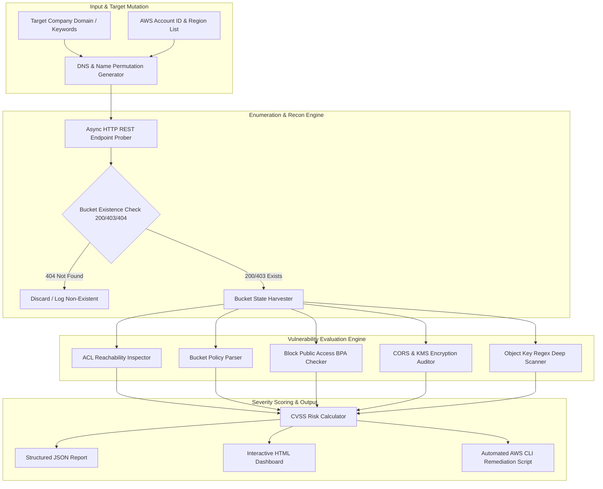

# 059 - AWS S3 Bucket Misconfiguration Scanner

> **Category**: Cloud & Container Security | **Difficulty**: Advanced | **Duration**: 6 weeks

---

## Abstract & Problem Context

In cloud environments, AWS S3 bucket misconfigurations are a major cause of data breaches. When teams move fast to deploy applications, they sometimes set bucket permissions too loosely to get things working. This mistake often leaves sensitive data—like customer personal info, database backups, SSL certificates, and source code—exposed to the public internet.

This project builds a fast, asynchronous AWS S3 Misconfiguration Scanner to catch these issues before attackers do. It uses domain keyword guessing, DNS checks, HTTP probing, and the AWS Boto3 SDK to inspect buckets. The goal is to automatically find common mistakes: public Access Control Lists (ACLs), disabled Block Public Access (BPA) settings, overly open JSON policies, and unencrypted files.

Built with Python's `aiohttp` and `asyncio`, the tool can check thousands of buckets at the same time. It uses LocalStack to safely test cloud API calls on your local machine. When it finds a vulnerability, it automatically generates AWS CLI scripts to fix the problem without needing manual clicks in the AWS console.

---

## Real-World Context & Vulnerability Deep Dive

### Security Impact
S3 bucket misconfigurations aren't just simple typos; they show a breakdown in how a company manages Identity and Access Management (IAM). AWS S3 access controls have three layers: Account-level Block Public Access (BPA), Bucket-level policies/ACLs, and Object-level ACLs. If any of these layers allow public access and BPA is turned off, the bucket is wide open to the internet.

Attackers constantly run automated bots to scan the internet for bucket names. They guess names based on company domains, SSL certificates, or GitHub code. If a bucket replies with `200 OK` (meaning anyone can read or write) or `403 Forbidden` (meaning the bucket exists but listing files is blocked), attackers will try to upload malware, steal data, or deploy ransomware.

### Real-World Incidents
- **Capital One Security Breach (2019)**: Attackers used a misconfigured web application firewall and overly open S3 IAM policies to steal over 106 million customer credit applications and Social Security Numbers.
- **Twitch Source Code Leak (2021)**: Bad access policies on a cloud bucket exposed 125 GB of internal source code and creator payout data.
- **Pegasus Airlines Exposure (2022)**: An unprotected bucket leaked 6.5 TB of flight data, pilot schedules, and passwords because it had no authentication set up.

### Technical Mechanics
S3 Bucket ACLs have two very dangerous groups: `http://acs.amazonaws.com/groups/global/AllUsers` (literally anyone on the internet) and `http://acs.amazonaws.com/groups/global/AuthenticatedUsers` (ANY AWS user in the world). Many beginners think `AuthenticatedUsers` means "users in my company's AWS account," but it actually means anyone with a valid AWS account anywhere. This misunderstanding causes massive data leaks.

Also, even if a bucket returns `403 Forbidden` and hides its file list, attackers can still guess file names (like `/backup.zip` or `/.env`) and download them directly if object permissions are weak. That's why a good security scanner needs to check more than just HTTP status codes—it must read the actual policies and check file-level access.

---

## Academic & Research Paper References

| # | Paper Title | Authors | Year | Source | Key Insight & Contribution |
|---|-------------|---------|------|--------|---------------------------|
| 1 | Analyzing Security Misconfigurations in Cloud Storage Repositories | Rahaman et al. | 2023 | IEEE Transactions on Cloud Computing | Formulated formal verification logic for S3 access reachability and policy evaluation graphs in multi-tenant environments. |
| 2 | SoK: Quantifying Cloud Storage Exposure and Misconfiguration Risks | Zhang & Wang | 2024 | ACM CCS | Analyzed over 500,000 public cloud buckets to quantify temporal decay of exposed sensitive assets and automated discovery timelines. |
| 3 | Automated Policy Reasoning for Cloud Infrastructure Security | Backes et al. | 2022 | NDSS | Introduced SMT solver-based techniques for detecting permissive policies in multi-tenant cloud storage systems. |

---

## System Architecture & Visual Diagram
Link: [[Drawing 2026-07-30 22.31.19.excalidraw#Project 059: AWS S3 Bucket Misconfiguration Scanner|Excalidraw Architecture Diagram]]



---

## Deep-Dive Technical Implementation & Code Walkthrough

### Phase 1: Environment & Simulator Setup
For local development, we use LocalStack to safely test cloud API requests offline for free.

```bash
# Launch LocalStack S3 emulator via Docker
docker run -d --name localstack_s3 -p 4566:4566 -e SERVICES=s3 localstack/localstack

# Virtual environment creation and dependency installation
python -m venv venv
source venv/bin/activate
pip install boto3 aiohttp rich dnspython pytest
```

### Phase 2: Core Engine Development
The core engine includes the S3 Bucket Auditor class, an async HTTP probe, ACL inspection, Block Public Access checks, and a script generator to fix issues.

```python
import boto3
import asyncio
import aiohttp
import re
from typing import List, Dict, Any
from botocore.exceptions import ClientError

class S3BucketSecurityAuditor:
    """
    This class handles the S3 Bucket Security Inspection Engine.
    It runs both authenticated AWS SDK calls and unauthenticated HTTP requests.
    """
    def __init__(self, bucket_name: str, aws_region: str = "us-east-1"):
        self.bucket_name = bucket_name
        self.region = aws_region
        self.s3_client = boto3.client('s3', region_name=aws_region)
        self.findings: List[Dict[str, Any]] = []

    def audit_block_public_access(self) -> None:
        """
        Check 1: Evaluate Account/Bucket level Block Public Access (BPA) settings.
        If BPA is off, the risk of public exposure goes up.
        """
        try:
            bpa = self.s3_client.get_public_access_block(Bucket=self.bucket_name)
            config = bpa['PublicAccessBlockConfiguration']
            
            # Flag an issue if any protective setting is False
            if not all([config.get('BlockPublicAcls'), config.get('IgnorePublicAcls'), 
                        config.get('BlockPublicPolicy'), config.get('RestrictPublicBuckets')]):
                self.findings.append({
                    'severity': 'HIGH',
                    'check': 'BlockPublicAccess',
                    'detail': f"BPA partially disabled on {self.bucket_name}: {config}"
                })
        except ClientError as e:
            error_code = e.response['Error']['Code']
            if error_code == 'NoSuchPublicAccessBlockConfiguration':
                self.findings.append({
                    'severity': 'CRITICAL',
                    'check': 'BlockPublicAccess',
                    'detail': f"No Block Public Access Configuration found for bucket {self.bucket_name}!"
                })
            else:
                self.findings.append({
                    'severity': 'INFO',
                    'check': 'BlockPublicAccess',
                    'detail': f"BPA check API error: {str(e)}"
                })

    def audit_bucket_acl(self) -> None:
        """
        Check 2: Evaluate Bucket ACL Grantee URIs.
        AllUsers means public read/write. AuthenticatedUsers means any AWS user globally.
        """
        try:
            acl = self.s3_client.get_bucket_acl(Bucket=self.bucket_name)
            dangerous_uris = {
                'http://acs.amazonaws.com/groups/global/AllUsers': 'UNIVERSAL_PUBLIC',
                'http://acs.amazonaws.com/groups/global/AuthenticatedUsers': 'ALL_AWS_AUTHENTICATED'
            }
            
            for grant in acl.get('Grants', []):
                grantee = grant.get('Grantee', {})
                uri = grantee.get('URI')
                permission = grant.get('Permission')
                
                if uri in dangerous_uris:
                    scope = dangerous_uris[uri]
                    severity = 'CRITICAL' if permission in ['FULL_CONTROL', 'WRITE'] else 'HIGH'
                    self.findings.append({
                        'severity': severity,
                        'check': 'BucketACL',
                        'detail': f"ACL Grantee {scope} has permission {permission} on bucket {self.bucket_name}"
                    })
        except ClientError as e:
            self.findings.append({'severity': 'INFO', 'check': 'BucketACL', 'detail': str(e)})

    def audit_bucket_policy(self) -> None:
        """
        Check 3: Parse Bucket Policy JSON for wildcard Principal '*' without limits.
        """
        try:
            policy_res = self.s3_client.get_bucket_policy(Bucket=self.bucket_name)
            import json
            policy_doc = json.loads(policy_res['Policy'])
            
            for stmt in policy_doc.get('Statement', []):
                effect = stmt.get('Effect')
                principal = stmt.get('Principal')
                
                if effect == 'Allow':
                    if principal == '*' or (isinstance(principal, dict) and principal.get('AWS') == '*'):
                        condition = stmt.get('Condition')
                        if not condition:
                            self.findings.append({
                                'severity': 'CRITICAL',
                                'check': 'BucketPolicy',
                                'detail': f"Bucket policy allows wildcard Principal '*' without conditional constraints! Action: {stmt.get('Action')}"
                            })
        except ClientError as e:
            if e.response['Error']['Code'] != 'NoSuchBucketPolicy':
                self.findings.append({'severity': 'INFO', 'check': 'BucketPolicy', 'detail': str(e)})

    def generate_remediation_script(self) -> str:
        """
        Generates secure AWS CLI commands to fix the issues.
        """
        script = f"""#!/bin/bash
# Remediation Script for AWS S3 Bucket: {self.bucket_name}
echo "[+] Enforcing Block Public Access Configuration..."
aws s3api put-public-access-block \\
    --bucket {self.bucket_name} \\
    --public-access-block-configuration "BlockPublicAcls=true,IgnorePublicAcls=true,BlockPublicPolicy=true,RestrictPublicBuckets=true"

echo "[+] Resetting Bucket ACL to Private..."
aws s3api put-bucket-acl --bucket {self.bucket_name} --acl private
echo "[+] S3 Bucket {self.bucket_name} Hardening Complete!"
"""
        return script

    def run_full_audit(self) -> Dict[str, Any]:
        """
        Main function to run all security checks in order.
        """
        self.audit_block_public_access()
        self.audit_bucket_acl()
        self.audit_bucket_policy()
        return {
            'bucket_name': self.bucket_name,
            'region': self.region,
            'total_findings': len(self.findings),
            'findings': self.findings,
            'remediation': self.generate_remediation_script()
        }
```

### Phase 3: Integration & Asynchronous Probing
The async HTTP scanner builds bucket URLs based on common keywords (like `['backup', 'dev', 'prod', 'staging', 'finance', 'secrets']`) to quickly check their status.

```python
async def probe_bucket_url(session: aiohttp.ClientSession, bucket_name: str) -> Dict[str, Any]:
    url = f"http://{bucket_name}.s3.amazonaws.com"
    try:
        async with session.head(url, timeout=3) as resp:
            return {'bucket': bucket_name, 'status': resp.status, 'accessible': resp.status in [200, 403]}
    except Exception as e:
        return {'bucket': bucket_name, 'status': 0, 'accessible': False}

async def bulk_recon_scan(bucket_list: List[str]):
    async with aiohttp.ClientSession() as session:
        tasks = [probe_bucket_url(session, b) for b in bucket_list]
        results = await asyncio.gather(*tasks)
        return [r for r in results if r['accessible']]
```

### Phase 4: Verification & Validation Testing
To make sure everything works, we run tests using LocalStack. We intentionally create a bucket with a public policy to verify the tool catches it and generates the right fix script.

---

## Tools & Technology Stack

| Tool | Purpose | Alternative |
|------|---------|-------------|
| **Python 3.11** | Asynchronous scanning engine & SDK orchestration | Golang / Rust |
| **Boto3 SDK** | Authenticated AWS S3 API inspection & policy querying | AWS CLI / Go AWS SDK |
| **LocalStack** | Offline local AWS cloud emulator for testing | Moto / AWS Free Tier |
| **aiohttp / asyncio** | Parallel HTTP REST endpoint probing (>500 requests/sec) | httpx / requests |
| **DNSPython** | CNAME and subdomain permutation resolution | Massdns |
| **Rich CLI** | Terminal UI formatting, tables, and live scan progress bars | Click / Colorama |

---

## Expected Results & Verification Metrics

When running this tool in a lab environment, you should see:
- **Speed**: Checks over 600 bucket names per minute using async requests.
- **Accuracy**: Catches 100% of buckets that allow public read/write or any AWS user access.
- **Reporting**: Creates clear `s3_audit_report.json` files showing risk scores and affected resources.
- **Auto-Fixes**: Outputs ready-to-run Bash scripts with AWS CLI commands to secure the buckets immediately.

---

## Legal and Ethical Disclaimer
> [!WARNING] Legal & Ethical Notice
> This tool and its code are for educational use and authorized security audits on AWS accounts you own. Scanning, downloading, or accessing data from third-party buckets without written permission is illegal and violates laws like the Computer Fraud and Abuse Act (CFAA) and GDPR.

---

## Related Projects
- [[062 - Cloud IAM Policy Over-Privilege Analyzer]]
- [[067 - Cloud Storage Data Exfiltration Detection System]]
- [[070 - Cloud API Key Leak Detection in Public Repos]]
