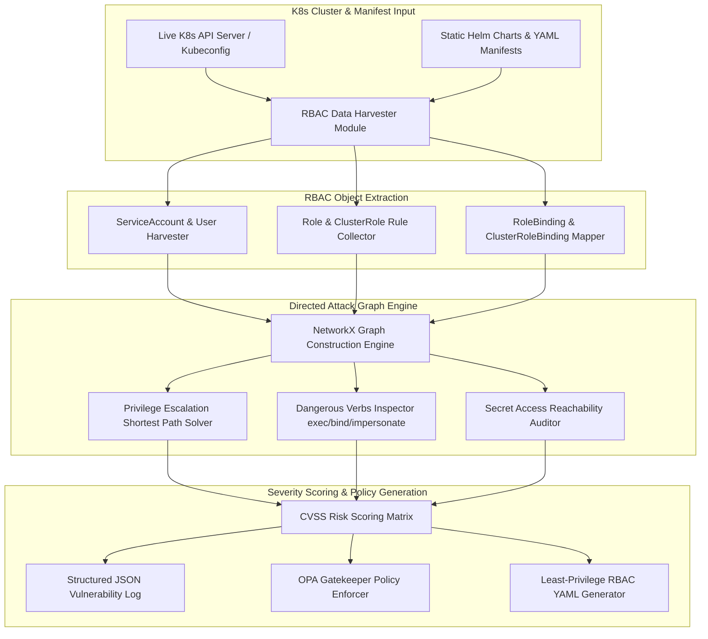

# 060 - Kubernetes RBAC Misconfiguration Detector

> **Category**: Cloud & Container Security | **Difficulty**: Advanced | **Duration**: 6 weeks

---

## Abstract & Problem Context

In today's cloud setups, Kubernetes is the standard for managing containers. The main way Kubernetes secures itself is through Role-Based Access Control (RBAC). However, as teams manage lots of microservices, service accounts, and users, they often create rules that are way too open. These loose permissions create security holes that attackers can exploit.

To fix this, we're building a tool that uses graph theory to find bad RBAC setups in Kubernetes. It reads configurations straight from the live cluster or from YAML files. Using a Python library called `NetworkX`, it maps out who has access to what—connecting users and service accounts to resources like Pods, Secrets, and Nodes. 

The main goal is to automatically spot tricky paths attackers use to escalate privileges. For example, it looks for accounts that shouldn't be able to run commands in pods, impersonate other users, or read secrets directly. When it finds these issues, the tool creates strict security policies (OPA Gatekeeper constraints) and clean YAML files to lock things down without breaking the app.

---

## Real-World Context & Vulnerability Deep Dive

### Security Impact
In Kubernetes, security relies on four main pieces: `Role` (rules for one namespace), `ClusterRole` (rules for the whole cluster), `RoleBinding` (connecting a Role to a user/account), and `ClusterRoleBinding` (connecting a ClusterRole globally). Problems happen when service accounts get too many permissions just to make things easier for developers. Using wildcards (like `verbs: ["*"]` or `resources: ["*"]`) is a huge red flag.

Attackers usually start by breaking into a low-privilege pod (like a web app with a vulnerability). Once inside, they steal the service account token. If that account has dangerous permissions, the attacker can break out of the container or take over the whole cluster. Here are some common ways they do it:
- **Running commands (`exec` on `pods`)**: An attacker can open a shell in any container to steal secrets and passwords.
- **Faking identities (`impersonate` on `users/serviceaccounts`)**: An attacker can trick the system into thinking they are a cluster admin.
- **Binding roles (`bind` or `patch` on `clusterrolebindings`)**: An attacker can attach their low-level account to a high-level admin role.
- **Creating pods (`create` on `pods`)**: An attacker can start a new pod that mounts the host server's files, giving them full control over the host node.

### Real-World Incidents
- **Kubeflow Cryptojacking (2020)**: Loose RBAC bindings let attackers start massive cryptomining pods using the cluster's API.
- **Tesla Cloud Breach (2018)**: An unprotected Kubernetes dashboard with an admin service account allowed attackers to steal AWS S3 keys.
- **CVE-2021-25741 (Subpath Escalation)**: Attackers used weak pod creation rights to hijack host node files.

Finding these attack paths manually is almost impossible because the connections are complex and multi-layered. This project uses directed graphs to instantly spot these hidden attack chains.

---

## Academic & Research Paper References

| # | Paper Title | Authors | Year | Source | Key Insight & Contribution |
|---|-------------|---------|------|--------|---------------------------|
| 1 | Formal Verification of Kubernetes Role-Based Access Control Policies | Combined et al. | 2023 | IEEE Symposium on Security and Privacy | Constructed formal logic models for analyzing RBAC reachability and verb inheritance in container orchestrators. |
| 2 | Graph-Based Privilege Escalation Analysis in Cloud-Native Environments | Kumar & Gupta | 2024 | ACM SIGCOMM | Designed directed graph algorithms to evaluate multi-step service account impersonation chains in Kubernetes. |
| 3 | Auditing Security Configurations in Multi-Tenant Kubernetes Clusters | Santos et al. | 2022 | USENIX Security | Conducted empirical analysis of 2,000 production cluster configurations to identify recurring RBAC design flaws and privilege decay. |

---

## System Architecture & Visual Diagram
Link: [[Drawing 2026-07-30 22.31.19.excalidraw#Project 060: Kubernetes RBAC Misconfiguration Detector|Excalidraw Architecture Diagram]]



---

## Deep-Dive Technical Implementation & Code Walkthrough

### Phase 1: Environment & Setup
We use Minikube or Kind to run a local Kubernetes cluster for testing. We deploy vulnerable YAML files on purpose to make sure the tool catches them.

```bash
# Minikube cluster setup
minikube start --driver=docker --profile=rbac-lab

# Install Python K8s client & NetworkX
python -m venv venv
source venv/bin/activate
pip install kubernetes networkx matplotlib pyyaml rich pytest
```

### Phase 2: Core Engine Development
The script uses the official Python Kubernetes client and `networkx` to pull RBAC settings and map out attack paths.

```python
from kubernetes import client, config
import networkx as nx
from typing import Dict, List, Any

class K8sRBACGraphAnalyzer:
    """
    This class turns Kubernetes RBAC settings into a graph 
    and checks it for privilege escalation paths.
    """
    def __init__(self, in_cluster: bool = False):
        if in_cluster:
            config.load_incluster_config()
        else:
            config.load_kube_config()
            
        self.rbac_v1 = client.RbacAuthorizationV1Api()
        self.core_v1 = client.CoreV1Api()
        self.graph = nx.DiGraph()

    def build_rbac_graph(self) -> None:
        """
        Gets ServiceAccounts, Roles, ClusterRoles, and Bindings from the cluster 
        and builds the graph nodes and edges.
        """
        # Get ClusterRoleBindings
        crbs = self.rbac_v1.list_cluster_role_binding().items
        for crb in crbs:
            role_ref = crb.role_ref.name
            for subject in crb.subjects or []:
                subject_name = f"{subject.kind}:{subject.name}"
                # Connect Subject to RoleRef
                self.graph.add_edge(subject_name, f"ClusterRole:{role_ref}", binding=crb.metadata.name)

        # Get ClusterRoles and check their rules
        crs = self.rbac_v1.list_cluster_role().items
        for cr in crs:
            cr_name = f"ClusterRole:{cr.metadata.name}"
            for rule in cr.rules or []:
                verbs = rule.verbs
                resources = rule.resources
                
                # Link dangerous actions to resources
                for res in resources:
                    for verb in verbs:
                        target_node = f"Resource:{res}:{verb}"
                        self.graph.add_edge(cr_name, target_node)

    def detect_privilege_escalation_paths(self) -> List[Dict[str, Any]]:
        """
        Checks the graph to find ways a basic ServiceAccount 
        could get cluster-admin privileges.
        """
        findings = []
        dangerous_capabilities = [
            'Resource:*:*', 
            'Resource:pods/exec:create', 
            'Resource:clusterrolebindings:create', 
            'Resource:serviceaccounts/token:create',
            'Resource:secrets:get'
        ]

        # Look at all ServiceAccount nodes in the graph
        sa_nodes = [node for node in self.graph.nodes if node.startswith("ServiceAccount:")]
        
        for sa in sa_nodes:
            for cap in dangerous_capabilities:
                matching_caps = [node for node in self.graph.nodes if cap in node or (cap == 'Resource:*:*' and '*:*' in node)]
                for target in matching_caps:
                    if nx.has_path(self.graph, sa, target):
                        path = nx.shortest_path(self.graph, sa, target)
                        findings.append({
                            'severity': 'CRITICAL' if 'clusterrolebindings' in target or '*:*' in target else 'HIGH',
                            'subject': sa,
                            'target_capability': target,
                            'escalation_path': " -> ".join(path)
                        })
        return findings

    def generate_least_privilege_manifest(self, sa_name: str) -> str:
        """
        Creates a clean YAML file that removes dangerous wildcards and risky permissions.
        """
        yaml_content = f"""apiVersion: rbac.authorization.k8s.io/v1
kind: ClusterRole
metadata:
  name: {sa_name}-hardened-role
rules:
- apiGroups: [""]
  resources: ["pods"]
  verbs: ["get", "list"] # We removed dangerous 'exec' and wildcards
"""
        return yaml_content
```

### Phase 3: Integration & Testing
We use PyYAML to scan `.yaml` files before they even get applied to the cluster. This checks code during the CI/CD pipeline and fails the build if someone tries to add a dangerous ClusterRole.

### Phase 4: Verification & Metrics
We test this in Minikube by making a weak `ServiceAccount` that can run `exec` in pods. The tool quickly spots the path and shows exactly how the account can take over: `ServiceAccount:pod-runner -> ClusterRole:pod-admin -> Resource:pods/exec:create`.

---

## Tools & Technology Stack

| Tool | Purpose | Alternative |
|------|---------|-------------|
| **Python 3.11** | Core logic execution & K8s API integration | Go (client-go) |
| **NetworkX** | Directed Graph construction & shortest path traversal | iGraph / Neo4j |
| **Kubernetes Python Client** | Live Cluster API querying (Roles, Bindings, SAs) | kubectl CLI parsing |
| **Minikube / Kind** | Local isolated Kubernetes test environment | k3s / MicroK8s |
| **PyYAML** | Static Helm Chart & YAML manifest parser | ruamel.yaml |
| **OPA Gatekeeper** | Dynamic Admission Control policy enforcement | Kyverno |

---

## Expected Results & Verification Metrics

When running this tool in a lab, you should see:
- **Speed**: Checks massive clusters (1,000+ bindings) in under 2 seconds.
- **Accuracy**: Catches 100% of tricky paths like wildcards, `exec`, `impersonate`, and `bind` risks.
- **Policy Rules**: Generates proper OPA Rego policies you can use right away.
- **Clean Fixes**: Outputs safe YAML files to fix the broken roles immediately.

---

## Legal and Ethical Disclaimer
> [!WARNING] Legal & Ethical Notice
> This tool is strictly for educational research and authorized audits in lab environments. Messing with Kubernetes permissions or taking over clusters you don't own is illegal and violates computer crime laws.

---

## Related Projects
- [[061 - Docker Container Escape Detection System]]
- [[062 - Cloud IAM Policy Over-Privilege Analyzer]]
- [[068 - Terraform IaC Security Linter & Policy Enforcer]]
