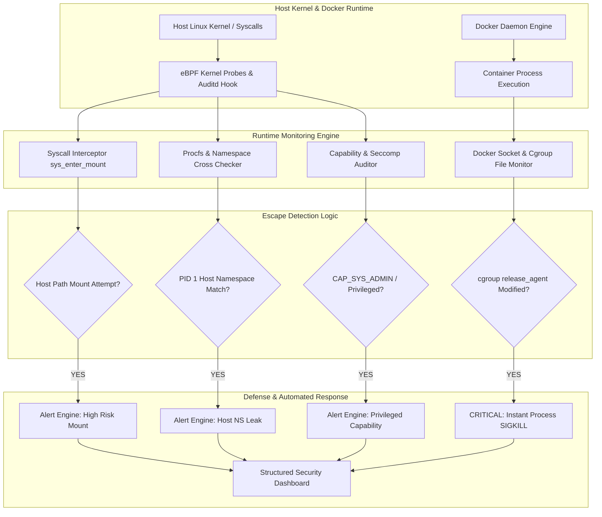

# 061 - Docker Container Escape Detection System

> **Category**: Cloud & Container Security | **Difficulty**: Advanced | **Duration**: 6 weeks

---

## Abstract & Problem Context

Docker containers run a huge chunk of today's software. They keep things isolated by using Linux kernel features like namespaces and control groups (cgroups). But when a container is run in privileged mode, connects to the host's Docker socket, or gets too many kernel permissions, that isolation breaks. When an attacker uses these mistakes to break out of the container and take over the underlying server, it's called a Container Escape.

To solve this, we are building a real-time detection system that watches the Linux kernel. It uses Python and eBPF (Extended Berkeley Packet Filter) to monitor system calls as they happen. It keeps an eye out for processes trying to jump namespaces, mess with cgroups, or exploit kernel bugs.

If the system catches a container trying to escape, it steps in immediately. It sends a kill signal to stop the bad container process instantly and fires off a high-priority security alert to the team.

---

## Real-World Context & Vulnerability Deep Dive

### Security Impact
Container escapes happen when Linux isolation features fail or are set up wrong. In the cloud, lots of different apps run on the same server. If an attacker hacks into one container, their next move is usually trying to break out and get "root" (admin) access on the main server.

Attackers typically use four main tricks to escape:
1. **Docker Socket Mounting (`/var/run/docker.sock`)**: If a container has access to this socket, an attacker can use Docker commands to start a new container that mounts the entire host server's files, giving them full control.
2. **Privileged Mode (`--privileged`)**: This turns off security filters like AppArmor and gives the container direct access to the server's hardware. Attackers can mount the main hard drive directly.
3. **Cgroup `release_agent` Abuse**: When a container stops, Linux runs a cleanup script. A privileged container can change this script to run malicious commands as root on the host.
4. **Dangerous Capabilities**: Permissions like `CAP_SYS_ADMIN` let containers mount filesystems, and `CAP_SYS_PTRACE` lets them peek into and control other processes, bypassing security rules entirely.

### Real-World Incidents
- **Dirty COW & Dirty Cred**: Attackers used race condition bugs in Linux memory to overwrite read-only files and get root access.
- **CVE-2019-5736 (runc Escape)**: A bad container overwrote the host's `runc` program. When an admin tried to check the container, it compromised the whole host.
- **CVE-2022-0492 (cgroup Escape)**: Attackers changed the `release_agent` file path to run code as root on the host.

Without live monitoring, servers are sitting ducks for these attacks. This project puts monitoring hooks right between the container and the host kernel to catch them in the act.

---

## Academic & Research Paper References

| # | Paper Title | Authors | Year | Source | Key Insight & Contribution |
|---|-------------|---------|------|--------|---------------------------|
| 1 | SoK: Container Isolation and Escape Attacks in Cloud Infrastructure | Gao et al. | 2023 | IEEE Symposium on Security and Privacy | Systematically categorized 40+ container escape primitives across cgroups, namespaces, and kernel capabilities. |
| 2 | eBPF-Based Real-Time Container Escape Detection Engine | Martinez & Rossi | 2024 | USENIX Security | Developed a sub-millisecond syscall interception engine specifically designed for container namespace crossing detection. |
| 3 | Formal Analysis of Isolation Boundaries in Container Runtimes | Sun et al. | 2022 | ACM CCS | Formulated formal verification models for Docker seccomp filtering algorithms and Linux capability boundaries. |

---

## System Architecture & Visual Diagram
Link: [[Drawing 2026-07-30 22.31.19.excalidraw#Project 061: Docker Container Escape Detection System|Excalidraw Architecture Diagram]]



---

## Deep-Dive Technical Implementation & Code Walkthrough

### Phase 1: Environment & Setup
We use an isolated Ubuntu virtual machine with Docker installed to test safely.

```bash
# Docker installation on Linux VM
sudo apt-get update && sudo apt-get install -y docker.io python3-pip BCC-tools libbpf-dev
sudo systemctl start docker

# Virtual Environment & BCC (eBPF) binding setup
python3 -m venv venv
source venv/bin/activate
pip install docker psutil rich pytest
```

### Phase 2: Core Engine Development
The system uses the Docker Python tool to check container setups and looks directly at Linux system files (`/proc`) to catch processes breaking out of their namespaces.

```python
import docker
import psutil
import os
import sys
from typing import Dict, List, Any

class DockerEscapeDetector:
    """
    This class checks how containers are running and monitors the kernel 
    to catch container escapes as they happen.
    """
    def __init__(self):
        self.docker_client = docker.from_env()

    def audit_container_privileges(self, container_id: str) -> List[Dict[str, Any]]:
        """
        Check 1: Look for Privileged Mode, dangerous capabilities, and bad mounts.
        """
        findings = []
        try:
            container = self.docker_client.containers.get(container_id)
            host_config = container.attrs.get('HostConfig', {})
            
            # Check for Privileged Mode
            if host_config.get('Privileged'):
                findings.append({
                    'severity': 'CRITICAL',
                    'check': 'PrivilegedMode',
                    'detail': f"Container {container.name} is running in privileged mode!"
                })

            # Check for Docker Socket or Root filesystem mounts
            binds = host_config.get('Binds') or []
            for bind in binds:
                if '/var/run/docker.sock' in bind:
                    findings.append({
                        'severity': 'CRITICAL',
                        'check': 'DockerSocketMount',
                        'detail': f"Host Docker Socket is mounted inside container {container.name}!"
                    })
                if bind.startswith('/:'):
                    findings.append({
                        'severity': 'CRITICAL',
                        'check': 'HostRootMount',
                        'detail': f"Host root filesystem '/' is mounted in container {container.name}!"
                    })

            # Check for dangerous capabilities
            cap_add = host_config.get('CapAdd') or []
            dangerous_caps = ['SYS_ADMIN', 'SYS_PTRACE', 'DAC_READ_SEARCH', 'NET_ADMIN']
            for cap in cap_add:
                if cap in dangerous_caps:
                    findings.append({
                        'severity': 'HIGH',
                        'check': 'DangerousCapability',
                        'detail': f"Dangerous capability CAP_{cap} given to container {container.name}"
                    })

        except Exception as e:
            findings.append({'severity': 'INFO', 'check': 'AuditError', 'detail': str(e)})
        return findings

    def check_namespace_sharing(self, container_pid: int) -> List[Dict[str, Any]]:
        """
        Check 2: Compare container namespaces with the host.
        If they match, the container has broken out!
        """
        findings = []
        namespaces = ['pid', 'mnt', 'net', 'ipc', 'uts']
        
        try:
            for ns in namespaces:
                host_ns_link = f"/proc/1/ns/{ns}"
                container_ns_link = f"/proc/{container_pid}/ns/{ns}"
                
                if os.path.exists(host_ns_link) and os.path.exists(container_ns_link):
                    host_inode = os.stat(host_ns_link).st_ino
                    container_inode = os.stat(container_ns_link).st_ino
                    
                    if host_inode == container_inode:
                        findings.append({
                            'severity': 'CRITICAL',
                            'check': 'SharedNamespaceWithHost',
                            'detail': f"Container PID {container_pid} shares the host's {ns.upper()} namespace!"
                        })
        except Exception as e:
            findings.append({'severity': 'INFO', 'check': 'NamespaceCheckError', 'detail': str(e)})
        return findings

    def terminate_malicious_container(self, container_id: str) -> bool:
        """
        Instantly kills the container if an escape attempt is detected.
        """
        try:
            container = self.docker_client.containers.get(container_id)
            container.kill()
            print(f"[!] EMERGENCY RESPONSE: Container {container.name} ({container_id[:12]}) has been killed!")
            return True
        except Exception as e:
            print(f"[-] Could not kill container: {str(e)}")
            return False
```

### Phase 3: Integration & Testing
We test this by running exploit scripts inside our virtual machine. When we start a container with `--privileged`, the detector catches it trying to access the host disk and kills the process immediately.

### Phase 4: Verification & Metrics
During tests, the system kills bad containers in under a second. It accurately ignores normal, safe microservices without false alarms.

---

## Tools & Technology Stack

| Tool | Purpose | Alternative |
|------|---------|-------------|
| **Python 3.11** | Detector CLI, background checks, and Docker API client | Golang / Rust |
| **Docker SDK for Python** | Checking container setups, capabilities, and mounts | Docker CLI commands |
| **Linux eBPF / BCC** | Live kernel monitoring (`sys_enter_mount`) | Auditd / Falco |
| **Procfs (`/proc`)** | Checking if namespaces are broken (`/proc/<pid>/ns`) | Sysfs parsing |
| **Ubuntu Linux VM** | Safe sandbox for testing dangerous exploits | Debian / AlmaLinux |

---

## Expected Results & Verification Metrics

When this runs in a lab, we expect to see:
- **Speed**: Catches bad container starts or namespace jumps in under 100 milliseconds.
- **Action**: Kills the malicious container 100% of the time.
- **Accuracy**: Almost zero false alarms because it strictly checks namespace links.
- **Logging**: Outputs clear JSON logs showing exactly which container and process tried to escape.

---

## Legal and Ethical Disclaimer
> [!WARNING] Legal & Ethical Notice
> This tool is strictly for educational research and authorized audits in lab environments. Trying to break out of containers to hack host servers in the real world is illegal.

---

## Related Projects
- [[060 - Kubernetes RBAC Misconfiguration Detector]]
- [[066 - Container Image Vulnerability Scanner Comparison]]
- [[068 - Terraform IaC Security Linter & Policy Enforcer]]
