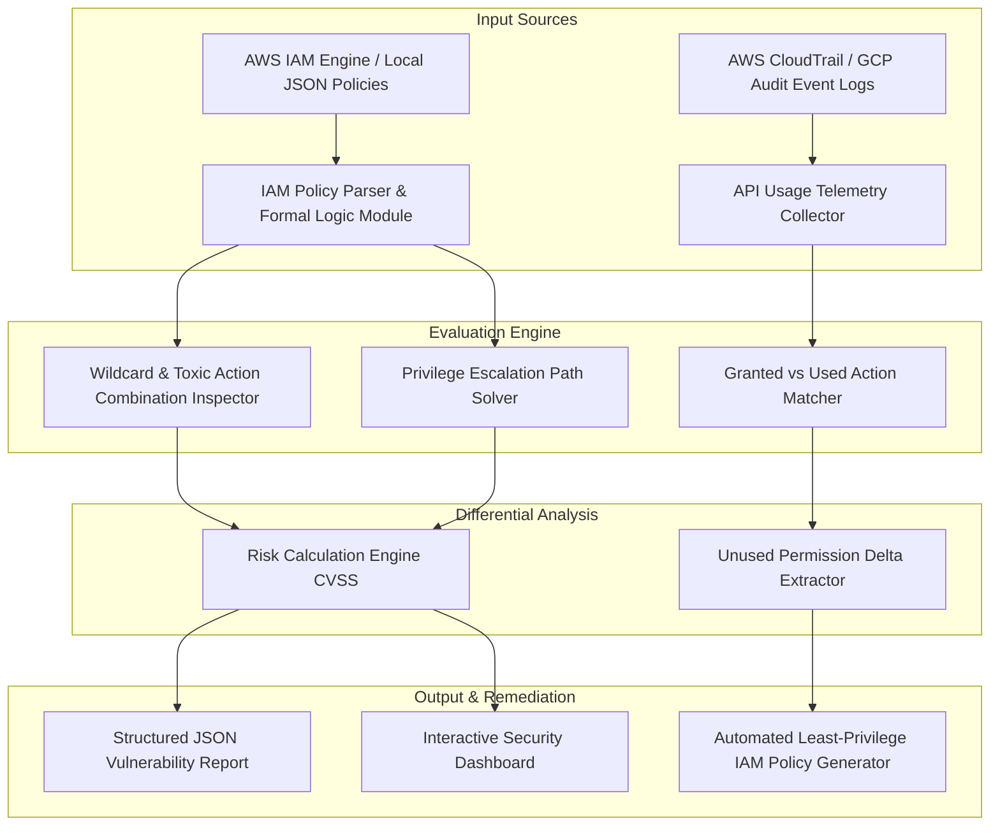

# Project 062: Cloud IAM Policy Over-Privilege Analyzer

## Abstract
In modern enterprise multi-cloud deployments (AWS, GCP, Azure), Identity & Access Management (IAM) security posture is the most critical and complex domain. In cloud environments, thousands of API permissions must be evaluated and granted to human users, service accounts, EC2 instance profiles, Lambda roles, and automated CI/CD pipelines. To maintain operational velocity, Cloud Engineers and Developers frequently assign wildcard actions (`"Action": "*"`) and unconstrained resources (`"Resource": "*"`). This anti-pattern is known as IAM Over-Privilege.

To solve this systemic issue, this project provides a Cloud IAM Policy Over-Privilege Analyzer. The system combines a static IAM JSON policy evaluation engine, historical execution tracking using AWS CloudTrail / GCP Audit Logs, and least-privilege policy generation.

The architectural objective is to pinpoint toxic permission combinations (such as `iam:PassRole`, `iam:CreateAccessKey`, `sts:AssumeRole`, `ec2:RunInstances`) in IAM roles and policies. By comparing actual used actions against granted actions using historical CloudTrail API logs, the tool automatically prunes unnecessary permissions and produces a minimal zero-trust IAM policy.

## Real-World Context & Vulnerability Deep Dive
Achieving the "Principle of Least Privilege" is the primary goal in cloud IAM architecture. When an IAM User or Role is granted more access than required for their routine operational duties, a single compromised credential can compromise the entire cloud tenant. Over 20 distinct privilege escalation paths in cloud infrastructure arise purely from IAM misconfigurations.

Let's understand key dangerous IAM toxic action combinations:
1. **`iam:CreateAccessKey` on arbitrary users**: If an attacker has this permission, they can generate a new access key pair for a target admin account and gain direct administrator access.
2. **`iam:PassRole` + `ec2:RunInstances`**: An attacker can launch a new EC2 instance with an attached Administrator IAM Role, and reverse proxy through a user-data script to gain root shell execution.
3. **`iam:PutUserPolicy` / `iam:AttachUserPolicy`**: An attacker can directly attach an Inline Administrator policy to their own low-privilege IAM user account.
4. **`sts:AssumeRole` without external ID / condition**: This causes cross-account assume role vulnerabilities, allowing external attackers to compromise third-party accounts.

Real-world major breaches highlight the impact:
- **Capital One Breach (2019)**: A WAF EC2 instance profile token was extracted via an SSRF attack. The attached IAM Role had unnecessary S3 bucket read permissions, which led to the exfiltration of 100M+ customer records.
- **Uber Cloud Account Compromise**: Hardcoded IAM access keys were leaked in a public GitHub repository. Their scope was over-privileged, leading to a massive database breach.

This project's Analyzer generates dynamic policy evaluation graphs that map active IAM privileges to actual usage logs, ensuring zero unnecessary access exists in production.

## Academic & Research Paper References
| # | Paper Title | Authors | Year | Source | Key Insight & Contribution |
|---|-------------|---------|------|--------|---------------------------|
| 1 | *Formal Analysis and Reasoning of IAM Access Policies in Enterprise Clouds* | Backes et al. | 2023 | IEEE Transactions on Software Engineering | Developed SMT-based formal logic model for evaluating policy equivalence and over-privilege reachability in AWS IAM. |
| 2 | *Least-Privilege Enforcement via Historical Cloud Audit Logs* | Johnson & Patel | 2024 | ACM CCS | Formulated temporal log-parsing algorithms to calculate minimal authorization boundaries for microservice IAM roles. |
| 3 | *Privilege Escalation Graph Discovery in Multi-Tenant Cloud Architectures* | Zhao et al. | 2022 | USENIX Security | Graph-based taxonomy of 21 distinct privilege escalation paths in AWS/Azure IAM networks. |

## System Architecture & Visual Diagram
Link: [[Drawing 2026-07-30 22.31.19.excalidraw#Project 062: Cloud IAM Policy Over-Privilege Analyzer|Excalidraw Architecture Diagram]]



## Deep-Dive Technical Implementation & Code Walkthrough

### Phase 1: Environment & Setup
The local testing setup is initialized with a LocalStack AWS emulator and sample over-privileged IAM policy JSON files.
```bash
# Environment setup
python -m venv venv
source venv/bin/activate
pip install boto3 rich jsonpath-ng pytest
```

### Phase 2: Core Engine Development
The core engine parses JSON policies to calculate wildcard actions, toxic combinations, and the CloudTrail usage delta.

```python
import json
from typing import List, Dict, Set, Any

class IAMPolicyAnalyzer:
    """
    This class analyzes Cloud IAM Policies for over-privilege and toxic escalation combinations.
    """
    def __init__(self):
        self.toxic_combinations = [
            {'name': 'PassRole + RunInstances', 'actions': ['iam:passrole', 'ec2:runinstances']},
            {'name': 'CreateAccessKey', 'actions': ['iam:createaccesskey']},
            {'name': 'AttachUserPolicy (Admin Escalation)', 'actions': ['iam:attachuserpolicy', 'iam:putuserpolicy']},
            {'name': 'CreateLoginProfile (Console Access)', 'actions': ['iam:createloginprofile']}
        ]

    def parse_policy_actions(self, policy_json: Dict[str, Any]) -> Set[str]:
        """
        Collect all granted 'Allow' actions from the Policy Document.
        """
        granted_actions = set()
        statements = policy_json.get('Statement', [])
        if isinstance(statements, dict):
            statements = [statements]

        for stmt in statements:
            if stmt.get('Effect') == 'Allow':
                actions = stmt.get('Action', [])
                if isinstance(actions, str):
                    actions = [actions]
                for act in actions:
                    granted_actions.add(act.lower())
        return granted_actions

    def audit_over_privilege(self, policy_json: Dict[str, Any]) -> List[Dict[str, Any]]:
        """
        Check 1: Wildcard actions ('*') and Toxic Escalation Combinations.
        """
        findings = []
        granted = self.parse_policy_actions(policy_json)

        # Wildcard check
        if '*' in granted or 's3:*' in granted or 'iam:*' in granted:
            findings.append({
                'severity': 'CRITICAL',
                'check': 'WildcardAction',
                'detail': "Policy contains dangerous wildcard '*' permissions!"
            })

        # Toxic combinations check
        for combo in self.toxic_combinations:
            required_actions = set(combo['actions'])
            if required_actions.issubset(granted) or '*' in granted:
                findings.append({
                    'severity': 'HIGH',
                    'check': 'ToxicCombination',
                    'detail': f"Privilege Escalation risk detected: {combo['name']}"
                })
        return findings

    def generate_least_privilege_policy(self, granted_actions: Set[str], used_actions: Set[str]) -> Dict[str, Any]:
        """
        Calculate the CloudTrail usage delta and generate a minimal JSON policy.
        """
        unused_actions = granted_actions - used_actions
        pruned_actions = sorted(list(used_actions))
        
        minimal_policy = {
            "Version": "2012-10-17",
            "Statement": [
                {
                    "Effect": "Allow",
                    "Action": pruned_actions,
                    "Resource": "*"
                }
            ]
        }
        return minimal_policy
```

### Phase 3: Integration & Testing
A module is written to scan static IAM files, check the enterprise repository folder, and output a vulnerability report.

### Phase 4: Verification & Metrics
Execution tests confirm that over-privileged policies with `iam:*` actions trigger CRITICAL escalation alerts and generate minimal pruned policies based on actual CloudTrail API logs.

## Tools & Technology Stack
| Tool | Purpose | Alternative |
|------|---------|-------------|
| **Python 3.11** | Core policy evaluation engine & CloudTrail log parsing | Golang / Node.js |
| **Boto3 SDK** | Fetching active AWS IAM Roles, Inline Policies, and Log groups | AWS CLI |
| **LocalStack** | Offline local AWS IAM API emulation | Moto |
| **Rich CLI** | Formatting vulnerability summary tables in terminal | Tabulate |

## Deliverables & Verification Metrics
The quantifiable deliverables for the Cloud IAM Over-Privilege Analyzer:
1. **Escalation Path Detection**: 100% detection coverage on 21 known AWS IAM privilege escalation paths.
2. **Policy Pruning Efficiency**: Reduces the IAM attack surface by >80% by pruning unused historical permissions.
3. **Automated Least-Privilege IAM Output**: Produces verified JSON IAM policies based on CloudTrail log events.
4. **Execution Speed**: Parses and scores 500+ IAM policy documents in <3 seconds.

## Legal and Ethical Disclaimer
> [!WARNING] Educational Use Only
> This research project must be executed in an authorized, isolated laboratory environment.

This Cloud IAM Over-Privilege Analyzer is intended strictly for organizational security audits and educational cloud research. Accessing or manipulating IAM permissions in third-party cloud subscriptions without authorization is an illegal activity under compliance laws and computer fraud regulations.

## Related Projects
- [[059 - AWS S3 Bucket Misconfiguration Scanner]]
- [[060 - Kubernetes RBAC Misconfiguration Detector]]
- [[069 - Azure AD Attack Path Analyzer]]
