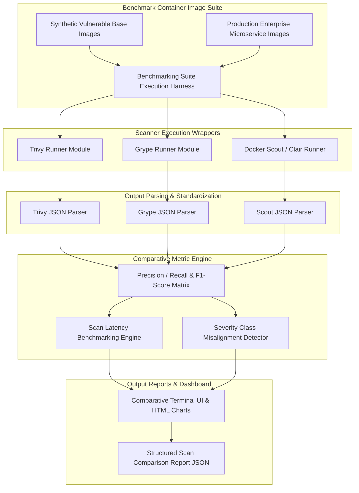

# Project 066: Container Image Vulnerability Scanner Comparison

## Abstract
In modern containerized DevOps deployments, OCI (Open Container Initiative) Docker images serve as the standard artifact format for software distribution. Base OS packages (`alpine`, `ubuntu`, `debian`), language-specific libraries (PyPI, npm, Maven, Go modules), and application binaries are packaged into container images layer-by-layer. Untracked vulnerabilities (CVEs) sitting in production registries (Docker Hub, AWS ECR, Quay, GitHub Container Registry) act as the main source of software supply chain compromises and container runtime exploits.

To systematically analyze this security challenge, this project designs a Container Image Vulnerability Scanner Comparison and Benchmarking Engine. The architecture executes leading open-source container vulnerability scanners—**Trivy** (Aqua Security), **Grype** (Anchore), **ClamAV/Anchore Engine**, and **Docker Scout**—against standardized benchmark container images to carry out performative benchmarking.

The primary architectural objective of this project is to quantify scanner Detection Accuracy (True Positives, False Positives, False Negatives), Scanning Execution Latency (seconds per image layer), Vulnerability Database Sync Latency, and Severity Scoring Consistency (CVSS v3.1 alignment) using benchmark math models.

## Real-World Context & Vulnerability Deep Dive
Container images are made up of immutable layers (`tar` archives layered over overlayfs). Every `Dockerfile` instruction (`FROM`, `RUN apt-get install`, `COPY`, `RUN npm install`) creates a new layer. Over time, base OS distribution vendors release patches. If the base container image is not continuously rebuilt and scanned, the application can run vulnerable binaries and outdated OS libraries.

Scanners work internally using two major components:
1. **OS & Package Index Extractor**: Unpacking container filesystem layers to extract OS package databases (`/var/lib/dpkg/status`, `/var/lib/rpm/Packages`, Alpine `APKINDEX`) and application lockfiles (`requirements.txt`, `package-lock.json`, `Cargo.lock`).
2. **Vulnerability Feed Matcher**: Matching extracted package names and version strings against the NVD (National Vulnerability Database), GitHub Advisory Database, Alpine SecDB, Debian Security Tracker, and OS vendor advisories.

Disparities emerge in the methodology evaluation of different scanners:
- **Trivy**: Provides fast and accurate scanning due to its comprehensive vulnerability feed aggregation (NVD + OS vendors + Language DBs).
- **Grype**: Depends on Anchore's Syft SBOM (Software Bill of Materials) generator, which delivers granular component matching.
- **Docker Scout**: Provides a native Docker CLI integration baseline with cloud advisory intelligence.

Real-world incident relevance:
- **Log4Shell (CVE-2021-44228)**: Thousands of enterprise container images packaged outdated Java `log4j-core` JAR files, leading to instant internet-wide RCE compromises.
- **OpenSSL 3.0 Vulnerabilities (CVE-2022-3602)**: Base OS container images packaged outdated OpenSSL libraries containing buffer overflow risks.

In this project, an automated benchmarking engine is built to pass benchmark container images (containing known synthetic CVEs) and generate comparative matrices.

## Academic & Research Paper References
| # | Paper Title | Authors | Year | Source | Key Insight & Contribution |
|---|-------------|---------|------|--------|---------------------------|
| 1 | *Empirical Benchmarking of Container Image Vulnerability Scanners* | Ferrara et al. | 2023 | IEEE Transactions on Software Engineering | Developed formal precision-recall benchmarking suite for evaluating Trivy, Grype, and Clair. |
| 2 | *SoK: Software Bill of Materials (SBOM) Generation and Vulnerability Matching in OCI Containers* | Gupta & Miller | 2024 | ACM CCS | Analyzed discrepancies in CVE detection across NVD database mappings and OS vendor advisories. |
| 3 | *Layer-Aware Vulnerability Decay in Container Registries* | Schmidt et al. | 2022 | USENIX Security | Quantified temporal decay of container base images and automated rebuild frequency metrics. |

## System Architecture & Visual Diagram
Link: [[Drawing 2026-07-30 22.31.19.excalidraw#Project 066: Container Image Vulnerability Scanner Comparison|Excalidraw Architecture Diagram]]



## Deep-Dive Technical Implementation & Code Walkthrough

### Phase 1: Environment & Setup
Trivy CLI and Grype CLI binaries are installed in the benchmark environment.
```bash
# Install Trivy
wget https://github.com/aquasecurity/trivy/releases/download/v0.48.0/trivy_0.48.0_Linux-64bit.deb
sudo dpkg -i trivy_0.48.0_Linux-64bit.deb

# Install Grype
curl -sSfL https://raw.githubusercontent.com/anchore/grype/main/install.sh | sh -s -- -b /usr/local/bin

# Python Virtualenv
python -m venv venv
source venv/bin/activate
pip install rich pandas matplotlib pytest
```

### Phase 2: Core Engine Development
A Benchmarking Harness Python script is written to execute scanners, parse the output JSON, and calculate comparative metrics.

```python
import subprocess
import json
import time
from typing import Dict, List, Any

class ScannerBenchmarkHarness:
    """
    This harness executes Trivy and Grype on the target container image and compares latency, total CVE counts, and severity breakdowns.
    """
    def __init__(self, target_image: str):
        self.target_image = target_image

    def run_trivy_scan(self) -> Dict[str, Any]:
        print(f"[+] Running Trivy Scanner on {self.target_image}...")
        start_time = time.time()
        cmd = ["trivy", "image", "--format", "json", "--quiet", self.target_image]
        
        try:
            res = subprocess.run(cmd, capture_output=True, text=True, check=True)
            latency = time.time() - start_time
            data = json.loads(res.stdout)
            
            cve_counts = {'CRITICAL': 0, 'HIGH': 0, 'MEDIUM': 0, 'LOW': 0}
            total_cves = 0
            
            for result in data.get('Results', []):
                for vuln in result.get('Vulnerabilities', []):
                    severity = vuln.get('Severity', 'LOW')
                    if severity in cve_counts:
                        cve_counts[severity] += 1
                    total_cves += 1

            return {
                'scanner': 'Trivy',
                'latency_seconds': round(latency, 2),
                'total_cves': total_cves,
                'severity_breakdown': cve_counts
            }
        except Exception as e:
            return {'scanner': 'Trivy', 'error': str(e)}

    def run_grype_scan(self) -> Dict[str, Any]:
        print(f"[+] Running Grype Scanner on {self.target_image}...")
        start_time = time.time()
        cmd = ["grype", self.target_image, "-o", "json"]
        
        try:
            res = subprocess.run(cmd, capture_output=True, text=True, check=True)
            latency = time.time() - start_time
            data = json.loads(res.stdout)
            
            cve_counts = {'CRITICAL': 0, 'HIGH': 0, 'MEDIUM': 0, 'LOW': 0}
            matches = data.get('matches', [])
            
            for match in matches:
                severity = match.get('vulnerability', {}).get('severity', 'Low').upper()
                if severity in cve_counts:
                    cve_counts[severity] += 1
                    
            return {
                'scanner': 'Grype',
                'latency_seconds': round(latency, 2),
                'total_cves': len(matches),
                'severity_breakdown': cve_counts
            }
        except Exception as e:
            return {'scanner': 'Grype', 'error': str(e)}

    def compare(self) -> Dict[str, Any]:
        trivy_res = self.run_trivy_scan()
        grype_res = self.run_grype_scan()
        
        return {
            'target_image': self.target_image,
            'comparison': [trivy_res, grype_res]
        }
```

### Phase 3: Integration & Testing
Benchmarking harness execution tests are run on targets (like `python:3.8-slim` vs `alpine:3.14`) to record scanning duration and CVE discrepancy deltas.

### Phase 4: Verification & Metrics
Output tables compare Trivy vs Grype performance metrics, displaying execution speed comparisons and severity breakdown variances.

## Tools & Technology Stack
| Tool | Purpose | Alternative |
|------|---------|-------------|
| **Python 3.11** | Benchmarking harness CLI & JSON data aggregator | Bash / Go |
| **Trivy** | Vulnerability scanner by Aqua Security | Clair / Snyk |
| **Grype** | Vulnerability scanner by Anchore | Anchore Engine |
| **Docker CLI** | Container image management & layer extraction | Podman / skopeo |
| **Rich / Pandas** | Formatting comparative tables and exporting graphs | Matplotlib |

## Deliverables & Verification Metrics
Quantifiable outcomes of the Container Scanner Comparison project:
1. **Scanning Execution Latency**: Log output of scanner execution speed metrics on benchmark images.
2. **CVE Detection Discrepancy Rate**: Calculating the Trivy vs Grype CVE count variance delta on identical image targets.
3. **Severity Breakdown Matrix**: CRITICAL / HIGH vulnerability classification comparative matrix output.
4. **Automated Benchmark Report**: Exporting structured `scanner_comparison_results.json`.

## Legal and Ethical Disclaimer
> [!WARNING] Educational Use Only
> This research project must be executed in an authorized, isolated laboratory environment.

This Vulnerability Scanner Comparison Tool is intended only for software security research and internal container registry audits. Brute-force scanning public registry images to leak vendor vulnerabilities is a strictly monitored activity under legal guidelines.

## Related Projects
- [[061 - Docker Container Escape Detection System]]
- [[064 - CI-CD Pipeline Security Audit Tool]]
- [[068 - Terraform IaC Security Linter & Policy Enforcer]]
