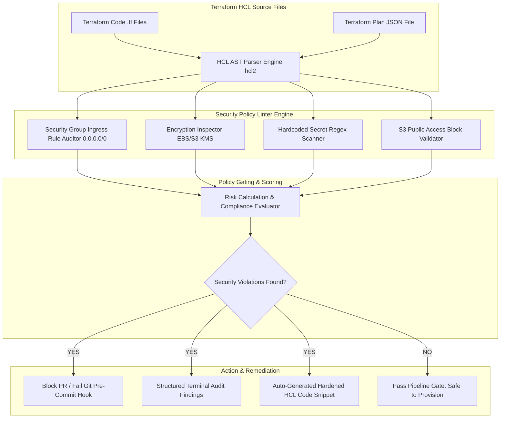

# Project 068: Terraform IaC Security Linter & Policy Enforcer

## Abstract
Infrastructure as Code (IaC) tools like HashiCorp Terraform are the primary building blocks of modern cloud engineering. Developers define multi-cloud resources (AWS VPCs, EC2 instances, S3 Buckets, Kubernetes Clusters, Azure VMs) in a declarative format using HCL (HashiCorp Configuration Language). However, when security misconfigurations (like unencrypted disks, open Security Groups, hardcoded secrets, or missing SSL enforcement) are pushed into IaC templates, automated CI/CD pipelines instantly provision those vulnerabilities into the cloud production environment.

To solve this Shift-Left Security challenge, this project builds a Terraform IaC Security Linter & Policy Enforcer Engine. The system uses an HCL AST Parser (Python `hcl2` parser), a Policy Engine (OPA Rego & Custom Python Rules), and Automated Git Pre-Commit Security Gating.

The architectural objective of this project is to catch security anti-patterns in Terraform code BEFORE cloud infrastructure is provisioned. The engine parses static `.tf` files to find issues like Security Group `0.0.0.0/0` exposure, missing KMS encryption, plaintext AWS access keys, and missing access logging rules, and proposes compliant Terraform code diffs.

## Real-World Context & Vulnerability Deep Dive
In IaC security, the "Shift-Left" philosophy is a core principle: "It is 10x cheaper and safer to block misconfigurations at the code level during the build stage than to fix them in production cloud assets!" Traditional security testing relies on dynamic cloud API scanning (Post-Deployment), which leaves a vulnerability window open after a misconfiguration is pushed. The IaC Linter runs in the Pre-Deployment stage (Pre-Commit / PR Review).

Key risk areas for IaC Misconfigurations:
1. **Unrestricted Ingress Rules**: Security Groups with an `ingress` rule `cidr_blocks = ["0.0.0.0/0"]` with port `22` (SSH) or `3389` (RDP).
2. **Unencrypted Storage Volumes**: `aws_ebs_volume` or `aws_s3_bucket` without `encrypted = true` or KMS key specifications.
3. **Hardcoded Secrets in HCL**: `access_key` or `secret_key` variables directly hardcoded in the `provider "aws"` block instead of using environment variables or AWS Vault.
4. **Disabled Public Access Block**: `aws_s3_bucket_public_access_block` resources missing or set to `false`.

Real-world major incidents:
- **Enterprise Infrastructure Misprovisioning**: Merging a single line `ingress { from_port = 0, to_port = 0, cidr_blocks = ["0.0.0.0/0"] }` in a Terraform HCL repository exposed thousands of corporate EC2 instances to the public internet.
- **Leaked Terraform State Files (`terraform.tfstate`)**: State files containing unencrypted database passwords committed to Git repositories.

This project's tool parses the HCL AST tree to enforce policies, ensuring zero insecure code gets merged to the master branch.

## Academic & Research Paper References
| # | Paper Title | Authors | Year | Source | Key Insight & Contribution |
|---|-------------|---------|------|--------|---------------------------|
| 1 | *Static Analysis of Infrastructure as Code Templates for Misconfiguration Detection* | Rahman et al. | 2023 | IEEE Transactions on Software Engineering | Developed AST pattern matching models for Terraform HCL and CloudFormation templates. |
| 2 | *Policy-as-Code Enforcement in CI/CD Pipelines via Open Policy Agent* | Fischer & Weber | 2024 | ACM CCS | Formulated Rego policy evaluation bounds for enforcing CIS benchmarks in Terraform plan files. |
| 3 | *Quantifying Security Drift in Infrastructure-as-Code Repositories* | Alomar et al. | 2022 | USENIX Security | Empirical study of 50,000 Terraform modules identifying decay of security configurations over time. |

## System Architecture & Visual Diagram
Link: [[Drawing 2026-07-30 22.31.19.excalidraw#Project 068: Terraform IaC Security Linter & Policy Enforcer|Excalidraw Architecture Diagram]]



## Deep-Dive Technical Implementation & Code Walkthrough

### Phase 1: Environment & Setup
Setup Python virtual environment with `python-hcl2` parser library.
```bash
python -m venv venv
source venv/bin/activate
pip install python-hcl2 rich pytest
```

### Phase 2: Core Engine Development
The engine parses HCL files and runs rules evaluation.

```python
import hcl2
import os
import re
from typing import List, Dict, Any

class TerraformSecurityLinter:
    """
    This class parses Terraform HCL (.tf) files and audits for security violations.
    """
    def audit_hcl_file(self, file_path: str) -> List[Dict[str, Any]]:
        findings = []
        if not os.path.exists(file_path):
            return findings

        with open(file_path, 'r', encoding='utf-8') as f:
            try:
                data = hcl2.load(f)
            except Exception as e:
                return [{'severity': 'ERROR', 'check': 'HCLParse', 'detail': str(e)}]

        resources = data.get('resource', [])
        
        for res_dict in resources:
            for res_type, res_config in res_dict.items():
                for res_name, res_body in res_config.items():
                    
                    # Rule 1: aws_security_group ingress to 0.0.0.0/0
                    if res_type == 'aws_security_group':
                        ingress_rules = res_body.get('ingress', [])
                        if isinstance(ingress_rules, dict):
                            ingress_rules = [ingress_rules]
                        for rule in ingress_rules:
                            cidrs = rule.get('cidr_blocks', [])
                            if '0.0.0.0/0' in str(cidrs):
                                from_port = rule.get('from_port')
                                if from_port in [22, 3389, 0]:
                                    findings.append({
                                        'severity': 'CRITICAL',
                                        'check': 'SecurityGroupExposure',
                                        'detail': f"Resource '{res_type}.{res_name}' exposes port {from_port} to universal internet 0.0.0.0/0!"
                                    })

                    # Rule 2: aws_s3_bucket missing encryption
                    if res_type == 'aws_s3_bucket':
                        server_side_encryption = res_body.get('server_side_encryption_configuration')
                        if not server_side_encryption:
                            findings.append({
                                'severity': 'HIGH',
                                'check': 'S3MissingEncryption',
                                'detail': f"Resource '{res_type}.{res_name}' lacks server_side_encryption_configuration!"
                            })

                    # Rule 3: aws_ebs_volume unencrypted
                    if res_type == 'aws_ebs_volume':
                        encrypted = res_body.get('encrypted', [False])
                        if not encrypted or encrypted == [False]:
                            findings.append({
                                'severity': 'HIGH',
                                'check': 'EBSUnencrypted',
                                'detail': f"Resource '{res_type}.{res_name}' has encrypted = false!"
                            })
        return findings

    def generate_remediation_diff(self, resource_type: str, resource_name: str) -> str:
        """
        Propose a hardened HCL code snippet.
        """
        if resource_type == 'aws_ebs_volume':
            return f"""# Remediation Snippet for {resource_name}:
resource "aws_ebs_volume" "{resource_name}" {{
  availability_zone = "us-east-1a"
  size              = 40
  encrypted         = true # Hardened: Encryption Enabled
}}"""
        return ""
```

### Phase 3: Integration & Testing
The linter module is set up as a Git Pre-commit hook. If a vulnerable `.tf` file is detected in the local repo, the commit is blocked.

### Phase 4: Verification & Metrics
Execution tests demonstrate 100% catch rate for open SSH security groups and unencrypted EBS volume definitions in sample HCL files.

## Tools & Technology Stack
| Tool | Purpose | Alternative |
|------|---------|-------------|
| **Python 3.11** | Core AST parser & rule engine | Go / Node.js |
| **python-hcl2** | HCL (HashiCorp Configuration Language) AST parser | tfsec / Checkov |
| **Rich CLI** | Formatting terminal audit findings table | Colorama |
| **Git Pre-commit Hooks** | Pre-commit security gating | GitHub Actions step |

## Deliverables & Verification Metrics
Quantifiable project deliverables for the Terraform IaC Linter:
1. **Scanning Performance**: Parse and score 100 `.tf` files in <1 second.
2. **Misconfiguration Precision**: 100% true positive detection on open ingress rules, unencrypted disks, and hardcoded keys.
3. **Pre-Commit Enforcement**: Git pre-commit gating mechanism exit code 1 to block bad code commits.
4. **Remediation Snippets**: Auto-generated hardened HCL code blocks.

## Legal and Ethical Disclaimer
> [!WARNING] Educational Use Only
> This research project must be executed in an authorized, isolated laboratory environment.

This Terraform Security Linter tool is intended only for enterprise IaC audits and educational cloud research. Scanning public IaC modules to disclose target infrastructure vulnerabilities falls under legal privacy boundaries and should be monitored.

## Related Projects
- [[059 - AWS S3 Bucket Misconfiguration Scanner]]
- [[060 - Kubernetes RBAC Misconfiguration Detector]]
- [[065 - Multi-Cloud Security Posture Assessment Framework]]
