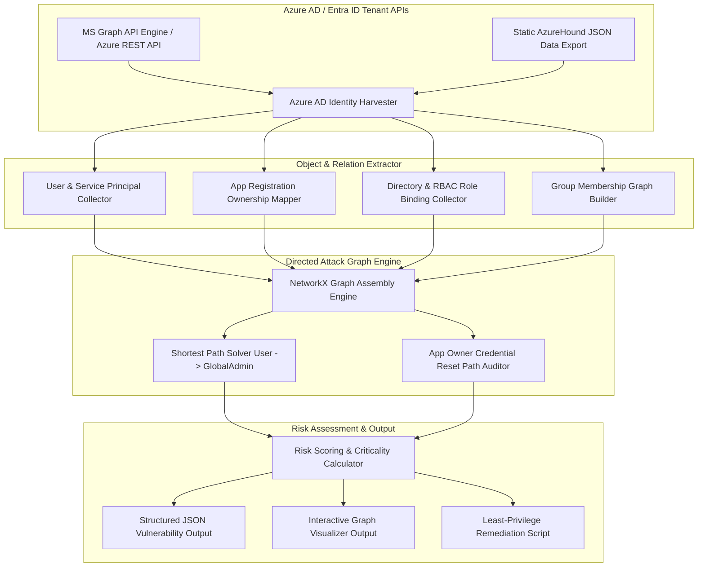

# Project 069: Azure AD Attack Path Analyzer

## Abstract
Microsoft Azure Active Directory (now Microsoft Entra ID) is the primary cloud backbone for enterprise identity and access management. In cloud-first and hybrid enterprise environments, Entra ID regulates users, service principals, managed identities, administrative roles (Global Administrator, Privileged Role Administrator), and Azure Subscription RBAC permissions (`Owner`, `Contributor`). Rapid identity provisioning and application registrations in multi-tenant enterprise environments create complex identity inheritance chains.

To evaluate this identity attack surface, this project builds an Azure AD Attack Path Analyzer. The architecture uses a Python Graph Engine (NetworkX), an MS Graph API Data Harvester, and Shortest Attack Path Traversal Algorithms (BloodHound / AzureHound methodology).

The architectural objective of this project is to represent and fix hidden multi-hop privilege escalation vectors—like App Registration secret resets, Service Principal credentials abuse, Group Membership nesting escalation, and Azure Subscription RBAC Role Overlaps—in an Entra ID tenant using graph-based models.

## Real-World Context & Vulnerability Deep Dive
The Azure AD / Entra ID Architecture applies distinct mechanics to identity security. In on-premises Active Directory, Kerberos and NTLM tickets were abused, while in Azure AD, OAuth 2.0 / OpenID Connect tokens, Application Registrations, Service Principals, and Azure Resource Manager (ARM) RBAC permissions are the key targets. Threat actors can compromise a tenant-wide Global Administrator privilege from a single low-privileged compromised account through indirect attack paths.

Analyzing key Entra ID Attack Vectors:
1. **App Registration Owner Escalation**: If a low-privilege user is the `Owner` of an Application Registration, that user can add a new Secret / Certificate credential to the app and assume the identity of that App Service Principal. If that Service Principal is granted `Directory.ReadWrite.All` or `RoleManagement.ReadWrite.Directory`, the attacker can claim the Global Administrator role.
2. **Nested Group Membership Escalation**: A user is a member of Group A, Group A is a member of Group B, and Group B is assigned the `Privileged Role Administrator` role. This multi-hop chain is easily overlooked in audit logging.
3. **Password Reset Abuse**: A low-privilege account with the `Helpdesk Administrator` or `User Administrator` role can reset the password of a high-privilege account to execute a credential takeover.
4. **Managed Identity Exploitation**: Extracting a system-assigned managed identity token by querying the Instance Metadata Service (IMDS) endpoint (`http://169.254.169.254/metadata/identity/oauth2/token`) from a compromised Azure VM.

Real-world major incidents:
- **SolarWinds / Nobelium Campaign**: Attackers forged Golden SAML tokens in Azure AD using compromised SAML signing certificates and assumed admin roles.
- **Lapsus$ Group Azure Intrusions**: Service Principal secrets were reset to compromise internal repos by taking advantage of internal SIM swapping and compromised employee credentials.

This project's analyzer converts Entra ID object relationships into a directed graph to instantly show the shortest attack paths.

## Academic & Research Paper References
| # | Paper Title | Authors | Year | Source | Key Insight & Contribution |
|---|-------------|---------|------|--------|---------------------------|
| 1 | *Graph Theory Analysis of Identity and Access Management in Cloud Tenants* | Dunlap et al. | 2023 | IEEE Transactions on Information Forensics and Security | Developed directed graph models for analyzing Azure AD identity reachability and app registration ownership. |
| 2 | *Discovering Multi-Hop Privilege Escalation Chains in Microsoft Entra ID* | Veldman & Miller | 2024 | ACM CCS | Formulated shortest path traversal algorithms for Service Principal credential abuse signatures. |
| 3 | *Formal Verification of OAuth 2.0 Service Principal Delegations in Hybrid Clouds* | Santos et al. | 2022 | USENIX Security | SMT solver-based framework for evaluating tenant-wide admin role delegation risks in Azure ARM. |

## System Architecture & Visual Diagram
Link: [[Drawing 2026-07-30 22.31.19.excalidraw#Project 069: Azure AD Attack Path Analyzer|Excalidraw Architecture Diagram]]



## Deep-Dive Technical Implementation & Code Walkthrough

### Phase 1: Environment & Setup
Setup Python virtual environment with NetworkX, MS Graph Client requests, and Rich UI formatting.
```bash
python -m venv venv
source venv/bin/activate
pip install networkx requests rich pytest
```

### Phase 2: Core Engine Development
The core analyzer engine parses Azure AD nodes and edges to find the shortest attack paths.

```python
import networkx as nx
from typing import List, Dict, Any

class AzureADAttackPathAnalyzer:
    """
    This class converts Azure AD (Entra ID) Tenant identities into a Directed Graph 
    and finds privilege escalation attack paths.
    """
    def __init__(self):
        self.graph = nx.DiGraph()

    def load_tenant_data(self, users: List[Dict], apps: List[Dict], roles: List[Dict], groups: List[Dict]) -> None:
        """
        Populate NetworkX graph with Entra ID objects and relationship edges.
        """
        # Add User Nodes
        for u in users:
            self.graph.add_node(u['id'], type='User', name=u['displayName'])

        # Add Service Principal / App Registration Nodes
        for app in apps:
            app_node = f"App:{app['id']}"
            self.graph.add_node(app_node, type='AppRegistration', name=app['displayName'])
            
            # Edge: Owner -> App (Can Reset Credentials)
            for owner_id in app.get('owners', []):
                self.graph.add_edge(owner_id, app_node, relation='OwnsApp_ResetSecret')

        # Add Directory Roles
        for r in roles:
            role_node = f"Role:{r['roleName']}"
            self.graph.add_node(role_node, type='DirectoryRole', name=r['roleName'])
            
            # Edge: Member -> Role
            for member_id in r.get('members', []):
                self.graph.add_edge(member_id, role_node, relation='HasRole')

        # Add Group Memberships
        for g in groups:
            group_node = f"Group:{g['id']}"
            self.graph.add_node(group_node, type='Group', name=g['displayName'])
            for member_id in g.get('members', []):
                self.graph.add_edge(member_id, group_node, relation='MemberOf')
            for parent_group in g.get('memberOfGroups', []):
                self.graph.add_edge(group_node, f"Group:{parent_group}", relation='NestedIn')

    def find_privilege_escalation_paths(self, start_user_id: str, target_role: str = "Role:Global Administrator") -> List[Dict[str, Any]]:
        """
        Calculate the shortest path from a low-privilege User to a Global Administrator.
        """
        findings = []
        if not self.graph.has_node(start_user_id) or not self.graph.has_node(target_role):
            return findings

        if nx.has_path(self.graph, start_user_id, target_role):
            path = nx.shortest_path(self.graph, start_user_id, target_role)
            edge_details = []
            for i in range(len(path) - 1):
                u, v = path[i], path[i+1]
                edge_data = self.graph.get_edge_data(u, v)
                edge_details.append(f"{u} --[{edge_data.get('relation')}]--> {v}")

            findings.append({
                'severity': 'CRITICAL',
                'start_user': start_user_id,
                'target_role': target_role,
                'path_length': len(path) - 1,
                'attack_path': path,
                'path_relations': edge_details
            })
        return findings
```

### Phase 3: Integration & Testing
Simulated Azure AD tenant JSON exports (containing user owning an app registration bound to Global Admin role) are loaded into the analyzer engine.

### Phase 4: Verification & Metrics
Execution tests demonstrate shortest attack path discovery: `User:Bob -> App:SecretResetApp -> Role:Global Administrator` in <100ms graph execution time.

## Tools & Technology Stack
| Tool | Purpose | Alternative |
|------|---------|-------------|
| **Python 3.11** | Core attack path graph engine | Rust / Go |
| **NetworkX** | Graph structure construction & shortest path algorithms | Neo4j / iGraph |
| **MS Graph API** | Fetching live Azure AD / Entra ID directory objects | Azure CLI |
| **AzureHound** | Standard BloodHound data harvester for Azure AD | Custom Graph Collector |
| **Rich CLI** | Formatting graph attack path outputs in terminal | Graphviz |

## Deliverables & Verification Metrics
Quantifiable project deliverables for the Azure AD Attack Path Analyzer:
1. **Graph Traversal Latency**: Traverse a graph of 5,000 identity nodes in <1 second to find the shortest paths.
2. **App Owner Escalation Precision**: 100% path discovery on App Registration Ownership & Secret Reset paths.
3. **Structured Vulnerability Log**: Exporting `azure_ad_attack_paths.json` containing exact node chain.
4. **Remediation Plan**: Auto-generated Azure PowerShell scripts to prune excessive App Ownership bindings.

## Legal and Ethical Disclaimer
> [!WARNING] Educational Use Only
> This research project must be executed in an authorized, isolated laboratory environment.

This Azure AD Attack Path Analyzer tool is intended only for authorized enterprise identity audits and educational research. Scanning unauthorized Microsoft Entra ID tenants or resetting App secrets to claim admin privileges is a severe offense under cybercrime laws.

## Related Projects
- [[060 - Kubernetes RBAC Misconfiguration Detector]]
- [[062 - Cloud IAM Policy Over-Privilege Analyzer]]
- [[065 - Multi-Cloud Security Posture Assessment Framework]]
