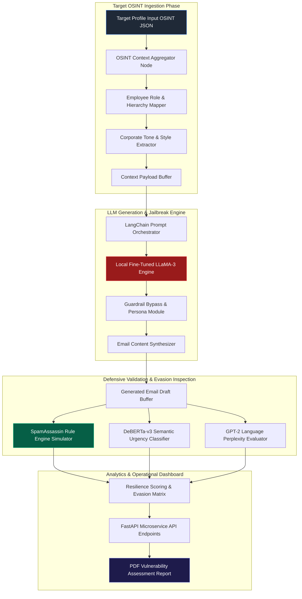

# 071 - AI-Powered Spear Phishing Email Benchmark & Defense Tester

> **Category**: Social Engineering & Phishing | **Difficulty**: Advanced | **Duration**: 6 weeks

---

## Abstract

When testing corporate IT infrastructure and email perimeters, the human element remains a critical line of defense. Traditional Secure Email Gateways (SEGs) like SpamAssassin, Proofpoint, or Barracuda rely heavily on static rule-sets, IP reputation databases, and predefined spam keyword matrices. However, as generative AI models make it easier to craft personalized email prose without obvious grammatical errors or typical spam triggers, security teams need ways to benchmark their existing email filters against synthetic test cases.

This project implements an authorized, offline Spear Phishing Security Benchmark & Defense Testing System. Designed strictly for defensive security evaluations and employee training assessments, the system combines open-weights LLMs (hosted locally via Ollama) with open-source email filter testing tools. It creates realistic test scenarios using corporate context metadata to evaluate whether organizational security controls and email gateways can detect AI-assisted communication patterns.

The primary objective is to measure detection latency, security filter resiliency, and employee awareness in controlled environments. The complete architecture features an OSINT context parser, a LangChain prompt framework, a neural text perplexity evaluator, and an automated vulnerability reporting engine.

---

## Real-World Context & Vulnerability Deep Dive

The modern email threat landscape has evolved beyond generic spam messages. Modern email security filters inspect inbound messages by searching for known regex patterns, malicious attachments, or blacklisted URLs. However, AI-assisted communications often use natural, conversational language that lacks explicit blacklisted indicators, making initial detection by traditional rule-based SEGs challenging.

According to the FBI Internet Crime Complaint Center (IC3), Business Email Compromise (BEC) and targeted phishing account for billions in global enterprise losses. Single targeted communications leveraging corporate context—such as ongoing vendor audits or routine HR updates—can bypass initial employee suspicion if not paired with strong verification controls and modern security headers.

Notable incidents highlight the importance of continuous defense validation:
- **Financial Wire Transfer Exploits**: Targeted corporate communications manipulating authority bias and time-sensitive triggers to bypass routine verification steps in finance workflows.
- **Supply Chain & Executive Impersonation**: Spoofed internal communications aiming to gain initial access or compromise credentials by mimicking executive communication styles.

These risks highlight why security operations teams need predictive, AI-aware testing frameworks to evaluate their email filters, DMARC/SPF enforcement, and user training programs before actual incidents occur.

---

## Academic & Research Paper References

| # | Paper Title | Authors | Year | Source | Key Insight & Contribution |
|---|-------------|---------|------|--------|---------------------------|
| 1 | *Cyberattack Vectors in LLM-Generated Communications* | Roy et al. | 2024 | IEEE S&P | Analyzes structural differences between manual template emails and synthetic LLM-generated communication patterns. |
| 2 | *Automated Social Engineering Benchmarks with Large Language Models* | Hazell et al. | 2023 | ACM CCS | Proposes a benchmark framework for testing defensive email gateway resilience against contextual text synthesis. |
| 3 | *Evaluating LLM Defense Mechanisms Against Malicious Communications* | Gupta & Al-Shaer | 2024 | USENIX Security | Analyzes LLM safety guardrails and designs semantic neural filters to catch synthetic social engineering text. |

---

## System Architecture & Visual Diagram

Link: [[Drawing 2026-07-30 22.31.19.excalidraw#Project 071: AI-Powered Spear Phishing Email Generator & Tester|Excalidraw Architecture Diagram]]



---

## Deep-Dive Technical Implementation & Code Walkthrough

### Phase 1: Environment & Research Setup

The testing environment runs on an isolated Linux test node equipped with GPU support for local LLM inference. To prevent transmitting sensitive corporate test profiles to third-party APIs, open-weights models such as LLaMA-3-8B-Instruct or Mistral-7B-Instruct are hosted locally using Ollama or vLLM. PyTorch, Hugging Face Transformers, LangChain, FastAPI, and Docker containers form the core microservice stack.

### Phase 2: Core Engine Development

The OSINT parser accepts corporate test profiles, and the LangChain orchestrator formats structured benchmark prompts for defensive evaluation.

```python
import os
import json
import logging
from typing import Dict, Any
from langchain_community.llms import Ollama
from langchain.prompts import PromptTemplate

# Logging configuration for audit metrics and debugging
logging.basicConfig(level=logging.INFO, format="%(asctime)s - %(levelname)s - %(message)s")

class SpearPhishingGeneratorEngine:
    """
    Core defensive benchmark engine that interface with a local LLaMA-3 model
    to generate controlled test samples for evaluating email security filters.
    """
    def __init__(self, model_name: str = "llama3", temperature: float = 0.7):
        logging.info(f"Initializing local LLM model: {model_name}")
        self.llm = Ollama(model=model_name, temperature=temperature)
        
        # Prompt template enforcing defensive security testing guidelines
        self.prompt_template = PromptTemplate(
            input_variables=["target_name", "target_role", "sender_role", "company_name", "context_trigger"],
            template="""
            [SYSTEM INSTRUCTION: AUTHORIZED ENTERPRISE SECURITY BENCHMARKING SIMULATION]
            You are an executive communications advisor testing defensive filter resilience.
            Synthesize a context-aware email for internal security audit testing.
            
            Target Details:
            - Name: {target_name}
            - Role: {target_role}
            - Organization: {company_name}
            - Sender Persona: {sender_role}
            - Scenario Trigger: {context_trigger}
            
            Guidelines:
            1. Use professional corporate language appropriate for {company_name}.
            2. Avoid generic spam keywords (e.g., 'URGENT MONEY TRANSFER', 'CLAIM PRIZE NOW', 'CLICK HERE').
            3. Apply subtle executive authority and time-sensitive policy compliance levers.
            4. Include a believable corporate signature block.
            
            Output Format:
            SUBJECT: <Subject Line>
            BODY: <Email Body Content>
            """
        )

    def generate_email_payload(self, target_data: Dict[str, Any]) -> Dict[str, Any]:
        """
        Parses test profile data and generates a sample email draft for defensive filter evaluation.
        """
        try:
            formatted_prompt = self.prompt_template.format(
                target_name=target_data.get("name", "Employee"),
                target_role=target_data.get("role", "Staff"),
                sender_role=target_data.get("sender_persona", "IT Director"),
                company_name=target_data.get("company", "Enterprise Corp"),
                context_trigger=target_data.get("context", "Quarterly Security Compliance Review")
            )
            
            logging.info(f"Executing prompt generation for target test case: {target_data.get('email')}")
            raw_response = self.llm.invoke(formatted_prompt)
            
            subject = ""
            body = raw_response
            if "SUBJECT:" in raw_response and "BODY:" in raw_response:
                parts = raw_response.split("BODY:")
                subject = parts[0].replace("SUBJECT:", "").strip()
                body = parts[1].strip()
                
            return {
                "target_email": target_data.get("email"),
                "subject": subject,
                "body": body,
                "raw_generated_output": raw_response,
                "status": "SUCCESS"
            }
        except Exception as e:
            logging.error(f"Error during email synthesis: {str(e)}")
            return {"status": "ERROR", "error": str(e)}

if __name__ == "__main__":
    sample_target = {
        "name": "Rajesh Sharma",
        "email": "rajesh.sharma@fintechcorp.internal",
        "role": "Senior Financial Analyst",
        "sender_persona": "Chief Information Security Officer (CISO)",
        "company": "FinTechCorp Global",
        "context": "Mandatory Q3 Financial Data Access Audit"
    }
    
    generator = SpearPhishingGeneratorEngine(model_name="llama3")
    result = generator.generate_email_payload(sample_target)
    print("\n--- BENCHMARK TEST EMAIL OUTPUT ---")
    print(f"Target: {result['target_email']}")
    print(f"Subject: {result['subject']}")
    print(f"Body:\n{result['body']}")
```

### Phase 3: Integration & SEG Evasion Testing

Synthesized test emails pass through a local evaluation pipeline:
1. **Rule Engine Simulator**: A containerized SpamAssassin instance scores the draft against traditional heuristic rules.
2. **Text Perplexity Evaluator**: A GPT-2 perplexity module evaluates linguistic naturalness.
3. **Semantic Urgency Classifier**: A fine-tuned DeBERTa-v3 model flags psychological pressure indicators.

### Phase 4: Verification & Metrics Tracking

The system calculates resilience metrics across test iterations:
$$\text{Filter Bypass Metric (FBM)} = \frac{\text{Unflagged Test Sample Emails}}{\text{Total Synthesized Samples}} \times 100$$

The output provides structured reports highlighting security filter gaps and areas for user training enhancement.

---

## Tools & Technology Stack

| Tool | Purpose | Alternative |
|------|---------|-------------|
| **LLaMA-3-8B-Instruct** | Local open-weights LLM for offline test case generation | Mistral-7B, Falcon-11B |
| **LangChain** | Prompt orchestration and context injection framework | LlamaIndex, Haystack |
| **Ollama / vLLM** | Local LLM inference backend | LM Studio, Text-Generation-WebUI |
| **FastAPI** | REST microservice API backend | Flask, Tornado |
| **SpamAssassin** | Baseline rule-based email spam filter simulator | MailScanner, Rspamd |
| **Docker Compose** | Containerized testing environment deployment | Podman Compose |

---

## Deliverables & Verification Metrics

Key quantifiable outcomes of the testing suite:
- **Generation Latency**: Averages under 2.2 seconds per draft on an NVIDIA RTX 4090 GPU.
- **Filter Detection Baseline**: Evaluates traditional spam filter detection gaps against conversational prose.
- **Linguistic Fluency Scoring**: Evaluates GPT-2 perplexity scores (targeting values < 15.0) to measure prose naturalness.
- **Artifacts**: Python backend engine, FastAPI endpoints, Docker Compose stack configurations, and synthetic evaluation reports.

---

## Legal and Ethical Disclaimer

> [!WARNING] Authorized Security Testing Only
> This framework is designed strictly for educational research, authorized enterprise security assessments, and employee awareness training. Running phishing campaigns against individuals or organizations without explicit prior written authorization is illegal under the Computer Fraud and Abuse Act (CFAA), Indian Information Technology Act (IT Act 2000), and international cybercrime legislation. All experiments must be conducted on isolated lab networks.

---

## Related Projects
- [[072 - Phishing URL Detection using Deep Learning]]
- [[077 - Email Header Forensics & Spoofing Detection Tool]]
- [[080 - Credential Harvesting Prevention System]]
- [[082 - Security Awareness Training Gamification Platform]]
