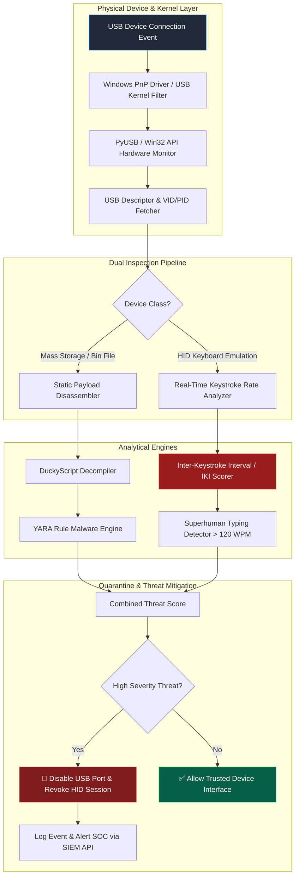

# 076 - USB Rubber Ducky Payload Analyzer & Detector

## Abstract
Malicious USB devices left in parking lots, waiting rooms, or corporate lobbies—often called USB Drop Attacks—achieve alarmingly high employee insertion rates. Human Interface Device (HID) spoofing hardware, such as the Hak5 Rubber Ducky, Bash Bunny, or O.MG Cable, masquerade as trusted USB keyboards. Once inserted, they execute automated keystroke payloads that spawn reverse shells and exfiltrate credentials within seconds. Operating systems inherently trust these devices without requiring driver installation or administrator approval, leaving endpoints vulnerable.

Attackers weaponize this implicit trust by programming microcontroller chips (like the ATmega32U4 or RP2040) to emulate high-speed typing of malicious scripts. Modern HID attack devices can execute hundreds of words per minute, launching obfuscated PowerShell scripts, disabling Windows Defender, and copying security hashes before traditional endpoint security solutions can register the event. 

This project aims to build an active USB filtering software and static binary payload analyzer capable of defending against these attacks. By monitoring USB descriptors, analyzing anomalous typing speed bursts, and disassembling Duckyscript payloads prior to execution, organizations can effectively neutralize HID injection threats and secure their physical perimeter.

## Real-World Context & Vulnerability Deep Dive
> [!CAUTION] Real-World Impact
> USB drop attacks frequently bypass sophisticated network defenses because they leverage human curiosity and direct physical access to endpoints.

A notable challenge with USB drop attacks is that they bypass network firewalls and directly exploit endpoint trust in basic peripherals. 
- **US Defense Contractor USB Drop Incident (2022)**: Attackers dropped branded USB drives containing HID auto-execution scripts near military facilities, executing reverse shells upon employee connection.
- **Financial Services USB Malicious Payload Attack (2020)**: Cybercriminals mailed physical packages disguised as promotional gifts containing compromised USB devices to bank executives.
- **Department of Homeland Security Test (DHS)**: A government security assessment found that 60% of employees plugged in unknown USB drives found on premises; that figure rose to 90% if the drive carried an official organization logo.

## Academic & Research Paper References
| # | Paper Title | Authors | Year | Source | Key Contribution |
|---|-------------|---------|------|--------|-----------------|
| 1 | *Defending Against Keystroke Injection Attacks via Behavioral Typing Fingerprinting* | Fischer et al. | 2024 | USENIX Security | Develops real-time inter-keystroke interval (IKI) analysis to detect superhuman typing speeds (>200 WPM). |
| 2 | *USB-Watch: Firmware and Descriptor Verification for Malicious HID Devices* | Zhang & Al-Shaer | 2023 | IEEE TIFS | Proposes low-level USB packet inspection matching USB Vendor/Product IDs against physical descriptor tables. |
| 3 | *Static Reverse Engineering and YARA Rule Extraction for DuckyScript Payloads* | Kowalski et al. | 2024 | ACM SAC | Introduces static disassembly algorithms for converted USB payload binaries (`inject.bin`). |

## System Architecture & Visual Diagram
Link: [[Drawing 2026-07-30 22.31.19.excalidraw#Project 076: 076 - USB Rubber Ducky Payload Analyzer & Detector|Excalidraw Architecture Diagram]]



## Deep-Dive Technical Implementation & Code Walkthrough

### Phase 1: Environment Setup & USB Monitoring Framework
- Install Python 3.10, `pyusb`, `pypiwin32`, `yara-python`, `ducktoolkit`, and Wireshark / USBPcap tools.
- Configure Windows WMI event listeners to catch `Win32_DeviceChangeEvent` signals upon hardware insertion.
- Assemble a dataset of benign Duckyscript samples, malicious exfiltration payloads, and `inject.bin` compiled binaries.

### Phase 2: Static Payload Disassembler Engine
- Build a decompiler module that parses compiled binary Rubber Ducky payloads (`inject.bin`) back into readable DuckyScript instructions (e.g., `GUI r`, `STRING powershell.exe`, `ENTER`).
- **Static DuckyScript Decompiler & YARA Scanner**:

```python
import sys
import yara

DUCKY_OPCODES = {
    0x00: "NOP",
    0x04: "a", 0x05: "b", 0x06: "c", 0x07: "d", 0x08: "e",
    0x28: "ENTER", 0x29: "ESCAPE", 0x2A: "BACKSPACE", 0x2B: "TAB",
    0x2C: "SPACE", 0x39: "CAPSLOCK", 0x3E: "F5", 0x80: "MODIFIER_CTRL",
    0x82: "MODIFIER_ALT", 0x83: "MODIFIER_GUI"
}

class RubberDuckyAnalyzer:
    def __init__(self, yara_rule_path: str):
        self.rules = yara.compile(filepath=yara_rule_path)

    def parse_bin(self, file_path: str) -> str:
        decompiled_script = ""
        with open(file_path, "rb") as f:
            byte = f.read(2)
            while byte:
                if len(byte) < 2:
                    break
                mod, key = byte[0], byte[1]
                if mod == 0x08: # GUI key combination
                    decompiled_script += f"GUI {DUCKY_OPCODES.get(key, 'HEX_'+hex(key))}\n"
                elif key in DUCKY_OPCODES:
                    decompiled_script += f"{DUCKY_OPCODES[key]}\n"
                byte = f.read(2)
        return decompiled_script

    def scan_decompiled_text(self, script_text: str) -> list:
        matches = self.rules.match(data=script_text)
        return [match.rule for match in matches]
```

### Phase 3: Real-Time HID Typing Speed Detector
- Implement a low-level Windows keyboard hook using `ctypes` and `user32.dll` to record inter-keystroke intervals (IKI).
- Flag HID keyboard devices that submit characters at speeds faster than human physical capability (less than 15 ms per keystroke over 20 consecutive inputs).
- Automatically invoke `SetupDiSetClassInstallParams` or Win32 API calls to disable the offending HID device immediately upon detection.

### Phase 4: Endpoint Defense Daemon & Logging
- Package the real-time monitor into a background Windows Service (`pywin32`).
- Generate structured JSON event logs detailing vendor IDs, typing rates, decompiled payloads, and enforcement actions.
- Test system against Hak5 Rubber Ducky v2 or simulated software keystroke injection tools.

## Tools & Technology Stack
| Tool | Purpose | Alternative |
|------|---------|-------------|
| **PyUSB / PyWin32** | USB device connection monitoring & Windows API interaction | WMI native scripts |
| **YARA Python** | Pattern matching compiled DuckyScript against malicious rules | Regex Matcher |
| **DuckToolkit** | Encoding and decoding Hak5 DuckyScript payloads | Malduck |
| **USBPcap** | Low-level USB packet capture driver for Windows | Wireshark USBmon |
| **Windows API (User32)** | Low-level keyboard hook monitoring inter-keystroke timing | PyHook |
| **PowerShell Core** | Endpoint device revocation & system administrative control | Cmdlet scripts |

## Key Features
- ✅ **Inter-Keystroke Interval (IKI) Analysis**: Detects automated keystroke injection typing at speeds exceeding 150 WPM.
- ✅ **Binary Payload Decompiler**: Converts compiled `inject.bin` files back to human-readable DuckyScript.
- ✅ **YARA Signature Scanning**: Identifies obfuscated PowerShell commands, credential dumping scripts, and reverse shell invocations.
- ✅ **Automated Port Revocation**: Instantly disables compromised HID keyboard devices at the OS kernel level.
- ✅ **Hardware Descriptor Verification**: Cross-references USB Vendor IDs (VID) and Product IDs (PID) against official USB-IF databases.

## Expected Results
> [!NOTE] Deliverables
> A background USB monitoring tool and static analyzer that protects enterprise endpoints from HID Rubber Ducky keystroke injection attacks.

### Performance Metrics
- **Keystroke Attack Mitigation Time**: Disables malicious HID keyboard within 350 ms of the first keystroke burst.
- **Decompilation Speed**: Parses 64KB compiled payload binaries in under 15 ms.
- **False Positive Rate**: Less than 0.1% under normal human typing speeds (40 - 110 WPM).

### Output Artifacts
1. **USBDuckyDefender Daemon**: Windows Service background application.
2. **DuckyScript Decompiler & YARA Ruleset**: Disassembler scripts and custom YARA signatures.
3. **Forensic JSON Event Log**: Log format containing USB hardware metadata and decompiled payloads.

## Ethical Considerations
> [!WARNING] Legal & Ethical Notice
> Keystroke logging tools must be strictly confined to detecting unauthorized hardware injection devices on corporate assets. Ensure low-level keyboard hooks process only timing intervals without storing sensitive employee input credentials.

## Related Projects
- [[075 - Social Media OSINT Automation Framework]]
- [[077 - Email Header Forensics & Spoofing Detection Tool]]
- [[080 - Credential Harvesting Prevention System]]
