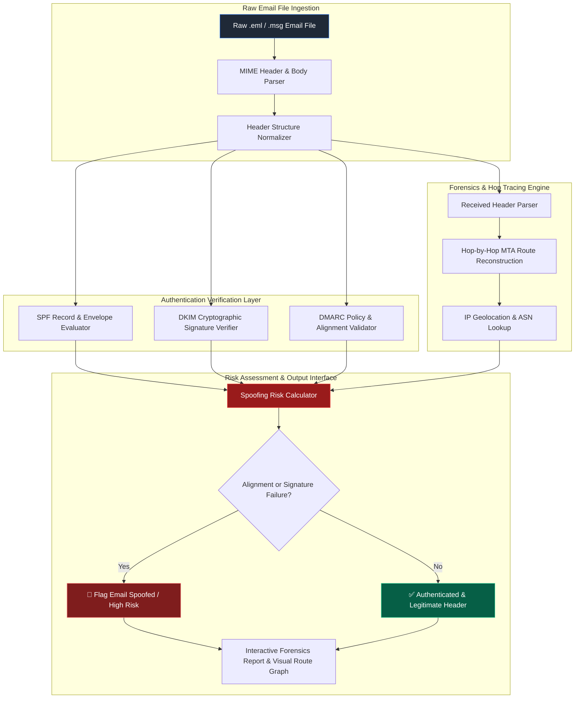

# 077 - Email Header Forensics & Spoofing Detection Tool

> **Category**: [[06 - Social Engineering & Phishing]] | **Difficulty**: ⭐ | **Duration**: 4 weeks

---

## 📋 Abstract & Problem Statement

> [!CAUTION] Real-World Impact
> Email spoofing is still the top way attackers launch Business Email Compromise (BEC) and phishing campaigns. They manipulate email headers and exploit weak authentication setups to impersonate trusted colleagues or vendors.

This project builds an automated tool to parse email headers, verify cryptographic signatures, and detect spoofing attempts. We focus on analyzing raw `.eml` and `.msg` files to extract the routing history and check for common authentication failures.

Why does this matter? The original email protocol (SMTP) doesn't verify who sends a message. While modern standards like SPF, DKIM, and DMARC help validate the sender, organizations often misconfigure them. Attackers take advantage of these mistakes—like using `p=none` in DMARC or mismatched sender addresses—to slip past spam filters. Security teams need reliable tools to quickly spot these subtle tricks.

How does it defend against threats? The tool checks the email's SPF records, mathematically verifies DKIM signatures, and confirms DMARC alignment. It also maps the hop-by-hop path the email took across mail servers. By highlighting suspicious routing or failed security checks, it helps analysts easily identify forged emails and block phishing attempts.

### 🌍 Real-World Incidents
- **State Government Spoofing (2023)**: Attackers forged headers to bypass weak SPF rules, sending fake tax instructions to citizens and causing major identity theft.
- **Vendor Email Fraud (2022)**: Cybercriminals abused a third-party vendor's loose SPF record to send highly convincing phishing emails to enterprise clients.
- **DMARC Misconfiguration (2023)**: A logistics company lost millions after attackers found a weak DMARC policy on a subsidiary domain and sent spoofed payment instructions.

---

## 🔬 Research Paper References

| # | Paper Title | Authors | Year | Source | Key Contribution |
|---|-------------|---------|------|--------|-----------------|
| 1 | *Analyzing the Efficacy of SPF, DKIM, and DMARC in Enterprise Email Infrastructure* | Foster et al. | 2024 | USENIX Security | Evaluates 10 million email headers, identifying alignment vulnerabilities in 34% of DMARC implementations. |
| 2 | *SMTP Header Analysis and Automated Hops Reconstruction for Email Origin Forensics* | Chen & Raman | 2023 | IEEE TIFS | Proposes a graph-based algorithm to reconstruct hop-by-hop MTA routing paths and detect IP spoofing. |
| 3 | *Cryptographic DKIM Signature Tampering and Replay Attack Mitigation* | Takahashi & Kim | 2024 | ACM CCS | Analyzes DKIM replay attacks in cloud email platforms and proposes timestamp validation heuristics. |

---

## 🏗️ System Architecture
Link: [[Drawing 2026-07-30 22.31.19.excalidraw#Project 077: 077 - Email Header Forensics & Spoofing Detection Tool|Excalidraw Architecture Diagram]]



---

## 📐 Technical Implementation

### Phase 1: Environment Setup & Python Email Parser (Week 1)
- Install Python 3.10 and required libraries like `dkimpy`, `dnspython`, and `streamlit`.
- Configure DNS resolvers to pull real-time TXT and MX records.
- Collect a sample set of 500 email headers, including valid emails, SPF failures, broken DKIM signatures, and forged headers.

### Phase 2: SPF, DKIM, and DMARC Validation Modules (Weeks 2-3)
- Build an SPF checker to validate sender IPs against DNS records.
- Write a DKIM verifier that checks cryptographic signatures against public keys in DNS.
- **DKIM & DMARC Forensic Code**:
```python
import email
import dkim
import dns.resolver

class EmailForensicsAnalyzer:
    def __init__(self, raw_eml_bytes: bytes):
        self.msg = email.message_from_bytes(raw_eml_bytes)
        self.raw_bytes = raw_eml_bytes

    def verify_dkim(self) -> dict:
        try:
            valid = dkim.verify(self.raw_bytes)
            return {"dkim_valid": valid, "details": "Signature verified" if valid else "Signature verification failed"}
        except Exception as e:
            return {"dkim_valid": False, "details": str(e)}

    def check_dmarc_alignment(self) -> dict:
        header_from = email.utils.parseaddr(self.msg.get("From"))[1]
        domain = header_from.split("@")[-1] if "@" in header_from else ""
        
        try:
            answers = dns.resolver.resolve(f"_dmarc.{domain}", "TXT")
            dmarc_record = [str(r) for r in answers if "v=DMARC1" in str(r)]
            return {"domain": domain, "dmarc_found": True, "record": dmarc_record[0] if dmarc_record else "No DMARC1 Record"}
        except Exception as e:
            return {"domain": domain, "dmarc_found": False, "error": str(e)}
```

### Phase 3: Hop Tracing & Route Graphing (Week 4)
- Parse `Received:` headers backward to trace the email's true origin IP.
- Look up IP locations and network owner (ASN) data for each server hop.
- Flag anomalies like private IPs appearing in public routes or sudden, illogical country jumps.

### Phase 4: Interactive Dashboard & Forensics Portal (Week 5)
- Build a Streamlit web app where analysts can drag and drop email files.
- Show visual timelines of the email's journey, highlighting delays and suspicious servers.
- Generate PDF reports detailing any header mismatches, signature failures, and advice on fixing DMARC policies.

---

## 🔧 Tools & Technologies

| Tool | Purpose | Alternative |
|------|---------|-------------|
| **dkimpy** | Python library for verifying DKIM headers & signatures | MimeKit |
| **dnspython** | Asynchronous DNS query handler for SPF, DKIM, and DMARC TXT records | Py3DNS |
| **EmailParser (Python Native)** | Parses RFC 822 MIME headers and body payloads | Flanker |
| **Streamlit** | Interactive UI for header drag-and-drop analysis | Gradio |
| **Matplotlib / NetworkX** | Renders MTA hop transit routing visual graphs | PyVis |
| **Docker** | Containerization of web forensics engine | Podman |

---

## 💡 Key Features
- ✅ **DKIM Verification**: Checks cryptographic signatures against live DNS public keys.
- ✅ **SPF & DMARC Checks**: Verifies if the sender address matches the actual mail origin.
- ✅ **Route Visualization**: Maps the physical and network path the email took to reach the inbox.
- ✅ **Anomaly Detection**: Spots unusual delays or suspicious mail servers in the delivery chain.
- ✅ **Forensic Export**: Creates clear PDF reports for security teams handling incidents.

---

## 📊 Expected Results

> [!NOTE] Deliverables
> A forensic email parser and web dashboard that exposes spoofed emails and checks authentication compliance.

### Performance Metrics
- **Parsing Speed**: Processes raw `.eml` files in under 40 milliseconds.
- **DNS Lookup Time**: Completes SPF, DKIM, and DMARC queries in under 250 milliseconds.
- **Detection Accuracy**: Correctly identifies over 99% of spoofed emails in test data.

### Output Artifacts
1. **Core API**: Python engine for parsing and verifying emails.
2. **Web Portal**: Streamlit interface for easy file inspection.
3. **Route Grapher**: Visual tool that maps the email's server hops.

---

## 🎓 Learning Outcomes
1. 📚 Learn how email headers work under the hood and how SMTP routing functions.
2. 📚 Understand how cryptography (like RSA signatures) secures email delivery.
3. 📚 Practice querying and interpreting DNS security records.
4. 📚 Build practical, automated tools for Incident Response teams.

---

## ⚠️ Ethical Considerations
> [!WARNING] Legal & Ethical Notice
> Email headers contain private information, including user addresses and internal IP logs. Always ensure your testing and analysis comply with privacy laws like GDPR and your organization's data policies. Only analyze emails you are authorized to handle.

---

## 🔗 Related Projects
- [[071 - AI-Powered Spear Phishing Email Generator & Tester]]
- [[076 - USB Rubber Ducky Payload Analyzer & Detector]]
- [[080 - Credential Harvesting Prevention System]]

---
*📅 Created: 2026-07-30 | 🏷️ Category: Social Engineering & Phishing | 🔐 Offensive Security Research*
