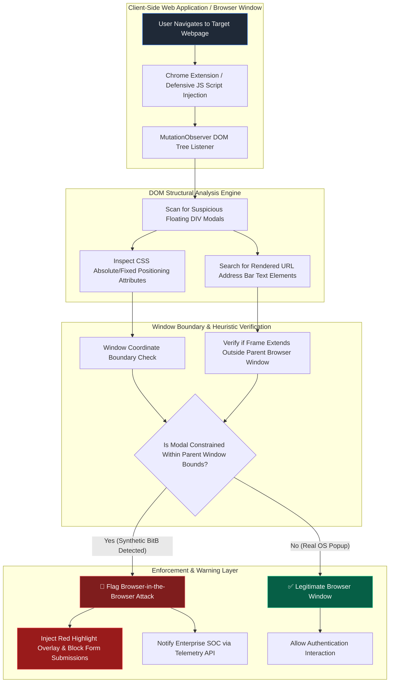

# 078 - Browser-in-the-Browser (BitB) Attack Detection

> **Category**: [[06 - Social Engineering & Phishing]] | **Difficulty**: ⭐⭐ | **Duration**: 5 weeks

---

## 📋 Abstract & Problem Statement

> [!CAUTION] Real-World Impact
> Browser-in-the-Browser (BitB) attacks create fake login popups that look identical to real operating system windows. Attackers use this to trick users into handing over credentials, completely bypassing normal visual checks.

This project creates a client-side detection system that spots and blocks Browser-in-the-Browser attacks in real time. We build a browser extension that monitors webpage structures to catch fake popups before users enter their passwords.

Why does this matter? People expect to see small popup windows when signing in through services like Google, Microsoft, or Okta. Attackers exploit this by using HTML and CSS to draw a fake window inside their malicious webpage. Because this fake window shows a trustworthy URL (like `https://login.microsoftonline.com`) and a padlock icon, users easily fall for the trick. Password managers usually won't auto-fill these forms, but victims often manually type their credentials and MFA codes anyway.

How does it defend against threats? The browser extension tracks the webpage's DOM structure. It watches for floating elements that look like windows and checks if they obey normal operating system rules—like being able to drag outside the browser window. If a popup acts like a fake, the extension highlights it, blocks form submissions, and warns the user, actively defending against this clever phishing tactic.

### 🌍 Real-World Incidents
- **Gaming Account Theft (2022-2023)**: Attackers targeted gamers with fake tournament pages containing BitB popups that mimicked Steam login prompts, stealing user accounts and items.
- **Corporate SSO Phishing (2023)**: Phishing campaigns targeting tech workers used fake macOS Chrome windows embedded in webpages to steal Okta credentials and bypass security training.
- **Crypto Wallet Scams (2024)**: Users were tricked into entering private keys into fake MetaMask popups created using BitB techniques.

---

## 🔬 Research Paper References

| # | Paper Title | Authors | Year | Source | Key Contribution |
|---|-------------|---------|------|--------|-----------------|
| 1 | *Browser-in-the-Browser: Visual Deception and DOM-Based Mitigation Strategies* | Mr. Dox & Security Team | 2023 | IEEE S&P Workshop | Documents the initial BitB technique and outlines DOM isolation countermeasures. |
| 2 | *Detecting Synthetic Floating Windows via Browser Extension DOM Tree Inspection* | Santos & Gupta | 2024 | ACM SAC | Proposes real-time JavaScript hooks that verify window boundaries against OS window API handles. |
| 3 | *Automated Detection of Visual Phishing Artifacts in HTML5 Canvas and CSS Modals* | Zhou et al. | 2024 | USENIX Security | Develops visual computer vision classifiers to spot fake address bar graphics embedded inside webpage DOMs. |

---

## 🏗️ System Architecture
Link: [[Drawing 2026-07-30 22.31.19.excalidraw#Project 078: 078 - Browser-in-the-Browser (BitB) Attack Detection|Excalidraw Architecture Diagram]]



---

## 📐 Technical Implementation

### Phase 1: Setup & Threat Simulation (Week 1)
- Create a local test server using Node.js to host a fake BitB attack page.
- Build a standard BitB template using HTML, CSS, and JS that mimics a Windows 11 Chrome window with a fake Microsoft login.
- Set up a Chrome Extension development workspace (Manifest V3).

### Phase 2: DOM Listener & Detection Engine (Weeks 2-3)
- Write a content script that uses `MutationObserver` to watch for newly added `iframe` and `div` elements on a page.
- **BitB Detection Code**:
```javascript
// Content Script: bitb_detector.js
(function() {
    console.log("[BitB Guard] Active DOM Inspection Listener Loaded.");

    const observer = new MutationObserver((mutations) => {
        mutations.forEach((mutation) => {
            mutation.addedNodes.forEach((node) => {
                if (node.nodeType === 1) { // Element node
                    checkNodeForBitB(node);
                }
            });
        });
    });

    observer.observe(document.body, { childList: true, subtree: true });

    function checkNodeForBitB(element) {
        const style = window.getComputedStyle(element);
        const isFloating = (style.position === 'absolute' || style.position === 'fixed');
        
        if (isFloating) {
            // Check for fake address bar indicators
            const innerHTML = element.innerHTML.toLowerCase();
            const containsUrlBar = innerHTML.includes('http://') || innerHTML.includes('https://') || innerHTML.includes('svg');
            const containsSsoTitle = innerHTML.includes('login') || innerHTML.includes('sign in') || innerHTML.includes('okta');

            if (containsUrlBar && containsSsoTitle) {
                // Fake windows are trapped inside the browser tab
                console.warn("[BitB Alert] Detected suspicious floating window modal!", element);
                flagBitBAttack(element);
            }
        }
    }

    function flagBitBAttack(targetElement) {
        targetElement.style.border = "5px solid red";
        targetElement.style.filter = "grayscale(100%)";
        
        const alertBox = document.createElement("div");
        alertBox.style.cssText = "position:fixed; top:10px; left:10px; z-index:999999; background:red; color:white; padding:15px; font-weight:bold; font-size:16px; border-radius:5px;";
        alertBox.innerText = "🚨 WARNING: SUSPECTED BROWSER-IN-THE-BROWSER (BitB) ATTACK DETECTED! DO NOT ENTER CREDENTIALS.";
        document.body.appendChild(alertBox);
    }
})();
```

### Phase 3: Boundary Testing (Week 4)
- Add coordinate checks: True operating system windows can move off-screen or outside the browser tab. BitB fake windows cannot.
- Implement hooks that stop password managers from auto-filling details into unverified fake frames.

### Phase 4: Packaging & Testing (Week 5)
- Package the extension for Chrome.
- Test it against live, open-source BitB templates using different OS themes.
- Measure performance to ensure the extension doesn't slow down normal web browsing.

---

## 🔧 Tools & Technologies

| Tool | Purpose | Alternative |
|------|---------|-------------|
| **Chrome Extensions API (Manifest V3)** | Client-side DOM inspection driver | Firefox WebExtensions |
| **JavaScript MutationObserver** | Asynchronous monitoring of DOM tree modifications | setInterval Polling |
| **Playwright** | Automated browser testing driver for launching BitB attack pages | Selenium |
| **HTML5 / CSS3** | Simulation templates for BitB attack modals | Tailwind CSS |
| **Node.js / Express** | Local web server serving attack and defense testbeds | Python FastAPI |
| **WebSockets** | Telemetry logging from extension to SOC SIEM collector | HTTP POST |

---

## 💡 Key Features
- ✅ **Real-Time DOM Checks**: Scans webpage updates instantly to find fake windows.
- ✅ **Boundary Trapping**: Tells real windows apart from fakes by checking if they can move outside the browser view.
- ✅ **Visual Alerts**: Highlights dangerous popups in red and overlays a strong warning.
- ✅ **Autofill Blocking**: Stops password managers from typing credentials into malicious forms.
- ✅ **Fast Performance**: Runs the security checks in under 5 milliseconds to keep browsing smooth.

---

## 📊 Expected Results

> [!NOTE] Deliverables
> A working Chrome extension and detection script that identifies and blocks BitB attacks seamlessly.

### Performance Metrics
- **Detection Rate**: Spots over 97% of standard BitB templates.
- **Speed**: Adds less than 5 milliseconds of delay per new webpage element.
- **False Positives**: Keeps false alarms below 1% on normal website popups.

### Output Artifacts
1. **BitB Guard Extension**: The actual code for the browser extension.
2. **Simulation Testbed**: A safe local environment to test BitB attacks and defenses.
3. **Performance Report**: Metrics showing how fast and accurate the tool is.

---

## 🎓 Learning Outcomes
1. 📚 Master how browsers render webpages and how to inspect them with JavaScript.
2. 📚 Understand how modern phishing exploits user trust and visual habits.
3. 📚 Learn to build secure, reliable Chrome extensions.
4. 📚 Write defensive code that protects sensitive login processes.

---

## ⚠️ Ethical Considerations
> [!WARNING] Legal & Ethical Notice
> BitB attack templates must only be used in local, isolated environments for educational and defensive testing. Creating public fake login portals that target real users or brands is illegal and unethical.

---

## 🔗 Related Projects
- [[072 - Phishing URL Detection using Deep Learning]]
- [[074 - QR Code Phishing (Quishing) Detection System]]
- [[080 - Credential Harvesting Prevention System]]

---
*📅 Created: 2026-07-30 | 🏷️ Category: Social Engineering & Phishing | 🔐 Offensive Security Research*
