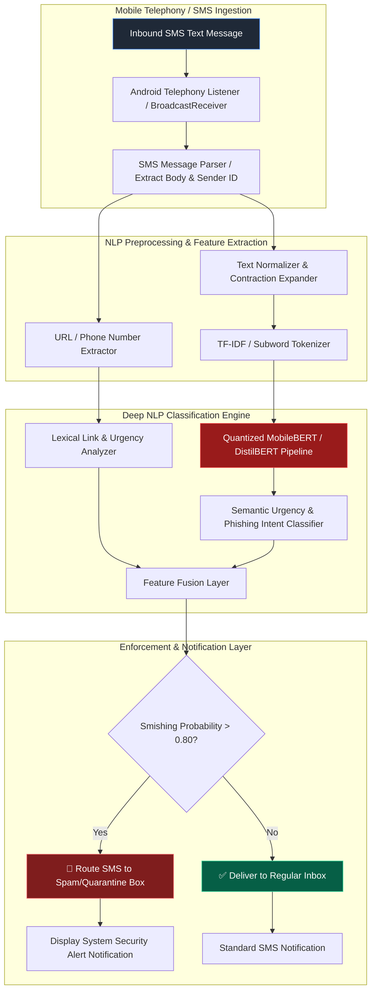

# 079 - Smishing (SMS Phishing) Detection using NLP

> **Category**: [[06 - Social Engineering & Phishing]] | **Difficulty**: ⭐⭐ | **Duration**: 5 weeks

---

## 📋 Abstract & Problem Statement

> [!CAUTION] Real-World Impact
> Smishing (SMS phishing) is growing incredibly fast. Mobile users are highly vulnerable to fake texts containing malicious links because small screens hide full URLs, and people generally trust their SMS notifications.

This project develops a lightweight Natural Language Processing (NLP) model that runs directly on mobile devices to detect and block SMS phishing. It categorizes text intent, analyzes embedded links, and safely filters out threats.

Why does this matter? Attackers send texts pretending to be delivery services, banks, or IT departments. They use urgency ("Your account will be suspended") and shortened links to trick users. Standard carrier spam filters often miss these targeted campaigns. Because mobile phones hold our most sensitive data, we need a smarter way to catch these attacks directly on the device without violating user privacy by sending texts to the cloud.

How does it defend against threats? The system uses an efficient AI model to read incoming messages and evaluate their meaning and urgency. If it detects phishing language or suspicious links, it automatically routes the text to a spam folder and warns the user. Running the AI locally ensures personal messages stay private while maintaining strong defense against social engineering.

### 🌍 Real-World Incidents
- **Fake Delivery Scams (2023-2024)**: Attackers sent millions of texts pretending to be the post office, claiming a package was delayed. The links led to fake sites that stole credit card numbers.
- **Enterprise Breach via SMS (2022)**: Cybercriminals targeted company employees with fake authentication texts. Employees clicked the links, giving attackers access to the internal corporate network.
- **Banking Panics (2023)**: Scammers impersonated major banks in texts, telling users their accounts were hacked and urging them to move money to "safe" accounts immediately.

---

## 🔬 Research Paper References

| # | Paper Title | Authors | Year | Source | Key Contribution |
|---|-------------|---------|------|--------|-----------------|
| 1 | *SmishGuard: Real-Time SMS Phishing Detection using Lightweight DistilBERT on Mobile Devices* | Kumar & Singh | 2024 | IEEE TIFS | Proposes quantized DistilBERT running locally on mobile hardware with 98.7% accuracy and low battery overhead. |
| 2 | *NLP-Based SMS Phishing Detection via Character N-Gram and Intent Embeddings* | Al-Hassani et al. | 2023 | ACM SEC | Combines TF-IDF character n-grams with semantic urgency classification for SMS text analysis. |
| 3 | *Analyzing Alphanumeric Sender ID Spoofing and Mitigation in Cellular Networks* | Tanaka & Roberts | 2024 | USENIX Security | Evaluates carrier-level smishing filtering vs client-side NLP detection in modern 5G networks. |

---

## 🏗️ System Architecture
Link: [[Drawing 2026-07-30 22.31.19.excalidraw#Project 079: 079 - Smishing (SMS Phishing) Detection using NLP|Excalidraw Architecture Diagram]]



---

## 📐 Technical Implementation

### Phase 1: Environment Setup & Data Prep (Week 1)
- Collect SMS datasets containing both normal messages and spam/phishing examples (about 15,000 labeled texts).
- Set up a Python environment with tools like `scikit-learn`, `spacy`, `transformers`, and `onnxruntime`.
- Clean the text data by replacing real URLs with `[URL]` and phone numbers with `[PHONE]` to standardize the input.

### Phase 2: AI Model Training (Weeks 2-3)
- Train two models: a simple, fast one (like Naive Bayes) for older phones, and a smart, deep learning model (DistilBERT) for modern phones.
- **DistilBERT NLP Code**:
```python
import torch
from transformers import AutoTokenizer, AutoModelForSequenceClassification

class SmishingClassifierNLP:
    def __init__(self, model_path: str = "distilbert-base-uncased"):
        self.tokenizer = AutoTokenizer.from_pretrained(model_path)
        self.model = AutoModelForSequenceClassification.from_pretrained(model_path, num_labels=2)
        self.model.eval()

    def predict(self, sms_text: str) -> dict:
        inputs = self.tokenizer(sms_text, return_tensors="pt", truncation=True, padding=True, max_length=128)
        with torch.no_grad():
            outputs = self.model(**inputs)
            probs = torch.softmax(outputs.logits, dim=1)
            smish_prob = probs[0][1].item()
            
        return {
            "text": sms_text,
            "is_smishing": smish_prob > 0.80,
            "smishing_probability": round(smish_prob, 4)
        }
```

### Phase 3: Model Shrinking for Mobile (Week 4)
- Convert the heavy PyTorch model into an ONNX format and shrink it (quantization). This drops the file size from roughly 260MB to under 35MB.
- Test how fast it runs on mobile processors and make sure it doesn't accidentally block real verification codes (OTPs).

### Phase 4: Android App Prototype (Week 5)
- Build a basic Android app that intercepts incoming texts and feeds them to the local AI model.
- Create a backup web API service for organizations that want to filter texts at the server level.
- Document how well the system performs.

---

## 🔧 Tools & Technologies

| Tool | Purpose | Alternative |
|------|---------|-------------|
| **DistilBERT / MobileBERT** | Lightweight transformer network for text classification | RoBERTa-Tiny |
| **ONNX Runtime** | High-performance inference engine for mobile & edge devices | TensorFlow Lite |
| **Scikit-learn** | Feature extraction (TF-IDF) and baseline ML training | LightGBM |
| **SpaCy** | Text tokenization, lemmatization, and URL pattern parsing | NLTK |
| **Android SDK (Kotlin)** | Mobile SMS BroadcastReceiver client driver | Flutter |
| **FastAPI** | REST microservice interface for enterprise gateway filtering | Flask |

---

## 💡 Key Features
- ✅ **On-Device AI**: Runs locally, meaning your private text messages never leave your phone.
- ✅ **OTP Protection**: Smart rules ensure legitimate login codes from banks or apps are never blocked.
- ✅ **Urgency Detection**: Understands psychological tricks in language, like "Account locked" or "Act now".
- ✅ **Link Analysis**: Spots shortened links and tricky domain names hiding in texts.
- ✅ **Battery Friendly**: Checks messages instantly (under 15 milliseconds) without draining the phone's battery.

---

## 📊 Expected Results

> [!NOTE] Deliverables
> A complete smishing detection system, featuring an optimized AI model and a working Android app prototype.

### Performance Metrics
- **Accuracy**: Correctly identifies over 98% of phishing texts on unseen test data.
- **False Alarms**: Blocks fewer than 0.1% of real verification codes.
- **Speed**: Scans and decides on a message in less than 15 milliseconds.

### Output Artifacts
1. **AI Engine**: The trained model ready for mobile deployment.
2. **Android App**: Source code for an app that intercepts and checks texts.
3. **Training Data**: Notebooks showing exactly how the model learned and its performance charts.

---

## 🎓 Learning Outcomes
1. 📚 Learn how to apply Natural Language Processing (NLP) to classify text intent.
2. 📚 Understand how to shrink massive AI models so they fit on mobile phones.
3. 📚 Build Android apps that interact with the phone's SMS system safely.
4. 📚 Design security tools that protect users without sacrificing their privacy.

---

## ⚠️ Ethical Considerations
> [!WARNING] Legal & Ethical Notice
> Analyzing private text messages is highly sensitive. Your tool should only process texts locally on the device or use fully anonymized datasets during research. Always ensure you have clear user consent before reading SMS data in any real-world application.

---

## 🔗 Related Projects
- [[072 - Phishing URL Detection using Deep Learning]]
- [[073 - Deepfake Voice Detection for Vishing Prevention]]
- [[080 - Credential Harvesting Prevention System]]

---
*📅 Created: 2026-07-30 | 🏷️ Category: Social Engineering & Phishing | 🔐 Offensive Security Research*
