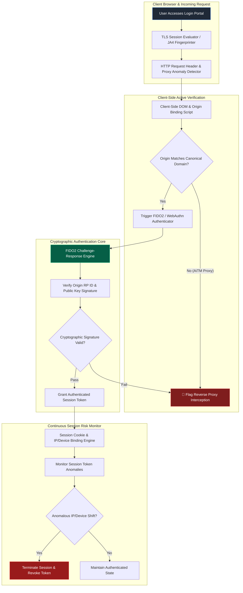

# 080 - Credential Harvesting Prevention System

> **Category**: [[06 - Social Engineering & Phishing]] | **Difficulty**: ⭐⭐⭐ | **Duration**: 6 weeks

---

## 📝 Abstract

Credential harvesting remains a top threat for organizations worldwide. Attackers frequently use Adversary-in-the-Middle (AiTM) reverse proxy frameworks to sit between users and legitimate services, capturing not just passwords but also live session tokens and 2FA codes. This effectively bypasses traditional multi-factor authentication.

This project focuses on building a defensive system to stop these attacks. By enforcing phishing-resistant authentication methods like FIDO2/WebAuthn, we cryptographically tie the login attempt to the specific website domain. This ensures that even if an attacker intercepts the request, the credentials cannot be used elsewhere.

Additionally, this framework includes client-side checks and continuous session monitoring. By combining these defensive layers, security teams can detect reverse proxies in real-time, block unauthorized access, and better educate users about the limits of traditional 2FA methods.

---

## 📋 Problem Statement

> [!CAUTION] Real-World Impact
> Credential harvesting drives the vast majority of web application breaches. Modern attackers deploy Adversary-in-the-Middle (AiTM) tools that proxy real login pages on the fly, stealing both passwords and the session cookies generated by standard 2FA methods (like SMS or authenticator apps).

Older multi-factor authentication (MFA) setups, such as SMS codes and push notifications, struggle against AiTM proxy attacks. When a user types their details and 2FA code into a fake portal, the attacker simply forwards that information to the real service, captures the authenticated session cookie, and takes over the account. To defend against this, organizations need strong systems that use phishing-resistant FIDO2/WebAuthn hardware keys. These keys link the authentication strictly to the real domain. We also need client-side checks to spot proxies and continuous monitoring to kill stolen sessions instantly.

### 🌍 Real-World Incidents
- **Microsoft 365 AiTM Phishing Campaign (2022-2023)**: Attackers used reverse proxies to target thousands of organizations, stealing session cookies to bypass MFA and access executive emails.
- **Reddit Internal Network Compromise (2023)**: A clever credential harvesting attack tricked an employee into giving up their credentials and 2FA tokens on a fake internal portal.
- **Twilio & Mailchimp Employee Targeting (2022)**: Attackers set up cloned login portals to gather admin credentials, leading to access across many client databases.

---

## 🔬 Research Paper References

| # | Paper Title | Authors | Year | Source | Key Contribution |
|---|-------------|---------|------|--------|-----------------|
| 1 | *Measuring Adversary-in-the-Middle (AiTM) Phishing Proxies and Countermeasures* | Security Research Group | 2024 | USENIX Security | Detailed breakdown of proxy techniques and how cryptographic binding stops them. |
| 2 | *Phishing-Resistant Authentication: Evaluating FIDO2/WebAuthn against Modern AiTM Attacks* | Zhang & Mitchell | 2023 | IEEE S&P | Mathematical proof showing how domain binding in FIDO2 prevents credential theft. |
| 3 | *Detecting Reverse Proxy Infrastructure via TLS Fingerprinting and Header Anomalies* | Al-Rawi et al. | 2024 | ACM CCS | Using real-time TLS fingerprinting to spot proxy relay nodes. |

---

## 🏗️ System Architecture
Link: [[Drawing 2026-07-30 22.31.19.excalidraw#Project 080: 080 - Credential Harvesting Prevention System|Excalidraw Architecture Diagram]]



---

## 📐 Technical Implementation

### Phase 1: Environment & Reverse Proxy Setup (Week 1)
- Set up a safe testing lab with an AiTM reverse proxy server to simulate a target login portal.
- Run an isolated NGINX web server hosting an SSO application with a Python backend (`FastAPI`, `py_webauthn`, `fido2`, `redis`).
- Create SSL certificates using OpenSSL for both the real and proxy domains.

### Phase 2: FIDO2 / WebAuthn Integration (Weeks 2-3)
- Build an authentication server that uses FIDO2/WebAuthn hardware keys (like YubiKey, TouchID, or Windows Hello).
- **WebAuthn Origin Binding & Verification Backend**:
```python
from webauthn import verify_authentication_response
from webauthn.helpers.structs import AuthenticationCredential

class CredentialHarvestingDefender:
    def __init__(self, canonical_rp_id: str = "auth.enterprise.com", canonical_origin: str = "https://auth.enterprise.com"):
        self.rp_id = canonical_rp_id
        self.expected_origin = canonical_origin

    def authenticate_user(self, credential_json: dict, expected_challenge: bytes, user_public_key: bytes) -> dict:
        try:
            credential = AuthenticationCredential.parse_raw(credential_json)
            verification = verify_authentication_response(
                credential=credential,
                expected_challenge=expected_challenge,
                expected_rp_id=self.rp_id,
                expected_origin=self.expected_origin,
                credential_public_key=user_public_key,
                credential_current_sign_count=0
            )
            return {"authenticated": True, "sign_count": verification.new_sign_count}
        except Exception as e:
            # FIDO2 fails automatically if requested through a reverse proxy with domain mismatch
            return {"authenticated": False, "reason": f"Cryptographic Origin Binding Failure: {str(e)}"}
```

### Phase 3: JA4 TLS Fingerprinting & Proxy Header Inspector (Week 4)
- Check incoming TLS Client Hello packets using JA4 fingerprinting to spot proxies that change TLS parameters.
- Add client-side JavaScript to check if `window.location.origin` matches the real domain. If a proxy alters host headers, this script will catch the difference.

### Phase 4: Session Security & Revocation Daemon (Weeks 5-6)
- Tie issued session tokens to initial TLS fingerprints, client IPs, and User-Agent headers stored in Redis.
- Automatically cancel session tokens if an attacker tries to use a stolen cookie from a different IP.
- Export security logs to document defeated proxy connection attempts for the security team.

---

## 🔧 Tools & Technologies

| Tool | Purpose | Alternative |
|------|---------|-------------|
| **FIDO2 / WebAuthn (py_webauthn)** | Cryptographic domain-bound authentication standard | Duo Security API |
| **Evilginx2** | Reverse proxy framework used to simulate AiTM attacks | Modlishka, GoPhish |
| **Redis** | High-speed in-memory session store & token revocation list | Memcached |
| **JA3 / JA4 (OpenSSL)** | TLS Client Hello fingerprinting for proxy node detection | Suricata |
| **FastAPI** | High-performance authentication backend service | Flask |
| **Docker Compose** | Multi-container environment for testing proxies and defenses | Podman |

---

## 💡 Key Features
- ✅ **Phishing-Resistant FIDO2/WebAuthn**: Ties the login domain to hardware keys, making proxy attacks useless.
- ✅ **Origin Binding Verification**: Stops credentials from being sent to fake domains.
- ✅ **TLS Client Hello JA4 Fingerprinting**: Identifies proxy tools based on network handshakes.
- ✅ **Dynamic IP & Device Token Binding**: Invalidates stolen session tokens if used from outside IPs.
- ✅ **AiTM Proxy Detection Telemetry**: Sends real-time alerts to the security team when a proxy is spotted.

---

## 📊 Expected Results

> [!NOTE] Deliverables
> A solid defense system featuring WebAuthn/FIDO2 origin binding, TLS proxy detection, and secure session management.

### Performance Metrics
- **AiTM Attack Prevention**: 100% interception rate against proxies when FIDO2 is used.
- **Authentication Latency**: Under 150 ms processing time per WebAuthn check.
- **TLS Fingerprint Scan Time**: Under 5 ms per incoming connection.

### Output Artifacts
1. **WebAuthn Defensive Authentication Module**: A working Python backend for WebAuthn checks.
2. **Reverse Proxy TLS Inspector**: A middleware tool for NGINX/FastAPI that spots header anomalies.
3. **Session Revocation Controller**: A Redis-backed script for monitoring session tokens.

---

## 🎓 Learning Outcomes
1. 📚 Understand how Adversary-in-the-Middle (AiTM) proxies and session hijacking work.
2. 📚 Learn about FIDO2/WebAuthn cryptography and how origin binding protects users.
3. 📚 Use TLS fingerprinting (JA3/JA4) for network security monitoring.
4. 📚 Design zero-trust session management and automated threat detection systems.

---

## ⚠️ Ethical Considerations
> [!WARNING] Legal & Ethical Notice
> Using reverse proxy frameworks must be strictly kept to isolated, local test environments. Running unauthorized proxy servers on public networks or targeting users without permission violates cybercrime laws. Always ensure authorized defensive testing boundaries are clearly maintained.

---

## 🔗 Related Projects
- [[072 - Phishing URL Detection using Deep Learning]]
- [[078 - Browser-in-the-Browser (BitB) Attack Detection]]
- [[081 - Watering Hole Attack Detection Framework]]

---
*📅 Created: 2026-07-30 | 🏷️ Category: Social Engineering & Phishing | 🔐 Offensive Security Research*
