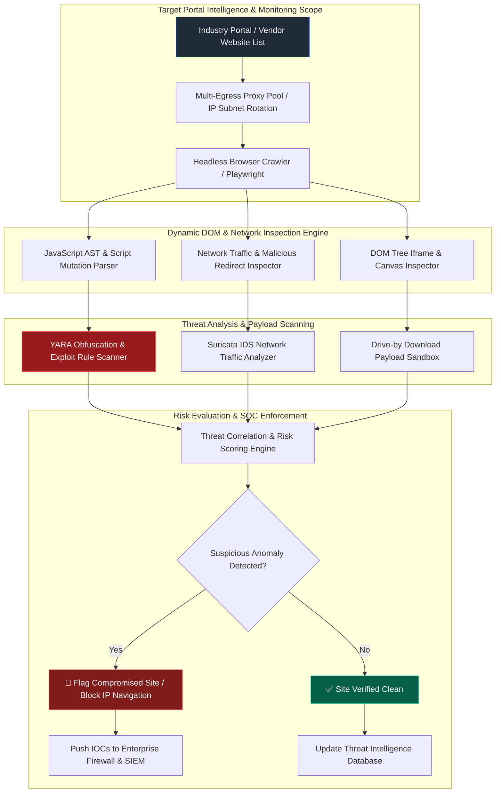

# 081 - Watering Hole Attack Detection Framework

> **Category**: [[06 - Social Engineering & Phishing]] | **Difficulty**: ⭐⭐⭐ | **Duration**: 6 weeks

---

## 📝 Abstract

Watering hole attacks are highly targeted campaigns where attackers compromise trusted third-party websites to infect specific visitors, such as employees of a particular company or industry. Instead of sending phishing emails, they wait for targets to visit these "watering holes" and deliver malicious payloads.

This project builds an automated detection framework to identify these subtle threats. By using headless browsers to crawl industry portals from various IP subnets, the system can expose conditional attacks that only trigger for specific targets. It analyzes web traffic, dynamic scripts, and hidden elements to detect drive-by downloads.

The primary focus is on defense and threat intelligence. Security teams can use this tool to monitor trusted sites, catch exploits before they reach end users, and strengthen their network defenses against targeted web-based attacks.

---

## 📋 Problem Statement

> [!CAUTION] Real-World Impact
> Advanced Persistent Threat (APT) groups use watering hole attacks to compromise specific, high-value targets. By hacking into niche news sites or vendor portals, they inject hidden scripts that serve exploits only to visitors from certain companies or industries.

Standard security tools often miss these attacks because they focus on email gateways and endpoints, leaving normal web browsing less monitored. In a watering hole attack, the malicious script checks the visitor's IP address, browser type, and operating system. If the visitor matches the target profile, the script delivers a malicious payload; otherwise, it shows normal content to stay hidden from basic security crawlers. Organizations need proactive monitoring tools that use automated browsers to track dynamic web changes, find hidden elements, and spot network anomalies on the sites their employees frequently visit.

### 🌍 Real-World Incidents
- **Hong Kong Media & Financial Sector Watering Hole (2021-2023)**: Attackers hacked local news portals to serve exploits to specific visiting devices.
- **US Defense Contractor Supply Chain Compromise (2022)**: Hackers placed redirect scripts on a popular aerospace logistics portal, delivering malware targeting defense industry IP addresses.
- **Polish Financial Institutions Attack (2017/2021)**: Malware was delivered to bank employees via official regulator websites that selectively targeted bank IP ranges.

---

## 🔬 Research Paper References

| # | Paper Title | Authors | Year | Source | Key Contribution |
|---|-------------|---------|------|--------|-----------------|
| 1 | *Detecting Targeted Watering Hole Attacks via IP-Gated Behavioral Web Crawling* | Zhao et al. | 2024 | USENIX Security | Building crawler networks from target IPs to reveal hidden payloads. |
| 2 | *Dynamic DOM Mutation and Obfuscated JavaScript Detection in Compromised Web Portals* | Miller & Santos | 2023 | IEEE TIFS | Using code parsing to find hidden dynamic elements on trusted sites. |
| 3 | *Characterizing APT Strategic Web Compromises and Drive-by Exploit Chains* | Al-Sabah et al. | 2024 | ACM CCS | Reviewing past campaigns to set baseline indicators for threat hunting. |

---

## 🏗️ System Architecture
Link: [[Drawing 2026-07-30 22.31.19.excalidraw#Project 081: 081 - Watering Hole Attack Detection Framework|Excalidraw Architecture Diagram]]



---

## 📐 Technical Implementation

### Phase 1: Environment & Crawler Framework Setup (Week 1)
- Set up a Python 3.10 environment with `playwright`, `yara-python`, `elasticsearch`, `requests`, `suricata`, and `FastAPI`.
- Configure a proxy pool to route the automated crawler through different corporate and commercial IP addresses to bypass targeting filters.
- Build a list of 100 trusted industry news portals and vendor sites to monitor.

### Phase 2: Dynamic DOM Mutation & Script Analysis (Weeks 2-3)
- Use Playwright headless browsers to track web page changes, scripts, and network requests.
- **Watering Hole DOM Mutation & Redirect Scanner**:
```python
import asyncio
from playwright.async_api import async_playwright
import yara
import json

class WateringHoleDetector:
    def __init__(self, yara_rules_path: str):
        self.rules = yara.compile(filepath=yara_rules_path)

    async def scan_portal(self, url: str, proxy_server: str = None) -> dict:
        async with async_playwright() as p:
            launch_args = {"headless": True}
            if proxy_server:
                launch_args["proxy"] = {"server": proxy_server}
                
            browser = await p.chromium.launch(**launch_args)
            context = await browser.new_context(user_agent="Mozilla/5.0 (Windows NT 10.0; Win64; x64)")
            page = await context.new_page()

            network_requests = []
            suspicious_iframes = []

            # Intercept outbound network requests
            page.on("request", lambda req: network_requests.append(req.url))

            try:
                await page.goto(url, wait_until="networkidle", timeout=15000)
                
                # Extract all dynamic iframes
                iframes = await page.query_selector_all("iframe")
                for iframe in iframes:
                    src = await iframe.get_attribute("src")
                    style = await iframe.get_attribute("style")
                    if src and ("0px" in str(style) or "display:none" in str(style)):
                        suspicious_iframes.append({"src": src, "style": style})

                # Extract page inline scripts and scan with YARA
                content = await page.content()
                matches = self.rules.match(data=content)
                yara_hits = [m.rule for m in matches]

                await browser.close()
                return {
                    "url": url,
                    "suspicious_iframes": suspicious_iframes,
                    "yara_matches": yara_hits,
                    "total_network_requests": len(network_requests)
                }
            except Exception as e:
                await browser.close()
                return {"url": url, "error": str(e)}
```

### Phase 3: Traffic Inspection & Payload Sandboxing (Week 4)
- Capture HTTP Archive (`.har`) files for every site scanned.
- Check third-party script loads, flagging new, untrusted external JavaScript domains.
- Send any downloaded files or suspicious payloads to an isolated sandbox (like Cuckoo or CAPE) for automated testing.

### Phase 4: SIEM Integration & Alerting Dashboard (Weeks 5-6)
- Store scan results in Elasticsearch to track how monitored sites change over time.
- Generate alerts if a trusted website suddenly adds hidden elements or complex scripts.
- Run the system as a Dockerized background task for continuous monitoring.

---

## 🔧 Tools & Technologies

| Tool | Purpose | Alternative |
|------|---------|-------------|
| **Playwright** | Asynchronous headless browser crawler for web inspection | Puppeteer, Selenium |
| **YARA** | Pattern matching engine for finding bad scripts | Regex Engine |
| **Suricata** | Network Intrusion Detection System for analyzing traffic | Zeek / Bro |
| **Elasticsearch** | Storage for web histories and change logs | OpenSearch |
| **CAPE Sandbox API** | Testing environment for suspicious payloads | Cuckoo Sandbox |
| **Docker Compose** | Multi-service orchestration container environment | Podman |

---

## 💡 Key Features
- ✅ **Multi-Egress IP Proxying**: Uses various IP ranges to bypass targeting filters and reveal hidden payloads.
- ✅ **Hidden Element Scanning**: Detects hidden iframes often used to hide exploit pages.
- ✅ **JavaScript Analysis**: Flags suspicious script actions and web page changes.
- ✅ **Network Redirect Tracing**: Finds complex redirects started by compromised sites.
- ✅ **Proactive Threat Feeds**: Sends indicators of compromise to firewalls before users visit bad sites.

---

## 📊 Expected Results

> [!NOTE] Deliverables
> A detection framework that monitors trusted portals and spots drive-by exploit attempts.

### Performance Metrics
- **Crawl Efficiency**: Inspects 50 complex web portals in under 15 minutes.
- **Hidden Element Detection**: 100% success rate in finding hidden iframe injections.
- **False Positive Rate**: Under 1.2% for normal script updates.

### Output Artifacts
1. **WateringHoleScanner Pipeline**: An automated Python crawler and YARA engine.
2. **Elasticsearch Dashboard**: A portal tracking historical web page changes.
3. **Threat Feed Generator**: A tool producing blocklists for firewalls.

---

## 🎓 Learning Outcomes
1. 📚 Learn how APT groups use watering hole attacks and web compromises.
2. 📚 Master web scraping and site inspection using Playwright.
3. 📚 Create custom YARA rules to detect tricky JavaScript and hidden elements.
4. 📚 Build automated threat intelligence pipelines to protect enterprise networks.

---

## ⚠️ Ethical Considerations
> [!WARNING] Legal & Ethical Notice
> Web crawling must follow robots.txt rules and use polite query rates. Do not attempt to exploit vulnerabilities found on third-party sites; always report security findings to domain owners using proper disclosure procedures. Stay within authorized defensive testing bounds.

---

## 🔗 Related Projects
- [[072 - Phishing URL Detection using Deep Learning]]
- [[075 - Social Media OSINT Automation Framework]]
- [[080 - Credential Harvesting Prevention System]]

---
*📅 Created: 2026-07-30 | 🏷️ Category: Social Engineering & Phishing | 🔐 Offensive Security Research*
