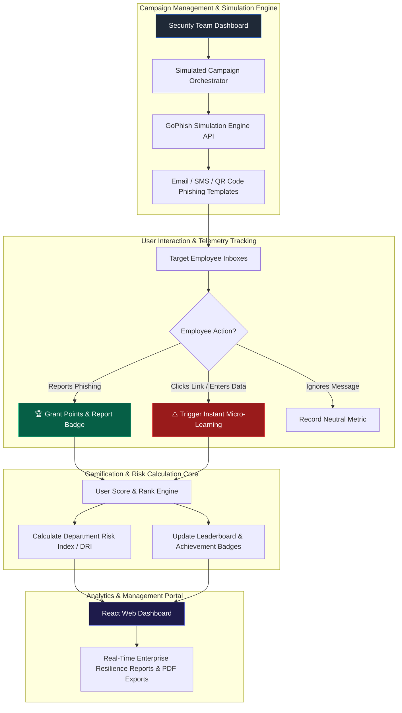

# 082 - Security Awareness Training Gamification Platform

> **Category**: [[06 - Social Engineering & Phishing]] | **Difficulty**: ⭐ | **Duration**: 4 weeks

---

## 📝 Abstract

Security awareness training is often viewed as a tedious compliance requirement, leading to poor knowledge retention and high susceptibility to social engineering attacks. Annual video modules do little to prepare employees for real-world phishing and credential theft scenarios.

This project introduces a gamified training platform that transforms security education into an engaging, continuous process. By integrating realistic phishing simulations with real-time feedback, leaderboards, and achievement badges, the system actively rewards positive security behaviors and provides immediate micro-learning when mistakes occur.

The educational focus of this platform emphasizes building a "Human Firewall." It gives security teams clear metrics on organizational resilience while helping employees build practical, lasting habits to detect and report threats safely.

---

## 📋 Problem Statement

> [!CAUTION] Real-World Impact
> Human error contributes to over 74% of corporate cybersecurity breaches. Standard 30-minute annual compliance videos often result in less than 10% long-term knowledge retention, leaving staff vulnerable to modern social engineering.

Traditional security awareness training struggles with low engagement and passive learning. Employees frequently treat mandatory videos as a chore rather than a chance to build threat recognition skills. As a result, when faced with realistic spear phishing, QR code scams, or manipulative phone calls, they fail to apply what they learned. Organizations need interactive platforms that provide continuous simulated attacks, real-time feedback, team leaderboards, and simple risk tracking to turn employees into an active defense layer.

### 🌍 Real-World Incidents
- **Healthcare System Compromise (2023)**: A hospital network suffered a ransomware attack after an employee clicked a bad attachment, despite having just completed standard compliance training.
- **Fintech Credential Phishing (2022)**: Attackers accessed internal tools after several staff members entered their credentials into a phishing portal during a weekend campaign.
- **Phishing Resiliency Study (2023)**: Research showed that companies using only static annual training had a 32% click rate on phishing emails, while those using continuous, gamified micro-simulations dropped their click rates below 4%.

---

## 🔬 Research Paper References

| # | Paper Title | Authors | Year | Source | Key Contribution |
|---|-------------|---------|------|--------|-----------------|
| 1 | *Gamification of Cybersecurity Awareness: Measuring Behavioral Change in Corporate Environments* | Adams et al. | 2024 | Computers & Security | Shows a 68% drop in phishing susceptibility using badge incentives and feedback. |
| 2 | *Evaluating Micro-Learning Interventions for Long-Term Phishing Resilience* | Patel & Jenkins | 2023 | ACM CHI | Demonstrates that short, immediate feedback modules improve learning retention significantly compared to long videos. |
| 3 | *Peer-Driven Security Culture: Gamified Departmental Leaderboards and Behavioral Metrics* | Al-Hassan et al. | 2024 | IEEE TIFS | Looks at how team competition improves enterprise security training programs. |

---

## 🏗️ System Architecture
Link: [[Drawing 2026-07-30 22.31.19.excalidraw#Project 082: 082 - Security Awareness Training Gamification Platform|Excalidraw Architecture Diagram]]



---

## 📐 Technical Implementation

### Phase 1: Environment Setup & GoPhish Integration (Week 1)
- Install Python 3.10, Node.js v18, PostgreSQL, the GoPhish API client, React, and Docker.
- Set up a local GoPhish server in a Docker container to run training campaigns.
- Create PostgreSQL database schemas for `users`, `departments`, `campaigns`, `scores`, and `badges`.

### Phase 2: Gamification Backend & Risk Scoring API (Weeks 2-3)
- Create a FastAPI service that receives GoPhish webhooks to track email opens, clicks, credential submissions, and reports.
- **Gamification Engine & Points Calculator**:
```python
from fastapi import FastAPI, HTTPException
from pydantic import BaseModel
import psycopg2

app = FastAPI(title="Security Awareness Gamification API")

class PhishingEvent(BaseModel):
    user_email: str
    event_type: str # 'reported', 'opened', 'clicked', 'submitted'
    campaign_id: int

@app.post("/webhook/gophish")
def process_gophish_event(event: PhishingEvent):
    points_delta = 0
    badge_earned = None

    if event.event_type == "reported":
        points_delta = 100
        badge_earned = "Phishing Sentinel"
    elif event.event_type == "opened":
        points_delta = 0
    elif event.event_type == "clicked":
        points_delta = -50
    elif event.event_type == "submitted":
        points_delta = -150

    update_user_score(event.user_email, points_delta, badge_earned)
    return {"status": "success", "user": event.user_email, "points_added": points_delta}

def update_user_score(email: str, points: int, badge: str = None):
    # Database update logic for user points and departmental risk score calculation
    pass
```

### Phase 3: Interactive Micro-Learning & Gamified Portal (Week 3)
- Build a web interface using React and TailwindCSS that shows:
  1. Personal Scorecards and Levels (e.g., Level 1: "Novice" to Level 10: "Cyber Defender").
  2. Department Leaderboards ranking different corporate teams.
  3. Short, 90-second learning modules that appear immediately if someone clicks a simulated phishing link.

### Phase 4: Analytics Dashboard & Deployment (Week 4)
- Make visual dashboards with Chart.js to show phishing click trends over time.
- Add report generation tools for management review.
- Package the whole application using Docker Compose for easy setup.

---

## 🔧 Tools & Technologies

| Tool | Purpose | Alternative |
|------|---------|-------------|
| **GoPhish** | Open-source phishing simulation framework | King Phisher |
| **FastAPI** | Python API for scoring logic | Express.js |
| **React + TailwindCSS** | User portal and leaderboards interface | Vue.js |
| **PostgreSQL** | Database for points, badges, and metrics | MySQL |
| **Chart.js** | Data visualization for resilience tracking | Recharts |
| **Docker Compose** | Manages application components | Podman |

---

## 💡 Key Features
- ✅ **Real-Time Scoring Engine**: Gives points for reporting phishing and deducts points for clicking unsafe links.
- ✅ **Departmental Leaderboards**: Creates friendly competition among teams to boost engagement.
- ✅ **Just-in-Time Micro-Learning**: Provides short, helpful training modules right when a mistake is made.
- ✅ **Achievement Badges**: Rewards active defenders with titles like "Phishing Sentinel" and "Security Champion".
- ✅ **Analytics Dashboard**: Tracks the organization's improvement against phishing attempts over time.

---

## 📊 Expected Results

> [!NOTE] Deliverables
> A complete gamified training platform linked with GoPhish, featuring scorecards, leaderboards, and management analytics.

### Performance Metrics
- **Phishing Click-Through Reduction**: Aims for under 5% click rate after three months of use.
- **Reporting Velocity**: Over 70% of simulated phishing emails reported within an hour.
- **API Processing Latency**: Under 20 ms per webhook event.

### Output Artifacts
1. **Gamification Platform Core**: The main FastAPI backend and React frontend.
2. **GoPhish Integration Adapter**: The automated handler for tracking events.
3. **Analytics Dashboard**: A web portal showing the organization's security posture.

---

## 🎓 Learning Outcomes
1. 📚 Learn how to apply gamification to enterprise security training.
2. 📚 Understand how to connect and use security tools like GoPhish via REST APIs.
3. 📚 Build full-stack applications with FastAPI, React, PostgreSQL, and Chart.js.
4. 📚 Discover behavioral methods that help people resist social engineering attacks.

---

## ⚠️ Ethical Considerations
> [!WARNING] Legal & Ethical Notice
> Simulated phishing campaigns must be planned carefully with HR and leadership. Never use scenarios that cause emotional distress (such as fake termination notices or false emergency alerts), as this breaks trust and damages workplace morale. Focus strictly on educational and authorized defensive testing.

---

## 🔗 Related Projects
- [[071 - AI-Powered Spear Phishing Email Generator & Tester]]
- [[073 - Deepfake Voice Detection for Vishing Prevention]]
- [[075 - Social Media OSINT Automation Framework]]

---
*📅 Created: 2026-07-30 | 🏷️ Category: Social Engineering & Phishing | 🔐 Offensive Security Research*
