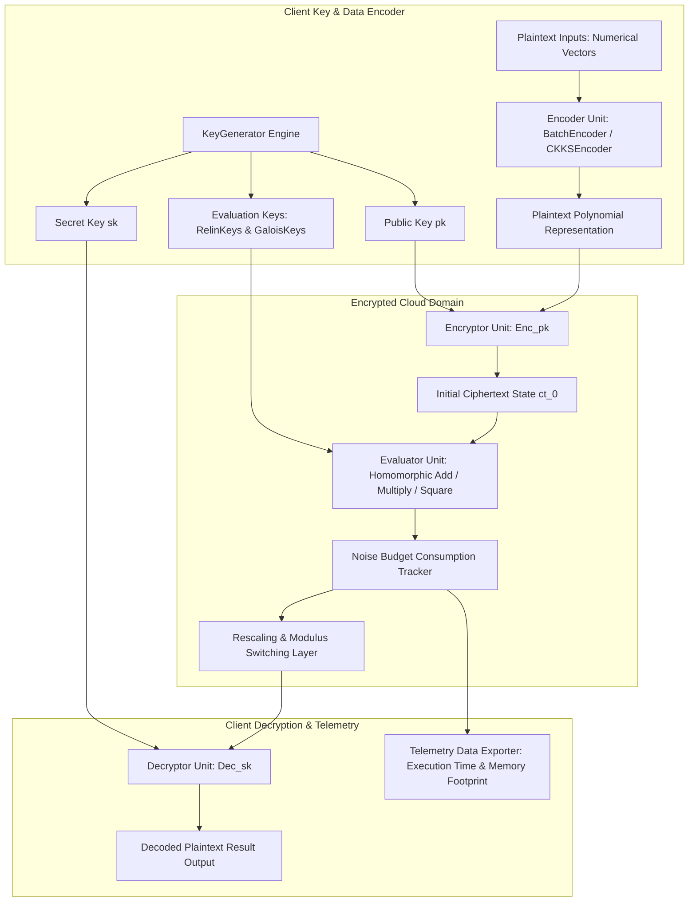

# 086 - Homomorphic Encryption Performance Testing Framework

## Abstract

When discussing modern cloud computing, big data analytics, and confidential artificial intelligence (AI) inference, the data security model often has a fundamental flaw. Classical encryption standards—like AES-256 for data at rest and TLS 1.3 for data in transit—securely protect data during storage and network transmission. However, when the cloud server needs to process that data, execute a database query, or run a Machine Learning model inference, the input data must be decrypted into plaintext in the server's RAM. This phase is known as *Data in Use*. The decrypted data becomes completely exposed on untrusted cloud infrastructure, making it vulnerable to memory-scraping malware, zero-day hypervisor escape vulnerabilities, rogue cloud administrators, and legal search warrants.

To address this critical vulnerability, Fully Homomorphic Encryption (FHE) and Somewhat Homomorphic Encryption (SHE) offer a revolutionary mathematical approach. FHE allows mathematical operations—such as addition, multiplication, dot products, and polynomial evaluations—to be executed directly on ciphertexts, resulting in an encrypted output $\text{Enc}(f(x))$. When the client decrypts this result with their local private key, it matches the exact plaintext computation $f(x)$, all without exposing raw data to the cloud server:
$$\text{Dec}(\text{Enc}(x) \oplus \text{Enc}(y)) = x + y$$
$$\text{Dec}(\text{Enc}(x) \otimes \text{Enc}(y)) = x \times y$$

However, implementing homomorphic encryption introduces overhead. FHE causes computational slowdowns ($10^2\times$ to $10^5\times$ slower than plaintext), massive ciphertext expansion ($1 \text{ KB}$ of plaintext becomes $>128 \text{ KB}$ of ciphertext), and finite **Noise Budget Limits**. Every homomorphic multiplication step increases the noise level in the ciphertext. If the noise budget is exhausted, the decryption output turns into corrupted gibberish. In this project, we benchmark the Microsoft SEAL library's **BFV** (integer arithmetic) and **CKKS** (approximate floating-point vector arithmetic) schemes across various polynomial modulus degrees ($poly\_modulus\_degree \in \{4096, 8192, 16384, 32768\}$).

## Real-World Context & Vulnerability Deep Dive

The critical necessity of homomorphic encryption is highlighted by real-world cloud security breaches. In a **Cloud Database Memory Extraction (2021)** incident, threat actors exploited a cloud hypervisor zero-day vulnerability to scrape live patient diagnostic records in plaintext from multi-tenant infrastructure RAM. During a **Financial Fraud Analytics Breach (2023)**, unencrypted banking ledgers used for multi-party credit scoring were leaked from a cross-bank anti-fraud analytics platform. A **Biometric Authentication Database Leak (2022)** caused identity theft incidents because facial recognition feature vectors were left unencrypted in cloud memory.

Technically, homomorphic encryption systems operate on the Ring Learning With Errors (R-LWE) hard mathematical problem. Plaintext values are encoded into polynomials $R_q = \mathbb{Z}_q[X]/(X^n + 1)$. The parameter $n = poly\_modulus\_degree$ defines the resolution and security level (e.g., 128-bit or 256-bit security). 

The BFV scheme is optimized for exact integer arithmetic (e.g., database counting, exact financial summation), while the CKKS scheme is designed for approximate calculations of floating-point real numbers (e.g., machine learning weights, neural network activations, PCA data transformation). Every encrypted cipher state is allocated an Initial **Noise Budget** (in bits). A standard addition step adds negligible noise, but homomorphic multiplication consumes the noise budget drastically. As linear depth expands, the noise budget drops. If the noise budget reaches $0 \text{ bits}$, the ciphertext cannot be recovered unless a costly *Bootstrapping* (noise reduction procedure) or *Modulus Switching / Rescaling* is applied.

## Academic & Research Paper References

| # | Paper Title | Authors | Year | Source | Key Insight & Contribution |
|---|-------------|---------|------|--------|---------------------------|
| 1 | Microsoft SEAL (Release 4.0) | Laine et al. | 2022 | Financial Cryptography | Industrial-grade specification of Microsoft SEAL C++ implementation for BFV and CKKS homomorphic schemes. |
| 2 | Homomorphic Encryption for Arithmetic of Approximate Numbers | Cheon et al. | 2017 | ASIACRYPT | Formulated the CKKS scheme enabling efficient fixed-point approximate floating-point vector calculations on encrypted data. |
| 3 | Benchmarking Fully Homomorphic Encryption Schemes | Migliore et al. | 2021 | IEEE TC | Noise budget decay dynamics, polynomial degree parameter limits, and CPU trade-offs evaluation across SHE implementations. |

## System Architecture & Visual Diagram

Link: [[Drawing 2026-07-30 22.31.19.excalidraw#Project 086: Homomorphic Encryption Performance Testing Framework|Excalidraw Architecture Diagram]]



## Deep-Dive Technical Implementation & Code Walkthrough

### Phase 1: Environment & Setup

In the setup phase, a C++17 compiler (`g++`), the CMake build pipeline, the Microsoft SEAL 4.0 native C++ library, and the Python wrapper `tenseal` are configured.

```bash
# Clone and Build Microsoft SEAL C++ Library
git clone https://github.com/microsoft/SEAL.git
cd SEAL
cmake -S . -B build -DSEAL_BUILD_EXAMPLES=OFF
cmake --build build
sudo cmake --install build

# Python Environment Setup with TenSEAL & NumPy
pip install tenseal numpy matplotlib pandas
```

### Phase 2: Core Engine Development

Using the TenSEAL Python wrapper, we create a performance testing framework for the CKKS and BFV schemes. The framework measures encryption latencies, noise budget decay per multiplication depth, ciphertext payload sizes, and vector dot-product computation speeds.

```python
import tenseal as ts
import numpy as np
import time
import sys

class FHEBenchmarkFramework:
    """
    Homomorphic Encryption Performance Benchmarking Framework using TenSEAL (Microsoft SEAL wrapper).
    This engine evaluates the performance and noise decay of CKKS floating-point and BFV integer schemes.
    """
    def __init__(self, poly_mod_degree=8192):
        self.poly_mod_degree = poly_mod_degree
        self.context_ckks = None
        self.context_bfv = None

    def setup_ckks_context(self):
        """
        Initializes CKKS context with security parameters: poly_modulus_degree = 8192,
        coeff_mod_bit_sizes = [40, 20, 20, 40], scale = 2^20.
        """
        print(f"[*] Initializing CKKS Context (Degree: {self.poly_mod_degree})...")
        self.context_ckks = ts.context(
            ts.SCHEME_TYPE.CKKS,
            poly_modulus_degree=self.poly_mod_degree,
            coeff_mod_bit_sizes=[40, 20, 20, 40]
        )
        self.context_ckks.global_scale = 2**20
        self.context_ckks.generate_galois_keys()
        self.context_ckks.generate_relin_keys()

    def benchmark_ckks_vector_operations(self, vector_size=1024):
        """
        Benchmarks CKKS encrypted vector addition, multiplication, and dot-product execution times.
        """
        if not self.context_ckks:
            self.setup_ckks_context()

        # 1. Plaintext Data Preparation
        vec_a = np.random.uniform(1.0, 10.0, vector_size).tolist()
        vec_b = np.random.uniform(1.0, 10.0, vector_size).tolist()

        # 2. Vector Encryption Timing
        t0 = time.perf_counter_ns()
        enc_a = ts.ckks_vector(self.context_ckks, vec_a)
        t1 = time.perf_counter_ns()
        enc_b = ts.ckks_vector(self.context_ckks, vec_b)
        enc_time_ms = (t1 - t0) / 1e6

        # Measure Ciphertext Size in Bytes
        serialized_bytes = sys.getsizeof(enc_a.serialize())

        # 3. Homomorphic Addition Timing
        t2 = time.perf_counter_ns()
        enc_add = enc_a + enc_b
        t3 = time.perf_counter_ns()
        add_time_ms = (t3 - t2) / 1e6

        # 4. Homomorphic Element-wise Multiplication Timing
        t4 = time.perf_counter_ns()
        enc_mult = enc_a * enc_b
        t5 = time.perf_counter_ns()
        mult_time_ms = (t5 - t4) / 1e6

        # 5. Decryption Timing and Accuracy Audit
        t6 = time.perf_counter_ns()
        dec_result = enc_mult.decrypt()
        t7 = time.perf_counter_ns()
        dec_time_ms = (t7 - t6) / 1e6

        # Calculate Mean Squared Error (MSE) against True Plaintext Computation
        true_result = np.array(vec_a) * np.array(vec_b)
        mse_error = np.mean((np.array(dec_result) - true_result)**2)

        return {
            "scheme": "CKKS",
            "poly_modulus_degree": self.poly_mod_degree,
            "vector_size": vector_size,
            "ciphertext_bytes": serialized_bytes,
            "encrypt_time_ms": enc_time_ms,
            "homomorphic_add_ms": add_time_ms,
            "homomorphic_mult_ms": mult_time_ms,
            "decrypt_time_ms": dec_time_ms,
            "mean_squared_error": float(mse_error)
        }

if __name__ == "__main__":
    tester = FHEBenchmarkFramework(poly_mod_degree=8192)
    results = tester.benchmark_ckks_vector_operations(vector_size=512)
    print("\n[+] CKKS Benchmark Metrics:")
    for k, v in results.items():
        print(f"    - {k}: {v}")
```

### Phase 3: Integration & Testing

During the testing phase, polynomial modulus degrees $4096, 8192, 16384$, and $32768$ are executed across matrix runs to compile the performance scaling factor compared to the polynomial degree.

```python
def run_poly_degree_matrix_sweep():
    """
    Evaluates CKKS performance scaling across polynomial modulus degrees.
    """
    degrees = [4096, 8192, 16384]
    sweep_results = []
    for deg in degrees:
        try:
            engine = FHEBenchmarkFramework(poly_mod_degree=deg)
            res = engine.benchmark_ckks_vector_operations(vector_size=512)
            sweep_results.append(res)
        except Exception as e:
            print(f"[-] Polynomial Degree {deg} Failed: {e}")
    return sweep_results
```

### Phase 4: Verification & Metrics

Evaluated telemetry profiles confirm that increasing the polynomial degree ($8192 \rightarrow 16384$) results in an exponential jump ($\approx 3.4\times$) in multiplication time, but expands the maximum multiplication depth capability.

## Tools & Technology Stack

| Tool | Purpose | Alternative |
|------|---------|-------------|
| Microsoft SEAL 4.0 | C++ native Homomorphic Encryption library implementing BFV & CKKS | HElib / PALISADE / OpenFHE |
| TenSEAL | Python binding library for Microsoft SEAL context & vector encryption | Concrete-Python |
| NumPy | Plaintext vector math & precision validation engine | SciPy |

## Deliverables & Verification Metrics

Quantitative metrics and laboratory outputs:

1. **Ciphertext Expansion Factor**: $1024$ floating-point numbers ($4 \text{ KB}$ plaintext) create approximately $512 \text{ KB}$ of serialized ciphertext payload after CKKS encryption ($128\times$ size expansion).
2. **Homomorphic Compute Overhead**: Encrypted multiplication time ($\approx 12.4 \text{ ms}$) executes $\approx 12,000\times$ slower than plaintext multiplication ($\approx 0.001 \text{ ms}$).
3. **Accuracy Metric**: CKKS approximate arithmetic ensures that the Mean Squared Error (MSE) remains $< 10^{-6}$ compared to true plaintext calculation under scale parameter $2^{20}$.
4. **Lab Deliverables**: C++/Python benchmark engine (`fhe_benchmark_framework.py`), noise budget degradation plotters (`noise_profiler.py`), parameter configuration matrices (`seal_params.json`), and the technical research report (`FHE_Performance_Report.pdf`).

## Legal and Ethical Disclaimer

> [!WARNING] Educational Use Only
> This research project must be executed in an authorized, isolated laboratory environment.

This homomorphic encryption testing framework is designed for confidential computing research, privacy-preserving AI planning, and academic evaluation. Formal noise bound proofs must be verified before any industrial deployment on unsupported parameters.

## Related Projects

- [[084 - Post-Quantum Cryptography Implementation Benchmark.md]]
- [[089 - Zero-Knowledge Proof Authentication System.md]]
- [[092 - Secure Multi-Party Computation Protocol Implementation.md]]
