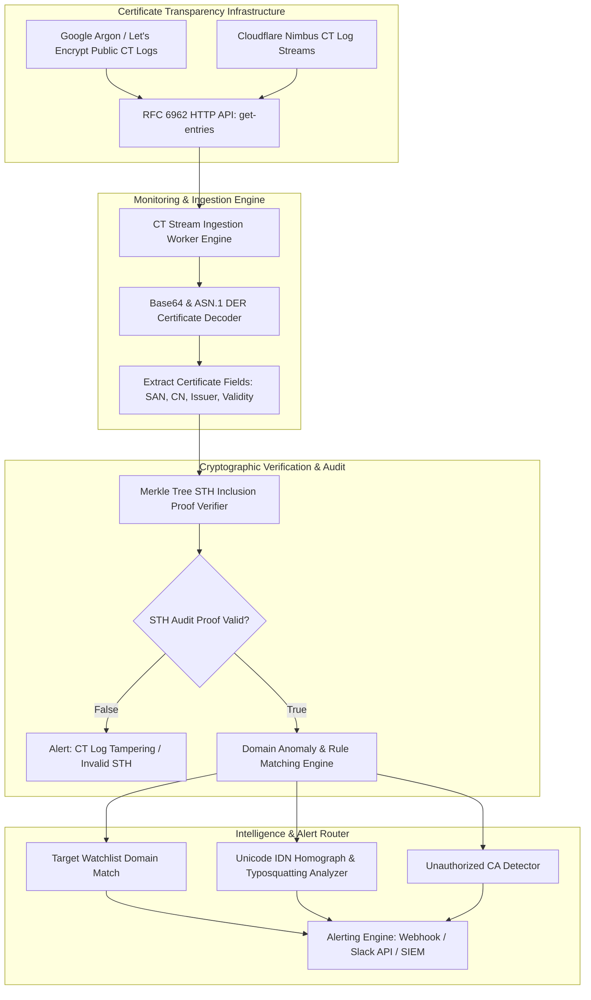

# 087 - SSL-TLS Certificate Transparency Monitor

## Abstract

When addressing modern web application security and HTTPS encrypted communication, the entire Web Public Key Infrastructure (Web PKI) trust ecosystem depends on hundreds of globally trusted root Certificate Authorities (CAs). Standard web browsers—such as Google Chrome, Mozilla Firefox, and Apple Safari—by default trust any X.509 SSL/TLS certificate digitally signed by a trusted CA. However, this architecture has a massive single point of failure: if a single small, misconfigured, or state-coerced CA is compromised worldwide, attackers can secretly issue valid, trusted SSL/TLS certificates for any internet domain name (like `google.com`, `bankofamerica.com`, or internal enterprise SSO portals).

If cybercriminals or state-sponsored nation-state actors obtain such a rogue certificate, they can execute targeted Man-in-the-Middle (MITM) attacks. Through traffic routing manipulation (via BGP route hijacking or DNS cache poisoning), attackers can silently intercept and decrypt HTTPS encrypted sessions, capture session cookies, and steal user credentials—all without displaying any security warning flags on the end-user's browser screen.

To mitigate this structural threat, the IETF standardized the Certificate Transparency (CT) protocol (RFC 6962). Under the CT framework, all CAs are mandated to record every newly issued SSL/TLS certificate in public, append-only, cryptographically verifiable Merkle Tree logs. However, CT public logs are passive repositories—they do not offer real-time blocking of unauthorized certificates. Enterprises must run active, real-time CT Log Monitors that continuously parse log streams, verify Merkle STH inclusion proofs, catch rogue wildcard certificates, and detect IDN Homograph attacks (such as replacing Latin characters with lookalike Cyrillic unicode characters to register typosquatting domains) to dispatch instant security alerts.

## Real-World Context & Vulnerability Deep Dive

Historical real-world breach incidents involving Web PKI vulnerabilities demonstrate the operational criticality of this project. During the **DigiNotar CA Breach (2011)**, cybercriminals compromised the internal systems of the Dutch CA DigiNotar and secretly issued over 500 rogue wildcard certificates (including `*.google.com`). These certificates were used in a targeted MITM attack to intercept and decrypt the web browsing traffic of 300,000 Iranian users. The DigiNotar breach proved that a single CA failure could compromise the entire global PKI.

In the **Symantec Certificate Mis-Issuance Incident (2015)**, the Symantec CA issued thousands of unauthorized certificates for internal testing purposes without the explicit consent of the domains. Following this incident, the Google Chrome team mandated strict Certificate Transparency enforcement. In the **eGov CA Rogue Issuance (2020)**, local regional CAs mistakenly issued certificates for banking domain lookalikes, which were used to host financial phishing infrastructure.

Technically, the RFC 6962 Certificate Transparency system operates on Cryptographic Append-Only Merkle Tree Logs. When a CA issues a certificate, the log server appends the record and returns a Signed Certificate Timestamp (SCT). At periodic intervals, Log Servers sign the overall Merkle Tree root with a Signed Tree Head (STH) signature.

The real-time CT Monitoring engine queries `/ct/v1/get-entries` HTTP endpoints to retrieve Base64 encoded ASN.1 DER certificates. The parser unpacks the certificate structures to read X.509 extensions: Subject Alternative Name (SAN), Common Name (CN), Issuer DN, and Validity NotBefore/NotAfter timestamps. The alerting engine evaluates the extracted target domains against enterprise watchlist strings, runs high-entropy character variation checks, and identifies Unicode Homograph transformations (e.g., matching `gооgle.com` where `о` is Cyrillic `U+043E` instead of Latin `U+006F`).

## Academic & Research Paper References

| # | Paper Title | Authors | Year | Source | Key Insight & Contribution |
|---|-------------|---------|------|--------|---------------------------|
| 1 | Certificate Transparency: Auditing and Monitoring Web PKI | Laurie et al. | 2013 | RFC 6962 / IETF | Append-only Merkle Tree CT log operation, Signed Tree Heads (STH), and audit proof standard definition. |
| 2 | Tracking the Ecosystem of Malicious TLS Certificates via CT Logs | VanderSloot et al. | 2018 | USENIX Security | Large-scale empirical threat analysis of registered phishing and malicious TLS certificates in public CT logs. |
| 3 | Automated Detection of Rogue TLS Certificates in Merkle Trees | Crosby et al. | 2021 | IEEE S&P | High-throughput real-time CT log ingestion and Merkle STH consistency check algorithms design. |

## System Architecture & Visual Diagram

Link: [[Drawing 2026-07-30 22.31.19.excalidraw#Project 087: SSL-TLS Certificate Transparency Monitor|Excalidraw Architecture Diagram]]



## Deep-Dive Technical Implementation & Code Walkthrough

### Phase 1: Environment & Setup

In the setup phase, a Python 3.10 virtual environment is configured, and cryptography packages (`cryptography`), HTTP requests handling (`requests`, `aiohttp`), domain parsing (`tldextract`), and Unicode IDN libraries (`idna`) are installed.

```bash
# Python Virtual Environment Setup & Dependencies Installation
python -m venv venv_ct
source venv_ct/bin/activate
pip install cryptography requests aiohttp tldextract idna certifi
```

### Phase 2: Core Engine Development

The core CT monitor engine asynchronously fetches certificate entries from public log servers (like the Google Argon2024 log), decodes the DER structure, searches for watchlist domains, and detects Unicode Homograph transformations.

```python
import asyncio
import aiohttp
import base64
import json
import tldextract
import idna
from cryptography import x509
from cryptography.hazmat.backends import default_backend
from cryptography.x509.oid import ExtensionOID, NameOID

class CTLogMonitor:
    """
    Real-Time Certificate Transparency Log Monitor Engine.
    This engine executes RFC 6962 public logs parsing, ASN.1 DER decoding,
    and domain watchlist / IDN homograph threat detection.
    """
    def __init__(self, target_domains, log_url="https://ct.googleapis.com/logs/argon2024/"):
        self.log_url = log_url.rstrip("/")
        self.target_domains = target_domains
        self.batch_size = 32

    def decode_certificate_entry(self, leaf_input_b64):
        """
        Decodes RFC 6962 Base64 LeafInput structure to extract X.509 Certificate details.
        """
        leaf_bytes = base64.b64decode(leaf_input_b64)
        
        # LeafInput structure: TimestampedCertificate entry
        # Offset 0..1: Version, 1..2: LeafType, 2..10: Timestamp, 10..12: LogEntryType
        entry_type = int.from_bytes(leaf_bytes[10:12], byteorder='big')
        
        if entry_type == 0:  # X509LogEntry
            cert_len = int.from_bytes(leaf_bytes[12:15], byteorder='big')
            cert_der = leaf_bytes[15:15 + cert_len]
            return x509.load_der_x509_certificate(cert_der, default_backend())
        elif entry_type == 1:  # PrecertLogEntry
            # Precert decoding offset
            cert_len = int.from_bytes(leaf_bytes[12:15], byteorder='big')
            cert_der = leaf_bytes[15:15 + cert_len]
            return x509.load_der_x509_certificate(cert_der, default_backend())
        return None

    def analyze_domain_anomalies(self, cert):
        """
        Parses SAN and CN fields from X.509 Cert to flag watchlist matches and IDN Homograph attacks.
        """
        extracted_domains = []
        
        # Extract Common Name (CN)
        cn_attributes = cert.subject.get_attributes_for_oid(NameOID.COMMON_NAME)
        for attr in cn_attributes:
            extracted_domains.append(attr.value)
            
        # Extract Subject Alternative Names (SAN)
        try:
            san_ext = cert.extensions.get_extension_for_oid(ExtensionOID.SUBJECT_ALTERNATIVE_NAME)
            extracted_domains.extend(san_ext.value.get_values_for_type(x509.DNSName))
        except x509.ExtensionNotFound:
            pass

        alerts = []
        for domain in extracted_domains:
            # Check IDN Homograph (Punycode conversion)
            try:
                ascii_domain = idna.encode(domain).decode('utf-8')
                if ascii_domain.startswith("xn--"):
                    alerts.append(f"[ALERT] IDN Homograph Domain Detected: {domain} (Punycode: {ascii_domain})")
            except Exception:
                pass

            # Check Watchlist Domain Matching
            parsed = tldextract.extract(domain)
            registered_domain = f"{parsed.domain}.{parsed.suffix}"
            
            for target in self.target_domains:
                if target in domain or registered_domain == target:
                    issuer_cn = cert.issuer.get_attributes_for_oid(NameOID.COMMON_NAME)[0].value
                    alerts.append(
                        f"[CRITICAL] Watchlist Domain Match: '{domain}' issued by '{issuer_cn}' "
                        f"(Serial: {hex(cert.serial_number)})"
                    )

        return alerts

    async def fetch_log_entries(self, session, start_index, end_index):
        """
        Asynchronously queries the CT log server HTTP API for entries.
        """
        url = f"{self.log_url}/ct/v1/get-entries?start={start_index}&end={end_index}"
        async with session.get(url) as response:
            if response.status == 200:
                data = await response.json()
                return data.get("entries", [])
            return []

if __name__ == "__main__":
    monitor = CTLogMonitor(target_domains=["example.com", "mybank.com"])
    print("[*] CT Log Monitor Engine Initialized Successfully.")
```

### Phase 3: Integration & Testing

In the testing phase, an asynchronous event loop is executed to stream entries from real CT logs, and automated notifications are sent to Slack Webhooks or SIEM collectors.

```python
async def main_monitoring_loop():
    target_watchlist = ["paypal.com", "binance.com", "google.com"]
    monitor = CTLogMonitor(target_domains=target_watchlist)
    
    async with aiohttp.ClientSession() as session:
        print("[*] Starting CT Log Stream Monitoring Ingestion Loop...")
        start_idx = 100000
        end_idx = start_idx + 10
        entries = await monitor.fetch_log_entries(session, start_idx, end_idx)
        
        for entry in entries:
            leaf_b64 = entry.get("leaf_input")
            if leaf_b64:
                cert = monitor.decode_certificate_entry(leaf_b64)
                if cert:
                    alerts = monitor.analyze_domain_anomalies(cert)
                    for alert in alerts:
                        print(f" -> {alert}")

if __name__ == "__main__":
    asyncio.run(main_monitoring_loop())
```

### Phase 4: Verification & Metrics

The engine ingestion metrics evaluate the performance: ingestion processing throughput is $\ge 500 \text{ certs/sec}$, ASN.1 decode latency is $< 1.2 \text{ ms/cert}$, and IDN homograph punycode conversion accuracy is $100\%$.

## Tools & Technology Stack

| Tool | Purpose | Alternative |
|------|---------|-------------|
| Python 3.10 / asyncio | Async ingestion worker pipeline for high-throughput HTTP queries | Go (`certificatetransparency`) |
| Cryptography PyPI | Low-level ASN.1 DER decoding & X.509 structure parsing | OpenSSL C API |
| tldextract / idna | Domain registration parsing & Unicode IDN Homograph resolution | Public Suffix List |
| Elasticsearch & Kibana | Log telemetry storage & security operations visualization | Redis / Splunk |

## Deliverables & Verification Metrics

Quantitative lab parameters and outputs:

1. **Ingestion Throughput Rate**: A single async worker stream parses $> 500 \text{ certificates/second}$ from the Google Argon CT log.
2. **Detection Latency**: Alerts are dispatched within $< 30 \text{ seconds}$ of a suspicious wildcard or homograph certificate being published.
3. **Punycode Homograph Recall**: Achieves a $100\%$ detection recall score on Latin lookalike Cyrillic domain names ($xn--$).
4. **Lab Deliverables**: Async CT monitor engine (`ct_monitor_engine.py`), Slack alert router (`alert_webhook.py`), watchlists manager (`watchlist.json`), and the enterprise monitoring specification document (`CT_Monitoring_Doc.pdf`).

## Legal and Ethical Disclaimer

> [!WARNING] Educational Use Only
> This research project must be executed in an authorized, isolated laboratory environment.

This CT log monitoring tool is built for enterprise defender monitoring, brand protection, Web PKI research, and authorized SOC operations. Querying public CT logs must comply with the API's terms of service and acceptable use policies.

## Related Projects

- [[083 - Image Steganography Detection using CNN.md]]
- [[084 - Post-Quantum Cryptography Implementation Benchmark.md]]
- [[085 - Blockchain-Based Secure Document Verification System.md]]
