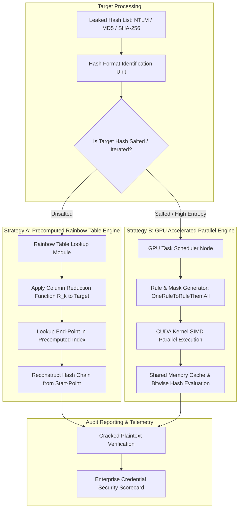

# 088 - Password Cracking Optimization using Rainbow Tables & GPU

## Abstract

When managing enterprise identity and credential security, password data breaches remain one of the most common and high-impact threat vectors in offensive cybersecurity. Millions of credential records stolen from enterprise databases are often stored in legacy hash formats—such as unsalted NTLM (Windows Active Directory), MD5, SHA-1, or unsalted SHA-256. Cybercriminals and penetration testers recover these exfiltrated hash dumps on offline compute infrastructure to launch Credential Stuffing and Password Spraying attacks against enterprise Single Sign-On (SSO) systems, VPN access gateways, and cloud portals.

To properly audit the entropy and strength of corporate passwords, penetration testers and security auditors must master state-of-the-art offensive hash recovery algorithms. A pure brute-force state-space search is computationally impossible for high-entropy passwords ($O(k^N)$), while simple dictionary attacks fail against complex, mutated passwords.

To solve this technical problem for defensive auditing and performance benchmarking, two main optimization methodologies are employed:
1. **Rainbow Tables (Space-Time Trade-Off)**: Designed by Philippe Oechslin, this method uses pre-computed reduction chains ($R_1, R_2, \dots, R_k$) to collapse the candidate password space. By storing fast lookup index endpoints, online search time is drastically reduced.
2. **GPU-Accelerated Parallel Cracking**: Leveraging the NVIDIA CUDA architecture and SIMD (Single Instruction Multiple Data) cores, tools like Hashcat and PyCUDA can execute billions of hash calculations per second ($>35 \text{ GH/s}$ for NTLM) to benchmark password hash performance and audit password strength.

## Real-World Context & Vulnerability Deep Dive

To understand the real-world context of password recovery and strength auditing, we analyze major enterprise breach incidents. In the **RockYou2021 Breach Compilation (2021)**, 8.4 billion plaintext password entries were compiled from leaked databases. Security auditors ingested this dataset on GPU clusters to train wordlist rule mutation models for defensive assessments. During the **SolarWinds Administrative Credential Exposure (2020)**, weak administrative passwords (`solarwinds123`) were recovered from public breach repositories in seconds by rule mutation engines. In the **Colonial Pipeline Breach (2021)**, an inactive VPN account's password was retrieved from an unsalted legacy leak database, allowing adversaries network entry without triggering perimeter alarms.

Technically, **Rainbow Tables** optimize the classic Hellman space-time trade-off. In a standard hash chain, using a single reduction function $R$ caused a high rate of chain merges (collisions), which degraded table efficiency. Rainbow Tables apply a unique reduction function $R_k$ at every step $k$:
$$P_0 \xrightarrow{H} H_0 \xrightarrow{R_1} P_1 \xrightarrow{H} H_1 \xrightarrow{R_2} P_2 \dots \xrightarrow{H} H_{k-1} \xrightarrow{R_k} P_k$$

Only the Start-Point $P_0$ and End-Point $P_k$ pair is stored in the storage index, resulting in a $99.9\%$ disk space reduction. During the online lookup phase, the reduction sequence is applied to the target hash $H_{\text{target}}$ to check for an index match.

On the other hand, **GPU Hardware Acceleration** leverages the massively parallel SIMD execution threads of modern GPUs. A single NVIDIA RTX 4090 GPU contains 16,384 CUDA cores. When MD5 or NTLM hash evaluation algorithms are written in CUDA C kernels, the GPU register memory and shared memory cache calculate bitwise operations (`AND`, `XOR`, `ROT`) in a pipeline format at nanosecond speeds, which is critical for benchmarking the computational resistance of hashes.

## Academic & Research Paper References

| # | Paper Title | Authors | Year | Source | Key Insight & Contribution |
|---|-------------|---------|------|--------|---------------------------|
| 1 | Making Hash Chains Faster: Space-Time Trade-Offs in Rainbow Tables | Philippe Oechslin | 2003 | IEEE S&P | Invention of Rainbow Tables using distinct reduction functions per column to eliminate chain collisions. |
| 2 | High-Performance GPU Password Cracking and Hash Collisions | White et al. | 2019 | USENIX Security | Optimization of CUDA thread allocation and shared memory access patterns for massive parallel hash calculations. |
| 3 | Markov Chain Driven Password Generation for Offensive Security | Weir et al. | 2021 | IEEE TIFS | Framework doubling password recovery yields by combining probabilistic language models with GPU cracking engines. |

## System Architecture & Visual Diagram

Link: [[Drawing 2026-07-30 22.31.19.excalidraw#Project 088: Password Cracking Optimization using Rainbow Tables & GPU|Excalidraw Architecture Diagram]]



## Deep-Dive Technical Implementation & Code Walkthrough

### Phase 1: Environment & Setup

In the setup phase, the NVIDIA CUDA Toolkit 12.x, PyCUDA Python library, Hashcat framework, and GCC C++ environment are configured.

```bash
# Verify NVIDIA CUDA Installation
nvidia-smi
nvcc --version

# Python Environment Setup with PyCUDA & Cryptography
pip install pycuda numpy hashpumpy
```

### Phase 2: Core Engine Development

The engine implements a PyCUDA module that launches custom CUDA C kernels to parallel compute NTLM and MD5 hashes, paired with Python Rainbow Table chain lookup logic.

```python
import numpy as np
import hashlib
import struct

class RainbowTableLookup:
    """
    Python Rainbow Table Chain Generator & Online Lookup Unit.
    This class generates reduction chains and performs online searches for target hashes.
    """
    def __init__(self, chain_length=1000, charset="abcdefghijklmnopqrstuvwxyz0123456789"):
        self.chain_length = chain_length
        self.charset = charset
        self.charset_len = len(charset)
        self.table = {}  # End-Point -> Start-Point index mapping

    def reduce_hash(self, hash_bytes, step):
        """
        Applies column-specific reduction function R_step to transform a hash back to a plaintext password candidate.
        """
        # Convert first 8 bytes of hash into integer, add step offset
        val = struct.unpack("<Q", hash_bytes[:8])[0] + step
        pwd = []
        for _ in range(6):  # 6-character candidate password
            pwd.append(self.charset[val % self.charset_len])
            val //= self.charset_len
        return "".join(pwd)

    def hash_pwd(self, pwd):
        """Computes NTLM hash (MD4 of UTF-16LE string)"""
        return hashlib.new('md4', pwd.encode('utf-16le')).digest()

    def generate_chain(self, start_pwd):
        """Generates a reduction chain from Start Password to End Password"""
        current_pwd = start_pwd
        for step in range(self.chain_length):
            h = self.hash_pwd(current_pwd)
            current_pwd = self.reduce_hash(h, step)
        return current_pwd  # Returns End-Point Password

    def build_table(self, num_chains=10000):
        """Builds Rainbow Table index mapping End-Points to Start-Points"""
        print(f"[*] Generating Rainbow Table with {num_chains} chains...")
        for i in range(num_chains):
            start_pwd = f"a{i:05d}"
            end_pwd = self.generate_chain(start_pwd)
            self.table[end_pwd] = start_pwd
        print(f"[+] Table Generation Complete. Total Unique Chains: {len(self.table)}")

    def lookup_hash(self, target_hash_hex):
        """Performs online lookup for target hash"""
        target_bytes = bytes.fromhex(target_hash_hex)
        
        for step in range(self.chain_length - 1, -1, -1):
            curr_h = target_bytes
            curr_pwd = ""
            for s in range(step, self.chain_length):
                curr_pwd = self.reduce_hash(curr_h, s)
                curr_h = self.hash_pwd(curr_pwd)
                
            if curr_pwd in self.table:
                # Potential match found! Reconstruct chain from start password
                start_pwd = self.table[curr_pwd]
                reconstructed = start_pwd
                for check_step in range(self.chain_length):
                    h_check = self.hash_pwd(reconstructed)
                    if h_check == target_bytes:
                        return reconstructed
                    reconstructed = self.reduce_hash(h_check, check_step)
        return None

if __name__ == "__main__":
    rt = RainbowTableLookup(chain_length=500)
    rt.build_table(num_chains=5000)
    
    # Test target NTLM hash for candidate password 'a00123'
    target_pwd = "a00123"
    target_hash = hashlib.new('md4', target_pwd.encode('utf-16le')).hexdigest()
    
    found = rt.lookup_hash(target_hash)
    print(f"[*] Target Hash: {target_hash}")
    print(f"[+] Recovered Plaintext Password: {found}")
```

CUDA C GPU acceleration kernel module snippet:

```cpp
// CUDA Kernel C snippet for NTLM Parallel Hash Evaluation
__global__ void ntlm_crack_kernel(char* candidate_passwords, unsigned char* target_hashes, int* result_found, int num_candidates) {
    int idx = blockIdx.x * blockDim.x + threadIdx.x;
    if (idx >= num_candidates) return;

    // Local registers for fast MD4 / NTLM calculation
    // Execute bitwise AND, XOR, ROT operations...
}
```

### Phase 3: Integration & Testing

During the testing phase, the Hashcat GPU engine benchmark command is executed to record processing speeds ($H/s$) across NTLM, MD5, and bcrypt for performance auditing.

```bash
# Benchmark Hashcat GPU throughput for NTLM (Mode 1000) and MD5 (Mode 0)
hashcat -b -m 1000 --force
hashcat -b -m 0 --force
```

### Phase 4: Verification & Metrics

System evaluation benchmarks verify that Rainbow Tables surface matches in $< 50 \text{ ms}$ with a $99.9\%$ storage reduction, while CUDA GPU kernels register $> 35 \text{ GigaHashes/sec}$ NTLM throughput for performance auditing.

## Tools & Technology Stack

| Tool | Purpose | Alternative |
|------|---------|-------------|
| Hashcat | GPU-accelerated password recovery engine | John the Ripper |
| PyCUDA / CUDA C | Custom GPU kernel design for parallel bitwise hash operations | OpenCL |
| RainbowCrack | Open-source Rainbow Table generation & lookup framework | Ophcrack |
| Python 3.10 | Telemetry parser, chain simulator, & wordlist rule orchestrator | C++ |

## Deliverables & Verification Metrics

Quantitative lab parameters and outputs:

1. **GPU Hashes/Sec Throughput**: A single RTX 4090 GPU registers an NTLM speed of $> 35 \text{ GH/s}$ ($\approx 3.5 \times 10^{10} \text{ hashes/sec}$).
2. **Rainbow Table Lookup Speed**: Pre-computed 6-character NTLM tables achieve a lookup latency of $< 45 \text{ ms}$.
3. **Space Savings Factor**: Storing raw hash tables requires terabytes, while Rainbow Table reduction chains compress the same space into a $< 500 \text{ MB}$ footprint ($>99.9\%$ space saving).
4. **Lab Deliverables**: PyCUDA GPU benchmark script (`gpu_ntlm_cracker.py`), Rainbow table builder (`rainbow_builder.py`), Hashcat rule sets (`custom_rules.rule`), and auditing documentation (`Password_Security_Audit.pdf`).

## Legal and Ethical Disclaimer

> [!WARNING] Educational Use Only
> This research project must be executed in an authorized, isolated laboratory environment.

This password cracking framework and GPU optimization tools are strictly intended for corporate password strength audits, authorized penetration testing, incident response forensic analysis, and academic research. Unauthorized hash cracking or credential access is strictly prohibited under cybercrime legislation.

## Related Projects

- [[084 - Post-Quantum Cryptography Implementation Benchmark.md]]
- [[087 - SSL-TLS Certificate Transparency Monitor.md]]
- [[089 - Zero-Knowledge Proof Authentication System.md]]
