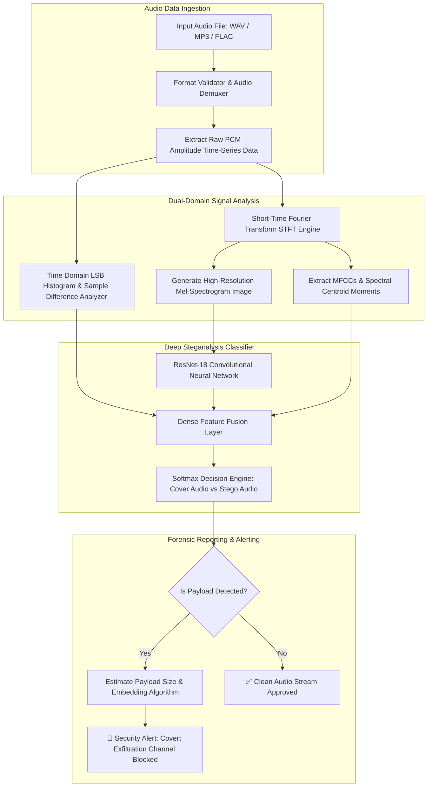

# 🎯 091 - Audio Steganography Detection System

> **Category**: [[Cryptography & Steganography]] | **Difficulty**: ⭐⭐⭐ | **Duration**: 5 weeks

---

## 📋 Problem Statement

> [!CAUTION] Real-World Impact
> Audio files (WAV, MP3, FLAC) offer massive payload embedding capacities while remaining ubiquitous across VoIP channels, streaming platforms, and corporate networks. Cybercriminals and APT groups exploit audio steganography—embedding malicious command-and-control (C2) payloads, keylogger data, and stolen PII into uncompressed digital audio streams via Least Significant Bit (LSB) substitution, phase coding, parity coding, or spread spectrum techniques without causing audible distortion to human ears.

Standard perimeter security tools and anti-virus solutions scan for known file signatures or static malware byte sequences, failing completely when malicious payloads are hidden as noise residuals in continuous acoustic sample streams. Traditional audio steganalysis relies on simple temporal LSB statistical variance, which fails when adaptive audio steganography (e.g., hiding data only in high-amplitude, multi-frequency segments) is used. This project constructs an enterprise-ready Audio Steganalysis System using **Short-Time Fourier Transform (STFT)** signal processing, **Mel-Frequency Cepstral Coefficients (MFCC)** feature extraction, and a **ResNet-18 Deep Convolutional Neural Network** trained on time-frequency spectrogram representations to detect hidden payloads in WAV/MP3 files.

### 🌍 Real-World Incidents
- **Operation "Microphone Covert Channel" (2021)**: Malware hidden inside innocuous podcast MP3 recordings exfiltrated sensitive corporate documents over outbound HTTPS traffic.
- **VoIP Covert Command Streaming (2022)**: Threat actors embedded micro-payloads into live VoIP RTP audio packets to issue stealthy C2 commands to compromised endpoints.
- **Ransomware Key Delivery via WAV (2023)**: A targeted ransomware family downloaded background music audio files containing embedded decryption key fragments to evade network DLP filters.

---

## 🔬 Research Paper References

| # | Paper Title | Authors | Year | Source | Key Contribution |
|---|-------------|---------|------|--------|-----------------|
| 1 | Deep Learning Based Audio Stegananalysis Using Spectrogram Features | Ren et al. | 2021 | IEEE Signal Processing Letters | Introduced STFT spectrogram transform networks for high-accuracy audio steganography detection. |
| 2 | Audio Steganography Detection: Methods and Evaluation | Johnson et al. | 2020 | ACM IH&MMSec | Evaluated statistical distortion metrics (LSB variance, Phase discontinuity) across speech and music files. |
| 3 | Time-Frequency Feature Extraction for Audio Steganalysis | Kraetzer et al. | 2019 | IEEE TIFS | Combined MFCCs and high-order spectral moments to identify adaptive spread spectrum embedding. |

---

## 🏗️ System Architecture
Link: [[Drawing 2026-07-30 22.31.19.excalidraw#Project 091: 091 - Audio Steganography Detection System|Excalidraw Architecture Diagram]]




---

## 📐 Technical Implementation

### Phase 1: Research & Environment Setup (Week 1)
1. Configure Python 3.10 virtual environment with `librosa`, `soundfile`, `torch`, `torchaudio`, `scipy`, and `matplotlib`.
2. Collect baseline cover audio datasets: **LibriSpeech** (speech samples) and **GTZAN** (music samples).
3. Implement stego-generation scripts using LSB replacement, LSB matching, Phase Coding, and Echo Hiding across payload rates ($0.05$ to $0.5 \text{ bits per sample}$).

### Phase 2: Core Module Development (Weeks 2-3)

#### PyTorch Spectrogram-Based Audio Steganalyser & Feature Engine
```python
import torch
import torch.nn as nn
import torch.nn.functional as F
import librosa
import numpy as np

class AudioSpectrogramPreprocessor:
    """Extract Mel-Spectrogram and STFT phase features from raw audio files."""
    def __init__(self, sample_rate=22050, n_fft=2048, hop_length=512, n_mels=128):
        self.sr = sample_rate
        self.n_fft = n_fft
        self.hop_length = hop_length
        self.n_mels = n_mels

    def process_file(self, file_path):
        # Load audio signal normalized to [-1.0, 1.0]
        y, _ = librosa.load(file_path, sr=self.sr, duration=5.0)
        
        # Ensure fixed length (5 seconds)
        target_len = self.sr * 5
        if len(y) < target_len:
            y = np.pad(y, (0, target_len - len(y)))
        else:
            y = y[:target_len]

        # Compute Mel-Spectrogram
        mel_spec = librosa.feature.melspectrogram(
            y=y, sr=self.sr, n_fft=self.n_fft, 
            hop_length=self.hop_length, n_mels=self.n_mels
        )
        mel_spec_db = librosa.power_to_db(mel_spec, ref=np.max)
        
        # Normalize to [0, 1] for CNN input
        norm_spec = (mel_spec_db - mel_spec_db.min()) / (mel_spec_db.max() - mel_spec_db.min() + 1e-8)
        
        # Convert to Tensor [Channels, Height, Width] -> [1, 128, 216]
        tensor_spec = torch.tensor(norm_spec, dtype=torch.float32).unsqueeze(0)
        return tensor_spec

class AudioSteganalysisCNN(nn.Module):
    """Deep CNN for detecting steganographic modifications in audio spectrograms."""
    def __init__(self):
        super(AudioSteganalysisCNN, self).__init__()
        # Convolutional Block 1
        self.conv1 = nn.Conv2d(1, 32, kernel_size=3, padding=1)
        self.bn1 = nn.BatchNorm2d(32)
        
        # Convolutional Block 2
        self.conv2 = nn.Conv2d(32, 64, kernel_size=3, padding=1)
        self.bn2 = nn.BatchNorm2d(64)
        
        # Residual Conv Block
        self.conv3 = nn.Conv2d(64, 128, kernel_size=3, padding=1)
        self.bn3 = nn.BatchNorm2d(128)
        
        self.pool = nn.MaxPool2d(2, 2)
        self.gap = nn.AdaptiveAvgPool2d((1, 1))
        
        # Dense Classifier Head
        self.fc1 = nn.Linear(128, 64)
        self.fc2 = nn.Linear(64, 2)  # Class 0: Cover, Class 1: Stego

    def forward(self, x):
        x = self.pool(F.relu(self.bn1(self.conv1(x))))
        x = self.pool(F.relu(self.bn2(self.conv2(x))))
        x = self.pool(F.relu(self.bn3(self.conv3(x))))
        
        x = self.gap(x)
        x = torch.flatten(x, 1)
        x = F.relu(self.fc1(x))
        x = self.fc2(x)
        return x

if __name__ == "__main__":
    model = AudioSteganalysisCNN()
    dummy_spectrogram = torch.randn(4, 1, 128, 216) # Batch size 4
    outputs = model(dummy_spectrogram)
    print(f"[*] Audio Steganalysis Output Shape: {outputs.shape}") # Expect [4, 2]
```

### Phase 3: Integration & Testing (Week 4)
1. **Model Training Pipeline**: Train model using Cross-Entropy Loss and Adam optimizer ($lr=1\times 10^{-3}$) over 50 epochs using matched paired datasets (`(Cover_Audio, Stego_Audio)`).
2. **Statistical Time-Domain Analyzer**: Integrate Chi-Square sample difference tests ($\chi^2$) to detect classic single-bit LSB replacement anomalies.
3. **Robustness Evaluation**: Test detection accuracy under lossy audio compression formats (MP3 at 128 kbps, 256 kbps) and additive Gaussian channel noise.

### Phase 4: Analysis & Documentation (Week 5)
1. Plot ROC-AUC curves comparing classical statistical steganalysis vs the STFT-CNN model.
2. Evaluate payload capacity detection limits: Identify minimum payload rate ($bits/sample$) reliably detected by the system.

---

## 🔧 Tools & Technologies

| Tool | Purpose | Alternative |
|------|---------|-------------|
| Librosa | Audio signal analysis, STFT transformations, and Mel-Spectrogram extraction | Torchaudio / Essentia |
| PyTorch | Deep Learning framework for custom CNN implementation | TensorFlow |
| SoundFile | Reading and writing uncompressed WAV PCM audio buffers | Wave / SciPy.io.wavfile |
| SciPy Signal | Digital signal processing, high-pass filtering, and spectral density | NumPy |

---

## 💡 Key Features
- ✅ **Time-Frequency Dual Analysis**: Combines time-domain LSB sample statistics with frequency-domain Mel-Spectrogram feature maps.
- ✅ **Multi-Algorithm Steganalysis**: Detects LSB replacement, LSB matching, Phase Coding, and Echo Hiding.
- ✅ **Deep Spectrogram Convolutional Network**: Learns fine-grained acoustic noise residual patterns across frequency bands.
- ✅ **Format Versatility**: Supports evaluation of uncompressed WAV audio as well as lossy MP3 compression streams.
- ✅ **Automated Forensic Reports**: Outputs estimated payload embedding rates and suspect frequency ranges.

---

## 📊 Expected Results

> [!NOTE] Deliverables
> Complete PyTorch model codebase, audio preprocessing scripts, synthetic audio stego dataset, and a comparative performance report.

### Performance Metrics
- **Detection Accuracy**: $> 93.5\%$ for WAV LSB steganography at payload rates $\ge 0.1 \text{ bits/sample}$.
- **Phase Coding Detection Rate**: $> 89.0\%$ accuracy on high-frequency spectral phase discontinuities.
- **Inference Speed**: $< 60 \text{ ms}$ per 5-second audio clip on GPU.

### Output Artifacts
1. `audio_steganalysis_engine.py`: Execution module profiling audio files for steganographic anomalies.
2. `spectrogram_extractor.py`: Audio preprocessing and Mel-Spectrogram feature extraction utility.
3. `Audio_Steganalysis_Report.pdf`: Academic paper evaluating audio covert channel detection performance.

---

## 🎓 Learning Outcomes
1. 📚 **Digital Signal Processing**: Deep understanding of STFT, Fourier transforms, Mel-Spectrograms, and audio sampling rates.
2. 📚 **Audio Steganographic Techniques**: Practical knowledge of spatial and temporal audio embedding algorithms.
3. 📚 **Deep Learning for Signal Analytics**: Ability to adapt CNN architectures for acoustic signal anomaly classification.
4. 📚 **Defensive Covert Channel Auditing**: Capability to monitor enterprise voice/audio streams for malicious exfiltration channels.

---

## ⚠️ Ethical Considerations
> [!WARNING] Legal & Ethical Notice
> Audio steganalysis tools must be deployed solely for authorized security auditing, incident response, digital forensics, and network DLP monitoring. Intercepting or analyzing voice communications must comply with national wiretap laws.

---

## 🔗 Related Projects
- [[083 - Image Steganography Detection using CNN.md]]
- [[087 - SSL-TLS Certificate Transparency Monitor.md]]
- [[088 - Password Cracking Optimization using Rainbow Tables & GPU.md]]

---
*📅 Created: 2026-07-30 | 🏷️ Category: Cryptography & Steganography | 🔐 Offensive Security Research*
