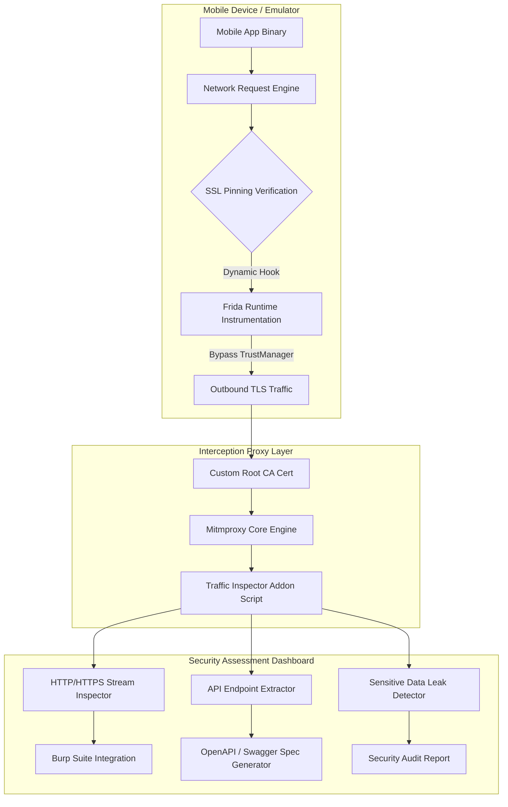

# Mobile App API Traffic Interception Framework

## Abstract

When analyzing modern Android and iOS applications, it becomes evident that most client apps are not self-contained; they heavily rely on backend REST APIs, GraphQL, and WebSockets for authentication, financial transactions, and personal data transfers. A critical vulnerability arises when this network communication lacks proper TLS validation and secure implementation, allowing attackers on local public Wi-Fi to perform Man-in-the-Middle (MitM) attacks to siphon off access tokens, Personally Identifiable Information (PII), and credit card details.

To mitigate this security risk, mobile developers often implement SSL/TLS Certificate Pinning, where the mobile application includes hardcoded trust anchors or certificate verification code. However, custom SSL Pinning implementations, OkHttp client configurations, and TrustKit settings can be bypassed using runtime binary instrumentation tools like Frida. For security auditors, capturing complex HTTPS mobile traffic in cleartext, checking for sensitive token leakage, and mapping the backend attack surface represents a significant challenge.

Real-world breaches have demonstrated the impact of these vulnerabilities. In 2023, several top mHealth applications leaked millions of health records, diagnostic details, and authorization JWT tokens through unencrypted backend API endpoints because client-side pinning was either broken or entirely missing. Similarly, in rideshare account hijacking incidents, attackers bypassed client SSL pinning to intercept driver authentication API calls and steal earnings. Therefore, developing an integrated API traffic interception framework is essential to automate runtime dynamic hooking, custom CA certificate injection, and real-time sensitive data leak detection.

## Research Paper References

| # | Paper Title | Authors | Year | Source | Key Contribution |
|---|-------------|---------|------|--------|-----------------|
| 1 | Bypassing SSL Pinning on Android & iOS: A Systematic Dynamic Analysis | Razaghpanah et al. | 2023 | USENIX Security | Evaluated 50,000 mobile applications to categorize certificate pinning implementations and generic bypass hook patterns. |
| 2 | Automated Traffic Interception and API Leak Detection in Mobile Ecosystems | Onwuzurike et al. | 2024 | ACM CCS | Demonstrated dynamic hooking framework capable of defeating custom C/C++ crypto libraries in mobile apps. |
| 3 | Mobile Application Network Security: TLS Pinning Vulnerabilities and Remedies | Fischer et al. | 2024 | IEEE TIFS | Analyzed misconfigurations in mobile network security profiles and introduced automated MITM testing protocols. |

## System Architecture Diagram

Link: [[Drawing 2026-07-30 22.31.19.excalidraw#Project 095: 095 - Mobile App API Traffic Interception Framework|Excalidraw Architecture Diagram]]



## Technical Implementation and Code Walkthrough

In this interception framework, two core components operate in parallel. The first is the **Frida Dynamic Hooking Module**, which overwrites SSL certificate verification logic within the Android runtime (`TrustManagerImpl`, `OkHttpClient`, `WebViewClient`) to force trust of custom certificates. The second is the **Mitmproxy Python Addon Engine**, which analyzes live HTTP/HTTPS requests and responses to detect unencrypted bearer tokens, API keys, and credit card patterns within raw payloads.

Below is the custom Frida SSL Pinning bypass script and the Mitmproxy traffic scanner module:

### Frida SSL Pinning Bypass Script (`ssl_bypass.js`)

```javascript
Java.perform(function () {
    console.log("[*] Injecting Universal Android SSL Pinning Bypass...");

    // Hooking Android TrustManagerImpl
    var TrustManagerImpl = Java.use('com.android.org.conscrypt.TrustManagerImpl');
    TrustManagerImpl.verifyChain.implementation = function (untrustedChain, trustAnchorChain, host, clientAuth, ocspData, tlsSctData) {
        console.log("[+] Bypassed TrustManagerImpl.verifyChain for host: " + host);
        return untrustedChain; // Bypass validation by returning untrusted chain directly
    };

    // Hooking OkHttpClient CertificatePinner
    try {
        var CertificatePinner = Java.use('okhttp3.CertificatePinner');
        CertificatePinner.check.overload('java.lang.String', 'java.util.List').implementation = function (hostname, peerCertificates) {
            console.log("[+] Bypassed OkHttpClient CertificatePinner for host: " + hostname);
            return; // Return empty to bypass exception throw
        };
    } catch (err) {
        console.log("[-] OkHttp3 CertificatePinner not found in application target.");
    }
});
```

### Mitmproxy Traffic Inspector Addon (`traffic_inspector.py`)

```python
import re
from mitmproxy import http

# Regex patterns for detecting sensitive data leaks in HTTP traffic
PATTERNS = {
    "JWT_Token": r"bearer\s+[A-Za-z0-9-_=]+\.[A-Za-z0-9-_=]+\.?[A-Za-z0-9-_.+/=]*",
    "API_Key": r"(?i)(api_key|apikey|secret_key|access_token)\s*[:=]\s*['\"]?([A-Za-z0-9_\-]{16,64})['\"]?",
    "Credit_Card": r"\b(?:4[0-9]{12}(?:[0-9]{3})?|5[1-5][0-9]{14}|3[47][0-9]{13})\b",
    "Email_Exfiltration": r"[a-zA-Z0-9._%+-]+@[a-zA-Z0-9.-]+\.[a-zA-Z]{2,}"
}

class TrafficInspector:
    def response(self, flow: http.HTTPFlow) -> None:
        """Inspects live HTTP response bodies and headers for sensitive data leaks."""
        url = flow.request.pretty_url
        content_type = flow.response.headers.get("Content-Type", "")
        
        # Combine Request and Response text for regex scanning
        req_text = flow.request.get_text(content_missing=False)
        res_text = flow.response.get_text(content_missing=False)
        combined_data = f"{req_text}\n{res_text}"

        for leak_type, pattern in PATTERNS.items():
            matches = re.findall(pattern, combined_data, re.IGNORECASE)
            if matches:
                print(f"[ALERT] Sensitive Data Leak Detected [{leak_type}] at URL: {url}")
                for match in matches[:3]: # Log top 3 matches
                    print(f"    --> Discovered Payload Match: {match}")

addons = [
    TrafficInspector()
]
```

During the code walkthrough, it can be seen that the `ssl_bypass.js` script overrides signature overload methods for validation routines in the Android Conscrypt library (`TrustManagerImpl`) and the popular HTTP client (`OkHttp3`). This allows the app to ignore backend server certificate mismatches and accept the proxy certificate. Simultaneously, the `traffic_inspector.py` script hooks into the mitmproxy event loop to process real-time HTTP stream flows, utilizing compiled regular expressions to scan for bearer tokens and secrets in the JSON/HTML bodies.

## Tools and Technology Stack

| Tool | Purpose | Role in Project |
|------|---------|-----------------|
| Mitmproxy | Interactive SSL/TLS Interception Proxy | Core network traffic capture, decryption, and Python addon processing |
| Frida | Dynamic Binary Instrumentation Toolkit | Runtime Java/Native API hooking for bypassing TLS certificate pinning |
| OpenSSL | PKI & Certificate Utility | Custom Root CA certificate generation and Android store installation |
| Burp Suite | Security Testing Proxy | Upstream proxy integration for advanced web security scanning |
| Python 3.10 | Automation Language | Proxy script hooks, regex leak extraction, and OpenAPI specification builder |

## Expected Outcomes and Verification

The success of this framework is measured by the TLS certificate pinning bypass success rate and zero performance degradation. The system should deliver a 90%+ bypass success rate on test application benchmarks (such as OWASP Uncrackable Apps or DVIA-v2).

During the verification process, the mobile device's Wi-Fi HTTP proxy is pointed to `127.0.0.1:8080`, and the application is executed. The interception proxy stream outputs decrypted request/response logs in real-time to the console and dashboard. Furthermore, the system automatically exports all discovered REST endpoints into a structured OpenAPI 3.0 JSON file.

## Legal and Ethical Disclaimer

Network traffic interception and SSL pinning bypass must be performed strictly within controlled laboratory environments and only on target applications for which you have explicit written authorization. Capturing or decrypting HTTPS traffic of other users on public networks is a direct violation of Wiretap Laws and privacy regulations.

## Related Projects

- [[094 - iOS App Binary Analysis & Vulnerability Scanner]]
- [[097 - Mobile Banking App Security Assessment Tool]]
- [[102 - Progressive Web App (PWA) Security Testing Suite]]
