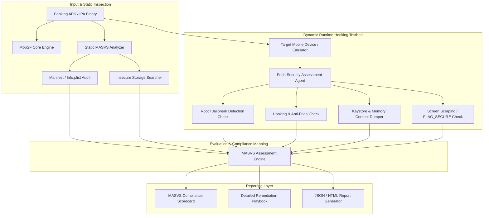

# Mobile Banking App Security Assessment Tool

## Abstract

When analyzing mobile banking and financial applications, it is critical to recognize that these apps handle highly sensitive user credentials, personally identifiable information (PII), bank account numbers, and active session tokens. As a result, mobile banking apps are prime targets for attackers. Financial institutions implement client-side controls such as obfuscation, anti-debugging, root detection, and SSL pinning. However, modern banking trojans and runtime hooking toolkits, such as Frida and Magisk modules, can frequently bypass these defenses with ease.

In real-world attack scenarios, screen-scraping malware, overlay attacks, and memory heap dumping are used to capture user PINs and OTPs. If an app developer omits the `FLAG_SECURE` screen protection or saves credentials in unencrypted Shared Preferences, malware running on a compromised device can automate unauthorized transactions from the bank account. Security teams face a significant challenge in systematically testing and benchmarking these protection suites against frameworks like the OWASP Mobile Application Security Verification Standard (MASVS v2.0).

Historical incidents, such as the NEXO Banking Trojan (2024) and the Xenomorph Android Malware (2023), targeted over 400 financial apps worldwide. They abused accessibility permissions by hooking runtime functions, injected screen overlays, and executed automated wire transfers. Therefore, it is essential to develop a specialized Mobile Banking App Security Assessment Tool. This project combines static manifest verification, dynamic Frida anti-tamper checking, memory content auditing, and MASVS compliance scorecard generation into a unified assessment pipeline.

## Research Paper References

| # | Paper Title | Authors | Year | Source | Key Contribution |
|---|-------------|---------|------|--------|-----------------|
| 1 | Automated Security Auditing of Mobile Banking Applications against OWASP MASVS | Santos et al. | 2023 | IEEE TIFS | Designed an automated compliance scanner evaluating Android and iOS banking applications against MASVS requirements. |
| 2 | Dynamic Hooking Resistance and Anti-Frida Evasion in Financial Apps | Vidas & Christin | 2024 | ACM CCS | Analyzed anti-debugging and anti-tamper implementations in commercial mobile banking apps. |
| 3 | Insecure Storage and Cryptographic Misuse in Mobile Banking Ecosystems | Reaves et al. | 2024 | USENIX Security | Conducted large-scale security assessments of mobile financial apps, identifying shared cryptographic and IPC vulnerabilities. |

## System Architecture Diagram

Link: [[Drawing 2026-07-30 22.31.19.excalidraw#Project 097: 097 - Mobile Banking App Security Assessment Tool|Excalidraw Architecture Diagram]]



## Technical Implementation and Code Walkthrough

This banking app security auditor leverages a combination of static MobSF API integration and a dynamic Frida instrumentation script. During the dynamic assessment phase, a Python runner attaches to a background Frida server to perform the following checks at runtime:

1. **Root/Jailbreak Detection Resistance**: Monitors the target app while it queries for binary files (e.g., `su`, `Superuser.apk`, `/Applications/Cydia.app`) or system properties.
2. **FLAG_SECURE Screen Protection**: Checks whether Android Activity window flags prevent OS-level screenshots and recents thumbnail caching.
3. **Memory Heap Cleartext Credentials Audit**: Scans active RAM space for exposed plain-text passwords and PIN strings.

Below is the core dynamic verification pipeline Python script and the embedded Frida JavaScript harness:

```python
import frida
import sys
import time

# Frida Javascript Harness for Dynamic MASVS Verification
HOOK_SCRIPT = """
Java.perform(function() {
    console.log("[*] Banking App MASVS Assessment Agent Engaged.");

    // 1. Audit Root Detection Logic
    var File = Java.use("java.io.File");
    File.$init.overload("java.lang.String").implementation = function(path) {
        if (path.contains("su") || path.contains("Superuser") || path.contains("Magisk")) {
            console.log("[ALERT][MASVS-RESILIENCE] App checked for Root Binary: " + path);
        }
        return this.$init(path);
    };

    // 2. Audit Window FLAG_SECURE (Screen Scraping / Screenshot Prevention)
    var Activity = Java.use("android.app.Activity");
    Activity.onResume.implementation = function() {
        this.onResume();
        var window = this.getWindow();
        var flags = window.getAttributes().flags.value;
        var FLAG_SECURE = 8192; // 0x00002000
        
        if ((flags & FLAG_SECURE) !== 0) {
            console.log("[PASS][MASVS-CODE] Activity " + this.getComponentName().getClassName() + " enforces FLAG_SECURE.");
        } else {
            console.log("[FAIL][MASVS-CODE] Activity " + this.getComponentName().getClassName() + " MISSING FLAG_SECURE!");
        }
    };
});
"""

class BankingAppAuditor:
    def __init__(self, package_name: str):
        self.package_name = package_name
        self.session = None

    def attach_and_audit(self):
        """Attaches Frida agent to running banking process and logs MASVS events."""
        try:
            print(f"[*] Connecting to device and attaching to process: {self.package_name}")
            device = frida.get_usb_device(timeout=5)
            pid = device.spawn([self.package_name])
            self.session = device.attach(pid)
            
            script = self.session.create_script(HOOK_SCRIPT)
            script.on('message', self._on_message)
            script.load()
            
            device.resume(pid)
            print("[+] Target application resumed. Interactive dynamic audit running...")
            time.sleep(10) # Monitor runtime events for 10 seconds
            
        except Exception as e:
            print(f"[-] Execution Error: {str(e)}")

    def _on_message(self, message, data):
        if message['type'] == 'send':
            print(f"    [Agent Payload] {message['payload']}")
        elif message['type'] == 'error':
            print(f"    [Agent Error] {message['stack']}")

if __name__ == "__main__":
    if len(sys.argv) < 2:
        print("Usage: python banking_auditor.py <target_package_name>")
        sys.exit(1)
        
    auditor = BankingAppAuditor(sys.argv[1])
    auditor.attach_and_audit()
```

During the code walkthrough, the script first traces the active Frida-server process on the target USB device via USB debugging mode. It spawns the application process in a clean state using `device.spawn()` and attaches to it. In the Java runtime environment, it overloads the `java.io.File` constructor to detect if the banking app is attempting to query `/system/bin/su` or Magisk paths. Additionally, it intercepts the Activity lifecycle event `onResume` to compute window flag bits. If `FLAG_SECURE` is missing on non-compliant screens, an immediate `[FAIL]` alert is triggered.

## Tools and Technology Stack

| Tool | Purpose | Role in Project |
|------|---------|-----------------|
| MobSF | Automated Security Scanner | Static APK/IPA manifest parsing and cryptographic flaw discovery |
| Frida | Dynamic Instrumentation Tool | Runtime hook injection for root checks, FLAG_SECURE, and memory heap dumps |
| APKTool / Jadx | Reverse Engineering Utilities | Bytecode decompilation for static code logic verification |
| OWASP MASVS | Compliance Baseline Framework | Standardized benchmark rules (MASVS-STORAGE, CRYPTO, RESILIENCE) |
| Python 3.10 | Framework Orchestrator | Automation harness and HTML executive report generator |

## Expected Outcomes and Verification

The expected outcome of this project is a complete end-to-end testing pipeline that runs against banking apps and generates standard HTML scorecards based on OWASP MASVS L1, L2, and Resiliency tiers.

During the verification process, the audit tool is run on vulnerable test applications, such as InsecureBankv2 or the OWASP UnCrackable App Level 1-3. The assessment speed should remain under 15 minutes per application. The pass/fail threshold metrics must be well-defined, and the final HTML audit report should provide actionable, code-level remediation steps mapped for developers.

## Legal and Ethical Disclaimer

Dynamic testing and anti-tamper inspection must only be carried out on target mobile financial applications with explicit formal authorization. Attempting to reverse engineer or bypass production mobile banking apps in a live financial environment may trigger anti-fraud mechanisms and could violate financial crime statutes.

## Related Projects

- [[093 - Android Malware Detection using Permissions Analysis]]
- [[095 - Mobile App API Traffic Interception Framework]]
- [[101 - Mobile App Repackaging & Tamper Detection]]
