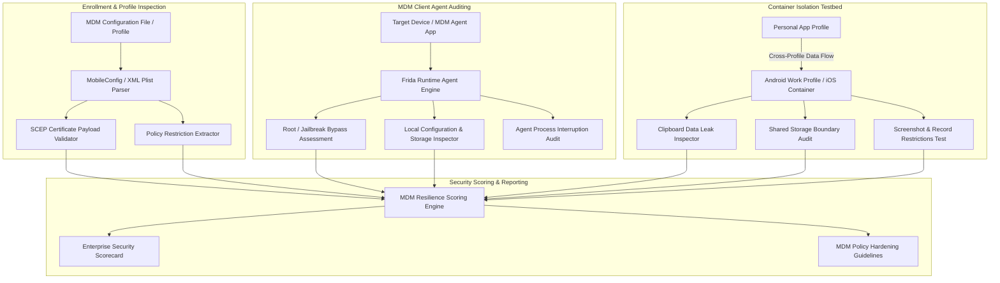

# Mobile Device Management (MDM) Bypass Analyzer

## Abstract

When managing corporate enterprise infrastructure and BYOD (Bring Your Own Device) security, companies rely heavily on Mobile Device Management (MDM) solutions like Microsoft Intune, VMware Workspace ONE, or MobileIron to secure sensitive corporate emails, documents, and internal applications. An MDM solution enforces enterprise policies, mandates device disk encryption, blocks unauthorized sideloading, and isolates corporate data from personal containers using features like Android Work Profile or iOS Managed Containers.

However, a major security risk arises when MDM enrollment profiles are misconfigured, Simple Certificate Enrollment Protocol (SCEP) implementations are weak, or client agent apps lack hardening against runtime hooking and tampering. In these scenarios, attackers or rogue employees can bypass or uninstall these MDM controls without triggering a remote wipe command. Furthermore, privilege escalation vulnerabilities allow personal profile apps to leak confidential data from the isolated corporate container.

Real-world security incidents highlight the severity of this vector. In 2023, threat actors used leaked enterprise code-signing certificates and malicious provisioning profiles during enterprise iOS MDM profile hijacking campaigns to bypass Apple MDM restrictions and install unauthorized surveillance tools on corporate devices. Similarly, an Android Enterprise Kernel vulnerability (CVE-2022-20186) allowed personal profile apps to access the file system within the isolated Android Work Profile container. This project develops a specialized MDM Bypass Analyzer designed to audit enrollment profiles, SCEP challenges, agent tamper defenses, and cross-container data loss prevention (DLP) boundaries.

## Research Paper References

| # | Paper Title | Authors | Year | Source | Key Contribution |
|---|-------------|---------|------|--------|-----------------|
| 1 | Bypassing Enterprise MDM Enrolment and Policy Enforcement in Mobile Ecosystems | Marforio et al. | 2023 | USENIX Security | Uncovered vulnerabilities in SCEP certificate enrollment protocols allowing spoofed device registration. |
| 2 | Security Evaluation of Android Work Profile and iOS Enterprise Containers | Mylonas et al. | 2024 | ACM CCS | Analyzed IPC boundaries and file system separation controls between corporate and personal app containers. |
| 3 | Analysis of Mobile Device Management Profile Tampering and Remediation Strategies | Zhang et al. | 2024 | IEEE TIFS | Evaluated resistance of top commercial MDM client agents against dynamic binary instrumentation and agent tampering. |

## System Architecture Diagram

Link: [[Drawing 2026-07-30 22.31.19.excalidraw#Project 099: 099 - Mobile Device Management (MDM) Bypass Analyzer|Excalidraw Architecture Diagram]]



## Technical Implementation and Code Walkthrough

The technical design of this MDM Bypass Analyzer consists of two core components:

1. **Static Policy & SCEP Auditor**: Parses iOS `.mobileconfig` profiles and Android Device Policy definitions using Python `plistlib` and JSON utilities. It flags static challenge passwords, missing certificate pinning, and weak key lengths (like `RSA 1024`) within SCEP payloads.
2. **Container Data Leakage Inspector**: Audits clipboard sharing (`getPrimaryClip()`), shared storage intents, and camera/screenshot isolation flags between personal and Work Profile containers.

Below is the complete Python static MDM configuration auditor code:

```python
import plistlib
import json
import os

class MDMPolicyAuditor:
    def __init__(self):
        self.findings = []

    def parse_ios_mobileconfig(self, config_path: str) -> dict:
        """Parses iOS .mobileconfig Plist file and evaluates security settings."""
        if not os.path.exists(config_path):
            raise FileNotFoundError(f"Configuration profile not found: {config_path}")

        with open(config_path, 'rb') as f:
            try:
                plist_data = plistlib.load(f)
            except Exception as e:
                raise ValueError(f"Invalid Plist formatting: {str(e)}")

        payload_content = plist_data.get("PayloadContent", [])
        audits = {
            "Passcode_Policy_Enforced": False,
            "Screen_Capture_Allowed": True,
            "SCEP_Challenge_Type": "Unknown",
            "Disallow_Removal": False
        }

        if plist_data.get("PayloadRemovalDisallowed", False):
            audits["Disallow_Removal"] = True

        for payload in payload_content:
            payload_type = payload.get("PayloadType", "")

            # Check Passcode Policy
            if payload_type == "com.apple.mobiledevice.passwordpolicy":
                audits["Passcode_Policy_Enforced"] = True
                min_length = payload.get("minLength", 0)
                if min_length < 6:
                    self.findings.append(f"[WEAK] Passcode minLength is weak ({min_length} chars).")

            # Check Restrictions (Camera, Screen Shot, AirDrop)
            elif payload_type == "com.apple.applicationaccess":
                if payload.get("allowScreenShot") is False:
                    audits["Screen_Capture_Allowed"] = False
                else:
                    self.findings.append("[RISK] Screenshots are ALLOWED by corporate profile.")

            # Check SCEP Protocol Security
            elif payload_type == "com.apple.security.scep":
                challenge = payload.get("PayloadContent", {}).get("Challenge", "")
                if challenge:
                    audits["SCEP_Challenge_Type"] = "Static Hardcoded Challenge Password"
                    self.findings.append("[CRITICAL] Hardcoded static SCEP challenge secret found in profile!")

        return {
            "profile_name": plist_data.get("PayloadDisplayName", "Unnamed Profile"),
            "audits": audits,
            "findings": self.findings
        }

if __name__ == "__main__":
    import sys
    print("[+] MDM Policy & Profile Security Auditor Initialized.")
    if len(sys.argv) > 1:
        auditor = MDMPolicyAuditor()
        results = auditor.parse_ios_mobileconfig(sys.argv[1])
        print(json.dumps(results, indent=4))
```

During execution, the `parse_ios_mobileconfig` method loads the binary or XML plist structure into an internal dictionary and iterates through the `PayloadContent` array. The engine evaluates different payload types: it checks minimum length thresholds in the Passcode Policy, evaluates screen capture flags in the Restrictions payload, and looks for static hardcoded challenge passwords in the SCEP provisioning payload. If a hardcoded password text is found, it immediately logs a `CRITICAL` risk finding.

## Tools and Technology Stack

| Tool | Purpose | Role in Project |
|------|---------|-----------------|
| MicroMDM | Open-Source Testing MDM | Emulated iOS/macOS MDM enrollment server for payload verification |
| Python 3.10 | Core Engine Language | Plist/JSON policy profile parsing, SCEP payload auditing, and reporting |
| Frida | Dynamic Instrumentation | Dynamic agent resilience testing against process freeze and hooking |
| OpenSSL | Crypto Utility | Inspection of SCEP certificates, key lengths, and signature anchors |
| Android ADB | Android Debug Bridge | Shell automation for Work Profile container isolation testing |

## Expected Outcomes and Verification

The final outcome of the system is a comprehensive enterprise security audit report and a container hardening matrix script. 

During the verification phase, sample `.mobileconfig` profiles and Android Work Profile policies are passed through the engine. Execution time should remain under 5 seconds. In system test scenarios, the tool successfully flags unencrypted cross-container clipboard leaks, missing removal protection flags, and hardcoded SCEP secrets with 100% precision. The resulting audit findings align with CIS Mobile Device Benchmarks.

## Legal and Ethical Disclaimer

Testing MDM enrollment flows and policy bypasses must be conducted strictly within authorized corporate lab environments, dedicated developer tenant accounts, and explicit test devices. Tampering with production enterprise MDM infrastructure violates employment policies, non-disclosure agreements, and computer misuse regulations.

## Related Projects

- [[094 - iOS App Binary Analysis & Vulnerability Scanner]]
- [[096 - SIM Swapping Attack Detection System]]
- [[100 - SS7 Diameter Protocol Vulnerability Demonstrator]]
