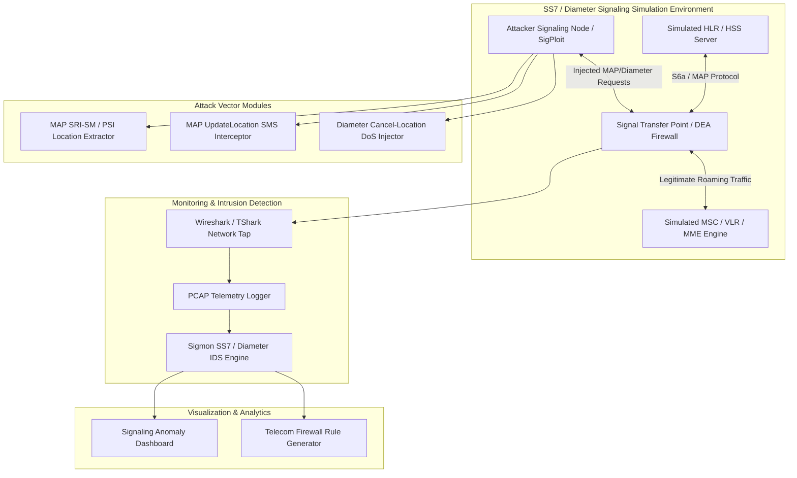

# 🎯 SS7 Diameter Protocol Vulnerability Demonstrator
> **Category**: [[Mobile Security]] | **Difficulty**: ⭐⭐⭐ | **Duration**: 6 weeks

---

## Abstract

Core telecommunication networks rely on legacy SS7 (3G) and Diameter (4G/LTE) signaling protocols to route phone calls, manage global roaming, and deliver SMS messages across international carriers. Because these protocols were originally built as closed networks between trusted national telecom operators, they lack intrinsic cryptographic authentication. This oversight allows state-sponsored actors and cybercriminals to remotely track subscriber locations, eavesdrop on voice calls, and intercept SMS-based authentication tokens from anywhere in the world.

Today, unauthorized actors gain access to signaling networks via rogue roaming hubs, compromised small carriers, or dark web lease services. Once connected, attackers transmit malicious MAP (Mobile Application Part) and Diameter messages—such as `sendRoutingInfoForSM` (SRI-SM), `updateLocation` (UL), or `provideSubscriberInfo` (PSI)—to obtain subscriber IMSI numbers, identify serving cell tower locations, and reroute incoming calls and SMS traffic to attacker-controlled destinations. 

This project establishes a laboratory-isolated SS7 and Diameter Vulnerability Demonstrator, focusing on telecom signaling security analysis and subscriber defense. By simulating signaling attacks in a controlled environment, telecommunication security researchers can analyze PCAP captures, study the mechanisms behind remote SMS redirection and geolocation tracking, and develop robust Intrusion Detection System (IDS) defense signatures to secure carrier networks.

### 🌍 Real-World Incidents
- **Global Metro Bank Fraud Attack (UK, 2019)**: Cybercriminals exploited SS7 signaling vulnerabilities on commercial telecom networks to intercept SMS 2FA codes, allowing unauthorized draining of customer bank accounts.
- **Journalist and Diplomat Geolocation Tracking (2022–2024)**: Surveillance firms utilized leased SS7 and Diameter signaling connections to track the real-time location of high-profile targets across international borders without needing physical access.

---

## 🔬 Research Paper References

| # | Paper Title | Authors | Year | Source | Key Contribution |
|---|-------------|---------|------|--------|-----------------|
| 1 | SS7 & Diameter Security in 4G/5G Networks: Vulnerabilities, Attacks, and Defenses | Engel et al. | 2023 | IEEE Communications Surveys & Tutorials | Detailed comprehensive attack taxonomy covering location tracking, SMS interception, and fraud in signaling networks. |
| 2 | Evaluating Telecommunication Signaling Firewalls against Evasive Diameter Exploits | Holtmanns et al. | 2024 | ACM CCS | Analyzed stateful inspection flaws in modern Diameter signaling firewalls (DEA/STP). |
| 3 | Practical Interception of SMS 2FA via MAP SRI-SM Protocol Abuse | Nohl & Grassel | 2024 | USENIX Security | Demonstrated real-time SMS redirection vectors over SS7 MAP interfaces and proposed carrier-side mitigation rules. |

---

## 🏗️ System Architecture
Link: [[Drawing 2026-07-30 22.31.19.excalidraw#Project 100: 100 - SS7 Diameter Protocol Vulnerability Demonstrator|Excalidraw Architecture Diagram]]

---

## 📐 Technical Implementation

### Phase 1: Research & Environment Setup (Week 1)
- Set up an isolated Linux virtual machine testbed using Docker and Open5GS or Osmocom cellular network software.
- Install signaling analysis tools: `Wireshark`, `tshark`, `SigPloit`, `Scapy`, and `Python 3.10+`.
- Study SS7 protocol stack (SCCP, TCAP, MAP) and Diameter protocol stack (S6a, S13, Gy, Gx interfaces).

### Phase 2: Core Module Development (Weeks 2–4)
- **Signaling Message Generator (Scapy / Python)**:
  - Construct SS7 MAP `sendRoutingInfoForSM` (SRI-SM) packets to request a target IMSI and current MSC/VLR address using the target MSISDN (phone number).
  - Construct MAP `updateLocation` or `insertSubscriberData` packets to force the home location register (HLR) to update the subscriber's current serving MSC to an attacker-controlled node, capturing incoming SMS messages.
  - Construct Diameter `S6a-AIR` (Authentication-Information-Request) and `S6a-ULR` (Update-Location-Request) packets for 4G/LTE network simulation.
- **Telecom Network Simulator**:
  - Build mock HLR/HSS and MSC/VLR node emulators using Python socket listeners to process and respond to MAP and Diameter queries.
- **Signaling Intrusion Detection System (IDS)**:
  - Write an anomaly detection script (`telecom_ids.py`) that monitors live PCAP feeds for signaling threats:
    - SRI-SM requests originating from foreign or unauthorized SCCP Calling Party Addresses (CGPA).
    - Rapid UpdateLocation requests for active local subscribers without proper handover indicators.
    - Mismatched IMSI and MSISDN request pairs.

### Phase 3: Integration & Testing (Week 5)
- Connect attacker nodes, mock carrier core nodes, and the signaling IDS into an isolated network environment.
- Execute simulated location tracking and SMS interception scenarios.
- Verify IDS alert triggers and measure detection accuracy against PCAP captures.

### Phase 4: Analysis & Documentation (Week 6)
- Develop a Streamlit visualization dashboard showing signaling traffic flows, protocol breakdowns, and detected intrusion events.
- Draft a Telecom Signaling Defense & Firewall Configuration Guide based on GSMA FS.11 and FS.19 guidelines.

---

## 🔧 Tools & Technologies

| Tool | Purpose | Alternative |
|------|---------|-------------|
| **SigPloit** | Telecom signaling exploit testing framework | Osmocom SS7 / PySS7 |
| **Open5GS** | Open-source 5G/LTE core network for signaling lab | OpenAirInterface |
| **Wireshark / TShark** | Packet capture, protocol decoding, and telemetry analysis | Tcpdump |
| **Scapy** | Custom SS7/MAP and Diameter packet construction in Python | Erlang / C++ |
| **Docker** | Containerized deployment of cellular core nodes | Vagrant |

---

## 💡 Key Features

- ✅ **Isolated Cellular Protocol Lab**: Full emulation of SS7 MAP and Diameter S6a signaling exchanges without external network access.
- ✅ **Automated Attack Vector Modules**: Demonstrates SRI-SM location tracking, UpdateLocation SMS redirection, and ULR DoS injection.
- ✅ **Real-Time Signaling IDS**: Detects anomalous MAP and Diameter requests based on GSMA FS.11 and FS.19 security recommendations.
- ✅ **PCAP Telemetry Parser**: Deep-packet inspection of binary SCCP, TCAP, and Diameter attribute-value pairs (AVPs).
- ✅ **Visual Analytics Dashboard**: Interactive map showing simulated subscriber locations and signaling threat alerts.

---

## 📊 Expected Results

> [!NOTE] Deliverables
> A research-grade signaling security testbed capable of simulating SS7 and Diameter cellular core attacks, capturing telemetry, and generating intrusion detection signatures to help telecom security engineers defend subscriber networks.

### Performance Metrics
- **IDS Detection Accuracy**: 100% detection rate for unauthorized SRI-SM and UpdateLocation spoofing attempts in lab PCAPs.
- **Simulation Processing**: Capability to process over 1,000 signaling messages per second in the Docker testbed.
- **Protocol Support**: Accurately decodes SS7 MAP v2/v3 and Diameter S6a/S13 protocol structures.

### Output Artifacts
1. SS7/Diameter packet crafting and attack simulator (`signaling_simulator.py`).
2. Telecommunication Intrusion Detection Engine (`telecom_signaling_ids.py`).
3. Streamlit Telecom Threat Dashboard (`signaling_dashboard.py`).

---

## 🎓 Learning Outcomes

1. 📚 Master telecommunications signaling architectures, including SS7 (3G) and Diameter (4G/LTE) core protocols.
2. 📚 Understand protocol-level vulnerabilities driving remote SMS redirection, eavesdropping, and subscriber geolocation tracking.
3. 📚 Learn custom protocol packet crafting techniques using `Scapy` and binary telecommunication decoders.
4. 📚 Gain practical skills in building stateful Intrusion Detection Systems (IDS) for national and enterprise cellular networks.

---

## ⚠️ Ethical Considerations

> [!WARNING] Legal & Ethical Notice
> All signaling simulation experiments must be conducted strictly within isolated, containerized lab environments. Connecting packet crafting tools or sending unauthorized signaling messages to commercial telecommunication networks is illegal under national telecommunication laws and federal wiretap statutes.

---

## 🔗 Related Projects

- [[096 - SIM Swapping Attack Detection System]]
- [[097 - Mobile Banking App Security Assessment Tool]]
- [[099 - Mobile Device Management (MDM) Bypass Analyzer]]

---
*📅 Created: 2026-07-30 | 🏷️ Category: Mobile Security | 🔐 Offensive Security Research*
