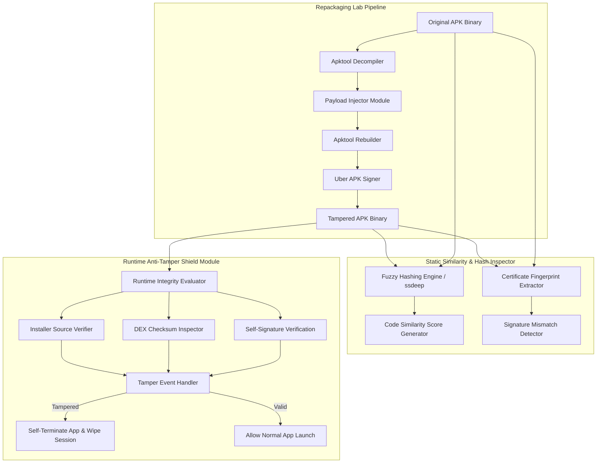

# 🎯 Mobile App Repackaging & Tamper Detection
> **Category**: [[Mobile Security]] | **Difficulty**: ⭐⭐ | **Duration**: 4 weeks

---

## 📋 Problem Statement

> [!CAUTION] Real-World Impact
> App repackaging is one of the most pervasive threat vectors targeting mobile users. Attackers download popular applications from official app stores, extract and decompile the application package, insert trojanized payload code, rebuild and re-sign the application, and distribute the tampered version to unsuspecting users across third-party marketplaces.

When mobile apps lack robust anti-tampering defenses and signature verification mechanisms, malicious actors can easily inject extra permissions, keystroke loggers, overlay screens, or ad-fraud SDKs into the compiled codebase. Victims download these repackaged apps believing they are genuine software, exposing their credentials and financial accounts to risk. To protect users and preserve brand integrity, software developers must implement anti-repackaging mechanisms—such as dynamic self-signature verification, DEX code checksum validation, native C/C++ integrity checks, and Play Integrity / App Attest integration. Developing a Mobile App Repackaging & Tamper Detection framework provides researchers and developers with a complete toolset to analyze repackaging attacks and build resilient defense modules.

### 🌍 Real-World Incidents
- **Repackaged WhatsApp & Telegram Trojans (2023–2024)**: Over 50 modified versions of messaging apps were distributed on third-party stores, containing spyware that exfiltrated chat histories and crypto seed phrases.
- **Flubot Trojan Propagation (2022)**: Attackers repackaged logistics and delivery tracking applications, embedding malicious SMS worm capabilities that infected millions of smartphones across Europe.

---

## 🔬 Research Paper References

| # | Paper Title | Authors | Year | Source | Key Contribution |
|---|-------------|---------|------|--------|-----------------|
| 1 | Large-Scale Empirical Analysis of App Repackaging in Android Marketplaces | Zhou et al. | 2023 | IEEE TIFS | Characterized repackaging trends across 100,000 Android applications using fuzzy hash similarity algorithms. |
| 2 | Resilient Code Signing and Anti-Tamper Mechanisms for Mobile Applications | Zha et al. | 2024 | ACM CCS | Proposed dual-layer signature validation combining native C code execution with hardware-backed Play Integrity APIs. |
| 3 | Automated Detection of Injected Payloads in Repackaged Mobile Apps | Desnos et al. | 2024 | NDSS | Formulated AST diffing algorithms to isolate injected malicious code blocks inside re-signed APK packages. |

---

## 🏗️ System Architecture
Link: [[Drawing 2026-07-30 22.31.19.excalidraw#Project 101: 101 - Mobile App Repackaging & Tamper Detection|Excalidraw Architecture Diagram]]

---

## 📐 Technical Implementation

### Phase 1: Research & Environment Setup (Week 1)
- Set up Android development environment with Python 3.10+, `apktool`, `jarsigner`, `apksigner`, `keytool`, and `ssdeep`.
- Study Android APK structure (DEX files, `META-INF/` certificates, `AndroidManifest.xml`, `resources.arsc`).
- Understand Android application signing schemes (v1, v2, v3, and v4 signing).

### Phase 2: Core Module Development (Weeks 2–3)
- **Repackaging Automation Engine**:
  - Build a Python script that automates unpacking an APK with `apktool`, appending a proof-of-concept payload activity, rebuilding the binary, and re-signing it with a rogue developer certificate.
- **Static Tamper Analysis Engine**:
  - **Fuzzy Hashing**: Calculate `ssdeep` and `TLSH` fuzzy hashes of original vs. tampered DEX bytecode to detect injected code modules.
  - **Certificate Comparer**: Extract SHA-256 certificate hashes from `META-INF/` and compare against the expected publisher certificate.
- **Runtime Integrity Shield SDK (Android / Java)**:
  - Write a reusable Java/Kotlin security library that executes during app initialization:
    - **Signature Check**: Computes current app signing certificate SHA-256 hash at runtime and compares against a hardcoded hash in C/C++ native code (`.so` library).
    - **Installer Verification**: Verifies `context.getPackageManager().getInstallerPackageName()` to ensure installation originated from `com.android.vending` (Google Play).
    - **CRC / DEX Hash Check**: Validates `classes.dex` checksums against expected build values.

### Phase 3: Integration & Testing (Week 4)
- Test runtime anti-tamper SDK by attempting to execute the automated repackaging engine against a protected test application.
- Verify that tampered binaries trigger self-termination routines, while legitimate builds execute normally.
- Evaluate performance impact on application launch times.

### Phase 4: Analysis & Documentation (Week 5)
- Package static analysis tool as a standalone CLI (`apk_tamper_detector.py`).
- Design an HTML report detailing bytecode similarity percentages, signature discrepancies, and anti-tamper SDK implementation guides.

---

## 🔧 Tools & Technologies

| Tool | Purpose | Alternative |
|------|---------|-------------|
| **Apktool** | Decompiling, modifying, and rebuilding Android APK packages | Bytecode Viewer |
| **Uber APK Signer** | Automates v1, v2, and v3 Android APK signature signing | Jarsigner / apksigner |
| **ssdeep / TLSH** | Context-triggered piecewise hashing for fuzzy code comparison | MinHash |
| **Python** | Automation of repackaging workflow and static similarity analysis | Bash |
| **C/C++ NDK** | Native code implementation for runtime signature protection | Java Obfuscation |

---

## 💡 Key Features

- ✅ **Automated Repackaging Test Suite**: Simulates attacker workflows to benchmark app resistance against binary modification.
- ✅ **Fuzzy Hashing Similarity Engine**: Quantifies code modifications using `ssdeep` and `TLSH` hashes.
- ✅ **Native Runtime Integrity Shield**: Multi-check C/C++ native library verifying APK signatures and DEX checksums.
- ✅ **Installer Source Verification**: Blocks execution if the application was sideloaded or installed via unauthorized marketplaces.
- ✅ **Self-Defense Action Trigger**: Automatically wipes local app cache and terminates execution upon tamper detection.

---

## 📊 Expected Results

> [!NOTE] Deliverables
> A comprehensive anti-repackaging framework consisting of an automated repackaging vulnerability test engine, a static fuzzy hash similarity analyzer, and a runtime native integrity shield library.

### Performance Metrics
- **Detection Rate**: 100% identification of altered APK signatures and modified DEX bytecode.
- **Runtime Overhead**: < 15ms added to application startup time during native integrity checks.
- **Fuzzy Hash Accuracy**: Detects code injections as small as 2% of overall binary volume.

### Output Artifacts
1. Automated APK Repackaging and Testing script (`repackage_apk.py`).
2. Static Tamper & Similarity Analyzer (`tamper_analyzer.py`).
3. Native Runtime Anti-Tamper Shield SDK source (`libintegrity_shield.so`).

---

## 🎓 Learning Outcomes

1. 📚 Understand Android application binary structure, compilation lifecycles, and APK signing schemes (v1–v4).
2. 📚 Master reverse engineering and repackaging methodologies using `Apktool` and `apksigner`.
3. 📚 Learn static code similarity comparison techniques using fuzzy hashing (`ssdeep`).
4. 📚 Develop practical skills in building native C/C++ runtime application self-protection (RASP) mechanisms.

---

## ⚠️ Ethical Considerations

> [!WARNING] Legal & Ethical Notice
> Repackaging tools and scripts must only be used on applications you own or have explicit permission to test. Distributing repackaged third-party applications without permission violates copyright laws and intellectual property rights.

---

## 🔗 Related Projects

- [[093 - Android Malware Detection using Permissions Analysis]]
- [[097 - Mobile Banking App Security Assessment Tool]]
- [[098 - Android Intent Hijacking Detection System]]

---
*📅 Created: 2026-07-30 | 🏷️ Category: Mobile Security | 🔐 Offensive Security Research*
