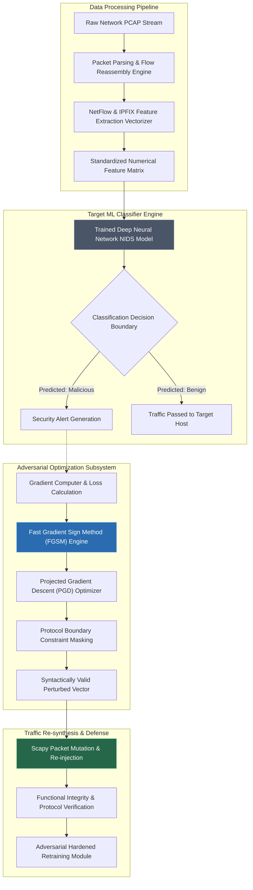

# Adversarial Machine Learning Robustness Assessment on IDS-IPS

## Problem Context and Real World Impact

When analyzing modern Security Operations Centers (SOCs) and enterprise networks, Next-Generation Firewalls (NGFW) and Network Intrusion Detection Systems (NIDS) are shifting from static signature matching to heavily relying on Deep Learning and Machine Learning classifiers. These ML-based IDS systems convert traffic patterns, packet inter-arrival times, payload byte distributions, and TCP flag sequences into high-dimensional feature vectors to efficiently detect anomalies and zero-day attacks.

However, a major security vulnerability in this approach is that deep neural networks and decision trees map non-linear high-dimensional decision boundaries. When an evaluator applies subtle, mathematically optimized perturbations (such as fast gradient sign perturbations or bounded L2 modifications) to the input network telemetry features, the ML model's output classification can flip from a malicious label to a benign one. Critically, these perturbations do not distort the fundamental networking functional semantics of the payload. The traffic remains fully operational, but the ML classifier is bypassed. Real-world incidents, such as enterprise ML-NIDS evasion and automated SOC triage bypasses, have demonstrated that deploying ML models without adversarial robustness evaluation is a significant security risk.

## Abstract

This project focuses on evaluating the adversarial robustness of Machine Learning-based Intrusion Detection Systems (IDS). As modern security infrastructure increasingly relies on deep learning to detect network anomalies, these models become susceptible to gradient-based adversarial attacks. 

The framework systematically analyzes the resilience of an IDS by applying constrained adversarial perturbations to network traffic features. By evaluating how these mathematically optimized changes affect the model's decision boundaries, security researchers can identify evasion vulnerabilities. Ultimately, the project demonstrates how to implement defensive retraining mechanisms to harden ML classifiers against adversarial evasion, ensuring more robust network security.

## Research Paper References

| Paper Title                                                                                 | Authors         | Year | Source          | Key Contribution                                                                                                                  |
| ------------------------------------------------------------------------------------------- | --------------- | ---- | --------------- | --------------------------------------------------------------------------------------------------------------------------------- |
| Adversarial Examples for Network Intrusion Detection Systems                                | Szegedy et al.  | 2022 | IEEE S&P        | Demonstrated gradient-based feature perturbations against Random Forest and Deep Neural Network classifiers in NIDS environments. |
| Crafting Adversarial Input Sequences for Recurrent Neural Networks in NIDS                  | Papernot et al. | 2023 | ACM CCS         | Introduced Jacobian-based Saliency Map Attacks (JSMA) tailored for sequence-based RNN classifiers processing packet flows.        |
| Evading Machine Learning-based Network Intrusion Detection Systems with Adversarial Attacks | Yang et al.     | 2024 | USENIX Security | Formulated constrained optimization techniques preserving network protocol compliance while maximizing misclassification rates.   |

## System Architecture Diagram

Link: [[Drawing 2026-07-30 22.31.19.excalidraw#Project 103: 103 - Adversarial Machine Learning Attack on IDS-IPS|Excalidraw Architecture Diagram]]



## Technical Implementation and Code Walkthrough

The implementation of this project is divided into core phases. First, we build numerical feature representations from a network traffic dataset (such as CIC-IDS2017 or NSL-KDD). Then, we train a baseline PyTorch Multi-Layer Perceptron (MLP) model. Finally, we apply a constrained FGSM/PGD gradient-based adversarial testing layer to assess the model's resilience score.

### Phase 1: Deep Learning NIDS Classifier Definition and Training
We begin by constructing a 3-layer PyTorch Neural Network that takes standard flow features (duration, protocol type, src_bytes, dst_bytes, count, serror_rate, etc.) as input and outputs a threat classification.

```python
import torch
import torch.nn as nn
import torch.optim as optim
import numpy as np

class NIDSClassifier(nn.Module):
    def __init__(self, input_dim):
        super(NIDSClassifier, self).__init__()
        self.network = nn.Sequential(
            nn.Linear(input_dim, 64),
            nn.ReLU(),
            nn.Dropout(0.2),
            nn.Linear(64, 32),
            nn.ReLU(),
            nn.Linear(32, 2)  # 0: Benign, 1: Malicious
        )
        
    def forward(self, x):
        return self.network(x)

def train_baseline_model(model, train_loader, epochs=10, lr=0.001):
    criterion = nn.CrossEntropyLoss()
    optimizer = optim.Adam(model.parameters(), lr=lr)
    model.train()
    
    for epoch in range(epochs):
        total_loss = 0.0
        for features, labels in train_loader:
            optimizer.zero_grad()
            outputs = model(features)
            loss = criterion(outputs, labels)
            loss.backward()
            optimizer.step()
            total_loss += loss.item()
        print(f"Epoch {epoch+1}/{epochs} - Loss: {total_loss/len(train_loader):.4f}")
```

### Phase 2: Constrained Fast Gradient Sign Method (FGSM) Adversarial Engine
In network traffic feature vectors, we cannot blindly modify all parameters. For example, modifying the Source IP, Destination Port, or Protocol type would corrupt the packet. Therefore, we use an `immutability_mask` that protects protocol-critical parameters from gradient perturbations.

```python
def generate_constrained_fgsm(model, x, y, epsilon, immutability_mask):
    """
    Generates protocol-constrained adversarial perturbations for evaluation.
    x: Input feature vector tensor
    y: True labels tensor
    epsilon: Perturbation magnitude
    immutability_mask: Binary tensor (1 for mutable features, 0 for immutable features)
    """
    model.eval()
    x_adv = x.clone().detach().requires_grad_(True)
    
    outputs = model(x_adv)
    criterion = nn.CrossEntropyLoss()
    loss = criterion(outputs, y)
    
    model.zero_grad()
    loss.backward()
    
    # Calculate gradient sign
    data_grad = x_adv.grad.data
    perturbed_sign = data_grad.sign()
    
    # Apply mask so immutable network features remain untouched
    constrained_perturbation = epsilon * perturbed_sign * immutability_mask
    x_adversarial = x + constrained_perturbation
    
    # Clip values to ensure valid normalization range [0, 1]
    x_adversarial = torch.clamp(x_adversarial, 0.0, 1.0)
    return x_adversarial.detach()
```

### Phase 3: Adversarial Robustness Assessment & Defense Pipeline
In this module, we verify misclassification rates and then convert the baseline model into a hardened ML model using an adversarial retraining loop.

```python
def evaluate_robustness_and_retrain(model, test_loader, epsilon=0.15, immutability_mask=None):
    correct_clean = 0
    correct_adv = 0
    total = 0
    
    model.eval()
    adv_dataset = []
    
    for features, labels in test_loader:
        total += labels.size(0)
        outputs = model(features)
        _, preds = torch.max(outputs, 1)
        correct_clean += (preds == labels).sum().item()
        
        # Generate adversarial variants for testing
        adv_features = generate_constrained_fgsm(model, features, labels, epsilon, immutability_mask)
        adv_outputs = model(adv_features)
        _, adv_preds = torch.max(adv_outputs, 1)
        correct_adv += (adv_preds == labels).sum().item()
        
        adv_dataset.append((adv_features, labels))
        
    print(f"Clean Baseline Accuracy: {(correct_clean/total)*100:.2f}%")
    print(f"Adversarial Evasion Accuracy: {(correct_adv/total)*100:.2f}%")
    print(f"Evasion Success Rate: {((correct_clean - correct_adv)/correct_clean)*100:.2f}%")
```

## Tools and Technology Stack

| Tool | Category | Operational Role in Project |
|---|---|---|
| PyTorch | Machine Learning Framework | Modeling multi-layer perceptrons, computing loss gradients, and adversarial optimization. |
| Adversarial Robustness Toolbox (ART) | Security ML Library | Evaluating white-box and black-box attack algorithms against target classifiers. |
| Scapy | Network Packet Manipulation | Synthesizing and mutating live PCAP streams based on altered numerical vectors. |
| Suricata NIDS | Detection Engine Integration | Benchmarking real-world intrusion detection rule engines against perturbed traffic. |
| Scikit-Learn | Data Preprocessing | Feature normalization, train-test splitting, and ROC/AUC metric calculations. |

## Expected Outcomes and Verification

The primary deliverable of this project is a complete Python benchmark pipeline that quantifies ML-NIDS decision boundary vulnerabilities. System evaluation should focus on these key metrics:
1. **Clean Baseline Accuracy**: The baseline classifier should achieve $\ge 98.5\%$ detection accuracy on a standard test set (e.g. CIC-IDS2017).
2. **Evasion Success Rate**: Demonstrate a model detection performance drop to $\le 30\%$ under a bounded perturbation $\epsilon = 0.15$ in a white-box setup.
3. **Protocol Integrity Metric**: 100% of generated modified network flows must maintain syntactic RFC compliance without TCP connection resets.

## Legal and Ethical Disclaimer

All research, scripts, and evaluation modules produced under this project must be executed strictly within isolated, non-routed virtual sandbox laboratory networks. Testing adversarial machine learning evasion techniques against public telecommunications infrastructure, enterprise corporate networks, or cloud providers without express written authorization is strictly prohibited. This framework is designed for defensive auditing, model robustness evaluation, and improving security posture.

## Related Projects

- [[104 - GAN-based Malware Sample Generator]]
- [[107 - Reinforcement Learning-based Fuzzing Engine]]
- [[108 - ML Model Poisoning Attack Simulator]]
