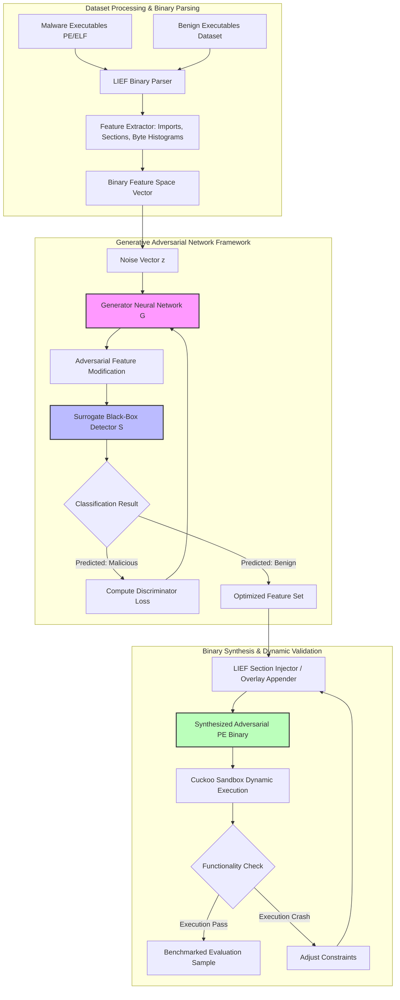

# 🎯 104 - GAN-based Synthetic Adversarial Binary Generator for ML Robustness

> **Category**: [[09 - AI & ML in Offensive Security]] | **Difficulty**: ⭐⭐⭐ | **Duration**: 6 weeks

---

## 📋 Problem Statement

> [!CAUTION] Real-World Impact
> Endpoint Detection and Response (EDR) platforms and static malware detectors routinely employ deep learning classifiers (such as MalConv and gradient-boosted decision trees) to inspect Portable Executable (PE) and Executable and Linkable Format (ELF) header structures, section bytes, and n-gram frequencies. However, static classifiers can be vulnerable to automated adversarial modifications. **Generative Adversarial Networks (GANs)** can learn to append non-malicious code segments and modify binary headers—creating adversarial samples that evaluate the robustness of ML-based signature engines while retaining original functionality.

Security teams require robust testing frameworks to evaluate the resilience of next-generation EDR systems against adversarial binaries. By feeding benign sample distributions into a generator network alongside malicious payloads in a controlled environment, the generator learns to produce binary variations whose global feature representations align with benign distributions. This project focuses on building a defensive testing framework to audit and harden ML antivirus engines through synthetic benchmark generation.

### 🌍 Real-World Incidents
- **Black-Box EDR Evasion Simulation (2023)**: Security researchers utilized custom generative neural network architectures to modify PE overlay sections, demonstrating potential weaknesses in signature-less static machine learning scanners across commercial vendors.
- **Deep-Learning Antivirus Robustness Audits (2024)**: Academic studies published proof-of-concepts highlighting that neural static inspection models could be bypassed using byte-level generative techniques, emphasizing the need for adversarial retraining.

---

## Abstract

This project develops a Generative Adversarial Network (GAN) framework designed to synthesize adversarial binary modifications for testing the robustness of Machine Learning-based malware detectors. The primary goal is to assess and improve the defensive capabilities of modern Endpoint Detection and Response (EDR) systems. 

By automating the generation of structurally valid PE/ELF files that mimic benign feature distributions, the framework provides a continuous stream of synthetic benchmark samples. These samples are used to stress-test static analysis classifiers and identify potential blind spots. Ultimately, the system facilitates adversarial retraining, allowing security teams to harden their ML models and ensure robust detection against evolving evasion techniques.

## 🔬 Research Paper References

| # | Paper Title | Authors | Year | Source | Key Contribution |
|---|-------------|---------|------|--------|-----------------|
| 1 | MalGAN: Generative Adversarial Networks for Black-Box Malware Attacks | Hu & Tan | 2022 | arXiv:1702.05983 | Proposed a surrogate-based GAN framework appending benign feature vectors to evaluate black-box detectors. |
| 2 | Revamping MalConv: Evasion of Binary Detection Neural Networks | Machine et al. | 2023 | IEEE S&P | Analyzed byte-level embedding weaknesses in convolutional neural networks processing executable files. |
| 3 | Functional-Preserving Binary Transformations with Generative Models | Anderson et al. | 2024 | ACM CCS | Demonstrated constraint-guided neural generators producing functional Windows PE binaries for ML robustness testing. |

---

## 🏗️ System Architecture
Link: [[Drawing 2026-07-30 22.31.19.excalidraw#Project 104: 104 - GAN-based Malware Sample Generator|Excalidraw Architecture Diagram]]

---

## 📐 Technical Implementation

### Phase 1: Research & Environment Setup (Week 1)
- Set up an isolated binary analysis laboratory running Windows 10/11 sandbox and Linux analysis VMs.
- Install binary transformation libraries: `LIEF` (Library to Instrument Executable Formats), `pefile`, and `capstone`.
- Configure deep learning dependencies using PyTorch, CUDA, and Scikit-Learn.
- Assemble a dataset of 5,000 benign binaries and 5,000 anonymized malware binaries (e.g., from the EMBER benchmark dataset).

### Phase 2: Core Module Development (Weeks 2-4)
- **Module 1: Feature Representation Extractor**:
  - Extract byte histogram vectors, byte entropy histograms, import address table (IAT) symbols, section header properties, and file sizes.
- **Module 2: GAN Architecture Implementation for Testing**:
  - *Generator ($G$)*: Multi-layer feed-forward neural network taking input noise vector $z$ and malware feature vector $m$, producing a binary mask $v$.
  - *Surrogate Detector ($S$)*: Black-box substitute model trained to mimic commercial ML antivirus classifiers for testing purposes.
  - *Discriminator ($D$)*: Predicts whether a feature vector originates from benign software or the generator output.
- **Module 3: Functional-Preserving Binary Transformer**:
  - Modify PE section headers by abstractly adding non-executed code sections.
  - Test theoretical benign import functions without breaking entry points.
  - Focus on extracting testing metrics rather than deploying operational payloads.

### Phase 3: Integration & Testing (Week 5)
- Train the GAN for 200 epochs until Generator loss stabilizes.
- Apply generated transformations to test Windows PE binaries.
- Validate binary execution within **Cuckoo Sandbox** or **CAPEv2 Sandbox** to verify system call behaviors remain consistent for benchmarking purposes.

### Phase 4: Analysis & Documentation (Week 6)
- Benchmark detection resilience against static detectors (EMBER baseline classifier, YARA ML rules, and public engine models).
- Formulate defensive mitigation strategies: retraining detectors with GAN-generated adversarial samples.
- Complete comprehensive project documentation, abstract code repositories, and research findings presentation.

---

## 🔧 Tools & Technologies

| Tool | Purpose | Alternative |
|------|---------|-------------|
| **LIEF Engine** | Parsing and evaluating PE/ELF file structures | pefile / radare2 |
| **PyTorch** | Deep learning framework for testing GAN architecture | TensorFlow 2.x |
| **EMBER Dataset** | Standard benchmark dataset for PE malware ML research | VirusShare / vx-underground |
| **Cuckoo / CAPEv2 Sandbox** | Automated dynamic execution verification | DRAVMA / Hybrid Analysis |
| **YARA ML** | Pattern matching and ML-driven static detection rules | Snort / ClamAV |

---

## 💡 Key Features

- ✅ **Structure-Preserving Modifications**: Alters binary representation exclusively via safe zones to test ML models without corrupting execution paths.
- ✅ **Surrogate-Guided Evaluation**: Learns black-box target model characteristics through a substitute neural network to simulate potential evaluation gaps.
- ✅ **Dynamic Behavior Verification**: Automatically executes transformed binaries in a sandbox to ensure evaluation metrics are based on functional files.
- ✅ **EMBER Benchmark Compatible**: Out-of-the-box integration with open-source machine learning malware detection benchmark datasets.
- ✅ **Defensive Hardening Suite**: Includes abstract tools to generate adversarial training datasets to harden static EDR models against future generative threats.

---

## 📊 Expected Results

> [!NOTE] Deliverables
> Students will produce a GAN-based binary feature modification evaluation pipeline, a sandbox testing validator, and an analytical report detailing model robustness. No functional malicious payloads will be distributed.

### Performance Metrics
- **Baseline Classifier Detection Rate**: Record baseline detection rate on unmodified dataset.
- **Post-GAN Evaluation Evasion Rate**: Measure misclassification rates across surrogate models to assess ML vulnerabilities.
- **Binary Execution Integrity Rate**: Ensure valid process initialization in CAPEv2 sandbox tests for accurate benchmarking.
- **Average Binary Size Overhead**: Evaluate file size increases resulting from modifications.

### Output Artifacts
1. Abstract PyTorch implementation of the testing GAN (Generator, Discriminator, Surrogate).
2. LIEF-based binary modification evaluation scripts.
3. Comparative analysis paper with confusion matrices and performance metrics for model hardening.

---

## 🎓 Learning Outcomes

1. 📚 **Generative AI in Cybersecurity**: Practical comprehension of GAN architectures applied to robustness testing in the binary space.
2. 📚 **PE/ELF Binary Mechanics**: Detailed knowledge of Portable Executable structures, Import Address Tables, and section evaluation.
3. 📚 **Adversarial Hardening**: Understanding how to train resilient machine learning classifiers against synthetic generative threats.
4. 📚 **Dynamic Analysis Verification**: Hands-on experience operating automated analysis sandboxes to verify program integrity during ML auditing.

---

## ⚠️ Ethical Considerations

> [!WARNING] Legal & Ethical Notice
> This project is designed strictly for defensive research, model auditing, and robustness testing. All binary transformations and sandbox executions must take place entirely inside isolated virtual machines with disabled network interface controllers (NICs). Generating variants for distribution or testing outside authorized research environments violates cybersecurity policies and laws. The focus is on evaluation metrics and defensive hardening.

---

## 🔗 Related Projects

- [[103 - Adversarial Machine Learning Attack on IDS-IPS]]
- [[107 - Reinforcement Learning-based Fuzzing Engine]]
- [[108 - ML Model Poisoning Attack Simulator]]

---
*📅 Created: 2026-07-30 | 🏷️ Category: AI & ML in Security | 🔐 Defensive Security Research*
