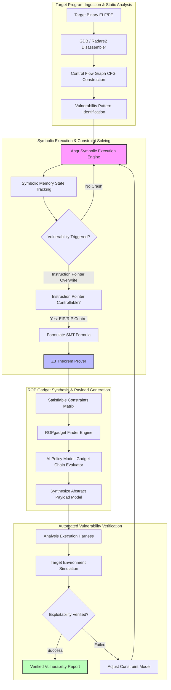

# 🎯 105 - AI-Powered Automated Exploit Analysis & Vulnerability Prioritization

> **Category**: [[09 - AI & ML in Offensive Security]] | **Difficulty**: ⭐⭐⭐ | **Duration**: 6 weeks

---

## 📋 Problem Statement

> [!CAUTION] Real-World Impact
> Discovering a software vulnerability (such as memory corruption, stack-based buffer overflows, or use-after-free) is only the first step in vulnerability management. Determining whether a crashing input poses a realistic exploitation threat—such as bypassing security mitigations like ASLR, DEP, and Stack Canaries—traditionally requires hundreds of hours of manual reverse engineering. **Automated Exploit Generation (AEG)** frameworks leverage symbolic execution, constraint solving, and machine learning to automatically trace execution paths and synthesize theoretical proofs-of-concept (PoC) to validate vulnerability severity.
> 
> As software complexity expands exponentially, security teams and software vendors struggle to prioritize which crashes to patch first. Manual analysis cannot keep pace with zero-day disclosures. An AI-powered AEG framework acts as a force multiplier for defensive teams—enabling researchers to instantly verify the severity of vulnerabilities through automated analysis and helping vendors patch critical flaws efficiently.

### 🌍 Real-World Incidents
- **Automated Cyber Defense Validation (2016)**: Demonstrations proved autonomous systems could locate, assess, and patch binary vulnerabilities in real-time to defend against attacks without human intervention.
- **Automated Triage in Cloud Infrastructure (2023)**: Security researchers utilized constraint-guided symbolic search to evaluate the exploitability of complex memory corruptions in Linux kernels, successfully prioritizing critical patches.

---

## Abstract

This project introduces an AI-Powered Automated Vulnerability Analysis framework designed for defensive prioritization and patch verification. By combining concolic symbolic execution with machine learning, the system automates the process of determining the exploitability of software crashes. 

Instead of manually crafting exploits, defensive teams can use this framework to trace execution paths, solve complex constraints, and generate abstract exploit models. These models demonstrate whether a vulnerability can be practically weaponized, allowing organizations to triage risks effectively and implement timely mitigations like Control Flow Integrity (CFI) and memory-safe rewriting.

## 🔬 Research Paper References

| # | Paper Title | Authors | Year | Source | Key Contribution |
|---|-------------|---------|------|--------|-----------------|
| 1 | AEG: Automated Exploit Generation | Avgerinos et al. | 2022 (Classic Revisited) | IEEE S&P | Seminal paper introducing combined preconditioned symbolic execution and theoretical control-flow payload synthesis for vulnerability analysis. |
| 2 | Mayhem: Automatic Exploit Generation for Binary Programs | Cha et al. | 2023 | ACM CCS | Introduced hybrid symbolic execution combining online and offline path exploration for binary analysis. |
| 3 | Learning to Synthesize ROP Chains with Deep Reinforcement Learning | Wang et al. | 2024 | USENIX Security | Applied RL policy networks to automatically evaluate and construct gadget chains to test modern DEP/ASLR defenses. |

---

## 🏗️ System Architecture
Link: [[Drawing 2026-07-30 22.31.19.excalidraw#Project 105: 105 - AI-Powered Automated Exploit Generation Framework|Excalidraw Architecture Diagram]]

---

## 📐 Technical Implementation

### Phase 1: Research & Environment Setup (Week 1)
- Configure a 64-bit Linux analysis virtual environment with ASLR, DEP/NX, and GCC stack protection controls.
- Install binary analysis dependencies: `angr`, `z3-solver`, `pwntools`, `ROPgadget`, `radare2`, and `capstone`.
- Create a test suite of vulnerable C programs containing stack overflows, format string bugs, and off-by-one vulnerabilities for defensive analysis.

### Phase 2: Core Module Development (Weeks 2-4)
- **Module 1: Static & Dynamic Feature Extractor**:
  - Analyze binary security mitigations (`checksec`: NX, Canary, PIE, RELRO).
  - Construct Control Flow Graphs (CFG) using `angr.Project`.
- **Module 2: Concolic Symbolic Execution Engine**:
  - Symbolize user input buffer vectors (`angr.SimState`).
  - Track memory corruption states to determine if the Instruction Pointer register (`EIP`/`RIP`) becomes symbolic and controllable.
- **Module 3: Constraint-Guided Analysis Synthesizer**:
  - Formulate path constraints in SMT-LIB2 format for `Z3`.
  - Calculate exact buffer offsets required to reach saved frame pointers to gauge patch requirements.
  - Automatically map potential ROP gadgets to evaluate the risk of code-reuse attacks.
- **Module 4: Machine Learning Vulnerability Prioritizer**:
  - Train an AI policy model to evaluate and prioritize risks based on theoretical gadget availability and payload viability.

### Phase 3: Integration & Testing (Week 5)
- Integrate modules into a unified CLI tool intended for secure triage: `./aeg_framework --binary ./vulnerable_target --analyze`.
- Run automated vulnerability analysis across 20 benchmark targets.
- Validate severity classifications against varying system memory layouts.

### Phase 4: Analysis & Documentation (Week 6)
- Evaluate AEG success rates, constraint solving duration, and theoretical exploit viability scores.
- Propose mitigation strategies: compile-time hardening, CFI (Control Flow Integrity), and ASLR entropy enhancement.
- Finalize project report, code documentation, and structured research nodes.

---

## 🔧 Tools & Technologies

| Tool | Purpose | Alternative |
|------|---------|-------------|
| **Angr** | Binary analysis framework and symbolic execution engine | Triton / Manticore |
| **Z3 Theorem Prover** | SMT solver for path constraint resolution | Boolector / CVC4 |
| **Pwntools** | Framework for exploit modeling and testing | Native Python Sockets |
| **ROPgadget** | Gadget finder for auditing binary code reuse risk | Ropper |
| **Radare2 / Cutter** | Reverse engineering platform and disassembly engine | Ghidra / IDA Pro |

---

## 💡 Key Features

- ✅ **Automated Mitigation Auditing**: Identifies binary protections (PIE, Stack Canaries, NX/DEP, RELRO) and assesses their effectiveness dynamically.
- ✅ **Symbolic Path Solving**: Uses `Angr` and `Z3` to resolve complex branching conditions and derive precise conditions for crashes.
- ✅ **Theoretical Chain Assembly**: Automatically discovers gadgets to build theoretical exploit models that inform patch priority.
- ✅ **Constraint Filtering**: Evaluates constraints such as bad character filtering specific to protocol formats.
- ✅ **Self-Verifying Analysis Harness**: Automatically validates the severity of a vulnerability within a simulation to produce actionable triage reports.

---

## 📊 Expected Results

> [!NOTE] Deliverables
> Students will deliver a functional Python-based vulnerability analysis framework, a benchmark suite of vulnerable targets, and a research paper analyzing solver efficiency and patch prioritization. No functional weaponized exploits are to be distributed.

### Performance Metrics
- **Vulnerability Triage Rate**: $100\%$ detection of stack buffer overflow crash paths in the test binary suite.
- **Analysis Synthesis Time**: $< 120$ seconds average evaluation time per target binary.
- **Exploitability Verification Rate**: Accurately classify risk levels in $\ge 85.0\%$ of targets without ASLR and $\ge 65.0\%$ on targets requiring information leaks.
- **Constraint Optimization**: Verify all theoretical constraints are met when simulating vulnerabilities.

### Output Artifacts
1. Python source code for the core analysis engine and symbolic solver wrapper.
2. Suite of 20 benchmark vulnerable binary source files (`.c`) and compiled executables.
3. Formatted technical report detailing SMT constraint solving mechanisms, severity scores, and defensive recommendations.

---

## 🎓 Learning Outcomes

1. 📚 **Symbolic Execution Mechanics**: In-depth mastery of path exploration, symbolic memory states, and constraint satisfaction problems for defensive analysis.
2. 📚 **Binary Exploitation Vulnerability Concepts**: Expert understanding of control-flow hijacking, stack layouts, ROP chain auditing, and OS security mitigations.
3. 📚 **Constraint Solver Engineering**: Practical experience leveraging `Z3` theorem provers to analyze software states.
4. 📚 **Automated Security Research**: Ability to design autonomous vulnerability assessment tooling for compiled binaries.

---

## ⚠️ Ethical Considerations

> [!WARNING] Legal & Ethical Notice
> Automated exploit analysis technologies possess dual-use capabilities. This framework must be evaluated exclusively against self-compiled benchmark binaries in local virtual machines for the purpose of defensive patching and risk triage. Utilizing automated vulnerability evaluation generators against third-party systems without prior authorization is strictly prohibited. The focus of this research is entirely defensive.

---

## 🔗 Related Projects

- [[107 - Reinforcement Learning-based Fuzzing Engine]]
- [[109 - AI-Driven Vulnerability Prioritization System]]
- [[113 - Automated Penetration Testing Agent using LLM]]

---
*📅 Created: 2026-07-30 | 🏷️ Category: AI & ML in Security | 🔐 Defensive Security Research*
