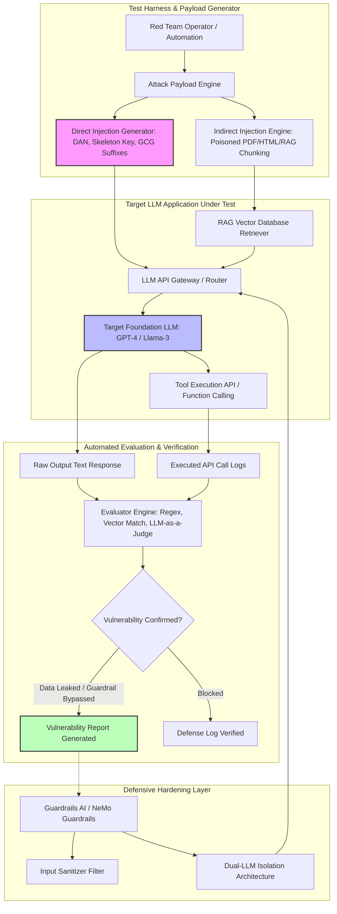

# 🎯 106 - LLM Prompt Injection Attack & Defense Toolkit

> **Category**: [[09 - AI & ML in Offensive Security]] | **Difficulty**: ⭐⭐ | **Duration**: 4 weeks

---

## 📋 Abstract

> [!CAUTION] Real-World Impact
> Companies are quickly adding Large Language Models (LLMs) to chatbots, email assistants, and code tools. However, this has made Prompt Injection the top vulnerability for LLM applications. Attackers can manipulate what the model outputs by sending malicious inputs directly, or by hiding bad instructions in external files like PDFs and web pages that the model reads (Indirect Injection). This lets attackers bypass security rules, steal confidential data, and run unauthorized commands.
>
> To prevent these risks, security teams need strong testing tools. This project builds an automated toolkit to test LLM applications against jailbreaks, prompt injections, and data leaks. It evaluates how well models resist these attacks and helps developers build better defenses.
>
> By running these tests, researchers can understand model robustness and audit AI applications safely before they go live. The toolkit focuses heavily on defensive evaluation, providing clear metrics on how often attacks succeed and how effectively guardrails block them.

### 🌍 Real-World Incidents
- **Bing Chat Indirect Prompt Injection (2023)**: Security researchers found hidden instructions in public webpages that tricked Bing Chat into asking users for credit card details.
- **ChatGPT Plugin Data Leak (2023)**: Vulnerabilities in document retrieval pipelines allowed malicious files to take over LLM prompts and leak private chat histories through image requests.

---

## 🔬 Research Paper References

| # | Paper Title | Authors | Year | Source | Key Contribution |
|---|-------------|---------|------|--------|-----------------|
| 1 | Universal and Transferable Adversarial Attacks on Aligned Language Models | Zou et al. | 2023 | arXiv:2307.15043 | Demonstrated automated Greedy Coordinate Gradient (GCG) suffix generation to jailbreak aligned LLMs. |
| 2 | Not What You've Signed Up For: Compromising Real-World LLM Applications via Indirect Prompt Injection | Greshake et al. | 2023 | ACM CCS | Formulated indirect injection taxonomies manipulating autonomous AI agents via external data channels. |
| 3 | Defending Against Prompt Injection Attacks with Dual-LLM Architectures | Liu et al. | 2024 | USENIX Security | Evaluated structural separation of untrusted user input from system instructions using secondary validation models. |

---

## 🏗️ System Architecture
Link: [[Drawing 2026-07-30 22.31.19.excalidraw#Project 106: 106 - LLM Prompt Injection Attack & Defense Toolkit|Excalidraw Architecture Diagram]]

---

## 📐 Technical Implementation

### Phase 1: Research & Environment Setup (Week 1)
- Set up a local Python environment with testing libraries: `garak`, `pyrit`, `langchain`, `openai`, `transformers`, and `guardrails-ai`.
- Run local AI models (like Llama-3-8B-Instruct or Mistral-7B) using `Ollama` or `vLLM` to keep testing safe and private.
- Build a sample vulnerable RAG application using LangChain and a FAISS vector database to serve as the test target.

### Phase 2: Core Module Development (Weeks 2-3)
- **Module 1: Attack Vector Generator**:
  - *Direct Injection*: Create tests for persona adoption, text obfuscation (Base64/ROT13), and adversarial suffixes.
  - *Indirect Injection*: Build poisoned Markdown, PDF, and HTML files containing hidden instructions designed to manipulate the model.
- **Module 2: Automated Benchmark Harness**:
  - Write scripts to automatically send hundreds of test payloads to the target model and record the responses.
- **Module 3: Vulnerability Evaluator (LLM-as-a-Judge)**:
  - Set up an automated evaluation model to detect if the target model leaked its system prompt or violated safety rules.
- **Module 4: Mitigation & Guardrail Module**:
  - Add input filters to remove suspicious characters and tags.
  - Implement output filters to block unexpected or harmful responses.
  - Build a Dual-LLM architecture that isolates trusted system instructions from untrusted user inputs.

### Phase 3: Integration & Testing (Week 4)
- Run automated tests against the local Llama-3 model and review the results.
- Benchmark the defense strategies by comparing vulnerability rates before and after turning on the guardrails.
- Generate clean, easy-to-read security assessment reports in HTML.

### Phase 4: Analysis & Documentation (Week 5)
- Document the testing methodology, defense strategies, and architecture recommendations.
- Finalize the project notes in Obsidian, clean up the codebase, and write a simple user guide.

---

## 🔧 Tools & Technologies

| Tool | Purpose | Alternative |
|------|---------|-------------|
| **Garak** | Scans LLMs to detect prompt injection vulnerabilities | PyRIT (Microsoft) |
| **LangChain** | Builds the target AI application for testing | LlamaIndex |
| **Ollama / vLLM** | Runs local AI models for secure testing | HuggingFace TGI |
| **Guardrails AI** | Filters input and enforces safety rules | NeMo Guardrails |
| **FAISS** | Vector database for the target application | ChromaDB / Qdrant |

---

## 💡 Key Features

- ✅ **Broad Vulnerability Testing**: Evaluates direct injections, indirect injections, system prompt leaks, and tool-hijacking.
- ✅ **Automated Evaluation**: Uses secondary AI models to score test results automatically, saving time and reducing manual effort.
- ✅ **Poisoned File Generator**: Creates stealthy payloads designed to test document retrieval systems (RAG).
- ✅ **Dual-LLM Defense**: Shows a working example of how to separate trusted system prompts from untrusted user data.
- ✅ **Clear Security Reporting**: Produces detailed JSON and HTML reports mapped to the OWASP Top 10 for LLM Applications.

---

## 📊 Expected Results

> [!NOTE] Deliverables
> Students will deliver a testing framework, a sample vulnerable application, and a hardened version with active defenses.

### Performance Metrics
- **Unprotected Target Injection Success Rate**: $\ge 85.0\%$ success on basic, unprotected AI applications.
- **Post-Guardrail Evasion Rate**: $< 5.0\%$ successful injection rate after defenses are enabled.
- **Scan Throughput**: Tests $> 50$ prompt injection probes per minute on a local setup.
- **False Positive Evaluation Rate**: $< 3.0\%$ inaccuracy when classifying whether an attack succeeded.

### Output Artifacts
1. Python toolkit source code containing the attack generator, testing harness, and guardrail modules.
2. Code examples showing vulnerable versus hardened AI applications.
3. Automated HTML reports explaining the security tests and results.

---

## 🎓 Learning Outcomes

1. 📚 **AI Model Security**: Understand how language models process instructions and why prompt injections happen.
2. 📚 **Testing AI Pipelines**: Learn how attackers target vector databases and autonomous agent tools.
3. 📚 **Defensive Engineering**: Gain experience building layered defenses, such as input sanitization and dual-model architectures.
4. 📚 **Automated Security Auditing**: Develop skills to create automated testing pipelines for machine learning systems.

---

## ⚠️ Ethical Considerations

> [!WARNING] Legal & Ethical Notice
> Testing prompt injection techniques against third-party commercial AI applications or public web services without explicit authorization is strictly prohibited. It violates terms of service and legal boundaries. All security auditing and robustness research must be performed only on self-hosted model instances or dedicated sandbox environments with clear, documented authorization.

---

## 🔗 Related Projects

- [[108 - ML Model Poisoning Attack Simulator]]
- [[111 - NLP for Threat Intelligence Extraction]]
- [[113 - Automated Penetration Testing Agent using LLM]]

---
*📅 Created: 2026-07-30 | 🏷️ Category: AI & ML in Offensive Security | 🔐 Offensive Security Research*
