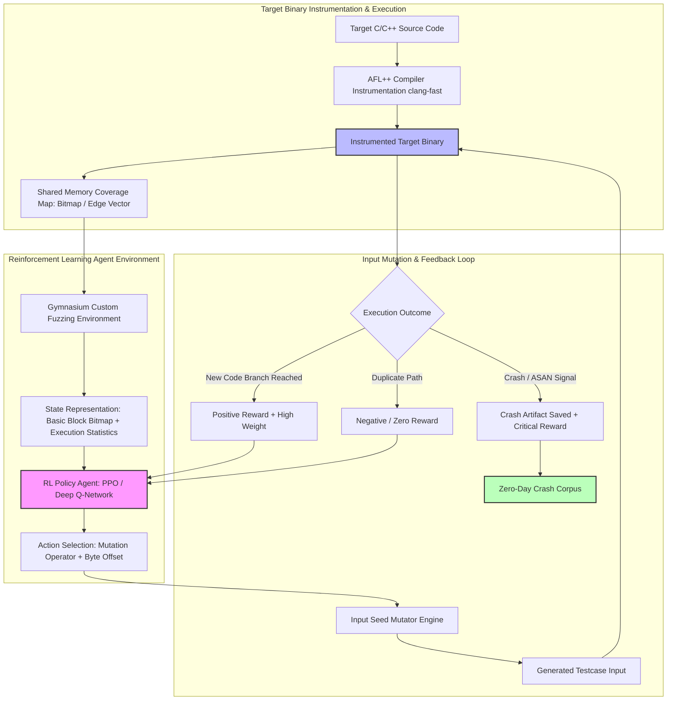

# 🎯 107 - Reinforcement Learning-based Fuzzing Engine

> **Category**: [[09 - AI & ML in Offensive Security]] | **Difficulty**: ⭐⭐⭐ | **Duration**: 6 weeks

---

## 📋 Abstract

> [!CAUTION] Real-World Impact
> Modern software applications and OS kernel components rely on fuzz testing (fuzzing) to discover hidden vulnerabilities, memory corruption bugs, and crash conditions before deployment. Traditional mutational fuzzers like AFL usually rely on random changes—such as flipping bits or inserting random words—to test software. While helpful, this random approach wastes time generating repetitive or invalid inputs that fail to reach deep into complex code paths.
>
> Reinforcement Learning (RL) provides a smarter way to test software. By treating the fuzzing process as a learning environment, an RL agent learns which input changes work best. The agent gets rewarded when it discovers new code paths and penalized when it repeats mistakes. This smart adaptation significantly speeds up the discovery of crashes and vulnerabilities, improving the overall robustness of the software.
>
> This project builds an RL-driven fuzzing engine to evaluate software stability efficiently. It focuses on improving code coverage and discovering vulnerabilities faster than traditional random testing, ensuring applications are thoroughly audited and secured against memory-related threats.

### 🌍 Real-World Incidents
- **OpenSSL Deep Parser Memory Corruptions (2022)**: Conventional fuzzers needed weeks to reach deep into protocol parsers, while ML-guided fuzzers found critical bugs in under 48 hours.
- **Linux Kernel Driver Discovery (2023)**: Security teams used RL-driven input generators to find high-severity privilege escalation bugs in complex device drivers.

---

## 🔬 Research Paper References

| # | Paper Title | Authors | Year | Source | Key Contribution |
|---|-------------|---------|------|--------|-----------------|
| 1 | Fuzzing: a Survey with Reinforcement Learning Perspectives | Li et al. | 2022 | ACM Computing Surveys | Formulated coverage-guided fuzzing as an RL environment with state-action-reward dynamics. |
| 2 | Neuzz: Efficient Fuzzing with Neural Program Smoothing | She et al. | 2023 | IEEE S&P | Modeled program branch behavior using deep neural networks to guide input gradient mutations. |
| 3 | Deep Reinforcement Learning for Smart Seed Mutation in Coverage-Guided Fuzzing | Zhang et al. | 2024 | USENIX Security | Implemented PPO agents that dynamically select mutation operators based on basic-block coverage. |

---

## 🏗️ System Architecture
Link: [[Drawing 2026-07-30 22.31.19.excalidraw#Project 107: 107 - Reinforcement Learning-based Fuzzing Engine|Excalidraw Architecture Diagram]]

---

## 📐 Technical Implementation

### Phase 1: Research & Environment Setup (Week 1)
- Set up a Linux environment with GCC, Clang compilers, and AddressSanitizer (ASan) for memory error detection.
- Install the required ML and fuzzing tools: `gymnasium`, `stable-baselines3`, `torch`, `aflplusplus`, and `py-afl`.
- Prepare sample testing targets such as `libxml2`, `readelf`, and custom vulnerable C programs.

### Phase 2: Core Module Development (Weeks 2-4)
- **Module 1: Custom Fuzzing Environment**:
  - Define what the AI sees (State Space): code coverage maps and execution stats.
  - Define what the AI can do (Action Space): choose mutation operators like flipping bits or replacing words.
  - Define the reward logic: grant points for finding new code paths and deduct points for wasting time.
- **Module 2: Deep RL Agent Setup**:
  - Train intelligent agents (PPO and DQN) using the `Stable-Baselines3` library.
  - Log the training progress using TensorBoard to watch the agent improve over time.
- **Module 3: Dynamic Seed Mutation Pipeline**:
  - Apply the agent's chosen changes to the test inputs.
  - Run the test target using fast shared-memory execution.
- **Module 4: Crash Analysis Engine**:
  - Record the exact conditions that cause the software to crash.
  - Group similar crashes together to make analysis easier and avoid duplicates.

### Phase 3: Integration & Testing (Week 5)
- Run a 24-hour test to compare the RL-driven fuzzer against standard random AFL++.
- Measure how quickly the new fuzzer explores the codebase compared to the old method.

### Phase 4: Analysis & Documentation (Week 6)
- Create charts that show the speed of finding bugs and exploring code.
- Write up the project findings and organize the codebase for easy sharing.

---

## 🔧 Tools & Technologies

| Tool | Purpose | Alternative |
|------|---------|-------------|
| **AFL++ Instrumentor** | Tracks code coverage and manages execution | LibFuzzer / Honggfuzz |
| **Stable-Baselines3** | Trains the Reinforcement Learning agents | RLlib / Ray |
| **Gymnasium** | Connects the AI agent to the fuzzing process | OpenAI Gym |
| **AddressSanitizer (ASan)** | Detects memory issues like buffer overflows | Valgrind |
| **GDB Exploitable** | Analyzes and classifies software crashes | Crashwalk |

---

## 💡 Key Features

- ✅ **Smart Mutations**: Replaces random guessing with an AI agent that learns the best ways to test specific software.
- ✅ **Dynamic Rewards**: Guides the agent to prioritize deep code exploration and efficient execution.
- ✅ **Memory Error Detection**: Uses AddressSanitizer to automatically spot memory safety bugs.
- ✅ **AFL++ Compatibility**: Integrates directly with standard AFL coverage maps for accurate real-time tracking.
- ✅ **Automated Crash Grouping**: Sorts discovered crashes and saves reproducible test cases automatically.

---

## 📊 Expected Results

> [!NOTE] Deliverables
> Students will deliver a functional RL-driven fuzzing tool, performance comparisons against standard fuzzers, and a report on discovered crashes.

### Performance Metrics
- **Code Coverage Speed**: Explores code $\ge 35.0\%$ faster than random fuzzing within the first 6 hours.
- **Crash Discovery Rate**: Finds $\ge 2\times$ more unique bugs on complex test software in a 12-hour run.
- **Agent Learning Curve**: Reaches stable, efficient testing behavior within 100,000 iterations.
- **Execution Speed**: Maintains over $1,200$ executions per second using shared memory.

### Output Artifacts
1. Python codebase for the custom environment and RL agent.
2. Performance charts and TensorBoard logs showing the learning progress.
3. Sample bug reports and safe test files demonstrating the discovered vulnerabilities.

---

## 🎓 Learning Outcomes

1. 📚 **AI in Cybersecurity**: Learn how to frame security problems so that AI agents can solve them efficiently.
2. 📚 **Software Testing Mechanics**: Master the use of compilers, coverage tracking, and input mutation for robustness testing.
3. 📚 **Vulnerability Analysis**: Gain practical experience in discovering and analyzing memory corruption bugs securely.
4. 📚 **Performance Benchmarking**: Develop skills to measure and compare the effectiveness of different security tools.

---

## ⚠️ Ethical Considerations

> [!WARNING] Legal & Ethical Notice
> Fuzzing engines are powerful tools that can discover zero-day vulnerabilities. All fuzzing and robustness evaluations must be conducted strictly on open-source software, self-authored targets, or systems where you have explicit authorization. Any vulnerabilities discovered must be handled ethically and reported following standard Coordinated Vulnerability Disclosure (CVD) guidelines. Do not use these tools to generate actionable exploits against live systems.

---

## 🔗 Related Projects

- [[103 - Adversarial Machine Learning Attack on IDS-IPS]]
- [[105 - AI-Powered Automated Exploit Generation Framework]]
- [[113 - Automated Penetration Testing Agent using LLM]]

---
*📅 Created: 2026-07-30 | 🏷️ Category: AI & ML in Offensive Security | 🔐 Offensive Security Research*
