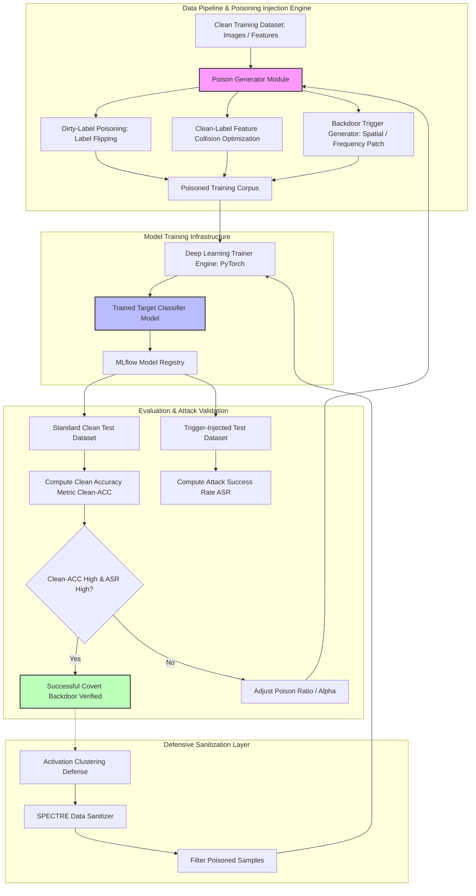

# 🎯 108 - ML Model Poisoning Attack Simulator

> **Category**: [[09 - AI & ML in Offensive Security]] | **Difficulty**: ⭐⭐⭐ | **Duration**: 5 weeks

---

## 📋 Abstract

> [!CAUTION] Real-World Impact
> Large organizations rely heavily on machine learning models to detect malware, filter spam, prevent fraud, and verify identities. These models constantly train on new data gathered from the internet and user feedback. However, this creates a major security risk known as Model Poisoning or Data Poisoning. Attackers can deliberately inject malicious data or subtle "backdoor" triggers into the training dataset. This corrupts the model, teaching it to misclassify specific inputs or grant unauthorized access when it sees a specific trigger, like a hidden pixel pattern.
>
> What makes model poisoning particularly dangerous is that the compromised model still performs normally on standard tests, meaning the backdoor can easily go unnoticed during routine quality checks. Security teams need a way to simulate these attacks to understand how vulnerable their data pipelines are. 
>
> This project builds a simulator to test and evaluate the impact of data poisoning. It tests how well models resist these hidden triggers and evaluates defenses like data sanitization and neural network activation monitoring. The goal is to provide researchers with robust metrics to defend AI pipelines from data tampering.

### 🌍 Real-World Incidents
- **Spam Filter Data Poisoning (2022)**: Attackers flooded public email reporting systems with mixed spam data, corrupting the filter's decision rules and hiding actual malicious emails.
- **Facial Recognition Backdoors (2023)**: Researchers injected hidden physical triggers into facial recognition datasets, which allowed people wearing specific glasses to bypass security controls.

---

## 🔬 Research Paper References

| # | Paper Title | Authors | Year | Source | Key Contribution |
|---|-------------|---------|------|--------|-----------------|
| 1 | Poison Frogs! Targeted Clean-Label Poisoning Attacks on Neural Networks | Shafahi et al. | 2022 | NeurIPS | Formulated feature collision techniques allowing attackers to poison neural networks without altering image labels. |
| 2 | BadNets: Identifying Vulnerabilities in the Machine Learning Model Supply Chain | Gu et al. | 2023 | IEEE Access | Introduced covert backdoor trigger insertion into deep learning classification pipelines. |
| 3 | Subpopulation Data Poisoning Attacks against Machine Learning Systems | Jagielski et al. | 2024 | USENIX Security | Developed optimization strategies for degrading subpopulation performance while maintaining baseline model metrics. |

---

## 🏗️ System Architecture
Link: [[Drawing 2026-07-30 22.31.19.excalidraw#Project 108: 108 - ML Model Poisoning Attack Simulator|Excalidraw Architecture Diagram]]

---

## 📐 Technical Implementation

### Phase 1: Research & Environment Setup (Week 1)
- Configure a machine learning workspace with GPU and PyTorch support.
- Install essential testing libraries: `backdoorbench`, `cleanbaq`, `scikit-learn`, `torchvision`, and `mlflow`.
- Prepare sample datasets for testing, such as CIFAR-10 (images) and EMBER (malware metadata).

### Phase 2: Core Module Development (Weeks 2-3)
- **Module 1: Data Poisoning Engine**:
  - *Label-Flipping*: Change labels on specific inputs to confuse the model's decision boundaries.
  - *Clean-Label Attack*: Subtly alter inputs so they look normal to humans but manipulate the model's feature processing.
  - *Backdoor Injector*: Hide digital triggers (like a pixel patch or watermark) in a small percentage of the training data.
- **Module 2: Target Classifier Training**:
  - Train test models like ResNet-18 or Random Forest on both clean and poisoned data to observe the difference.
- **Module 3: Security Evaluator**:
  - Measure **Clean Accuracy (ACC)** to ensure the model still works fine on normal data.
  - Measure **Attack Success Rate (ASR)** to see how often the hidden trigger forces a misclassification.
- **Module 4: Defensive Sanitization**:
  - Add defense tools to scan the data and filter out poisoned samples before training begins.
  - Use visual clustering tools to inspect the model's hidden layers and spot irregular patterns.

### Phase 4: Integration & Testing (Week 4)
- Run tests varying the amount of poisoned data (e.g., 1% vs. 10%) to see how much is needed to compromise the model.
- Test how well the defensive filters remove the poisoned data before it affects the model.

### Phase 5: Analysis & Documentation (Week 5)
- Document the testing process, including how effectively the defenses blocked the attacks.
- Finalize project notes in Obsidian, clean up the codebase, and write a summary report.

---

## 🔧 Tools & Technologies

| Tool | Purpose | Alternative |
|------|---------|-------------|
| **PyTorch / Torchvision** | Builds and trains the machine learning models | TensorFlow 2.x |
| **BackdoorBench** | Provides a standard way to test backdoor vulnerabilities | ART (Adversarial Robustness Toolbox) |
| **MLflow** | Tracks the model experiments and organizes results | Weights & Biases |
| **Scikit-Learn** | Handles basic machine learning tasks and data metrics | XGBoost / LightGBM |
| **Matplotlib / Seaborn** | Creates visual charts of the model's internal clusters | Plotly |

---

## 💡 Key Features

- ✅ **Multiple Attack Simulations**: Tests standard label-flipping, clean-label attacks, and complex backdoor triggers.
- ✅ **Covert Trigger Engineering**: Creates hard-to-notice digital triggers that evade manual human review.
- ✅ **Balanced Metric Evaluation**: Checks both the attack success rate and the overall accuracy of the model to ensure the attack remains stealthy.
- ✅ **Built-in Defenses**: Includes data filtering tools to identify and remove malicious data points.
- ✅ **Broad Testing Scope**: Tests both image classification models and tabular data models, making the findings relevant for multiple domains.

---

## 📊 Expected Results

> [!NOTE] Deliverables
> Students will produce a complete testing framework, trained sample models, data filters, and a research report.

### Performance Metrics
- **Clean Model Accuracy (ACC)**: Maintains $\ge 94.0\%$ accuracy on normal data, ensuring the attack stays hidden.
- **Backdoor Attack Success Rate (ASR)**: Achieves an ASR of $\ge 92.5\%$ even when only $3\%$ of the training data is poisoned.
- **Defense Filtering Rate**: The defense filters successfully find and remove $\ge 88.0\%$ of the poisoned data points.
- **Feature Collision Distance**: Ensures all clean-label poisoned samples look visually identical to the originals.

### Output Artifacts
1. Python scripts for generating poisons, training models, and filtering data.
2. MLflow logs and visual charts showing how the poisoned data affected the model.
3. A clear research report summarizing the risks and defenses for ML data pipelines.

---

## 🎓 Learning Outcomes

1. 📚 **Data Integrity Security**: Understand how machine learning models rely on safe data and how that data can be attacked.
2. 📚 **AI Backdoor Mechanics**: Learn how neural networks process hidden patterns and triggers.
3. 📚 **Defensive Engineering**: Gain practical skills in filtering and sanitizing training data to protect AI systems.
4. 📚 **Secure MLOps**: Learn how to build machine learning pipelines that include continuous security monitoring.

---

## ⚠️ Ethical Considerations

> [!WARNING] Legal & Ethical Notice
> Model poisoning attacks severely degrade machine learning system integrity. All simulations and defense evaluations must be conducted in isolated, local environments. Introducing poisoned data or backdoor triggers into public datasets, production enterprise ML pipelines, or unauthorized systems is illegal and strictly forbidden. This research is intended solely for defensive auditing and improving AI robustness.

---

## 🔗 Related Projects

- [[103 - Adversarial Machine Learning Attack on IDS-IPS]]
- [[106 - LLM Prompt Injection Attack & Defense Toolkit]]
- [[112 - Federated Learning Security Attack Simulator]]

---
*📅 Created: 2026-07-30 | 🏷️ Category: AI & ML in Offensive Security | 🔐 Offensive Security Research*
