# 🎯 109 - AI-Driven Vulnerability Prioritization System

> **Category**: [[09 - AI & ML in Offensive Security]] | **Difficulty**: ⭐⭐ | **Duration**: 4 weeks

---

## 📋 Problem Statement

> [!CAUTION] Real-World Impact
> Enterprise security teams face a huge challenge every year with over 30,000 new vulnerabilities (CVEs) being disclosed. The traditional way of dealing with these relies heavily on static CVSS scores. However, these scores do not accurately show the real-world danger. While more than 56% of vulnerabilities get a "High" or "Critical" rating, less than 5% are actually used by attackers. This gap creates massive overload, forcing teams to waste time on low-risk issues while dangerous zero-day exploits might go unnoticed.

An **AI-Driven Vulnerability Prioritization System** fixes this by collecting dynamic data from multiple sources. It combines static metrics, EPSS (Exploit Prediction Scoring System) trends, CISA's Known Exploited Vulnerabilities catalog, asset value, and threat intelligence from the dark web. By feeding this data into machine learning models like XGBoost or Random Forest, the system can predict how likely a vulnerability is to be exploited in the real world. 

This predictive approach allows security operations teams to focus their patching efforts where they matter most. Instead of chasing every high CVSS score, defenders can address the small percentage of vulnerabilities that pose an immediate, realistic threat to their infrastructure, thereby improving overall organizational resilience and saving valuable time.

### 🌍 Real-World Incidents
- **Log4Shell Operational Overload (CVE-2021-44228)**: Companies spent weeks tracking vulnerable servers across millions of devices, slowing down operations because standard scanners could not provide contextual risk scores.
- **MoveIT Transfer Zero-Day Exploitation (2023)**: Attackers exploited an unprioritized zero-day vulnerability before enterprise patch cycles could address it, leading to massive data theft.

---

## 🔬 Research Paper References

| # | Paper Title | Authors | Year | Source | Key Contribution |
|---|-------------|---------|------|--------|-----------------|
| 1 | Predicting Real-World Vulnerability Exploitation with Machine Learning | Jacobs et al. | 2022 | ACM TOIT | Introduced the Exploit Prediction Scoring System (EPSS) using gradient boosted decision trees. |
| 2 | Beyond CVSS: Machine Learning for Context-Aware Vulnerability Prioritization | Chen et al. | 2023 | IEEE TIFS | Combined asset contextual criticality with temporal threat intelligence to refine patch prioritization accuracy. |
| 3 | Automated Risk Scoring using NLP over Dark Web Threat Intelligence | Sharma et al. | 2024 | USENIX Security | Extracted early exploit indicators from dark web forums to predict weaponization 30 days prior to public disclosures. |

---

## 🏗️ System Architecture
Link: [[Drawing 2026-07-30 22.31.19.excalidraw#Project 109: 109 - AI-Driven Vulnerability Prioritization System|Excalidraw Architecture Diagram]]

```mermaid
graph TD
    subgraph Data Ingestion & Threat Feeds
        A[NVD API: CVSS Base Metrics] --> D[Feature Normalizer & Fusion Engine]
        B[EPSS API: Exploit Probability] --> D
        C[CISA KEV Catalog: Active Exploitation] --> D
        E[Dark Web / GitHub PoC Scraping] --> D
        F[Enterprise Asset CMDB: Asset Criticality] --> D
    end

    subgraph Machine Learning Prioritization Model
        D --> G[Standardized Feature Vector]
        G --> H[XGBoost Gradient Boosting Classifier]
        G --> I[Random Forest Ensemble Model]
        H --> J[Risk Score Predictor Module]
        I --> J
    end

    subgraph Dynamic Prioritization Matrix
        J --> K[Real-World Exploitability Score 0.00 - 1.00]
        K --> L{Contextual Risk Assessment}
        L -->|Score >= 0.80 + Critical Asset| M[P0: Immediate Patch Action Required]
        L -->|0.50 <= Score < 0.80| N[P1: Scheduled 7-Day Patch Cycle]
        L -->|Score < 0.50| O[P2: Standard Maintenance Window]
    end

    subgraph SOC Dashboard & Alerting
        M --> P[Jira Security Ticket Auto-Generation]
        N --> P
        O --> Q[SOC BI Dashboard: Grafana / Streamlit]
    end

    style H fill:#f9f,stroke:#333,stroke-width:2px
    style J fill:#bbf,stroke:#333,stroke-width:2px
    style M fill:#bfb,stroke:#333,stroke-width:2px
```

---

## 📐 Technical Implementation

### Phase 1: Research & Environment Setup (Week 1)
- Set up a Python analysis workspace with standard data science libraries: `scikit-learn`, `xgboost`, `pandas`, `requests`, `streamlit`, and `plotly`.
- Register API access keys for the NVD (National Vulnerability Database) API v2 and the EPSS API.
- Download the CISA Known Exploited Vulnerabilities (KEV) JSON dataset for analysis.

### Phase 2: Core Module Development (Weeks 2-3)
- **Module 1: Telemetry Ingestion Pipeline**:
  - Fetch CVE metadata such as CVSS v3.1 vector, attack vector, complexity, and privileges required.
  - Query real-time EPSS scores and percentile trends.
  - Cross-reference with CISA KEV catalog flags to identify active exploitation.
- **Module 2: Machine Learning Risk Classifier**:
  - Extract and combine features from CVSS metrics, EPSS trends, vendor impact ratings, and asset exposure factors.
  - Train XGBoost and Random Forest classifiers on historical CVE weaponization data from 2018 to 2024.
- **Module 3: Prioritization Engine & Ticketing Integrator**:
  - Calculate a normalized Threat Score.
  - Automatically map CVEs to remediation timelines (for example, P0 within 24 hours, P1 within 7 days).
- **Module 4: Interactive Dashboard**:
  - Build an interactive Streamlit application to visualize risk distributions, compliance metrics, and patch queue reduction.

### Phase 3: Integration & Testing (Week 4)
- Run the system against a synthetic enterprise dataset containing 10,000 scanned CVE findings.
- Compare the efficiency of AI-based prioritization against traditional CVSS filtering to measure the reduction in unnecessary workload.

### Phase 4: Analysis & Documentation (Week 4)
- Evaluate model metrics, including Precision, Recall, ROC-AUC curve, and F1-score against the CISA KEV dataset.
- Finalize documentation, code repositories, and user manuals to help security teams deploy the system.

---

## 🔧 Tools & Technologies

| Tool | Purpose | Alternative |
|------|---------|-------------|
| **XGBoost / Scikit-Learn** | Building machine learning classification models | LightGBM / CatBoost |
| **NVD API v2** | Ingesting vulnerability metrics and CVSS vectors | VulnDB API |
| **EPSS API** | Fetching real-time exploit prediction scores | FIRST.org EPSS Data Feed |
| **CISA KEV Catalog** | Sourcing ground truth datasets of active exploits | Mandiant Threat Intel |
| **Streamlit** | Creating interactive dashboards for SOC visualization | Dash / Grafana |

---

## 💡 Key Features

- ✅ **Multi-Source Data Fusion**: Combines NVD, EPSS, CISA KEV, and custom asset criticality into a single normalized data structure.
- ✅ **Dynamic Exploitability Prediction**: Uses machine learning to predict the likelihood of weaponization before public exploits become widely available.
- ✅ **Massive Workload Reduction**: Decreases actionable patching backlogs significantly compared to traditional filtering methods.
- ✅ **Context-Aware Assessment**: Adjusts the priority of a vulnerability based on network exposure, such as whether a system is internet-facing or isolated.
- ✅ **Automated Remediation Routing**: Automatically generates priority tickets and sends them directly to IT operations teams.

---

## 📊 Expected Results

> [!NOTE] Deliverables
> The final deliverables include a functional Python telemetry harvester, a trained XGBoost prioritization model, an interactive Streamlit dashboard, and a comprehensive validation report.

### Performance Metrics
- **Model Classification Accuracy**: High ROC-AUC score for predicting active exploitation based on the CISA KEV ground truth.
- **Efficiency Gains**: Significant reduction in urgent patch workloads without overlooking critical threats.
- **Data Processing Speed**: Ability to ingest, enrich, and score thousands of CVE records per minute.

### Output Artifacts
1. Python codebase covering ingestion modules, model trainers, and the Streamlit UI.
2. Trained XGBoost model binary files for deployment.
3. A comparative evaluation report demonstrating operational efficiency over static CVSS scoring.

---

## 🎓 Learning Outcomes

1. 📚 **Data-Driven Security Auditing**: Learn how to apply machine learning to streamline enterprise vulnerability management.
2. 📚 **Feature Engineering & Data Fusion**: Gain skills in normalizing and combining varied threat intelligence feeds.
3. 📚 **Machine Learning Implementation**: Get practical experience training and tuning XGBoost classifiers for security datasets.
4. 📚 **Security Operations Optimization**: Develop the capability to build automated systems that improve everyday SOC workflows and defense strategies.

---

## ⚠️ Ethical Considerations

> [!WARNING] Legal & Ethical Notice
> This tool ingests public vulnerability data to assist in defensive prioritization. All threat intelligence and exploit prediction metrics must be used solely to streamline patch management, audit infrastructure, and improve overall defensive security posture.

---

## 🔗 Related Projects

- [[105 - AI-Powered Automated Exploit Generation Framework]]
- [[109 - AI-Driven Vulnerability Prioritization System]]
- [[111 - NLP for Threat Intelligence Extraction]]

---
*📅 Created: 2026-07-30 | 🏷️ Category: AI & ML in Offensive Security | 🔐 Defensive Security Research*
