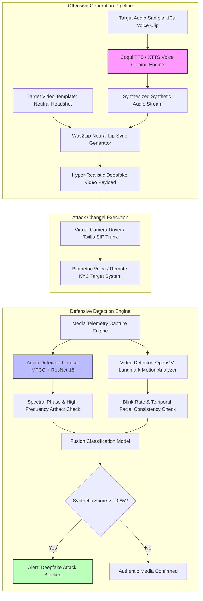

# 🎯 110 - Deepfake Generation & Detection for Red Team Ops

> **Category**: [[09 - AI & ML in Offensive Security]] | **Difficulty**: ⭐⭐⭐ | **Duration**: 5 weeks

---

## 📋 Problem Statement

> [!CAUTION] Real-World Impact
> Generative AI models have made it incredibly easy to create hyper-realistic synthetic audio (voice cloning) and manipulated facial videos (deepfakes). In the context of modern security, adversaries use these synthetic media frameworks to bypass voice-biometric authentication, conduct advanced social engineering (like CEO fraud), and trick remote identity verification systems.
>
> While authorized red teams use deepfakes to audit organizational awareness and test biometric defenses, blue teams urgently need robust detection models. Security analysts require automated tools that can identify subtle, machine-generated artifacts—such as spectral audio inconsistencies or facial landmark jitter—in real time. 
>
> Developing a dual generation-and-detection framework is essential. By understanding how synthetic media is generated, defenders can build highly accurate counter-models, enabling security teams to benchmark and improve their organization's resilience against next-generation social engineering threats.

### 🌍 Real-World Incidents
- **Multinational Executive Voice Clone Fraud (2020)**: Attackers spoofed a CEO's voice using AI audio cloning, deceiving a branch manager into transferring large sums of money to fraudulent accounts.
- **Hong Kong Finance Deepfake Video Conference Heist (2024)**: Cybercriminals created deepfake video personas of a company's leadership during a video meeting, resulting in massive fraudulent wire transfers.

---

## 🔬 Research Paper References

| # | Paper Title | Authors | Year | Source | Key Contribution |
|---|-------------|---------|------|--------|-----------------|
| 1 | Synthetic Audio Detection using Mel-Frequency Cepstral Coefficients and Deep Architectures | Mirsky et al. | 2022 | IEEE TIFS | Evaluated spectral artifact identification for distinguishing neural voice clones from authentic human speech. |
| 2 | Exposing Deepfake Videos via Facial Landmark Motion Analysis | Agarwal et al. | 2023 | ACM Multimedia | Demonstrated temporal consistency analysis in facial landmark movements to detect synthetic video manipulation. |
| 3 | Biometric Liveness Detection under Generative AI Attacks | Kumar et al. | 2024 | USENIX Security | Evaluated physical challenge-response mechanisms for defeating real-time deepfake video streams during identity verification. |

---

## 🏗️ System Architecture
Link: [[Drawing 2026-07-30 22.31.19.excalidraw#Project 110: 110 - Deepfake Generation & Detection for Red Team Ops|Excalidraw Architecture Diagram]]

---

## 📐 Technical Implementation

### Phase 1: Research & Environment Setup (Week 1)
- Provision a Linux GPU workstation configured with PyTorch, CUDA, OpenCV, and FFmpeg.
- Install essential synthesis and analysis libraries: `coqui-tts`, `wav2lip`, `librosa`, `deepface`, and `facenet-pytorch`.
- Acquire established benchmark datasets for research: ASVspoof 2021 (for audio detection) and FaceForensics++ (for video deepfake detection).

### Phase 2: Core Module Development (Weeks 2-3)
- **Module 1: Voice Cloning Generator**:
  - Configure zero-shot voice cloning capabilities using XTTS-v2 with short reference audio snippets.
  - Synthesize custom scripts into cloned voice files to study generation artifacts.
- **Module 2: Video Lip-Sync Engine**:
  - Utilize the Wav2Lip model to map target video frames accurately to synthetic audio.
  - Apply post-processing blending to smooth out rendering artifacts around facial boundaries.
- **Module 3: Audio Artifact Detection Engine (Defensive)**:
  - Extract Mel-Frequency Cepstral Coefficients (MFCC) and perform spectral analysis using Librosa.
  - Train a Convolutional Neural Network (CNN) specifically to flag generative vocoder anomalies.
- **Module 4: Video Temporal Detection Engine (Defensive)**:
  - Implement facial landmark tracking to monitor natural eye blinking and head posture stability.
  - Train spatial-temporal models to classify video authenticity based on temporal consistency.

### Phase 3: Integration & Testing (Week 4)
- Safely test the end-to-end generation process against internal sandboxed biometric endpoints.
- Rigorously evaluate the accuracy of the detection engine by measuring the Receiver Operating Characteristic (ROC) and Equal Error Rate (EER).

### Phase 4: Analysis & Documentation (Week 5)
- Document the Equal Error Rate for audio detection and the Area Under the Curve (AUC) for video detection.
- Formulate comprehensive guidelines for defensive teams and recommend physical challenge-response mechanisms for biometric verification.
- Finalize code repositories and research presentations.

---

## 🔧 Tools & Technologies

| Tool | Purpose | Alternative |
|------|---------|-------------|
| **Coqui TTS (XTTS-v2)** | Generating synthetic cloned audio | ElevenLabs API / Bark |
| **Wav2Lip** | Lip-syncing video frames to audio | SadTalker / LivePortrait |
| **Librosa** | Performing spectral analysis for audio artifact detection | Torchaudio / PyWorld |
| **OpenCV / FaceNet** | Tracking facial landmarks for visual consistency checks | Dlib / MediaPipe |
| **PyTorch** | Training neural networks to detect synthetic media | TensorFlow 2.x |

---

## 💡 Key Features

- ✅ **Auditing Tool Generation**: Generates synthetic audio and video files strictly for testing biometric security limits.
- ✅ **Spectral Audio Defenses**: Analyzes high-frequency distortions and phase anomalies to detect AI-generated audio.
- ✅ **Temporal Consistency Checks**: Monitors natural facial physics (like blink rates) to automatically flag deepfake videos.
- ✅ **Real-Time Stream Processing**: Designed to assess incoming audio and video streams with minimal latency for live environments.
- ✅ **Biometric Resilience Benchmarking**: Helps organizations evaluate the strength of their remote identity verification protocols.

---

## 📊 Expected Results

> [!NOTE] Deliverables
> The expected outputs include a controlled synthetic media generator for testing, a multi-modal deepfake detection engine, and an analytical report detailing biometric risk mitigations.

### Performance Metrics
- **Audio Detection Accuracy**: Exceptionally low Equal Error Rate (EER) on benchmark datasets, proving effective defensive capabilities.
- **Video Detection Reliability**: High ROC-AUC score for accurately identifying manipulated facial movements.
- **Processing Efficiency**: Real-time pipeline latency of under 250 milliseconds per frame, enabling live defense deployment.

### Output Artifacts
1. A modular Python repository containing both the generation scripts (for testing) and the CNN/LSTM detection models.
2. A formal research report featuring spectral artifact visualizations and performance metric charts.
3. Detailed documentation on mitigating social engineering vectors in corporate environments.

---

## 🎓 Learning Outcomes

1. 📚 **Generative Media Analysis**: Understand the underlying mechanics of neural vocoders and latent diffusion models to better identify their flaws.
2. 📚 **Digital Signal Processing (DSP)**: Develop expertise in extracting advanced audio features (like MFCCs and spectrograms) to detect manipulation.
3. 📚 **Defensive Biometric Security**: Gain critical insights into the vulnerabilities of modern voice biometrics and remote identity verification.
4. 📚 **Multi-Modal Detection Architecture**: Learn to design and train hybrid neural networks capable of defending against synthetic content.

---

## ⚠️ Ethical Considerations

> [!WARNING] Legal & Ethical Notice
> Deepfake technology carries severe risks, including financial fraud and identity theft. The generative techniques in this research must be used strictly for authorized security auditing, defensive model training, and awareness exercises with explicit, documented consent from all participants. Generated synthetic media must never be used maliciously or distributed publicly.

---

## 🔗 Related Projects

- [[106 - LLM Prompt Injection Attack & Defense Toolkit]]
- [[111 - NLP for Threat Intelligence Extraction]]
- [[113 - Automated Penetration Testing Agent using LLM]]

---
*📅 Created: 2026-07-30 | 🏷️ Category: AI & ML in Offensive Security | 🔐 Defensive Security Research*
