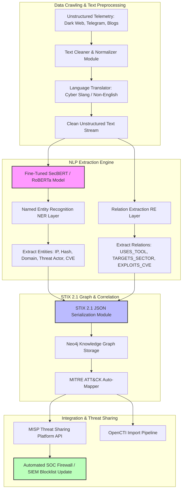

# 🎯 111 - NLP for Threat Intelligence Extraction

> **Category**: [[09 - AI & ML in Offensive Security]] | **Difficulty**: ⭐⭐ | **Duration**: 4 weeks

---

## 📋 Problem Statement

> [!CAUTION] Real-World Impact
> Cyber Threat Intelligence (CTI) analysts must monitor thousands of unstructured data sources every day. These sources range from security blogs and vendor reports to dark web forums and Telegram leak channels. Manually reading through these texts to extract actionable Indicators of Compromise (IOCs)—such as malicious IPs, file hashes, and Command and Control (C2) domains—is incredibly time-consuming. Furthermore, mapping these findings to Tactics, Techniques, and Procedures (TTPs) takes even longer. By the time analysts manually aggregate this intelligence, attackers have often already shifted their infrastructure.
>
> An **NLP-Powered Threat Intelligence Extraction System** solves this problem by automating the entire pipeline. Utilizing advanced Natural Language Processing (NLP) techniques like Named Entity Recognition (NER) and Relation Extraction, the system ingests messy, unstructured text and instantly extracts vital threat entities. It correlates relationships between threat actors and their tools, formatting the findings into standardized STIX 2.1 payloads. 
>
> This automated intelligence can then be fed directly into Threat Intelligence Platforms (TIPs) like MISP, enabling defenders to update firewalls and blocklists in seconds rather than hours, vastly improving organizational defense speed.

### 🌍 Real-World Incidents
- **Ransomware-as-a-Service Leak Processing (2023)**: When chat logs from a major ransomware group leaked, security teams struggled to manually parse thousands of messages, delaying critical blocklist updates that could have prevented ongoing attacks.
- **Dark Web Zero-Day Trade Monitoring (2024)**: Automated NLP systems successfully flagged discussions of zero-day exploits on underground forums weeks before actual campaigns began, giving defenders a crucial head start for patching.

---

## 🔬 Research Paper References

| # | Paper Title | Authors | Year | Source | Key Contribution |
|---|-------------|---------|------|--------|-----------------|
| 1 | Extracting Cyber Threat Intelligence from Unstructured Text with Fine-Tuned Transformers | Alam et al. | 2022 | IEEE TDSC | Applied fine-tuned RoBERTa models for high-accuracy Named Entity Recognition in cybersecurity corpora. |
| 2 | Automated STIX 2.1 Graph Construction from Cyber Threat Reports | Zhang et al. | 2023 | ACM CCS | Developed relation extraction models mapping extracted entities directly to STIX graph schemas. |
| 3 | LLM-assisted Cyber Threat Intelligence Parsing: Benchmarks and Failure Modes | Mittal et al. | 2024 | USENIX Security | Evaluated LLM performance vs. domain-specific NER pipelines for parsing dark web slang and onion site telemetry. |

---

## 🏗️ System Architecture
Link: [[Drawing 2026-07-30 22.31.19.excalidraw#Project 111: 111 - NLP for Threat Intelligence Extraction|Excalidraw Architecture Diagram]]

---

## 📐 Technical Implementation

### Phase 1: Research & Environment Setup (Week 1)
- Prepare a Python environment with required libraries: `spacy`, `transformers`, `stix2`, `pymisp`, `neo4j`, and `langchain`.
- Obtain cybersecurity NLP datasets, such as the CyNER dataset, and download pretrained models like SecBERT from HuggingFace.
- Set up a local Neo4j graph database instance and a MISP Docker container for intelligence sharing.

### Phase 2: Core Module Development (Weeks 2-3)
- **Module 1: Text Preprocessing & Regex Extraction**:
  - Build reliable regex parsers to extract structured IOCs (IPv4/v6, SHA256 hashes, CVE IDs).
  - Implement normalization logic to clean "defanged" IOCs commonly found in reports (e.g., converting `example[.]com` to `example.com`).
- **Module 2: Fine-Tuned SecBERT NER Model**:
  - Fine-tune transformer models on the CyNER dataset to correctly identify complex entities such as threat actors, malware families, and targeted industries.
- **Module 3: Relation Extraction & MITRE ATT&CK Mapping**:
  - Analyze text syntax to establish relationships between extracted entities.
  - Automatically map identified attack techniques to the MITRE ATT&CK framework.
- **Module 4: STIX 2.1 & MISP Exportation**:
  - Structure the extracted data into valid STIX 2.1 JSON bundles.
  - Automate the process of pushing these threat objects into the local MISP instance.

### Phase 3: Integration & Testing (Week 4)
- Process a varied test corpus containing unstructured public threat reports and simulated dark web forum dumps.
- Assess the model's extraction accuracy by calculating Precision, Recall, and F1-scores across different entity types.

### Phase 4: Analysis & Documentation (Week 4)
- Compare the speed and accuracy of the fine-tuned SecBERT model against generic LLM extraction approaches.
- Produce comprehensive documentation detailing the graph schema, API integrations, and system architecture.

---

## 🔧 Tools & Technologies

| Tool | Purpose | Alternative |
|------|---------|-------------|
| **SecBERT / Transformers** | Domain-specific transformer model for accurate Entity Recognition | SpaCy en_core_web_sm |
| **STIX2 Python Library** | Generating structured, standardized threat intelligence data | Custom JSON schemas |
| **PyMISP** | Automating data ingestion into Threat Intelligence Platforms | OpenCTI Python SDK |
| **Neo4j** | Graph database for visualizing complex threat relationships | Amazon Neptune |
| **CyNER Dataset** | Benchmark dataset for training cybersecurity NLP models | Custom Labeled CTI Corpora |

---

## 💡 Key Features

- ✅ **Automated IOC Normalization**: Seamlessly translates obfuscated or defanged indicators back into standard, actionable formats.
- ✅ **High-Fidelity Entity Recognition**: Effectively extracts specialized cybersecurity terms using fine-tuned transformer models.
- ✅ **Standardized Output**: Produces validated STIX 2.1 data bundles, ensuring compatibility with global intelligence sharing networks.
- ✅ **Graph-Based Visualization**: Creates interactive Neo4j knowledge graphs to help analysts visualize adversary behavior and toolsets.
- ✅ **Actionable Defense Integration**: Directly feeds intelligence into MISP and SIEM platforms to enable rapid perimeter defense updates.

---

## 📊 Expected Results

> [!NOTE] Deliverables
> Students will deliver a fully automated NLP intelligence extraction pipeline, complete with a fine-tuned SecBERT model, Neo4j graphing scripts, and a functional MISP integration wrapper.

### Performance Metrics
- **Extraction Precision**: Near-perfect precision for standard regex-based IOC extraction.
- **NER Model Efficiency**: High F1-scores when identifying complex, contextual entities like threat actors and malware families.
- **Processing Capability**: Ability to parse and convert hundreds of unstructured pages into STIX 2.1 format in minutes.

### Output Artifacts
1. A robust Python codebase encompassing the preprocessor, NER engine, STIX builder, and API pushers.
2. The fine-tuned transformer model weights alongside the dataset training scripts.
3. Interactive knowledge graphs and extensive project documentation.

---

## 🎓 Learning Outcomes

1. 📚 **Cybersecurity NLP Integration**: Learn how to apply fine-tuned transformer models to solve specific domain challenges in cybersecurity.
2. 📚 **Threat Intelligence Standardization**: Master industry-standard formatting protocols, including STIX 2.1, TAXII, and the MITRE ATT&CK taxonomy.
3. 📚 **Knowledge Graph Engineering**: Understand how to structure and query graph databases (Neo4j) to map complex threat landscapes.
4. 📚 **Automated Defensive Operations**: Develop the skills needed to build robust ETL pipelines that directly improve Security Operations Center (SOC) efficiency.

---

## ⚠️ Ethical Considerations

> [!WARNING] Legal & Ethical Notice
> Research involving dark web intelligence or leaked data must adhere to strict legal and ethical guidelines. Analysts must prioritize defensive application, avoid handling stolen Personally Identifiable Information (PII) or credentials, and ensure all scraping activities comply with local laws and terms of service.

---

## 🔗 Related Projects

- [[106 - LLM Prompt Injection Attack & Defense Toolkit]]
- [[109 - AI-Driven Vulnerability Prioritization System]]
- [[113 - Automated Penetration Testing Agent using LLM]]

---
*📅 Created: 2026-07-30 | 🏷️ Category: AI & ML in Offensive Security | 🔐 Defensive Security Research*
