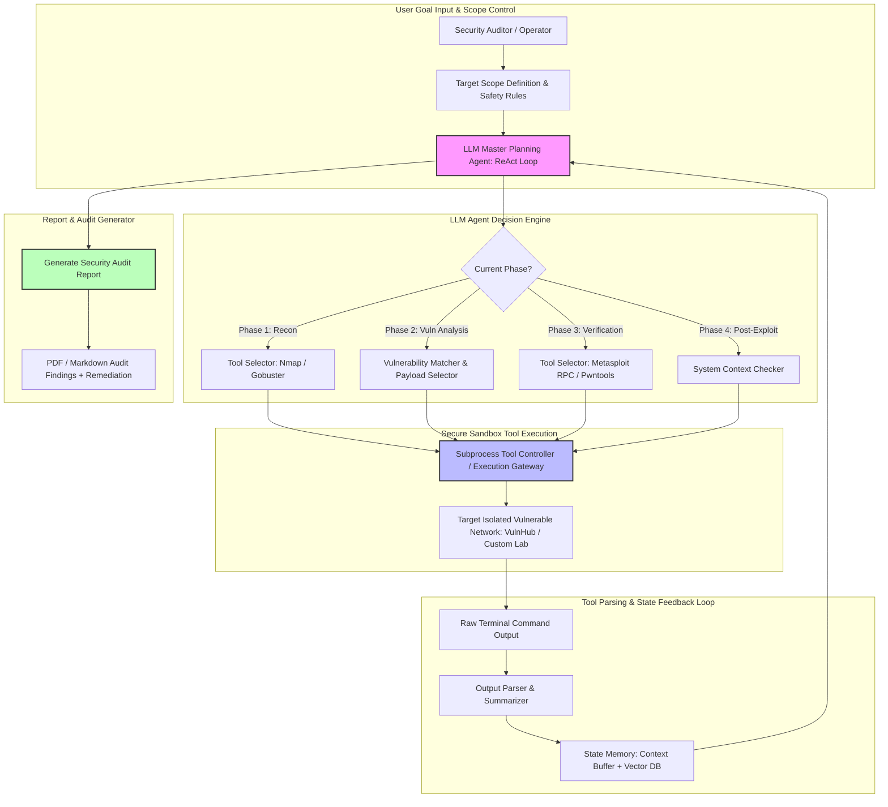

# 🎯 113 - Automated Penetration Testing Agent using LLM

> **Category**: [[09 - AI & ML in Offensive Security]] | **Difficulty**: ⭐⭐⭐ | **Duration**: 6 weeks

---

## 📋 Problem Statement

> [!CAUTION] Real-World Impact
> As enterprise networks expand, the attack surface grows faster than human security teams can thoroughly audit. Traditional automated vulnerability scanners rely on static rules, which often generate high volumes of false positives and fail to identify complex, multi-stage vulnerabilities. For example, a scanner might detect an open FTP port but miss how those exposed credentials could be used to access a web dashboard and eventually trigger command injection.
>
> An **Automated Penetration Testing Agent using LLMs** bridges this gap by combining the reasoning and planning capabilities of Large Language Models with established security tooling (like Nmap and Metasploit). Operating within a tightly controlled **ReAct (Reasoning + Acting)** feedback loop, the agent autonomously analyzes network telemetry, formulates assessment plans, selects appropriate tools, and verifies vulnerabilities. 
>
> This research emphasizes building secure, bounded autonomous systems. By simulating advanced attacks in isolated environments, defenders can evaluate how LLM-driven automation might be used maliciously and, importantly, learn how to build autonomous agents that assist human defenders in continuous, comprehensive security auditing while strictly obeying safety boundaries.

### 🌍 Real-World Incidents
- **Autonomous Multi-Stage Network Breach Simulations (2023)**: Security researchers demonstrated that LLM agents could autonomously link several low-severity misconfigurations to achieve full domain compromise in lab environments, highlighting the need for advanced automated auditing tools.
- **Continuous Penetration Testing in Cloud Infrastructure (2024)**: Forward-thinking organizations deployed bounded autonomous agents inside staging environments to continuously verify patches and safely discover newly exposed administrative endpoints.

---

## 🔬 Research Paper References

| # | Paper Title | Authors | Year | Source | Key Contribution |
|---|-------------|---------|------|--------|-----------------|
| 1 | Autonomous Penetration Testing with Large Language Models | Deng et al. | 2023 | arXiv:2306.00552 | Formulated the PentestGPT framework structuring LLM reasoning into Reconnaissance, Exploitation, and Post-Exploitation phases. |
| 2 | AutoPentest-DRL: Combining Reinforcement Learning and LLMs for Cyber Assessment | Zhou et al. | 2024 | USENIX Security | Integrated hierarchical decision-making between high-level LLM planners and low-level execution scripts. |
| 3 | Evaluating Autonomous Agent Capabilities in Real-World CTF Environments | Happe et al. | 2024 | IEEE S&P | Benchmarked LLM agent performance across diverse Capture The Flag (CTF) challenges, analyzing failure modes and safety limits. |

---

## 🏗️ System Architecture
Link: [[Drawing 2026-07-30 22.31.19.excalidraw#Project 113: 113 - Automated Penetration Testing Agent using LLM|Excalidraw Architecture Diagram]]

---

## 📐 Technical Implementation

### Phase 1: Research & Environment Setup (Week 1)
- Construct a strictly isolated virtual network containing deliberately vulnerable targets (e.g., Metasploitable, OWASP Juice Shop).
- Install required agent frameworks and auditing tools: `langchain`, `nmap`, `pymetasploit3`, and Docker for containment.
- Configure local open-weights LLMs (such as Llama-3-Instruct) or appropriate API endpoints to serve as the reasoning engine.

### Phase 2: Core Module Development (Weeks 2-4)
- **Module 1: Agent ReAct Engine**:
  - Implement a LangChain-based ReAct loop that guides the agent through structured logic: `Thought -> Action -> Tool Output -> Observation -> Next Step`.
- **Module 2: Tool Wrapper Interfaces**:
  - Develop programmatic wrappers for essential tools, ensuring output is parsed into clean JSON for the LLM to comprehend.
  - Implement RPC bridges to interact with frameworks like Metasploit safely.
- **Module 3: Safety Guardrail Module**:
  - Code hard boundaries to restrict the agent strictly to defined CIDR scopes (e.g., `192.168.56.0/24`).
  - Implement absolute blocks on destructive commands and restrict execution privileges.
- **Module 4: Automated Report Generator**:
  - Build a module to synthesize the agent's findings, successful verification paths, and recommended remediation steps into professional markdown or PDF reports.

### Phase 3: Integration & Testing (Week 5)
- Deploy the agent against benchmark machines within the isolated lab environment.
- Evaluate the agent's ability to logically chain discoveries and adhere completely to defined safety guardrails.

### Phase 4: Analysis & Documentation (Week 6)
- Assess the efficiency of LLM-assisted auditing compared to traditional manual security assessments.
- Extensively document the agent architecture, safety controls, prompt engineering strategies, and research findings.

---

## 🔧 Tools & Technologies

| Tool | Purpose | Alternative |
|------|---------|-------------|
| **LangChain / AutoGPT** | Managing the agent's reasoning loop and tool routing | LlamaIndex / CrewAI |
| **Nmap CLI** | Conducting network discovery and service enumeration | Masscan / RustScan |
| **PyMetasploit3** | Programmatically interacting with security verification frameworks | Native Exploit Scripts |
| **Local LLM / OpenAI API** | Providing the foundational reasoning for multi-stage planning | Anthropic Claude API |
| **Docker / KVM** | Ensuring strict isolation and containment of target environments | VirtualBox |

---

## 💡 Key Features

- ✅ **Autonomous Assessment Chaining**: Demonstrates the capability to logically link network discoveries to further verification steps without constant human oversight.
- ✅ **Structured Reasoning Loop**: Utilizes a ReAct methodology to continuously adapt strategies based on the latest command outputs.
- ✅ **Programmatic Tool Integration**: Interfaces directly with standard security frameworks via RPC, showcasing advanced automation capabilities.
- ✅ **Strict Operational Guardrails**: Features hardcoded safety scopes and command blacklists to ensure absolute containment within the lab environment.
- ✅ **Automated Remediation Reporting**: Automatically translates complex technical findings into actionable, professional security reports.

---

## 📊 Expected Results

> [!NOTE] Deliverables
> Students will deliver a contained, LLM-powered security auditing agent, comprehensive tool wrappers, robust safety enforcement modules, and an automated report generator.

### Performance Metrics
- **Controlled Exploitation Rate**: Successful completion of designated audit paths on vulnerable benchmark VMs.
- **Tool Parsing Accuracy**: High reliability in interpreting and acting upon raw terminal outputs.
- **Safety Compliance**: Zero instances of out-of-scope network targeting or execution of blocked commands.

### Output Artifacts
1. Python source code encompassing the ReAct Agent, Tool Wrappers, and Safety Guardrails.
2. Demonstration logs highlighting the agent's reasoning process and adherence to safety protocols.
3. Sample automated penetration testing reports detailing discovered vulnerabilities and mitigation advice.

---

## 🎓 Learning Outcomes

1. 📚 **Autonomous AI Design**: Master the construction of ReAct agents, state memory management, and advanced prompt engineering.
2. 📚 **Security Tool Automation**: Gain hands-on experience integrating traditional CLI security tools into intelligent programmatic pipelines.
3. 📚 **Vulnerability Auditing Methodology**: Deepen understanding of standard penetration testing phases and how they can be simulated in software.
4. 📚 **AI Guardrails & Safety Engineering**: Develop critical skills in designing fail-safes, network boundaries, and execution limits for autonomous systems.

---

## ⚠️ Ethical Considerations

> [!WARNING] Legal & Ethical Notice
> Autonomous security agents are powerful tools that must be handled with extreme care. They must be strictly constrained to authorized target IP ranges within isolated, locally hosted lab environments. Implementing hardcoded safety wrappers is mandatory. Deploying such autonomous systems against external, unauthorized, or production infrastructure is highly dangerous and illegal.

---

## 🔗 Related Projects

- [[105 - AI-Powered Automated Exploit Generation Framework]]
- [[106 - LLM Prompt Injection Attack & Defense Toolkit]]
- [[107 - Reinforcement Learning-based Fuzzing Engine]]

---
*📅 Created: 2026-07-30 | 🏷️ Category: AI & ML in Offensive Security | 🔐 Defensive Security Research*
