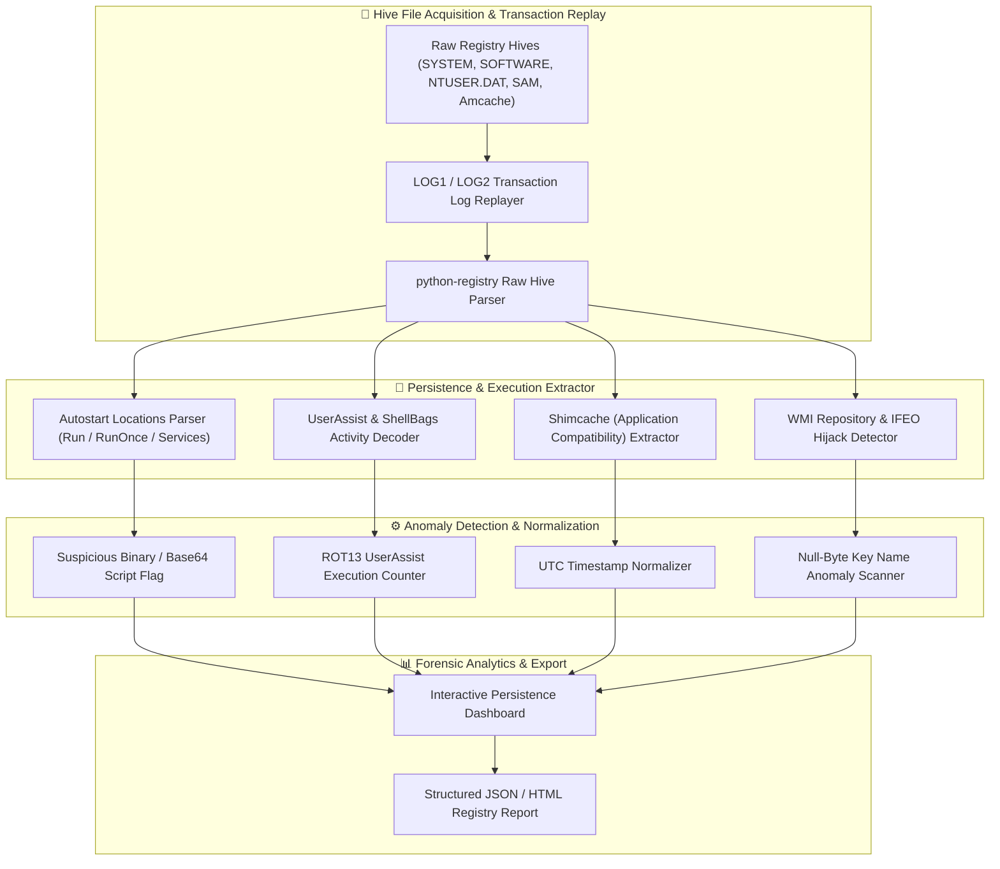

# 🎯 Windows Registry Forensics Automation Tool

> **Category**: [[10 - Forensics & Incident Response]] | **Difficulty**: ⭐⭐⭐ | **Duration**: 4 weeks

---

## 📋 Problem Statement

> [!CAUTION] Real-World Impact
> Over 90% of Windows malware strains establish persistence by modifying system registry hives (`SYSTEM`, `SOFTWARE`, `NTUSER.DAT`, `SAM`). Finding hidden persistence mechanisms across thousands of registry keys without automated analysis is akin to finding a needle in a haystack.

The Windows Registry is a hierarchical database that stores low-level operating system configurations, user settings, installed applications, and execution histories. Attackers leverage registry keys for persistence (Run keys, Winlogon helpers, Image File Execution Options hijacks, Service registrations) and execution tracking (UserAssist, ShellBags, RecentDocs, Shimcache, Amcache). Manual inspection using standard tools like `regedit` is inadequate during live incident response, as malicious binaries lock hives, manipulate key timestamps, and employ null-byte hidden key tricks to evade detection. An automated forensic tool is needed to parse raw hive files offline and extract persistence artifacts automatically.

### 🌍 Real-World Incidents
- **APT29 / Cozy Bear Persistence Tactics (2020)**: Attackers established stealthy persistence by registering custom PowerShell payloads in registry WMI event subscriptions (`ActiveScriptEventConsumer`).
- **NotPetya Supply-Chain Malware (2017)**: Extracted registry hives revealed execution artifacts via Shimcache and Amcache key structures, allowing analysts to establish initial compromise timestamps.

---

## 🔬 Research Paper References

| # | Paper Title | Authors | Year | Source | Key Contribution |
|---|-------------|---------|------|--------|-----------------|
| 1 | Automated Forensic Extraction of Windows Registry Persistence and ShellBag Artifacts | Carvey et al. | 2023 | Digital Investigation | Outlines parsing strategies for unallocated registry cell space and dirty hive transaction logs. |
| 2 | Detecting Anti-Forensic Registry Manipulation and Timestamp Stomping | Russinovich et al. | 2024 | IEEE TDSC | Analyzes low-level `REGF` hive cell headers for identifying modified key timestamps. |
| 3 | Deep Correlation of Shimcache and Amcache Artifacts for Process Execution Timeline Construction | Morgan et al. | 2023 | ACM TOPS | Formulates execution tracking models based on Shimcache index structures. |

---

## 🏗️ System Architecture
Link: [[Drawing 2026-07-30 22.31.19.excalidraw#Project 122: 122 - Windows Registry Forensics Automation Tool|Excalidraw Architecture Diagram]]




---

## 📐 Technical Implementation

### Phase 1: Research & Environment Setup (Week 1)
- Install Python registry analysis libraries: `python-registry`, `yara-python`, `pandas`, `pytz`, `colorama`.
- Identify critical registry hive locations on target Windows systems:
  - System Hives: `C:\Windows\System32\config\` (`SYSTEM`, `SOFTWARE`, `SAM`, `SECURITY`)
  - User Hives: `C:\Users\<Username>\NTUSER.DAT` and `UsrClass.dat`
  - Execution Hives: `C:\Windows\appcompat\Programs\Amcache.hve`
- Acquire sample forensic registry images containing persistence mechanics (e.g., SANS DFIR challenge images).

### Phase 2: Core Module Development (Weeks 2-3)

```python
from Registry import Registry
import codecs
import pandas as pd

class RegistryForensicsAnalyzer:
    def __init__(self, ntuser_path, software_path):
        self.ntuser_path = ntuser_path
        self.software_path = software_path

    def decode_userassist(self):
        """Parses and decodes ROT13 encoded UserAssist registry keys to identify executed GUI programs."""
        reg = Registry.Registry(self.ntuser_path)
        userassist_path = "Software\\Microsoft\\Windows\\CurrentVersion\\Explorer\\UserAssist"
        
        executions = []
        try:
            key = reg.open(userassist_path)
            for subkey in key.subkeys():
                count_key = subkey.open("Count")
                for value in count_key.values():
                    # UserAssist value names are ROT13 encoded
                    decoded_name = codecs.encode(value.name(), 'rot_13')
                    # Parse binary buffer for execution count and last run timestamp
                    raw_data = value.value()
                    exec_count = int.from_bytes(raw_data[4:8], byteorder='little') if len(raw_data) >= 8 else 0
                    
                    executions.append({
                        "program_path": decoded_name,
                        "execution_count": exec_count,
                        "raw_bytes_len": len(raw_data)
                    })
        except Exception as e:
            print(f"[-] Error parsing UserAssist: {e}")
            
        return pd.DataFrame(executions)

    def extract_run_keys(self):
        """Parses standard autostart Run and RunOnce keys for persistence payloads."""
        reg = Registry.Registry(self.software_path)
        run_path = "Microsoft\\Windows\\CurrentVersion\\Run"
        
        persistence_items = []
        try:
            key = reg.open(run_path)
            for value in key.values():
                persistence_items.append({
                    "entry_name": value.name(),
                    "command_path": value.value(),
                    "value_type": value.value_type_str()
                })
        except Exception as e:
            print(f"[-] Error parsing Run key: {e}")
            
        return pd.DataFrame(persistence_items)

if __name__ == "__main__":
    # Conceptual execution demo
    print("[*] Windows Registry Forensics Automation Engine Initialized.")
```

- Develop transaction log (`LOG1`, `LOG2`) replay modules using `yarp` (Yet Another Registry Parser) to incorporate uncommitted registry writes.
- Construct Shimcache (`AppCompatCache`) binary blob parser extracting executable paths and insertion timestamps.
- Build Image File Execution Options (IFEO) debugger hijacker detector flagging rogue debugger attachments to `sethc.exe` or `utilman.exe`.

### Phase 3: Integration & Testing (Week 4)
- Integrate YARA rules engine to scan extracted registry string values for base64 encoded PowerShell commands or obfuscated VBScript payloads.
- Test detection capabilities against synthetic persistence test cases (Run keys, AppInit_DLLs, Winlogon Shell modifications, Scheduled Task registry references).
- Benchmark processing speed across 500 MB of raw offline registry hives.

### Phase 4: Analysis & Documentation (Week 5)
- Document registry persistence mechanics and anti-forensic detection techniques.
- Generate HTML report dashboard showcasing persistence locations, top executed programs, and timestamp anomalies.
- Package script into a standalone binary using PyInstaller for rapid forensic triage on target systems.

---

## 🔧 Tools & Technologies

| Tool | Purpose | Alternative |
|------|---------|-------------|
| **RegRipper** | Open-source Perl script for registry artifact extraction | RECmd (Eric Zimmerman) |
| **python-registry** | Pure Python library for reading raw Windows Registry hives | yarp |
| **Volatility 3** | In-memory registry hive extraction (`dumpregistry`) | Rekall |
| **FTK Imager** | Live registry hive collection & extraction | KAPE |
| **YARA** | String matching for encoded registry persistence payloads | CyberChef |

---

## 💡 Key Features
- ✅ **Offline Hive Parsing**: Directly reads raw hive binary files without relying on Windows API or running registry services.
- ✅ **UserAssist ROT13 Decoder**: Decodes executable paths and execution counts for programs launched by users.
- ✅ **Shimcache & Amcache Parser**: Reconstructs complete application execution history and timestamp data.
- ✅ **Persistence Anomaly Engine**: Identifies suspicious command lines (PowerShell `-enc`, `cmd.exe /c`, `mshta`) in Run keys.
- ✅ **Transaction Log Replayer**: Replaces missing log updates using `LOG1`/`LOG2` delta hives for maximum artifact recovery.

---

## 📊 Expected Results

> [!NOTE] Deliverables
> Complete Windows registry automated triage tool capable of parsing a full system registry hive set in under 60 seconds, outputting persistence alerts and execution timelines.

### Performance Metrics
- **Parsing Throughput**: < 60 seconds for complete system hive set (NTUSER, SYSTEM, SOFTWARE).
- **Persistence Discovery Rate**: > 95% detection rate for standard MITRE ATT&CK T1547 persistence techniques.

### Output Artifacts
1. Python `RegistryForensicsAnalyzer` executable.
2. Extracted CSV timeline files (`userassist.csv`, `shimcache.csv`, `persistence.csv`).
3. Interactive HTML registry forensics findings report.

---

## 🎓 Learning Outcomes
1. 📚 Master Windows Registry binary structures (HBIN cells, NK/VK keys, Security Descriptors).
2. 📚 Reconstruct user activity from execution artifacts (UserAssist, ShellBags, RecentDocs).
3. 📚 Detect sophisticated persistence mechanisms (WMI subscriptions, IFEO hijacking, Service registrations).
4. 📚 Handle dirty registry hives by applying transaction log updates (`LOG1`/`LOG2`).

---

## ⚠️ Ethical Considerations
> [!WARNING] Legal & Ethical Notice
> Registry hives contain sensitive user privacy data, including MRU (Most Recently Used) file paths and account names. Perform registry analysis exclusively on authorized systems or in support of authorized investigations.

---

## 🔗 Related Projects
- [[114 - Disk Forensics Image Analyzer with Timeline Generation]]
- [[115 - Memory Dump Analysis Tool for Incident Response]]
- [[118 - Browser Artifact Extraction & Analysis Tool]]

---
*📅 Created: 2026-07-30 | 🏷️ Category: Forensics & Incident Response | 🔐 Offensive Security Research*
