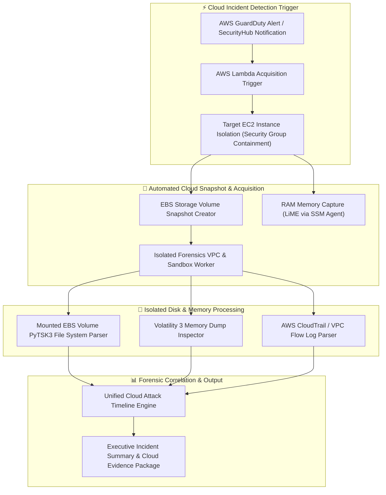

# 🎯 Cloud Instance Forensics Snapshot Analyzer

> **Category**: [[10 - Forensics & Incident Response]] | **Difficulty**: ⭐⭐⭐⭐ | **Duration**: 6 weeks

---

## 📝 Abstract

> [!CAUTION] Real-World Impact
> Ephemeral cloud infrastructure, such as AWS EC2, Azure VMs, and GCP Compute Instances, can be destroyed by attackers or auto-scaling groups within seconds of a compromise. This rapid change often wipes out critical forensic evidence before investigators can establish remote access.

This project develops a Cloud Instance Forensics Snapshot Analyzer to solve the challenges of acquiring evidence in cloud-native environments. Traditional physical methodologies fail here because security teams cannot attach hardware write-blockers or physically pull storage drives. Instead, this system automates the creation of storage snapshots using cloud provider APIs, handles detached volume mounting, and captures memory over hypervisor channels. It also correlates these artifacts with cloud control plane logs, like AWS CloudTrail, to build a complete timeline of the attack.

By automating these steps, the analyzer ensures that volatile data and disk evidence are preserved immediately when a threat is detected. It is crucial for modern digital forensics and incident response (DFIR) because it stops the loss of evidence caused by auto-scaling terminations and attacker tampering. The resulting platform delivers an executive incident summary and a secure cloud evidence package, maintaining a strict chain-of-custody for further investigation.

### 🌍 Real-World Incidents
- **Capital One Cloud Data Breach (2019)**: Attackers exploited an SSRF vulnerability in a cloud WAF on an EC2 instance, exfiltrating AWS IAM credentials and S3 bucket contents across ephemeral hosts.
- **Crypto-Mining Auto-Scaling Campaign (2021)**: Attackers compromised Kubernetes container nodes, triggering auto-scaling groups that spawned and terminated hundreds of transient mining instances, obscuring log trails.

---

## 🔬 Research Paper References

| # | Paper Title | Authors | Year | Source | Key Contribution |
|---|-------------|---------|------|--------|-----------------|
| 1 | Automated Cloud Instance Snapshotting and Volatile State Acquisition | Zawoad et al. | 2023 | IEEE TDSC | Outlines API-driven automated acquisition frameworks for ephemeral cloud workloads. |
| 2 | Reconstructing Cloud Cyber Attack Chains through CloudTrail and Disk Snapshot Alignment | Do et al. | 2024 | ACM TOPS | Demonstrates temporal correlation between IAM role AssumeRole calls and disk file creation times. |
| 3 | Containerized Forensics Environment for AWS EBS Volume Carving | Pichan et al. | 2023 | Digital Investigation | Proposes isolated container pipelines for analyzing EBS snapshots without target instance boot contamination. |

---

## 🏗️ System Architecture
Link: [[Drawing 2026-07-30 22.31.19.excalidraw#Project 123: 123 - Cloud Instance Forensics Snapshot Analyzer|Excalidraw Architecture Diagram]]



---

## 📐 Technical Implementation

### Phase 1: Research & Environment Setup (Week 1)
- Install cloud forensics dependencies: `boto3`, `pytsk3`, `volatility3`, `docker`, `pandas`, `jinja2`.
- Configure AWS IAM cross-account forensic role with necessary permissions: `ec2:CreateSnapshot`, `ec2:AttachVolume`, `ssm:SendCommand`.
- Deploy an isolated Forensic VPC containing an automated analysis EC2 worker instance with tools like Sleuth Kit and Volatility pre-installed.
- Obtain sample AWS EBS snapshots and CloudTrail logs from public cloud incident challenge repositories for testing.

### Phase 2: Core Module Development (Weeks 2-3)

```python
import boto3
import time
import sys

class AWSCloudForensicsEngine:
    def __init__(self, region_name="us-east-1"):
        self.ec2 = boto3.client('ec2', region_name=region_name)
        self.ssm = boto3.client('ssm', region_name=region_name)

    def isolate_instance(self, instance_id, isolation_sg_id):
        """Isolates the target instance by applying a zero-ingress containment security group."""
        print(f"[*] Isolating Instance {instance_id} via Security Group...")
        self.ec2.modify_instance_attribute(
            InstanceId=instance_id,
            Groups=[isolation_sg_id]
        )
        print(f"[+] Instance {instance_id} successfully isolated.")

    def create_ebs_snapshots(self, instance_id):
        """Creates EBS snapshots of all attached block storage volumes for evidence preservation."""
        response = self.ec2.describe_instances(InstanceIds=[instance_id])
        volumes = response['Reservations'][0]['Instances'][0]['BlockDeviceMappings']
        
        snapshot_ids = []
        for vol in volumes:
            vol_id = vol['Ebs']['VolumeId']
            print(f"[*] Creating Snapshot for Volume {vol_id}...")
            snap = self.ec2.create_snapshot(
                VolumeId=vol_id,
                Description=f"Forensic Snapshot of {instance_id} Volume {vol_id}"
            )
            snapshot_ids.append(snap['SnapshotId'])
        
        return snapshot_ids

    def trigger_memory_dump_ssm(self, instance_id, s3_bucket_destination):
        """Executes an SSM document to run a LiME RAM acquisition script on the target instance."""
        print(f"[*] Dispatching SSM RAM Acquisition Command to {instance_id}...")
        command = f"lime-dump --output s3://{s3_bucket_destination}/ram_{instance_id}.lime"
        
        response = self.ssm.send_command(
            InstanceIds=[instance_id],
            DocumentName="AWS-RunShellScript",
            Parameters={'commands': [command]}
        )
        return response['Command']['CommandId']

if __name__ == "__main__":
    # Conceptual execution workflow demonstration
    print("[*] AWS Cloud Forensics Orchestration Suite Initialized.")
```

- Develop a pipeline using Boto3 to mount target EBS snapshots as read-only block devices (`/dev/xvdf`) to the Forensic Worker instance.
- Build an AWS CloudTrail JSON log parser to isolate `AssumeRole`, `GetCallerIdentity`, and `CreateAccessKey` actions around the time of the compromise.
- Construct a wrapper for extracting RAM images, analyzing LiME dump files with Volatility 3 in automated headless mode.

### Phase 3: Integration & Testing (Week 4)
- Integrate an AWS Lambda trigger to run the Python acquisition script immediately upon receiving an AWS GuardDuty threat alert.
- Conduct validation testing on synthetic compromised Linux and Windows EC2 instances.
- Verify snapshot creation speed and volume mounting integrity without altering the hash values of the source data.

### Phase 4: Analysis & Documentation (Week 5)
- Document cloud evidence preservation rules adhering to ISO/IEC 27050 standards to maintain legal validity.
- Generate an automated HTML incident report that combines CloudTrail IAM API events, EBS file system artifacts, and memory findings.
- Deliver Terraform templates for deploying the entire automated cloud forensics framework efficiently.

---

## 🔧 Tools & Technologies

| Tool | Purpose | Alternative |
|------|---------|-------------|
| **Boto3 (AWS SDK)** | API orchestration for instance isolation and snapshotting | Azure SDK for Python |
| **AWS CloudTrail / VPC Flow Logs** | Cloud control plane and network flow logging | Azure Activity Log |
| **The Sleuth Kit (PyTSK3)** | EBS volume disk image file system parsing | Autopsy |
| **Volatility 3** | Ephemeral instance RAM memory analysis | Rekall |
| **Docker** | Isolated worker environments for forensic parsing | Podman |

---

## 💡 Key Features
- ✅ **Automated Instance Containment**: Immediately removes inbound and outbound security group access when an alert triggers.
- ✅ **API-Driven EBS Snapshot Acquisition**: Takes point-in-time storage volume snapshots within seconds.
- ✅ **Live RAM Capture via Cloud Agent**: Uses SSM or Azure Guest Agent to execute volatile RAM dumps to secure S3 storage.
- ✅ **Cross-Account Forensic Worker Isolation**: Mounts snapshots inside an isolated forensics AWS account to prevent evidence tampering.
- ✅ **Unified CloudTrail & File System Timeline**: Correlates IAM API calls with on-disk file creation and process execution events.

---

## 📊 Expected Results

> [!NOTE] Deliverables
> Complete cloud forensics automation framework capable of isolating a compromised instance and snapshotting storage within 45 seconds of an alert trigger.

### Performance Metrics
- **Acquisition Execution Time**: Under 45 seconds from GuardDuty alert to snapshot initialization.
- **Snapshot Mounting Latency**: Under 3 minutes for a 100 GB volume in an isolated forensic VPC.

### Output Artifacts
1. Python `AWSCloudForensicsEngine` automation script.
2. Terraform infrastructure-as-code deployment scripts (`main.tf`).
3. Unified Cloud Incident Analysis HTML/PDF report.

---

## 🎓 Learning Outcomes
1. 📚 Master cloud-native incident response and forensic acquisition methodologies (AWS, Azure, GCP).
2. 📚 Programmatically manage cloud block storage snapshots, IAM security groups, and cloud API events using Boto3.
3. 📚 Correlate control plane audit logs (CloudTrail) with data plane disk and memory artifacts.
4. 📚 Design isolated zero-trust cloud forensic sandbox environments using Terraform and Docker.

---

## ⚠️ Ethical Considerations
> [!WARNING] Legal & Ethical Notice
> Executing cloud API snapshotting and SSM commands requires elevated cloud administrative privileges. Ensure cross-account IAM roles are strictly restricted to forensic operations teams with multi-factor authentication. Always adhere to strict chain-of-custody protocols and verify that all evidence collection is legally authorized.

---

## 🔗 Related Projects
- [[114 - Disk Forensics Image Analyzer with Timeline Generation]]
- [[115 - Memory Dump Analysis Tool for Incident Response]]
- [[120 - SIEM Log Correlation & Alert Prioritization Engine]]

---
*📅 Created: 2026-07-30 | 🏷️ Category: Forensics & Incident Response | 🔐 Offensive Security Research*
