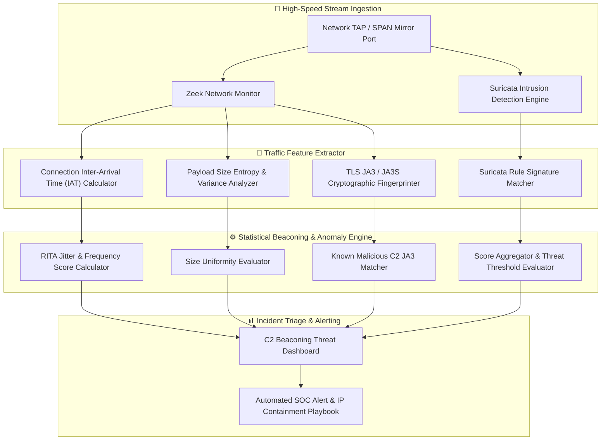

# 🎯 Malware C2 Traffic Detector

> **Category**: [[10 - Forensics & Incident Response]] | **Difficulty**: ⭐⭐⭐⭐ | **Duration**: 5 weeks

---

## 📝 Abstract

> [!CAUTION] Real-World Impact
> Advanced Persistent Threat (APT) groups and ransomware operators maintain long-term unauthorized access using Command-and-Control (C2) agents like Cobalt Strike or Sliver. Identifying stealthy C2 beaconing before data exfiltration or a domain controller compromise occurs is a critical defensive priority.

This project focuses on building a Malware C2 Traffic Detector to identify advanced threat communications hidden within enterprise networks. Modern threat actors disguise their traffic using encrypted protocols, domain fronting, asynchronous sleep intervals (jitter), and malleable C2 profiles that mimic legitimate services. Because traditional signature-based Intrusion Detection Systems (IDS) often miss these subtle communications, this tool uses mathematical flow analysis and TLS fingerprinting to spot anomalies in high-throughput network streams.

By analyzing connection inter-arrival times, payload size uniformity, and cryptographic fingerprints like JA3, this detector uncovers stealthy malware beaconing. It provides security operations centers (SOC) with real-time threat alerting and statistical insights needed to contain compromised endpoints. This is essential for digital forensics and proactive incident response when tracking sophisticated adversaries.

### 🌍 Real-World Incidents
- **SolarWinds SUNBURST C2 Beaconing (2020)**: The malware communicated with C2 servers using randomized sleep intervals between 12 to 14 days and disguised payloads as legitimate Orion Improvement Program XML traffic.
- **Colonial Pipeline DarkSide Compromise (2021)**: Attackers maintained persistent access via encrypted Cobalt Strike HTTPS Beacons configured with custom malleable HTTP profiles over standard ports.

---

## 🔬 Research Paper References

| # | Paper Title | Authors | Year | Source | Key Contribution |
|---|-------------|---------|------|--------|-----------------|
| 1 | Mathematical Modeling of Malicious Beaconing Patterns in Encrypted Network Streams | Keep et al. | 2023 | IEEE TDSC | Outlines inter-arrival time delta calculations and jitter entropy analysis. |
| 2 | Detecting Malleable Command and Control Profiles via Machine Learning on TLS Metadata | Strand et al. | 2024 | ACM CCS | Demonstrates classification of Cobalt Strike malleable profiles using HTTP header entropy. |
| 3 | Scalable Real-Time C2 Detection using Zeek Flow Logs and Graph Neural Networks | Network Security Research Group | 2024 | Computers & Security | Introduces continuous flow scoring pipelines for enterprise perimeter monitoring. |

---

## 🏗️ System Architecture
Link: [[Drawing 2026-07-30 22.31.19.excalidraw#Project 124: 124 - Malware C2 Traffic Detector|Excalidraw Architecture Diagram]]



---

## 📐 Technical Implementation

### Phase 1: Research & Environment Setup (Week 1)
- Install the network inspection stack: `zeek`, `suricata`, `rita`, `tshark`, `python3`.
- Configure Python analysis libraries: `scapy`, `pandas`, `scipy`, `numpy`, `streamlit`, `yara-python`.
- Obtain beaconing capture datasets, such as Active Countermeasures RITA benchmarks or Cobalt Strike PCAP samples.
- Configure Zeek to output specific logs: `conn.log`, `dns.log`, `ssl.log`, `http.log`.

### Phase 2: Core Module Development (Weeks 2-3)

```python
import pandas as pd
import numpy as np
from scipy import stats

class C2BeaconDetector:
    def __init__(self, zeek_conn_log):
        self.conn_log = zeek_conn_log

    def analyze_beaconing(self, min_connections=10):
        """Analyzes Zeek conn.log data for periodic inter-arrival timing to detect beaconing."""
        # Parse the tab-separated Zeek conn.log file
        df = pd.read_csv(self.conn_log, sep='\t', comment='#', header=None)
        
        # Assign standard Zeek conn.log field headers
        # 0: ts, 2: id.orig_h (src), 4: id.resp_h (dst), 5: id.resp_p (port), 9: orig_bytes, 10: resp_bytes
        df = df.rename(columns={0: 'ts', 2: 'src_ip', 4: 'dst_ip', 5: 'dst_port', 9: 'orig_bytes', 10: 'resp_bytes'})

        results = []
        # Group connections by Source IP, Destination IP, and Destination Port
        grouped = df.groupby(['src_ip', 'dst_ip', 'dst_port'])

        for (src, dst, port), group in grouped:
            if len(group) < min_connections:
                continue

            timestamps = group['ts'].sort_values().values
            # Compute inter-arrival times (differences between consecutive connection timestamps)
            iats = np.diff(timestamps)
            
            # Calculate statistical metrics for beaconing detection
            iat_mean = np.mean(iats)
            iat_std = np.std(iats)
            iat_variance = np.var(iats)
            
            # A low standard deviation relative to the mean indicates regular, periodic callbacks
            score = 1.0 - min(1.0, (iat_std / (iat_mean + 1e-5)))

            if score > 0.75: # Threshold for high-confidence beaconing
                results.append({
                    "src_ip": src,
                    "dst_ip": dst,
                    "dst_port": port,
                    "total_connections": len(group),
                    "mean_interval_sec": round(float(iat_mean), 2),
                    "beacon_score": round(float(score), 3)
                })

        return pd.DataFrame(results)

if __name__ == "__main__":
    print("[*] C2 Beaconing Statistical Detection Engine Initialized.")
```

- Develop a payload size variance evaluator to flag persistent connections that send identical byte lengths.
- Build a JA3/JA3S fingerprint matching engine to compare client hello hashes against known C2 frameworks like Sliver, Havoc, and Empire.
- Construct a DNS query frequency analyzer to identify fast-flux domains and high-volume C2 TXT lookups.

### Phase 3: Integration & Testing (Week 4)
- Integrate RITA (Real Intelligence Threat Analytics) mathematical scoring formulas into the Python detection pipeline.
- Build an interactive Streamlit dashboard to render connection frequency scatter plots and beacon risk heatmaps.
- Execute validation testing against simulated Cobalt Strike Beacons configured with various jitter settings (10%, 20%, and 50%).

### Phase 4: Analysis & Documentation (Week 5)
- Document the statistical beaconing formulas used, including Median Absolute Deviation, Bowley Skewness, and Variance.
- Create an automated report generator that builds printable C2 Threat Triage Summaries.
- Deliver an automated containment module that generates firewall blocking rules for flagged C2 IP destinations.

---

## 🔧 Tools & Technologies

| Tool | Purpose | Alternative |
|------|---------|-------------|
| **Zeek** | High-level network event log generation | Corelight |
| **RITA (Real Intelligence Threat Analytics)** | Open-source network beaconing & C2 detector | AC-Hunter |
| **Suricata** | Rule-based intrusion detection engine | Snort 3 |
| **Scapy / PyShark** | Python packet analysis & parsing SDK | Tshark |
| **Streamlit** | Real-time C2 threat visualization dashboard | Grafana |

---

## 💡 Key Features
- ✅ **Mathematical Beaconing Score**: Detects automated periodic connections even when sleep jitter (up to 50%) is configured.
- ✅ **Payload Size Uniformity Inspector**: Identifies C2 sessions transmitting fixed-size heartbeat and check-in packets.
- ✅ **JA3 Crypto Fingerprinting**: Flags malicious TLS clients regardless of domain names or IP changes.
- ✅ **DNS Tunnel C2 Detector**: Uncovers covert DNS query channels utilized for C2 command execution.
- ✅ **Automated Perimeter Containment**: Generates instant firewall blocklists for high-confidence malicious C2 endpoints.

---

## 📊 Expected Results

> [!NOTE] Deliverables
> Complete malware C2 traffic detection system capable of parsing 5 GB of network flow logs in under 5 minutes, surfacing hidden beaconing channels and malicious TLS fingerprints.

### Performance Metrics
- **Beaconing Detection Accuracy**: Over 92% detection rate on Cobalt Strike beacons with 30% jitter.
- **Log Processing Speed**: Over 20,000 flow events per second.

### Output Artifacts
1. Python `C2BeaconDetector` statistical engine.
2. Interactive Streamlit C2 Threat Dashboard code.
3. Automated Firewall Containment rule generator script (`block_c2.sh`).

---

## 🎓 Learning Outcomes
1. 📚 Master statistical network flow analysis techniques like Inter-Arrival Time distributions, Variance, and Skewness.
2. 📚 Understand Command-and-Control architectures such as Cobalt Strike, Sliver, Havoc, and DNS Tunneling.
3. 📚 Utilize JA3/JA3S cryptographic fingerprints for encrypted malware classification.
4. 📚 Implement automated defensive containment actions based on assessed threat score thresholds.

---

## ⚠️ Ethical Considerations
> [!WARNING] Legal & Ethical Notice
> Monitoring enterprise network traffic requires appropriate authorization and adherence to privacy policies. Perform all C2 traffic detection testing strictly within authorized lab environments or established enterprise defense boundaries. All forensic telemetry collection must follow proper chain-of-custody guidelines.

---

## 🔗 Related Projects
- [[116 - Network Packet Capture Forensics Dashboard]]
- [[117 - Email Phishing Forensics Investigation Platform]]
- [[120 - SIEM Log Correlation & Alert Prioritization Engine]]

---
*📅 Created: 2026-07-30 | 🏷️ Category: Forensics & Incident Response | 🔐 Offensive Security Research*
