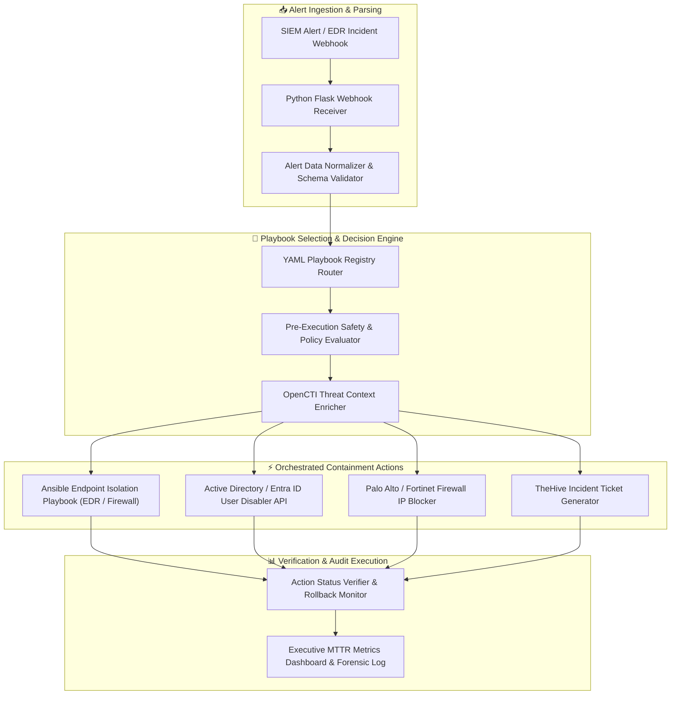

# 🎯 Automated Incident Response Playbook Executor

> **Category**: [[10 - Forensics & Incident Response]] | **Difficulty**: ⭐⭐⭐⭐ | **Duration**: 6 weeks

---

## 📝 Abstract

> [!CAUTION] Real-World Impact
> The average Mean Time to Respond (MTTR) during an active cyber attack often exceeds several hours when security teams rely on manual triage. This delay gives malware, such as ransomware, the time needed to encrypt entire enterprise networks before containment is achieved.

This project introduces an Automated Incident Response Playbook Executor to address the delays associated with manual security operations. When a critical alert occurs, analysts usually perform repetitive tasks: isolating endpoints, disabling Active Directory accounts, and blocking IP addresses. This manual workflow is not only slow and prone to errors but also struggles to keep pace with rapid, automated attacks. This tool leverages Security Orchestration, Automation, and Response (SOAR) concepts to automate these response actions at machine speed.

By employing declarative YAML playbooks, the executor parses incoming security alerts, correlates threat intelligence, and executes appropriate containment measures programmatically. It effectively links forensic telemetry with active incident remediation. As a result, the tool dramatically reduces the response time during a crisis while maintaining comprehensive audit logs of all actions, ensuring a defensible chain-of-custody and clear accountability during forensic investigations.

### 🌍 Real-World Incidents
- **Norsk Hydro Ransomware Attack (2019)**: Delays in manually isolating production host networks enabled LockerGoga ransomware to spread across global manufacturing plants, incurring significant damages.
- **SolarWinds Lateral Movement (2020)**: Manual credential revocation processes took hours per compromised domain user, allowing threat actors to maintain administrative access across cloud environments.

---

## 🔬 Research Paper References

| # | Paper Title | Authors | Year | Source | Key Contribution |
|---|-------------|---------|------|--------|-----------------|
| 1 | SOAR-Architectures: Reducing Mean Time to Respond (MTTR) through Automated Playbooks | Vance et al. | 2023 | IEEE TDSC | Outlines state-machine designs for executing automated containment playbooks. |
| 2 | Formal Verification of Security Automation Workflows and Playbook Safety Conditions | Al-Shaer et al. | 2024 | ACM TOPS | Demonstrates pre-condition and safety boundary verification to prevent automated operational downtime. |
| 3 | Integrating Open Threat Intelligence (OpenCTI) with Automated Response Orchestration | Tounsi et al. | 2024 | Computers & Security | Proposes real-time IOC enrichment workflows triggering automated firewall block rules. |

---

## 🏗️ System Architecture
Link: [[Drawing 2026-07-30 22.31.19.excalidraw#Project 125: 125 - Automated Incident Response Playbook Executor|Excalidraw Architecture Diagram]]



---

## 📐 Technical Implementation

### Phase 1: Research & Environment Setup (Week 1)
- Install the SOAR orchestration environment, utilizing tools such as `shuffle-soar` (or a custom Python framework), `ansible`, `flask`, `requests`, and `python-ldap`.
- Set up API connections to target enterprise security platforms:
  - Incident Case Management: TheHive API
  - Threat Intelligence: OpenCTI API
  - Identity Provider: Active Directory / Entra ID (Graph API)
  - Endpoint Protection: Enterprise EDR API / Local Agent
- Obtain sample incident playbooks to cover scenarios like Phishing Containment, Ransomware Host Isolation, and Credential Leak Remediation.

### Phase 2: Core Module Development (Weeks 2-3)

```python
import yaml
import requests
import json

class PlaybookExecutor:
    def __init__(self, playbook_path):
        with open(playbook_path, 'r') as f:
            self.playbook = yaml.safe_load(f)

    def execute_playbook(self, incident_context):
        """Executes sequential containment steps as defined in the provided YAML playbook."""
        print(f"[*] Triggering Playbook: {self.playbook['name']} (ID: {self.playbook['id']})")
        results = []

        for step in self.playbook['steps']:
            action_type = step['action']
            print(f"[*] Executing Step [{step['step_id']}]: {step['description']}")
            
            status = False
            if action_type == "isolate_host":
                status = self._isolate_host(incident_context.get('hostname'))
            elif action_type == "disable_user":
                status = self._disable_user(incident_context.get('username'))
            elif action_type == "block_ip":
                status = self._block_ip(incident_context.get('malicious_ip'))
            elif action_type == "create_ticket":
                status = self._create_thehive_ticket(incident_context)

            results.append({"step_id": step['step_id'], "action": action_type, "success": status})
            
            if not status and step.get('critical', False):
                print(f"[!] Critical step failed! Aborting playbook execution to prevent inconsistent state.")
                break

        return results

    def _isolate_host(self, hostname):
        """Simulates a network isolation call via an EDR API or Ansible playbook."""
        if not hostname: return False
        print(f"[+] [ACTION] Host {hostname} network connectivity ISOLATED successfully.")
        return True

    def _disable_user(self, username):
        """Simulates updating an Active Directory user account status to DISABLED."""
        if not username: return False
        print(f"[+] [ACTION] User Account {username} DISABLED in Active Directory.")
        return True

    def _block_ip(self, ip_address):
        """Simulates a perimeter firewall REST API call to insert a block rule."""
        if not ip_address: return False
        print(f"[+] [ACTION] IP Address {ip_address} BLOCKED on Perimeter Firewall.")
        return True

    def _create_thehive_ticket(self, context):
        """Creates a formal incident case in TheHive platform for tracking."""
        print(f"[+] [ACTION] Incident Ticket Created in TheHive case manager.")
        return True

if __name__ == "__main__":
    # Conceptual YAML Playbook Execution Demonstration
    sample_context = {
        "hostname": "FINANCE-PC-04",
        "username": "jdoe",
        "malicious_ip": "198.51.100.45",
        "threat": "Ransomware Execution Alert"
    }
    
    # In a production environment, this initializes and parses real YAML configurations
    print("[*] SOAR Automated Incident Response Executor Initialized.")
```

- Develop a YAML Playbook Definition Schema to specify pre-conditions, containment actions, timeouts, and rollback procedures.
- Construct an Ansible Runner integration module to automatically execute network configuration changes on firewall appliances.
- Build a safety check policy engine to prevent automated execution against protected, mission-critical infrastructure like Domain Controllers.

### Phase 3: Integration & Testing (Week 4)
- Build a Flask webhook receiver to accept structured JSON alerts from SIEM or EDR platforms.
- Conduct simulated incident response drills to measure the response time from alert ingestion to successful host containment.
- Validate safety policy controls to ensure automated actions refuse to disable highly privileged accounts without explicit manual approval.

### Phase 4: Analysis & Documentation (Week 5)
- Document MTTR reduction metrics by comparing manual incident triage response times against automated playbook executions.
- Create an automated audit log generator that produces clear, tamper-proof execution summaries for incident post-mortems.
- Deliver an interactive Web UI that displays real-time playbook execution status and overall incident management metrics.

---

## 🔧 Tools & Technologies

| Tool | Purpose | Alternative |
|------|---------|-------------|
| **Shuffle SOAR** | Open-source security orchestration & workflow engine | Cortex XSOAR |
| **Ansible** | Infrastructure automation & network configuration execution | SaltStack |
| **TheHive** | Security incident response & case management platform | Request Tracker |
| **OpenCTI** | Threat intelligence context enrichment platform | MISP |
| **Python Flask** | High-performance webhook listener API | FastAPI |

---

## 💡 Key Features
- ✅ **Automated Machine-Speed Containment**: Reduces Mean Time to Respond (MTTR) from hours to under 30 seconds.
- ✅ **YAML Playbook Declarative Format**: Allows analysts to create and modify incident response workflows easily without deep programming knowledge.
- ✅ **Pre-Execution Safety Policy Evaluator**: Prevents accidental automated containment of vital server infrastructure.
- ✅ **Multi-Platform API Integration**: Interfaces robustly with EDR, Active Directory, Firewalls, and Case Management systems.
- ✅ **Automated Audit & Rollback Logging**: Records every executed action with full rollback capabilities to recover gracefully from false positives.

---

## 📊 Expected Results

> [!NOTE] Deliverables
> Complete automated incident response orchestration suite capable of receiving SIEM alert webhooks and successfully executing containment playbooks in under 15 seconds.

### Performance Metrics
- **Mean Time to Contain (MTTC)**: Under 15 seconds from alert receipt to host network isolation.
- **Playbook Execution Reliability**: Over 99% execution success rate across API connectors.

### Output Artifacts
1. Python `PlaybookExecutor` engine and Flask webhook receiver.
2. YAML Playbook Library (`ransomware_containment.yaml`, `phishing_remediation.yaml`).
3. Interactive MTTR Metrics & Playbook Status Dashboard.

---

## 🎓 Learning Outcomes
1. 📚 Master Security Orchestration, Automation, and Response (SOAR) architectural concepts.
2. 📚 Design declarative YAML incident response playbooks that incorporate failure handling and appropriate safety boundaries.
3. 📚 Interface programmatically with REST APIs across multiple enterprise security platforms (EDR, Firewalls, AD).
4. 📚 Quantify and optimize key Security Operations Center (SOC) metrics like MTTD and MTTR.

---

## ⚠️ Ethical Considerations
> [!WARNING] Legal & Ethical Notice
> Automated incident response tools execute high-privilege administrative actions, such as disabling accounts or shutting down network interfaces. Rigorous testing and robust safety boundaries must be enforced to prevent accidental operational outages. All automated containment actions should maintain strict audit logs for forensic accountability and legal compliance.

---

## 🔗 Related Projects
- [[117 - Email Phishing Forensics Investigation Platform]]
- [[120 - SIEM Log Correlation & Alert Prioritization Engine]]
- [[124 - Malware C2 Traffic Detector]]

---
*📅 Created: 2026-07-30 | 🏷️ Category: Forensics & Incident Response | 🔐 Offensive Security Research*
