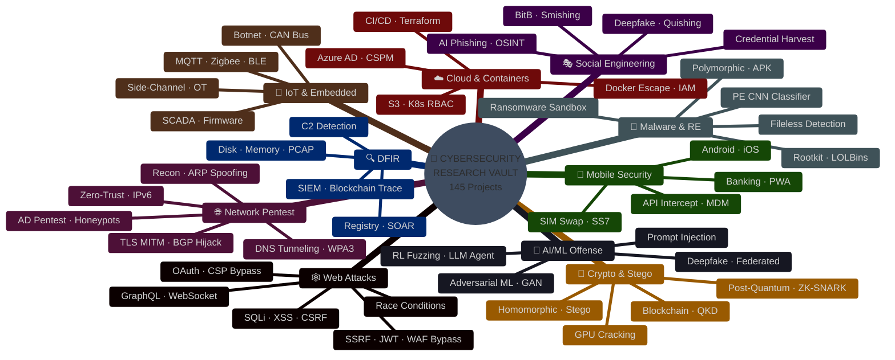

<div align="center">


<br>


<br>


</div>

---

<div align="center">

### 👋 what this actually is

</div>

look — this isn't a polished portfolio. this is **three years of breaking things in VMs at 3am**, reading RFCs nobody asked me to read, and slowly figuring out how security actually works — not how textbooks say it works.

some of these projects are clean. some are rough. some i rewrote three times. that's the point — this is the actual research trail, not the highlight reel.

```
me in year 1:   "how does a port scanner even work?"
me in year 2:   "let me build a ransomware sandbox and trace C2 traffic"
me in year 3:   "what if i use reinforcement learning for fuzzing
                 and train a GAN to generate malware samples?"
```

yeah. it escalated.

---

<div align="center">

### 🗺️ the attack surface map

</div>



---

<div align="center">

### 📂 repo structure

</div>

```
cybersecurity-vault/
│
├── 🔬 CYBER SECURITY/                              ← Advanced Research (125 Projects)
│   ├── 📋 00 - Offensive Security Project Index
│   ├── 🕸️ 01 - Web Application Attacks/             [15 projects · 001–015]
│   ├── 🌐 02 - Network Penetration Testing/          [15 projects · 016–030]
│   ├── 🦠 03 - Malware Analysis & Reverse Eng/       [15 projects · 031–045]
│   ├── 📡 04 - IoT & Embedded Security/              [13 projects · 046–058]
│   ├── ☁️ 05 - Cloud & Container Security/            [12 projects · 059–070]
│   ├── 🎭 06 - Social Engineering & Phishing/         [12 projects · 071–082]
│   ├── 🔐 07 - Cryptography & Steganography/          [10 projects · 083–092]
│   ├── 📱 08 - Mobile Security/                       [10 projects · 093–102]
│   ├── 🤖 09 - AI & ML in Offensive Security/         [11 projects · 103–113]
│   └── 🔍 10 - Forensics & Incident Response/         [12 projects · 114–125]
│
├── 🔧 basic project/                               ← Foundational Work (20 Projects)
│   ├── 📋 00 - Basic Cybersecurity Projects Index
│   └── Projects 001–020 (FIM, scanners, crypto, stego, detection)
│
├── 🎨 Excalidraw/                                   ← Architecture Diagrams
└── 📄 README.md                                     ← you are here
```

---

<div align="center">

### ⚔️ the 10 domains — full project listing

*click any domain to expand*

</div>

<!-- ═══════════════════════ DOMAIN 01 ═══════════════════════ -->

<details>
<summary>

&nbsp;&nbsp;🕸️&nbsp; <b>01 — Web Application Attacks</b> &nbsp;│&nbsp; <code>15 Projects</code> &nbsp;│&nbsp; <i>the stuff that got me hooked</i>

</summary>

<br>

> this is where it all started. the first time i understood SQL injection — not the meme, but the actual AST parsing and why parameterized queries stop it — something clicked. then it snowballed.

<div align="center">

| # | Project | What It Actually Does |
|:---:|---------|---------|
| `001` | **SQL Injection Detection & Prevention** | automated AST parsing — catches injections that WAFs miss |
| `002` | **XSS Payload Generator** | context-aware encoding, polyglot payloads across injection points |
| `003` | **CSRF Token Analyzer & Bypass** | validates CSRF defenses in real workflows, tests bypass paths |
| `004` | **SSRF Scanner** | catches apps leaking access to internal cloud metadata endpoints |
| `005` | **API Security Testing Platform** | REST/SOAP auth testing, rate-limiting gaps, exposed data |
| `006` | **JWT Vulnerability Assessment** | key confusion, signature bypass, algorithm switching attacks |
| `007` | **WAF Bypass Analyzer** | payload mutation engine — tests if your WAF rules actually hold up |
| `008` | **Broken Access Control Detector** | IDOR hunting, horizontal/vertical privilege escalation (OWASP #1) |
| `009` | **GraphQL Security Audit** | introspection abuse, query depth bombs, batching attacks |
| `010` | **WebSocket Security Suite** | full-duplex hijacking, frame manipulation, origin validation |
| `011` | **Browser Extension Analyzer** | manifest parsing, background script permission auditing |
| `012` | **CSP Bypass Research Tool** | finding script gadgets that bypass content security policies |
| `013` | **Race Condition Detector** | async HTTP racing — bugs that only appear under concurrency |
| `014` | **Prototype Pollution Detection** | tracing recursive object merges in Node.js |
| `015` | **OAuth 2.0 Flow Scanner** | redirect URI validation, state parameter checks, grant misuse |

</div>

</details>

<!-- ═══════════════════════ DOMAIN 02 ═══════════════════════ -->

<details>
<summary>

&nbsp;&nbsp;🌐&nbsp; <b>02 — Network Penetration Testing</b> &nbsp;│&nbsp; <code>15 Projects</code> &nbsp;│&nbsp; <i>where packets tell stories</i>

</summary>

<br>

> networks are beautiful when you understand them. and terrifying when you realize how much trust is just... assumed at every layer.

<div align="center">

| # | Project | What It Actually Does |
|:---:|---------|---------|
| `016` | **Network Recon Framework** | async port scanning with service banner → known vuln correlation |
| `017` | **ARP Spoofing Detection** | watches ethernet frames and ARP cache for poisoning attempts |
| `018` | **DNS Tunneling Detection (ML)** | uses ML on subdomain entropy to find covert data channels |
| `019` | **WPA3 Security Assessment** | SAE Dragonfly handshake side-channel timing analysis |
| `020` | **TLS/SSL MITM Detection** | X.509 chain validation, certificate pinning audit engine |
| `021` | **Traffic Anomaly Detection** | deep autoencoders learn "normal" traffic, flag zero-day deviations |
| `022` | **BGP Hijacking Framework** | prefix hijacking simulation, RPKI origin validation testing |
| `023` | **Port Knocking Auth System** | single packet authorization — firewall shows zero open ports |
| `024` | **VPN Leak Analyzer** | catches DNS, IPv6, and WebRTC leaks that defeat your VPN |
| `025` | **AD Pentesting Automation** | kerberoasting, AS-REP roasting, BloodHound attack path mapping |
| `026` | **SMB Vulnerability Scanner** | SMB protocol security checks, patch verification chains |
| `027` | **Zero-Trust Validator** | microsegmentation boundary testing, mTLS enforcement gaps |
| `028` | **IPv6 Security Assessment** | ICMPv6 RA attacks, NDP cache poisoning simulation |
| `029` | **SDN Controller Testing** | OpenFlow topology poisoning, TCAM table saturation |
| `030` | **Honeypot Platform** | containerized decoy services capturing real attack telemetry |

</div>

> spent weeks on the BGP hijacking one. understanding how the internet's routing works — and how it can be subverted — changed how i think about infrastructure trust.

</details>

<!-- ═══════════════════════ DOMAIN 03 ═══════════════════════ -->

<details>
<summary>

&nbsp;&nbsp;🦠&nbsp; <b>03 — Malware Analysis & Reverse Engineering</b> &nbsp;│&nbsp; <code>15 Projects</code> &nbsp;│&nbsp; <i>the rabbit hole that humbled me</i>

</summary>

<br>

> malware authors are clever. reverse engineering forces you to think in assembly, understand OS internals, and question every API call. this domain humbled me the most.

<div align="center">

| # | Project | What It Actually Does |
|:---:|---------|---------|
| `031` | **PE Header CNN Classifier** | converts PE headers to grayscale images → CNN malware classification |
| `032` | **Ransomware Behavior Sandbox** | I/O frequency tracking, shadow copy deletion, canary file triggers |
| `033` | **Fileless Malware Detection** | Volatility memory analysis for process hollowing, DLL injection |
| `034` | **Dynamic API Call Tracer** | hooks user-mode APIs, traces Win32 syscall sequences |
| `035` | **Polymorphic Malware Detection** | control flow graph mining for code-morphing malware |
| `036` | **Android APK Scanner** | smali bytecode + AndroidManifest permission abuse analysis |
| `037` | **ELF Exploit Detector** | checks Linux binaries for NX, ASLR, RELRO, stack canary |
| `038` | **Rootkit Detection Framework** | sys_call_table integrity verification, DKOM detection |
| `039` | **Malware Unpacker** | section entropy analysis, original entry point recovery |
| `040` | **PE Anomaly Classifier** | random forest on static PE features — surprisingly effective |
| `041` | **Office Macro Scanner** | VBA stream extraction + heuristic shellcode detection |
| `042` | **Firmware Backdoor Detector** | binwalk extraction + hardcoded credential scanning |
| `043` | **Cryptojacking Detector** | WASM CPU monitoring + WebSocket mining pool detection |
| `044` | **Adversarial IDS Evasion** | gradient-based perturbation to fool ML intrusion detection |
| `045` | **LOLBin Abuse Detector** | catches malicious use of legitimate Windows system binaries |

</div>

> project 031 was a turning point. converting binary structures into images for neural networks — it bridged two worlds i was interested in.

</details>

<!-- ═══════════════════════ DOMAIN 04 ═══════════════════════ -->

<details>
<summary>

&nbsp;&nbsp;📡&nbsp; <b>04 — IoT & Embedded Security</b> &nbsp;│&nbsp; <code>13 Projects</code> &nbsp;│&nbsp; <i>firmware dumps at midnight</i>

</summary>

<br>

> IoT devices ship with terrible security. i wanted to understand exactly how terrible. turns out: very.

<div align="center">

| # | Project | What It Actually Does |
|:---:|---------|---------|
| `046` | **IoT Botnet Detector** | network flow distribution analysis + C2 entropy profiling |
| `047` | **Smart Home Vuln Audit** | tests local APIs and cloud sync mechanisms of smart devices |
| `048` | **CAN Bus IDS** | SocketCAN frame monitoring for ECU ID anomalies in vehicles |
| `049` | **MQTT Security Tester** | broker auth fuzzing, topic authorization, payload injection |
| `050` | **Zigbee/Z-Wave Simulator** | 802.15.4 frame capture, wireless key exchange analysis |
| `051` | **Firmware Extraction Pipeline** | flash dump → filesystem unpack → Ghidra headless audit |
| `052` | **BLE MITM Tool** | GATT service discovery + characteristic value tampering |
| `053` | **SCADA/ICS Security Platform** | Modbus TCP and DNP3 industrial protocol register audits |
| `054` | **Default Credential Scanner** | automated telnet/SSH testing against known IoT defaults |
| `055` | **Smart Grid FDI Simulator** | power system state estimation vector modification |
| `056` | **LoRaWAN Security Audit** | DevNonce replay attacks, MIC integrity testing |
| `057` | **Side-Channel Attack Demo** | differential power analysis (DPA) on microcontrollers |
| `058` | **OT Segmentation Validator** | Purdue Model IT/OT zone boundary policy verification |

</div>

> the SCADA one kept me up at night. industrial systems running power plants have security from a different era. and they're still running.

</details>

<!-- ═══════════════════════ DOMAIN 05 ═══════════════════════ -->

<details>
<summary>

&nbsp;&nbsp;☁️&nbsp; <b>05 — Cloud & Container Security</b> &nbsp;│&nbsp; <code>12 Projects</code> &nbsp;│&nbsp; <i>attacking abstractions</i>

</summary>

<br>

> cloud security is weird — no physical server to touch. everything is APIs, IAM policies, and misconfiguration. one wrong JSON policy and you've exposed everything.

<div align="center">

| # | Project | What It Actually Does |
|:---:|---------|---------|
| `059` | **S3 Misconfiguration Scanner** | public ACL detection, bucket policy analysis, secret scanning |
| `060` | **K8s RBAC Detector** | ClusterRole binding graphs → privilege escalation path discovery |
| `061` | **Docker Escape Detection** | eBPF monitoring for cgroup release_agent and runc escapes |
| `062` | **IAM Over-Privilege Analyzer** | CloudTrail usage vs. granted permissions comparison |
| `063` | **Serverless Injection Simulator** | event payload injection testing on Lambda functions |
| `064` | **CI/CD Security Audit** | GitHub Actions AST analysis for unpinned actions |
| `065` | **Multi-Cloud CSPM** | CIS benchmark compliance across AWS, Azure, GCP |
| `066` | **Container Scanner Benchmark** | Trivy vs. Grype vs. Clair across real image layers |
| `067` | **Exfiltration Detection** | Isolation Forest anomaly detection on CloudTrail API logs |
| `068` | **Terraform IaC Linter** | OPA Rego policy evaluation on HCL infrastructure plans |
| `069` | **Azure AD Attack Paths** | MS Graph API harvesting → service principal attack mapping |
| `070` | **API Key Leak Detector** | real-time git commit scanning for high-entropy secrets |

</div>

> project 062 was eye-opening. most cloud accounts grant 10x more IAM permissions than what's actually used. that gap is how breaches happen.

</details>

<!-- ═══════════════════════ DOMAIN 06 ═══════════════════════ -->

<details>
<summary>

&nbsp;&nbsp;🎭&nbsp; <b>06 — Social Engineering & Phishing</b> &nbsp;│&nbsp; <code>12 Projects</code> &nbsp;│&nbsp; <i>the hardest vulnerability to patch is human</i>

</summary>

<br>

> the best firewall in the world doesn't help when someone clicks a link they shouldn't have. this section is about understanding — and defending against — human-layer attacks.

<div align="center">

| # | Project | What It Actually Does |
|:---:|---------|---------|
| `071` | **AI Spear Phishing Tester** | generates contextual phishing emails for awareness programs |
| `072` | **Phishing URL Detector (DL)** | 1D CNN + Bi-LSTM lexical URL classification |
| `073` | **Deepfake Voice Detector** | MFCC feature analysis to identify synthetic audio |
| `074` | **Quishing Detector** | QR code decoding + headless browser redirect chain following |
| `075` | **OSINT Framework** | public metadata aggregation → target vulnerability profiling |
| `076` | **Rubber Ducky Analyzer** | HID attack detection via keystroke timing analysis |
| `077` | **Email Header Forensics** | SPF, DKIM, DMARC alignment validation engine |
| `078` | **BitB Attack Detector** | DOM mutation monitoring for fake browser-in-browser iframes |
| `079` | **Smishing Detector** | DistilBERT intent classification for SMS phishing |
| `080` | **Credential Harvest Shield** | FIDO2 WebAuthn binding + AiTM proxy detection |
| `081` | **Watering Hole Detector** | multi-egress crawler monitoring for drive-by injections |
| `082` | **Security Awareness Platform** | GoPhish webhooks + gamified micro-learning modules |

</div>

> the BitB detector (078) came from me falling for a BitB attack in a CTF. i thought the login popup was real. it wasn't. built the detector out of spite.

</details>

<!-- ═══════════════════════ DOMAIN 07 ═══════════════════════ -->

<details>
<summary>

&nbsp;&nbsp;🔐&nbsp; <b>07 — Cryptography & Steganography</b> &nbsp;│&nbsp; <code>10 Projects</code> &nbsp;│&nbsp; <i>the math underneath everything</i>

</summary>

<br>

> every security mechanism eventually comes down to crypto. i wanted to understand the primitives — not just call library functions and hope for the best.

<div align="center">

| # | Project | What It Actually Does |
|:---:|---------|---------|
| `083` | **Image Steganalysis (CNN)** | SRM filtering + deep residual networks for hidden data detection |
| `084` | **Post-Quantum Crypto Benchmark** | Kyber/Dilithium vs RSA/ECC — benchmarking the quantum transition |
| `085` | **Blockchain Document Verifier** | Solidity contracts with Merkle tree hash anchoring |
| `086` | **Homomorphic Encryption Tester** | MS SEAL BFV/CKKS scheme performance evaluation |
| `087` | **CT Log Monitor** | certificate transparency stream ingestion + homograph detection |
| `088` | **Password Cracking Engine** | custom rainbow tables + Hashcat GPU optimization |
| `089` | **ZK-SNARK Auth System** | Groth16 zero-knowledge proof for passwordless authentication |
| `090` | **QKD Simulation** | Qiskit BB84 protocol with eavesdropping detection via error rates |
| `091` | **Audio Steganography Detector** | STFT spectrum analysis for frequency-domain data hiding |
| `092` | **Secure MPC Protocol** | Shamir secret sharing + Yao's garbled circuits |

</div>

> simulating BB84 (090) and watching the error rate spike the moment an eavesdropper is present — physics and cryptography colliding. favorite project to build.

</details>

<!-- ═══════════════════════ DOMAIN 08 ═══════════════════════ -->

<details>
<summary>

&nbsp;&nbsp;📱&nbsp; <b>08 — Mobile Security</b> &nbsp;│&nbsp; <code>10 Projects</code> &nbsp;│&nbsp; <i>the computer in everyone's pocket</i>

</summary>

<br>

> mobile has its own world — different architectures, permission models, telecom protocols from the 1970s still in use.

<div align="center">

| # | Project | What It Actually Does |
|:---:|---------|---------|
| `093` | **Android Malware Detector** | permission correlation matrix → Random Forest classification |
| `094` | **iOS Binary Scanner** | Mach-O parsing for missing ASLR, ARC, banned APIs |
| `095` | **Mobile API Interceptor** | Frida SSL pinning bypass + mitmproxy traffic analysis |
| `096` | **SIM Swap Detector** | CAMARA API integration for real-time SIM swap risk scoring |
| `097` | **Mobile Banking Auditor** | OWASP MASVS compliance + root/jailbreak detection |
| `098` | **Intent Hijacking Detector** | Android intent filter parsing + dynamic IPC redirect testing |
| `099` | **MDM Bypass Analyzer** | SCEP enrollment integrity + MDM profile enforcement checks |
| `100` | **SS7/Diameter Vuln Demo** | telecom signaling protocol security research |
| `101` | **App Tamper Detector** | smali code hashing + native runtime integrity verification |
| `102` | **PWA Security Suite** | service worker cache poisoning + manifest scope validation |

</div>

> the SS7 research (100) was disturbing. protocols routing your phone calls — designed in the 1970s, zero authentication, still in use today.

</details>

<!-- ═══════════════════════ DOMAIN 09 ═══════════════════════ -->

<details>
<summary>

&nbsp;&nbsp;🤖&nbsp; <b>09 — AI & ML in Offensive Security</b> &nbsp;│&nbsp; <code>11 Projects</code> &nbsp;│&nbsp; <i>weaponizing intelligence</i>

</summary>

<br>

> this is where my ML interest and security obsession merged. the question: can machine learning be both the attacker and the defender? (answer: yes, and that's terrifying.)

<div align="center">

| # | Project | What It Actually Does |
|:---:|---------|---------|
| `103` | **Adversarial ML on IDS** | evasion perturbations that bypass neural network intrusion detection |
| `104` | **GAN Malware Generator** | GANs that mutate PE file structural features |
| `105` | **Automated Exploit Generation** | angr symbolic execution + Z3 constraint solving → ROP chains |
| `106` | **Prompt Injection Toolkit** | direct/indirect prompt injection testing on AI applications |
| `107` | **RL Fuzzing Engine** | PPO agent learning optimal AFL++ mutator strategies |
| `108` | **Model Poisoning Simulator** | clean-label poisoning + backdoor trigger injection |
| `109` | **Vuln Prioritization System** | ML scoring combining EPSS + CVSS + live threat feeds |
| `110` | **Deepfake Ops Toolkit** | voice cloning, lip-sync generation, spectral detection |
| `111` | **Threat Intel NLP** | fine-tuned SecBERT extracting STIX 2.1 IoCs from dark web |
| `112` | **Federated Learning Attacks** | gradient inversion that extracts training data from FL updates |
| `113` | **LLM Pentest Agent** | LangChain orchestrating Nmap/Metasploit RPC autonomously |

</div>

> project 113 is the one i'm most excited about — an LLM that can run recon, find vulns, and suggest exploits. this is where security testing is heading.

</details>

<!-- ═══════════════════════ DOMAIN 10 ═══════════════════════ -->

<details>
<summary>

&nbsp;&nbsp;🔍&nbsp; <b>10 — Forensics & Incident Response</b> &nbsp;│&nbsp; <code>12 Projects</code> &nbsp;│&nbsp; <i>what happens after the breach</i>

</summary>

<br>

> offense gets the attention, but IR is where it actually matters. when something goes wrong, you need to know exactly what happened, when, and how to contain it.

<div align="center">

| # | Project | What It Actually Does |
|:---:|---------|---------|
| `114` | **Disk Forensics Timeline** | Sleuth Kit partition analysis + super-timeline generation |
| `115` | **Memory Dump Analyzer** | Volatility 3 — malfind, driver scans, process artifact extraction |
| `116` | **PCAP Forensics Dashboard** | Zeek + Suricata log correlation for packet investigation |
| `117` | **Email Phishing Forensics** | header parsing, SPF/DKIM validation, attachment pipeline |
| `118` | **Browser Artifact Extractor** | SQLite parsing for Chrome/Firefox history, cookies, cache |
| `119` | **Ransomware Blockchain Tracer** | Bitcoin transaction clustering to trace ransom payments |
| `120` | **SIEM Correlation Engine** | Sigma rule evaluation on Elasticsearch log streams |
| `121` | **Chain of Custody Blockchain** | smart contract hash logging for evidence integrity |
| `122` | **Registry Forensics Automation** | hive parsing — persistence keys, UserAssist, MRU lists |
| `123` | **Cloud Snapshot Analyzer** | EC2/Azure snapshot mounting + forensic artifact extraction |
| `124` | **C2 Traffic Detector** | beaconing frequency analysis + TLS JA3 fingerprint matching |
| `125` | **SOAR Playbook Executor** | automated IR — IP isolation, account lockout, containment |

</div>

> the blockchain tracer (119) was financial detective work — clustering algorithms that de-anonymize Bitcoin wallets used for ransomware payments.

</details>

---

<div align="center">

### 🔧 the foundation layer

</div>

before the advanced stuff, i built 20 basic projects to make sure i actually understood the fundamentals. no shortcuts.

<details>
<summary>

&nbsp;&nbsp;🧱&nbsp; <b>Basic Cybersecurity Projects</b> &nbsp;│&nbsp; <code>20 Projects</code> &nbsp;│&nbsp; <i>where everything started</i>

</summary>

<br>

> simple by design. each one teaches a core concept that the advanced projects build on.

<div align="center">

| # | Project | Core Concept |
|:---:|---------|:---:|
| `001` | File Integrity Monitor (SHA-256) | hashing & integrity |
| `002` | Port Scanner & Banner Grabber | reconnaissance |
| `003` | ARP Poisoning Detection | layer 2 trust |
| `004` | Password Strength Checker & Hash Cracker | authentication |
| `005` | Phishing URL Detector | domain heuristics |
| `006` | Packet Sniffer & HTTP Analyzer | traffic analysis |
| `007` | LSB Image Steganography | data hiding |
| `008` | Directory Bruteforce Scanner | web recon |
| `009` | Keylogger Detection & Process Monitor | endpoint security |
| `010` | SQL Injection Test Script | injection basics |
| `011` | Encrypted Password Manager CLI | applied crypto |
| `012` | Log File Anomaly Scanner | pattern detection |
| `013` | DNS Lookup & Subdomain Finder | DNS recon |
| `014` | Reflected XSS Scanner | output encoding |
| `015` | Wi-Fi Saved Password Extractor | credential audit |
| `016` | Encrypted Socket Chat Application | crypto + networking |
| `017` | HTTP Security Headers Checker | hardening |
| `019` | Network Ping Sweep & Host Discovery | network mapping |
| `020` | USB Auto-Run Infection Prevention | endpoint defense |

</div>

</details>

---

<div align="center">

### 🛠️ what i work with

</div>

<table align="center">
<tr>
<td align="center"><b>Languages</b></td>
<td align="center"><b>ML / AI</b></td>
<td align="center"><b>Security</b></td>
<td align="center"><b>Infrastructure</b></td>
</tr>
<tr>
<td align="center">

`Python` `C/C++`<br>`Bash` `JavaScript`<br>`Solidity`

</td>
<td align="center">

`PyTorch` `TensorFlow`<br>`scikit-learn`<br>`LangChain` `SecBERT`

</td>
<td align="center">

`Metasploit` `Nmap`<br>`Burp` `Frida`<br>`Ghidra` `Volatility`

</td>
<td align="center">

`AWS` `Azure` `GCP`<br>`Docker` `Kubernetes`<br>`Terraform`

</td>
</tr>
</table>

<br>

<div align="center">

*but honestly — the most important tools were a VM, a terminal, and patience.*

</div>

---

<div align="center">

### 🔄 how i approach each project

```mermaid
%%{init: {'theme': 'dark', 'themeVariables': {'primaryColor': '#00ff9d', 'primaryTextColor': '#c9d1d9', 'primaryBorderColor': '#00d4aa', 'lineColor': '#00d4aa', 'secondaryColor': '#161b22', 'tertiaryColor': '#0d1117'}}}%%
flowchart LR
    A["🤔 Find something<br/>I don't understand"] --> B["📚 Read everything<br/>RFCs, papers, docs"]
    B --> C["🔨 Build a small<br/>experiment"]
    C --> D["💥 It breaks or<br/>surprises me"]
    D --> E["🔁 Debug, research,<br/>try again"]
    E --> F["💡 It clicks —<br/>document it"]
    F --> G["🛡️ Think about<br/>the defense"]

    style A fill:#0d1117,stroke:#00ff9d,stroke-width:2px,color:#c9d1d9
    style B fill:#0d1117,stroke:#00d4aa,stroke-width:2px,color:#c9d1d9
    style C fill:#0d1117,stroke:#7c3aed,stroke-width:2px,color:#c9d1d9
    style D fill:#0d1117,stroke:#f97316,stroke-width:2px,color:#c9d1d9
    style E fill:#0d1117,stroke:#eab308,stroke-width:2px,color:#c9d1d9
    style F fill:#0d1117,stroke:#06b6d4,stroke-width:2px,color:#c9d1d9
    style G fill:#0d1117,stroke:#00ff9d,stroke-width:2px,color:#c9d1d9
```

</div>



<div align="center">

*that last step matters the most. offense informs defense. you can't protect what you don't understand how to break.*

</div>

---

<div align="center">

### 📊 stats

</div>

<div align="center">

```
╭─────────────────────────────────────────────────────╮
│                                                     │
│   🕸️  Web Attacks ·········· 15    📡 IoT ········ 13  │
│   🌐  Network ·············· 15    ☁️  Cloud ······ 12  │
│   🦠  Malware & RE ········· 15    🎭 Social Eng · 12  │
│   🔐  Crypto ··············· 10    📱 Mobile ····· 10  │
│   🤖  AI/ML Offense ········ 11    🔍 DFIR ······· 12  │
│                                                     │
│   🔧  Basic Projects ······· 20                      │
│   ───────────────────────────────                    │
│   📦  TOTAL ················ 145                      │
│                                                     │
╰─────────────────────────────────────────────────────╯
```

</div>

---

<div align="center">

### 🧪 the honest part

</div>

some of these projects are rough. not every experiment produced clean results. some sandboxes crashed. some ML models barely beat random. some attacks only worked under very specific conditions.

**i kept those in the repo too.**

because a clean success shows *what worked* — but a documented failure shows *why something didn't work*. and that's often more valuable.

```
progress > perfection

a working exploit taught me offense.
a failed detection taught me defense.
a broken sandbox taught me engineering.
```

| Tag | Meaning |
|:---:|---|
| 🟢 | **Complete** — research, code, and documentation done |
| 🔵 | **Active** — currently building or testing |
| 🟡 | **Experimental** — results still being evaluated |
| 🟠 | **Paused** — hit a wall, will come back to it |
| ⚪ | **Archived** — keeping for reference |

---

<div align="center">

### ⚠️ ethics & usage

</div>

everything here was built and tested in **controlled environments** — virtual machines, lab networks, CTFs, and authorized targets.

<table align="center">
<tr>
<td align="center"><b>✅ Do</b></td>
<td align="center"><b>❌ Don't</b></td>
</tr>
<tr>
<td>

Test on systems you own<br>
Use in lab/VM environments<br>
Practice on CTF platforms<br>
Learn defensive engineering<br>
Research responsibly

</td>
<td>

Attack unauthorized systems<br>
Distribute malware<br>
Steal data or credentials<br>
Conduct surveillance<br>
Anything illegal

</td>
</tr>
</table>

<br>

<div align="center">

*test legally. break only what you have permission to break. if you're unsure — don't.*

</div>

---

<div align="center">

### 🧭 why this is public

</div>

<table align="center">
<tr>
<td>🎯</td>
<td><b>Accountability</b> — putting work out there forces you to actually finish and document it</td>
</tr>
<tr>
<td>📖</td>
<td><b>Learning in public</b> — maybe someone's stuck on the same thing i was, and my notes help</td>
</tr>
<tr>
<td>🔬</td>
<td><b>Proof of work</b> — not certificates, not badges — actual projects that show understanding</td>
</tr>
</table>

---

<div align="center">

<br>

```
┌────────────────────────────────────────────────────┐
│                                                    │
│   hardik roy                                       │
│   BTech · Cybersecurity Engineering                │
│                                                    │
│   understand it. break it. fix it. document it.    │
│                                                    │
└────────────────────────────────────────────────────┘
```

<br>

*this repo is a research trail — not a product.*
*some of it is clean. some of it is messy. all of it is real.*

<br>


<br>


</div>
