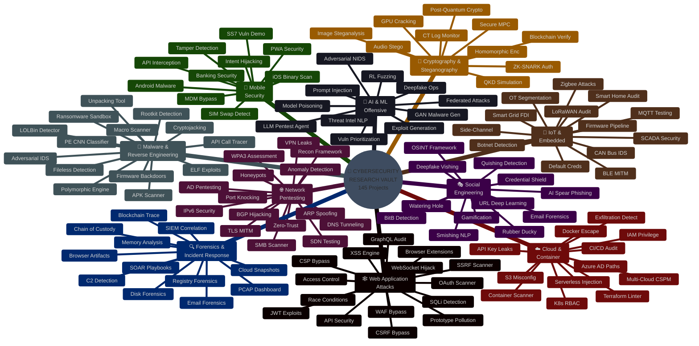

<!-- ═══════════════════════════════════════════════════════════════════ -->
<!--                  🔐  HARDIK ROY — CYBERSECURITY VAULT  🔐         -->
<!-- ═══════════════════════════════════════════════════════════════════ -->

<div align="center">


<br>

<!-- ── STATUS MATRIX ── -->


<br>

```
╔══════════════════════════════════════════════════════════════════╗
║                                                                  ║
║    ██████╗██╗   ██╗██████╗ ███████╗██████╗                       ║
║   ██╔════╝╚██╗ ██╔╝██╔══██╗██╔════╝██╔══██╗                     ║
║   ██║      ╚████╔╝ ██████╔╝█████╗  ██████╔╝                     ║
║   ██║       ╚██╔╝  ██╔══██╗██╔══╝  ██╔══██╗                     ║
║   ╚██████╗   ██║   ██████╔╝███████╗██║  ██║                     ║
║    ╚═════╝   ╚═╝   ╚═════╝ ╚══════╝╚═╝  ╚═╝                    ║
║                                                                  ║
║   ███████╗███████╗ ██████╗██╗   ██╗██████╗ ██╗████████╗██╗   ██╗║
║   ██╔════╝██╔════╝██╔════╝██║   ██║██╔══██╗██║╚══██╔══╝╚██╗ ██╔╝║
║   ███████╗█████╗  ██║     ██║   ██║██████╔╝██║   ██║    ╚████╔╝ ║
║   ╚════██║██╔══╝  ██║     ██║   ██║██╔══██╗██║   ██║     ╚██╔╝  ║
║   ███████║███████╗╚██████╗╚██████╔╝██║  ██║██║   ██║      ██║   ║
║   ╚══════╝╚══════╝ ╚═════╝ ╚═════╝ ╚═╝  ╚═╝╚═╝   ╚═╝      ╚═╝  ║
║                                                                  ║
║              ⟪  RESEARCH  ·  EXPLOIT  ·  DEFEND  ⟫              ║
║                                                                  ║
╚══════════════════════════════════════════════════════════════════╝
```

<br>

> *"A security researcher's value is not measured by the tools they run,*
> *but by the systems they understand."*

<br>


</div>

---

<div align="center">

## ◈ MISSION BRIEF ◈

</div>

<table>
<tr>
<td width="60%">

This repository is a **comprehensive offensive security research vault** containing **145 projects** spanning every critical attack domain — from web application exploitation and network penetration testing to malware reverse engineering, IoT hacking, cloud security, and AI-powered offensive tooling.

Every project includes:
- 📐 **Architectural design** with Excalidraw visual diagrams
- 📄 **Research-backed methodology** referencing academic literature
- 🔬 **Technical breakdown** of attack surfaces and defense mechanisms
- 💻 **Implementation logic** with source code design patterns

This is not a tool collection. This is an **engineered research trail**.

</td>
<td width="40%">

```
   ┌──────────────────────┐
   │                      │
   │   RECONNAISSANCE     │
   │        ↓             │
   │   VULNERABILITY      │
   │   ANALYSIS           │
   │        ↓             │
   │   EXPLOITATION       │
   │        ↓             │
   │   POST-EXPLOITATION  │
   │        ↓             │
   │   ANALYSIS &         │
   │   DOCUMENTATION      │
   │        ↓             │
   │   DEFENSE             │
   │   ENGINEERING        │
   │                      │
   └──────────────────────┘
```

</td>
</tr>
</table>

---

<div align="center">

## ◈ ATTACK SURFACE MAP ◈

*10 Core Offensive Security Research Domains*

</div>



---

<div align="center">

## ◈ REPOSITORY ARCHITECTURE ◈

</div>

```
cybersecurity-research-vault/
│
├── 📂 CYBER SECURITY/                         ← 🔬 Advanced Research (125 Projects)
│   │
│   ├── 📋 00 - Offensive Security Project Index.md
│   │
│   ├── 🕸️ 01 - Web Application Attacks/           ← 15 Projects [001-015]
│   │   ├── 001 - SQL Injection Detection & Prevention System
│   │   ├── 002 - XSS Payload Generator with Context-Aware Encoding
│   │   ├── 003 - CSRF Token Analyzer & Bypass Framework
│   │   ├── 004 - Server-Side Request Forgery (SSRF) Scanner
│   │   ├── 005 - API Security Testing Automation Platform
│   │   ├── 006 - JWT Token Vulnerability Assessment Tool
│   │   ├── 007 - WAF Bypass Techniques Analyzer
│   │   ├── 008 - Broken Access Control Detection Engine
│   │   ├── 009 - GraphQL API Security Audit Framework
│   │   ├── 010 - WebSocket Security Testing Suite
│   │   ├── 011 - Browser Extension Security Analyzer
│   │   ├── 012 - CSP Bypass Research Tool
│   │   ├── 013 - Race Condition Vulnerability Detector
│   │   ├── 014 - Prototype Pollution Attack Detection
│   │   └── 015 - OAuth 2.0 Flow Vulnerability Scanner
│   │
│   ├── 🌐 02 - Network Penetration Testing/        ← 15 Projects [016-030]
│   │   ├── 016 - Automated Network Reconnaissance Framework
│   │   ├── 017 - ARP Spoofing Detection & Prevention
│   │   ├── 018 - DNS Tunneling Detection Using ML
│   │   ├── 019 - WPA3 Security Assessment Tool
│   │   ├── 020 - TLS/SSL Man-in-the-Middle Detection
│   │   ├── 021 - Network Traffic Anomaly Detection (Autoencoders)
│   │   ├── 022 - BGP Hijacking Simulation & Detection
│   │   ├── 023 - Port Knocking Authentication System
│   │   ├── 024 - VPN Tunnel Leak Detection Analyzer
│   │   ├── 025 - Active Directory Penetration Testing
│   │   ├── 026 - SMB/CIFS Vulnerability Scanner
│   │   ├── 027 - Zero-Trust Network Architecture Validator
│   │   ├── 028 - IPv6 Security Assessment Tool
│   │   ├── 029 - SDN Controller Security Testing
│   │   └── 030 - Honeypot Deployment & Attack Platform
│   │
│   ├── 🦠 03 - Malware Analysis & Reverse Engineering/ ← 15 Projects [031-045]
│   │   ├── 031 - PE Header CNN Malware Classifier
│   │   ├── 032 - Ransomware Behavior Analysis Sandbox
│   │   ├── 033 - Fileless Malware Memory Forensics
│   │   ├── 034 - Dynamic API Call Tracing Platform
│   │   ├── 035 - Polymorphic Malware Behavioral Signatures
│   │   ├── 036 - Android APK Static Vulnerability Scanner
│   │   ├── 037 - Linux ELF Binary Exploit Detection
│   │   ├── 038 - Rootkit System Call Monitoring
│   │   ├── 039 - Malware Unpacking & Deobfuscation
│   │   ├── 040 - PE Anomaly Random Forest Classifier
│   │   ├── 041 - Office Macro-based Malware Detector
│   │   ├── 042 - Firmware Backdoor Detection System
│   │   ├── 043 - Browser Cryptojacking Detector
│   │   ├── 044 - Adversarial ML IDS Evasion Generator
│   │   └── 045 - LOLBin Abuse Detector
│   │
│   ├── 📡 04 - IoT & Embedded Security/            ← 13 Projects [046-058]
│   │   ├── 046 - IoT Botnet Flow Analysis
│   │   ├── 047 - Smart Home Vulnerability Assessment
│   │   ├── 048 - CAN Bus Vehicle Intrusion Detection
│   │   ├── 049 - MQTT Protocol Security Testing
│   │   ├── 050 - Zigbee & Z-Wave Attack Simulator
│   │   ├── 051 - IoT Firmware Extraction Pipeline
│   │   ├── 052 - BLE Sniffing & MITM Tool
│   │   ├── 053 - Industrial SCADA/ICS Security Platform
│   │   ├── 054 - IoT Default Credential Scanner
│   │   ├── 055 - Smart Grid FDI Attack Simulator
│   │   ├── 056 - LoRaWAN Security Audit Framework
│   │   ├── 057 - Side-Channel Attack Demonstrator
│   │   └── 058 - OT Network Segmentation Validator
│   │
│   ├── ☁️ 05 - Cloud & Container Security/          ← 12 Projects [059-070]
│   │   ├── 059 - AWS S3 Misconfiguration Scanner
│   │   ├── 060 - Kubernetes RBAC Misconfig Detector
│   │   ├── 061 - Docker Container Escape Detection
│   │   ├── 062 - Cloud IAM Over-Privilege Analyzer
│   │   ├── 063 - Serverless Injection Simulator
│   │   ├── 064 - CI/CD Pipeline Security Audit
│   │   ├── 065 - Multi-Cloud Security Posture (CSPM)
│   │   ├── 066 - Container Image Scanner Benchmark
│   │   ├── 067 - Cloud Exfiltration Detection System
│   │   ├── 068 - Terraform IaC Security Linter
│   │   ├── 069 - Azure AD Attack Path Analyzer
│   │   └── 070 - Cloud API Key Leak Detector
│   │
│   ├── 🎭 06 - Social Engineering & Phishing/       ← 12 Projects [071-082]
│   │   ├── 071 - AI Spear Phishing Generator & Tester
│   │   ├── 072 - Phishing URL Deep Learning Detector
│   │   ├── 073 - Deepfake Voice Vishing Detection
│   │   ├── 074 - QR Code Quishing Detection System
│   │   ├── 075 - Social Media OSINT Framework
│   │   ├── 076 - USB Rubber Ducky Payload Analyzer
│   │   ├── 077 - Email Header Forensics Tool
│   │   ├── 078 - Browser-in-the-Browser (BitB) Detector
│   │   ├── 079 - Smishing NLP Detection System
│   │   ├── 080 - Credential Harvesting Prevention
│   │   ├── 081 - Watering Hole Attack Detection
│   │   └── 082 - Security Awareness Gamification
│   │
│   ├── 🔐 07 - Cryptography & Steganography/        ← 10 Projects [083-092]
│   │   ├── 083 - CNN Image Steganography Detection
│   │   ├── 084 - Post-Quantum Cryptography Benchmark
│   │   ├── 085 - Blockchain Document Verification
│   │   ├── 086 - Homomorphic Encryption Testing
│   │   ├── 087 - SSL/TLS CT Log Monitor
│   │   ├── 088 - GPU Password Cracking Engine
│   │   ├── 089 - Zero-Knowledge Proof Auth (ZK-SNARK)
│   │   ├── 090 - Quantum Key Distribution Simulation
│   │   ├── 091 - Audio Steganography Detector
│   │   └── 092 - Secure Multi-Party Computation
│   │
│   ├── 📱 08 - Mobile Security/                      ← 10 Projects [093-102]
│   │   ├── 093 - Android Permission-based Malware Detection
│   │   ├── 094 - iOS Mach-O Binary Vulnerability Scanner
│   │   ├── 095 - Mobile API Traffic Interception
│   │   ├── 096 - SIM Swapping Attack Detection
│   │   ├── 097 - Mobile Banking Security Assessment
│   │   ├── 098 - Android Intent Hijacking Detection
│   │   ├── 099 - MDM Bypass Analyzer
│   │   ├── 100 - SS7/Diameter Protocol Vulnerability Demo
│   │   ├── 101 - Mobile App Tamper Detection
│   │   └── 102 - PWA Security Testing Suite
│   │
│   ├── 🤖 09 - AI & ML in Offensive Security/       ← 11 Projects [103-113]
│   │   ├── 103 - Adversarial ML Attack on IDS/IPS
│   │   ├── 104 - GAN-based Malware Sample Generator
│   │   ├── 105 - AI Automated Exploit Generation (angr/Z3)
│   │   ├── 106 - LLM Prompt Injection Attack Toolkit
│   │   ├── 107 - Reinforcement Learning Fuzzing Engine
│   │   ├── 108 - ML Model Poisoning Simulator
│   │   ├── 109 - AI Vulnerability Prioritization (EPSS+CVSS)
│   │   ├── 110 - Deepfake Generation & Detection (Red Team)
│   │   ├── 111 - NLP Threat Intelligence Extraction (SecBERT)
│   │   ├── 112 - Federated Learning Attack Simulator
│   │   └── 113 - Autonomous LLM Penetration Testing Agent
│   │
│   └── 🔍 10 - Forensics & Incident Response/       ← 12 Projects [114-125]
│       ├── 114 - Disk Forensics Timeline Engine (TSK)
│       ├── 115 - Memory Dump Volatility Analyzer
│       ├── 116 - PCAP Forensics Dashboard (Zeek/Suricata)
│       ├── 117 - Email Phishing Forensics Platform
│       ├── 118 - Browser Artifact Extraction Tool
│       ├── 119 - Ransomware Blockchain Payment Tracing
│       ├── 120 - SIEM Log Correlation Engine (Sigma)
│       ├── 121 - Chain of Custody Blockchain System
│       ├── 122 - Windows Registry Forensics Automation
│       ├── 123 - Cloud Instance Snapshot Analyzer
│       ├── 124 - Malware C2 Traffic Detector (JA3)
│       └── 125 - SOAR Incident Response Playbook Executor
│
├── 📂 basic project/                               ← 🔧 Foundational Projects (20 Projects)
│   ├── 📋 00 - Basic Cybersecurity Projects Index.md
│   ├── 001 - File Integrity Monitor (SHA-256)
│   ├── 002 - Network Port Scanner & Banner Grabber
│   ├── 003 - ARP Poisoning Detection Script
│   ├── 004 - Password Strength Checker & Hash Cracker
│   ├── 005 - Web URL Phishing Detector
│   ├── 006 - Packet Sniffer & HTTP Header Analyzer
│   ├── 007 - LSB Image Steganography Tool
│   ├── 008 - Directory Bruteforce Scanner
│   ├── 009 - Keylogger Detection & Process Monitor
│   ├── 010 - SQL Injection Vulnerability Tester
│   ├── 011 - Encrypted Password Manager CLI
│   ├── 012 - Log File Anomaly Scanner (Regex)
│   ├── 013 - DNS Lookup & Subdomain Finder
│   ├── 014 - Reflected XSS Scanner
│   ├── 015 - Wi-Fi Saved Password Extractor
│   ├── 016 - Encrypted Socket Chat Application
│   ├── 017 - HTTP Security Headers Checker
│   ├── 019 - Network Ping Sweep & Host Discovery
│   └── 020 - USB Auto-Run Infection Prevention
│
├── 📂 Excalidraw/                                  ← 🎨 Architecture Diagrams & Visuals
│
└── 📄 README.md                                    ← You are here
```

---

<div align="center">

## ◈ DOMAIN BREAKDOWN ◈

</div>

<!-- ═══════════════════════════════════════════════════════════════════ -->
<!--                    DOMAIN 01: WEB APPLICATION ATTACKS              -->
<!-- ═══════════════════════════════════════════════════════════════════ -->

<details>
<summary>

### 🕸️ `DOMAIN 01` — Web Application Attacks &nbsp;&nbsp; `[15 Projects]`

</summary>

<br>

> Research into OWASP Top 10 attack vectors, authentication bypass, injection flaws, client-side exploitation, and application-layer defense evasion.

| # | Project | Core Technology |
|:---:|---------|:---:|
| `001` | Automated SQL Injection Detection & Prevention System | AST Parsing · Parameterized Queries |
| `002` | XSS Payload Generator with Context-Aware Encoding | Polyglot XSS · DOM Sanitization |
| `003` | CSRF Token Analyzer & Bypass Framework | Cross-Origin Request Validation |
| `004` | Server-Side Request Forgery (SSRF) Scanner | Cloud Metadata · Internal Endpoint Auditing |
| `005` | API Security Testing Automation Platform | REST/SOAP · Rate-Limiting · AuthZ |
| `006` | JWT Token Vulnerability Assessment Tool | Signature Verification · Key Confusion |
| `007` | WAF Bypass Techniques Analyzer | Payload Mutation Algorithms |
| `008` | Broken Access Control Detection Engine | IDOR Discovery · OWASP #1 |
| `009` | GraphQL API Security Audit Framework | Introspection · Depth Limiting · Batching |
| `010` | WebSocket Security Testing Suite | Full-Duplex Hijacking · Frame Manipulation |
| `011` | Browser Extension Security Analyzer | Manifest Parsing · Permission Auditing |
| `012` | Content Security Policy (CSP) Bypass Research Tool | Script Gadget Injection |
| `013` | Race Condition Vulnerability Detector | Async HTTP Racing · Concurrency Flaws |
| `014` | Prototype Pollution Attack Detection System | Node.js Object Merge Pollution |
| `015` | OAuth 2.0 Flow Vulnerability Scanner | Redirect URI · State Parameter Validation |

</details>

<!-- ═══════════════════════════════════════════════════════════════════ -->
<!--                    DOMAIN 02: NETWORK PENETRATION TESTING          -->
<!-- ═══════════════════════════════════════════════════════════════════ -->

<details>
<summary>

### 🌐 `DOMAIN 02` — Network Penetration Testing &nbsp;&nbsp; `[15 Projects]`

</summary>

<br>

> Layer 2–7 network attack research: protocol exploitation, traffic analysis, infrastructure security testing, and network defense validation.

| # | Project | Core Technology |
|:---:|---------|:---:|
| `016` | Automated Network Reconnaissance Framework | Async Port Scanning · Banner Mapping |
| `017` | ARP Spoofing Detection & Prevention System | Ethernet Frame Inspection · ARP Cache |
| `018` | DNS Tunneling Detection Using ML Classifiers | Subdomain Entropy · Covert Channels |
| `019` | Wireless Network WPA3 Security Assessment | SAE Dragonfly · Side-Channel Timing |
| `020` | Man-in-the-Middle Detection for TLS/SSL | X.509 Validation · Key Pinning |
| `021` | Network Traffic Anomaly Detection (Autoencoders) | Deep Autoencoder · Zero-Day Detection |
| `022` | BGP Hijacking Simulation & Detection | Prefix De-aggregation · RPKI Validation |
| `023` | Port Knocking Authentication with Stealth Mode | Single Packet Authorization (SPA) |
| `024` | VPN Tunnel Leak Detection Analyzer | DNS/IPv6/WebRTC Leak Detection |
| `025` | Active Directory Penetration Testing Automation | Kerberoasting · AS-REP · BloodHound |
| `026` | SMB/CIFS Vulnerability Scanner & Exploit Chain | SMB Protocol · Patch Verification |
| `027` | Zero-Trust Network Architecture Validator | Microsegmentation · mTLS Enforcement |
| `028` | IPv6 Security Assessment & Attack Simulation | ICMPv6 RA Guard · NDP Cache |
| `029` | SDN Controller Security Testing Framework | OpenFlow Poisoning · TCAM Saturation |
| `030` | Honeypot Deployment & Attack Analysis Platform | Containerized Decoys · Telemetry |

</details>

<!-- ═══════════════════════════════════════════════════════════════════ -->
<!--                    DOMAIN 03: MALWARE & REVERSE ENGINEERING        -->
<!-- ═══════════════════════════════════════════════════════════════════ -->

<details>
<summary>

### 🦠 `DOMAIN 03` — Malware Analysis & Reverse Engineering &nbsp;&nbsp; `[15 Projects]`

</summary>

<br>

> Binary analysis, malware behavioral sandboxing, memory forensics, deobfuscation, and ML-powered malware classification research.

| # | Project | Core Technology |
|:---:|---------|:---:|
| `031` | Automated Malware Classification (CNN on PE Headers) | Grayscale PE → CNN Classification |
| `032` | Ransomware Behavior Analysis Sandbox | I/O Tracking · Shadow Copy · Canary Files |
| `033` | Fileless Malware Detection (Memory Forensics) | Volatility · Process Hollowing · DLL Injection |
| `034` | Dynamic Malware Analysis with API Call Tracing | User-Mode Hooking · Win32 Syscall Tracing |
| `035` | Polymorphic Malware Detection (Behavioral Signatures) | CFG Mining · Graph-Based Detection |
| `036` | Android APK Static Analysis & Vuln Scanner | Smali Parsing · AndroidManifest Audit |
| `037` | ELF Binary Exploit Detection for Linux | NX · ASLR · RELRO · Stack Canary Checks |
| `038` | Rootkit Detection (System Call Monitoring) | sys_call_table Integrity · DKOM |
| `039` | Malware Unpacking & Deobfuscation Automation | Entropy Calculation · OEP Recovery |
| `040` | PE File Anomaly Detection (Random Forest) | Static Feature Extraction → ML |
| `041` | Macro-based Malware Detector (Office Documents) | VBA Stream Extraction · Shellcode Heuristics |
| `042` | Firmware Backdoor Detection System | Binwalk · Hardcoded Key Analysis |
| `043` | Cryptojacking Script Detection in Browsers | WASM CPU Monitoring · WebSocket Mining |
| `044` | Adversarial Example Generator for ML-IDS Evasion | Gradient-Based Feature Perturbation |
| `045` | Living-off-the-Land Binary (LOLBin) Abuse Detector | Cmd-Line Telemetry · LOLBas Audit |

</details>

<!-- ═══════════════════════════════════════════════════════════════════ -->
<!--                    DOMAIN 04: IoT & EMBEDDED SECURITY              -->
<!-- ═══════════════════════════════════════════════════════════════════ -->

<details>
<summary>

### 📡 `DOMAIN 04` — IoT & Embedded Security &nbsp;&nbsp; `[13 Projects]`

</summary>

<br>

> Hardware hacking, firmware extraction, industrial protocol security, automotive intrusion detection, and wireless IoT protocol exploitation research.

| # | Project | Core Technology |
|:---:|---------|:---:|
| `046` | IoT Botnet Detection (Network Flow Analysis) | Flow Distribution · C2 Entropy Analysis |
| `047` | Smart Home Device Vulnerability Assessment | Local Protocol API · Cloud Sync Audit |
| `048` | CAN Bus Intrusion Detection (Connected Vehicles) | SocketCAN · ECU ID Anomaly Detection |
| `049` | MQTT Protocol Security Testing Tool | Broker Auth · Topic AuthZ · Payload Fuzzing |
| `050` | Zigbee & Z-Wave Protocol Attack Simulator | 802.15.4 Capture · Key Exchange Analysis |
| `051` | IoT Firmware Extraction & Analysis Pipeline | Flash Dump · Filesystem Unpack · Ghidra |
| `052` | BLE Sniffing & MITM Attack Tool | GATT Discovery · Characteristic Tampering |
| `053` | Industrial SCADA/ICS Security Platform | Modbus TCP · DNP3 Register Audits |
| `054` | IoT Device Default Credential Scanner | Telnet/SSH Credential Verification |
| `055` | Smart Grid False Data Injection Simulator | State Estimation Vector Modification |
| `056` | LoRaWAN Security Audit Framework | DevNonce Replay · MIC Integrity Testing |
| `057` | Embedded Device Side-Channel Attack Demo | Differential Power Analysis (DPA) |
| `058` | OT Network Segmentation Validator | Purdue Model Zone Boundary Analysis |

</details>

<!-- ═══════════════════════════════════════════════════════════════════ -->
<!--                    DOMAIN 05: CLOUD & CONTAINER SECURITY           -->
<!-- ═══════════════════════════════════════════════════════════════════ -->

<details>
<summary>

### ☁️ `DOMAIN 05` — Cloud & Container Security &nbsp;&nbsp; `[12 Projects]`

</summary>

<br>

> Cloud infrastructure exploitation, container escape detection, IAM privilege analysis, IaC security, and multi-cloud posture management research.

| # | Project | Core Technology |
|:---:|---------|:---:|
| `059` | AWS S3 Bucket Misconfiguration Scanner | Public ACL · Policy · Secret Pattern Matching |
| `060` | Kubernetes RBAC Misconfiguration Detector | ClusterRole Graph · PrivEsc Detection |
| `061` | Docker Container Escape Detection System | eBPF · cgroup release_agent · runc Escape |
| `062` | Cloud IAM Policy Over-Privilege Analyzer | CloudTrail History vs. Granted Policies |
| `063` | Serverless Function Injection Simulator | Event Payload Injection · Lambda Testing |
| `064` | CI/CD Pipeline Security Audit Tool | GitHub Actions AST · Unpinned Actions |
| `065` | Multi-Cloud Security Posture Assessment | CIS Benchmarks · AWS/Azure/GCP |
| `066` | Container Image Vulnerability Scanner Comparison | Trivy · Grype · Clair Benchmarking |
| `067` | Cloud Storage Data Exfiltration Detection | Isolation Forest · CloudTrail API Anomaly |
| `068` | Terraform IaC Security Linter & Policy Enforcer | OPA Rego · HCL Plan Evaluation |
| `069` | Azure AD Attack Path Analyzer | MS Graph API · Service Principal Paths |
| `070` | Cloud API Key Leak Detection in Public Repos | Git Stream Scanning · High-Entropy Secrets |

</details>

<!-- ═══════════════════════════════════════════════════════════════════ -->
<!--                    DOMAIN 06: SOCIAL ENGINEERING & PHISHING        -->
<!-- ═══════════════════════════════════════════════════════════════════ -->

<details>
<summary>

### 🎭 `DOMAIN 06` — Social Engineering & Phishing &nbsp;&nbsp; `[12 Projects]`

</summary>

<br>

> AI-powered phishing simulation, deep learning URL classification, deepfake detection, OSINT automation, and human-layer attack surface research.

| # | Project | Core Technology |
|:---:|---------|:---:|
| `071` | AI Spear Phishing Email Generator & Tester | LLM Contextual Generation · Awareness |
| `072` | Phishing URL Detection (Deep Learning) | 1D CNN · Bi-LSTM · Lexical Classification |
| `073` | Deepfake Voice Detection for Vishing Prevention | MFCC Feature Analysis · Synthetic Audio |
| `074` | QR Code Phishing (Quishing) Detection System | CV QR Parsing · Headless Redirect Unrolling |
| `075` | Social Media OSINT Automation Framework | Metadata Aggregation · Vulnerability Scoring |
| `076` | USB Rubber Ducky Payload Analyzer & Detector | Keystroke Dynamics · HID Timing Analysis |
| `077` | Email Header Forensics & Spoofing Detection | SPF · DKIM · DMARC Alignment Engine |
| `078` | Browser-in-the-Browser (BitB) Attack Detection | DOM Mutation · Fake Iframe Detection |
| `079` | Smishing (SMS Phishing) Detection using NLP | DistilBERT Intent Classification |
| `080` | Credential Harvesting Prevention System | FIDO2 WebAuthn · AiTM Proxy Detection |
| `081` | Watering Hole Attack Detection Framework | Multi-Egress Crawler · Drive-By Monitoring |
| `082` | Security Awareness Training Gamification | GoPhish Webhooks · Micro-Learning Modules |

</details>

<!-- ═══════════════════════════════════════════════════════════════════ -->
<!--                    DOMAIN 07: CRYPTOGRAPHY & STEGANOGRAPHY         -->
<!-- ═══════════════════════════════════════════════════════════════════ -->

<details>
<summary>

### 🔐 `DOMAIN 07` — Cryptography & Steganography &nbsp;&nbsp; `[10 Projects]`

</summary>

<br>

> Post-quantum cryptography, zero-knowledge proofs, blockchain verification, homomorphic encryption, and deep learning steganalysis research.

| # | Project | Core Technology |
|:---:|---------|:---:|
| `083` | Image Steganography Detection using CNN | SRM Filtering · Deep Residual Steganalysis |
| `084` | Post-Quantum Cryptography Benchmark | Kyber (ML-KEM) · Dilithium (ML-DSA) vs RSA/ECC |
| `085` | Blockchain-Based Document Verification | Solidity · Merkle Tree Hash Anchoring |
| `086` | Homomorphic Encryption Performance Testing | MS SEAL · BFV/CKKS Scheme Evaluation |
| `087` | SSL/TLS Certificate Transparency Monitor | CT Log Stream · Homograph Domain Detection |
| `088` | Password Cracking (Rainbow Tables & GPU) | Custom Tables · Hashcat GPU Optimization |
| `089` | Zero-Knowledge Proof Authentication System | Groth16 ZK-SNARK Circuit |
| `090` | Quantum Key Distribution (QKD) Simulation | Qiskit BB84 · Eavesdropping Error Detection |
| `091` | Audio Steganography Detection System | STFT Spectrum Anomaly Analysis |
| `092` | Secure Multi-Party Computation Protocol | Shamir Secret Sharing · Yao's Garbled Circuits |

</details>

<!-- ═══════════════════════════════════════════════════════════════════ -->
<!--                    DOMAIN 08: MOBILE SECURITY                      -->
<!-- ═══════════════════════════════════════════════════════════════════ -->

<details>
<summary>

### 📱 `DOMAIN 08` — Mobile Security &nbsp;&nbsp; `[10 Projects]`

</summary>

<br>

> Android/iOS application security, telecom protocol research, mobile API interception, and mobile app integrity verification research.

| # | Project | Core Technology |
|:---:|---------|:---:|
| `093` | Android Malware Detection (Permissions Analysis) | Permission Matrix · Random Forest |
| `094` | iOS App Binary Analysis & Vulnerability Scanner | Mach-O Parsing · ASLR/ARC/Banned APIs |
| `095` | Mobile App API Traffic Interception Framework | Frida SSL Bypass · mitmproxy Inspection |
| `096` | SIM Swapping Attack Detection System | CAMARA API · SIM Swap Risk Scoring |
| `097` | Mobile Banking App Security Assessment | OWASP MASVS · Anti-Root Verification |
| `098` | Android Intent Hijacking Detection System | Intent Filter Parsing · IPC Redirect Analysis |
| `099` | Mobile Device Management (MDM) Bypass Analyzer | SCEP Enrollment · Profile Integrity |
| `100` | SS7/Diameter Protocol Vulnerability Demo | Telecom Signaling Protocol Research |
| `101` | Mobile App Repackaging & Tamper Detection | Smali Hashing · Native Signature Verification |
| `102` | Progressive Web App (PWA) Security Suite | Service Worker Cache Poisoning · Scope Checks |

</details>

<!-- ═══════════════════════════════════════════════════════════════════ -->
<!--                    DOMAIN 09: AI & ML IN OFFENSIVE SECURITY        -->
<!-- ═══════════════════════════════════════════════════════════════════ -->

<details>
<summary>

### 🤖 `DOMAIN 09` — AI & ML in Offensive Security &nbsp;&nbsp; `[11 Projects]`

</summary>

<br>

> Adversarial machine learning, generative attack tooling, LLM exploitation, reinforcement learning fuzzing, and autonomous security agent research.

| # | Project | Core Technology |
|:---:|---------|:---:|
| `103` | Adversarial ML Attack on IDS/IPS | Evasion Perturbation · NIDS Model Attack |
| `104` | GAN-based Malware Sample Generator | PE Feature Mutation · GANs |
| `105` | AI-Powered Automated Exploit Generation | angr Symbolic Execution · Z3 Solver · ROP |
| `106` | LLM Prompt Injection Attack & Defense Toolkit | Direct/Indirect Injection Assessment |
| `107` | Reinforcement Learning-based Fuzzing Engine | PPO Agent · AFL++ Mutator Policy |
| `108` | ML Model Poisoning Attack Simulator | Clean-Label Poisoning · Backdoor Triggers |
| `109` | AI-Driven Vulnerability Prioritization | EPSS + CVSS + Threat Feed Scoring |
| `110` | Deepfake Generation & Detection (Red Team) | Voice Cloning · Lip-Sync · Spectral Detection |
| `111` | NLP for Threat Intelligence Extraction | SecBERT · STIX 2.1 IoC Extraction |
| `112` | Federated Learning Security Attack Simulator | Gradient Inversion Attack Simulation |
| `113` | Autonomous Penetration Testing Agent (LLM) | LangChain · Nmap/Metasploit RPC Orchestration |

</details>

<!-- ═══════════════════════════════════════════════════════════════════ -->
<!--                    DOMAIN 10: FORENSICS & INCIDENT RESPONSE        -->
<!-- ═══════════════════════════════════════════════════════════════════ -->

<details>
<summary>

### 🔍 `DOMAIN 10` — Forensics & Incident Response &nbsp;&nbsp; `[12 Projects]`

</summary>

<br>

> Disk/memory forensics, PCAP analysis, SIEM engineering, blockchain tracing, evidence integrity, and automated incident response research.

| # | Project | Core Technology |
|:---:|---------|:---:|
| `114` | Disk Forensics Image Analyzer & Timeline Gen | Sleuth Kit (TSK) · Super-Timeline |
| `115` | Memory Dump Analysis for Incident Response | Volatility 3 · Malfind · Driver Scans |
| `116` | Network Packet Capture Forensics Dashboard | PCAP · Zeek · Suricata Log Correlation |
| `117` | Email Phishing Forensics Investigation Platform | Headers · SPF/DKIM · Attachment Pipeline |
| `118` | Browser Artifact Extraction & Analysis Tool | SQLite · Chrome/Firefox History/Cookies |
| `119` | Ransomware Payment Blockchain Tracing | Bitcoin Transaction Clustering |
| `120` | SIEM Log Correlation & Alert Prioritization | Sigma Rules · Elasticsearch Streams |
| `121` | Digital Evidence Chain of Custody Blockchain | Smart Contract Hash Logging |
| `122` | Windows Registry Forensics Automation | Hive Parsing · Persistence · UserAssist · MRU |
| `123` | Cloud Instance Forensics Snapshot Analyzer | EC2/Azure Snapshot Mounting & Parsing |
| `124` | Malware C2 Traffic Detector | Beaconing Analysis · TLS JA3 Fingerprinting |
| `125` | Automated Incident Response Playbook Executor | SOAR Engine · IP Isolation · Account Lockout |

</details>

---

<div align="center">

## ◈ FOUNDATIONAL PROJECTS ◈

*20 Beginner-Level Security Implementations*

</div>

<details>
<summary>

### 🔧 `FOUNDATIONS` — Basic Cybersecurity Projects &nbsp;&nbsp; `[20 Projects]`

</summary>

<br>

> Hands-on implementations covering core security concepts: integrity monitoring, scanning, encryption, steganography, detection, and secure communication.

| # | Project | Focus Area |
|:---:|---------|:---:|
| `001` | File Integrity Monitor (FIM) using SHA-256 | Integrity · Hashing |
| `002` | Network Port Scanner & Service Banner Grabber | Reconnaissance · Scanning |
| `003` | ARP Poisoning Detection Script | Network · MITM Defense |
| `004` | Password Strength Checker & Hash Cracker | Authentication · Cracking |
| `005` | Web URL Phishing Detector (Domain Heuristics) | Phishing · Detection |
| `006` | Packet Sniffer & HTTP Header Analyzer | Traffic Analysis |
| `007` | LSB Image Steganography Encoder & Decoder | Steganography |
| `008` | Directory Bruteforce Scanner for Web Servers | Web Recon |
| `009` | Keylogger Detection & Process Monitoring Tool | Endpoint Security |
| `010` | SQL Injection Vulnerability Test Script | Web Exploitation |
| `011` | Encrypted Password Manager CLI Tool | Crypto · Storage |
| `012` | Log File Anomaly Scanner using Regex | Log Analysis |
| `013` | DNS Lookup & Subdomain Finder Tool | DNS Recon |
| `014` | Cross-Site Scripting (XSS) Reflected Scanner | Web Security |
| `015` | System Wi-Fi Saved Passwords Extractor | Credential Audit |
| `016` | Encrypted Chat Application using Sockets | Crypto · Networking |
| `017` | HTTP Security Headers Checker | Hardening |
| `019` | Network Ping Sweep & Host Discovery Tool | Network Discovery |
| `020` | USB Drive Auto-Run Infection Prevention Script | Endpoint Defense |

</details>

---

<div align="center">

## ◈ TECHNOLOGY RADAR ◈

</div>

<table>
<tr>
<td align="center" width="14%">

**Languages**

</td>
<td align="center" width="14%">

**ML / AI**

</td>
<td align="center" width="14%">

**Security**

</td>
<td align="center" width="14%">

**Network**

</td>
<td align="center" width="14%">

**Cloud**

</td>
<td align="center" width="14%">

**Forensics**

</td>
<td align="center" width="14%">

**Crypto**

</td>
</tr>
<tr>
<td align="center">

`Python`
`C / C++`
`Bash`
`JavaScript`
`Solidity`

</td>
<td align="center">

`TensorFlow`
`PyTorch`
`scikit-learn`
`SecBERT`
`LangChain`

</td>
<td align="center">

`Metasploit`
`Nmap`
`Burp Suite`
`AFL++`
`Frida`

</td>
<td align="center">

`Scapy`
`Wireshark`
`Zeek`
`Suricata`
`OpenFlow`

</td>
<td align="center">

`AWS`
`Azure`
`GCP`
`Kubernetes`
`Docker`

</td>
<td align="center">

`Volatility`
`Sleuth Kit`
`Ghidra`
`Binwalk`
`Autopsy`

</td>
<td align="center">

`Qiskit`
`MS SEAL`
`Hashcat`
`OpenSSL`
`Circom`

</td>
</tr>
</table>

---

<div align="center">

## ◈ RESEARCH METHODOLOGY ◈

</div>

Every project in this repository follows a structured offensive security research pipeline:

```mermaid
%%{init: {'theme': 'dark', 'themeVariables': {'primaryColor': '#00ff9d', 'primaryTextColor': '#c9d1d9', 'primaryBorderColor': '#00d4aa', 'lineColor': '#00d4aa', 'secondaryColor': '#161b22', 'tertiaryColor': '#0d1117'}}}%%
flowchart LR
    A["🎯 THREAT<br/>MODEL"] --> B["📚 LITERATURE<br/>REVIEW"]
    B --> C["📐 SYSTEM<br/>DESIGN"]
    C --> D["⚙️ IMPLEMENT"]
    D --> E["🧪 TEST &<br/>VALIDATE"]
    E --> F["📊 ANALYZE<br/>RESULTS"]
    F --> G["📝 DOCUMENT<br/>FINDINGS"]
    G --> H["🛡️ DEFENSE<br/>ENGINEERING"]

    style A fill:#0d1117,stroke:#00ff9d,stroke-width:2px,color:#00ff9d
    style B fill:#0d1117,stroke:#00d4aa,stroke-width:2px,color:#00d4aa
    style C fill:#0d1117,stroke:#7c3aed,stroke-width:2px,color:#7c3aed
    style D fill:#0d1117,stroke:#f97316,stroke-width:2px,color:#f97316
    style E fill:#0d1117,stroke:#eab308,stroke-width:2px,color:#eab308
    style F fill:#0d1117,stroke:#06b6d4,stroke-width:2px,color:#06b6d4
    style G fill:#0d1117,stroke:#8b5cf6,stroke-width:2px,color:#8b5cf6
    style H fill:#0d1117,stroke:#00ff9d,stroke-width:2px,color:#00ff9d
```



<br>

<table>
<tr>
<td width="50%">

### 🧠 Research Philosophy

```
Understand the PROTOCOL.
Map the ATTACK SURFACE.
Develop the EXPLOIT.
Study the IMPACT.
Engineer the DEFENSE.
Document EVERYTHING.
```

</td>
<td width="50%">

### 📐 Each Project Contains

```
✦ Threat Model & Attack Surface Analysis
✦ Academic Literature References
✦ Excalidraw Architecture Diagrams
✦ Implementation with Source Code Logic
✦ Testing Methodology & Results
✦ Defense Recommendations
✦ Detailed Technical Documentation
```

</td>
</tr>
</table>

---

<div align="center">

## ◈ STATS DASHBOARD ◈

</div>

```
╔════════════════════════════════════════════════════════════════════════╗
║                                                                        ║
║   ╭──────────────────╮  ╭──────────────────╮  ╭──────────────────╮    ║
║   │  TOTAL PROJECTS  │  │  ATTACK DOMAINS  │  │  BASIC PROJECTS  │    ║
║   │                  │  │                  │  │                  │    ║
║   │      ██ 145 ██   │  │     ██ 10 ██     │  │     ██ 20 ██     │    ║
║   ╰──────────────────╯  ╰──────────────────╯  ╰──────────────────╯    ║
║                                                                        ║
║   ╭──────────────────╮  ╭──────────────────╮  ╭──────────────────╮    ║
║   │   WEB ATTACKS    │  │  NETWORK PENTEST │  │  MALWARE & RE    │    ║
║   │                  │  │                  │  │                  │    ║
║   │    ██ 15 ██      │  │    ██ 15 ██      │  │    ██ 15 ██      │    ║
║   ╰──────────────────╯  ╰──────────────────╯  ╰──────────────────╯    ║
║                                                                        ║
║   ╭──────────────────╮  ╭──────────────────╮  ╭──────────────────╮    ║
║   │  IoT & EMBEDDED  │  │  CLOUD & K8S     │  │  SOCIAL ENG.     │    ║
║   │                  │  │                  │  │                  │    ║
║   │    ██ 13 ██      │  │    ██ 12 ██      │  │    ██ 12 ██      │    ║
║   ╰──────────────────╯  ╰──────────────────╯  ╰──────────────────╯    ║
║                                                                        ║
║   ╭──────────────────╮  ╭──────────────────╮  ╭──────────────────╮    ║
║   │  CRYPTOGRAPHY    │  │  MOBILE SEC.     │  │  AI/ML OFFENSE   │    ║
║   │                  │  │                  │  │                  │    ║
║   │    ██ 10 ██      │  │    ██ 10 ██      │  │    ██ 11 ██      │    ║
║   ╰──────────────────╯  ╰──────────────────╯  ╰──────────────────╯    ║
║                                                                        ║
║                    ╭──────────────────╮                                 ║
║                    │  DFIR & FORENSICS│                                 ║
║                    │                  │                                 ║
║                    │    ██ 12 ██      │                                 ║
║                    ╰──────────────────╯                                 ║
║                                                                        ║
╚════════════════════════════════════════════════════════════════════════╝
```

---

<div align="center">

## ◈ PROJECT STATUS LEGEND ◈

</div>

| Indicator | Status | Description |
|:---:|:---:|---|
| 🟢 | **Complete** | Research, implementation, and documentation finalized |
| 🔵 | **Active** | Currently under active development and testing |
| 🟡 | **Experimental** | Results under evaluation — research in progress |
| 🟠 | **Paused** | Work temporarily suspended — partially implemented |
| ⚪ | **Archived** | Reference material — no longer actively maintained |
| 🔴 | **Blocked** | Awaiting dependencies, hardware, or lab environment |

---

<div align="center">

## ◈ ETHICAL FRAMEWORK ◈

</div>

> [!CAUTION]
> **AUTHORIZED USE ONLY** — All techniques demonstrated in this repository are intended exclusively for educational research, authorized penetration testing, CTF competitions, and defensive security engineering in controlled lab environments.

<table>
<tr>
<td width="50%">

### ✅ Authorized Use

```
→ Systems you own
→ Lab / VM environments
→ CTF platforms
→ Bug bounty programs (in scope)
→ Authorized penetration tests
→ Academic research
→ Defensive engineering
```

</td>
<td width="50%">

### ❌ Prohibited Use

```
→ Unauthorized system access
→ Production system attacks
→ Data theft or exfiltration
→ Surveillance without consent
→ Distribution of malware
→ Any illegal activity
→ Bypassing authorization
```

</td>
</tr>
</table>

<br>

> **Test legally. Break only what you are authorized to break. Document everything.**

---

<div align="center">

## ◈ AI USAGE DISCLOSURE ◈

</div>

> [!NOTE]
> Some components of this repository were created, reviewed, or improved with AI assistance — including code generation, debugging, documentation formatting, and concept exploration. All final implementation, testing, interpretation, and verification remain the responsibility of the author. AI-generated output should never be treated as authoritative without independent validation.

---

<div align="center">

## ◈ CONNECT ◈

</div>

<div align="center">

```
╭─────────────────────────────────────────╮
│                                         │
│           HARDIK ROY                    │
│                                         │
│   Offensive Security Researcher         │
│   BTech · Cybersecurity Engineering     │
│                                         │
│   ⟪ Build · Break · Analyze · Defend ⟫ │
│                                         │
╰─────────────────────────────────────────╯
```

</div>

---

<div align="center">

<br>

```
⟦ QUESTION ⟧ → ⟦ HYPOTHESIS ⟧ → ⟦ RESEARCH ⟧ → ⟦ EXPLOIT ⟧ → ⟦ ANALYZE ⟧ → ⟦ DEFEND ⟧ → ⟦ DOCUMENT ⟧
```

<br>


<br>


</div>
