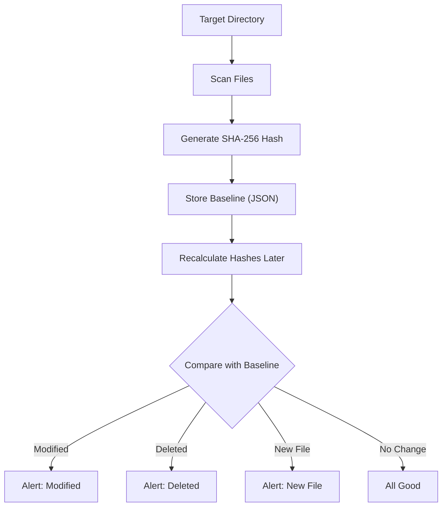

# Project 001: Simple File Integrity Monitor (FIM) with SHA-256

**Category:** Basic Cybersec Projects | **Difficulty:** Beginner | **Time:** 1-2 Weeks

---

### What's the point of this?

Picture this: you're running a server. Someone slips in some malware and quietly tweaks a config file. Nothing breaks right away, but they just gave themselves a backdoor. Or worse, ransomware starts locking up your files in the middle of the night.

How do you even figure out what got changed? You can't just trust the "last modified" timestamp on the file—hackers fake those all the time. 

That's why we use a File Integrity Monitor (FIM). Instead of looking at filenames or dates, a FIM takes a cryptographic fingerprint (a hash) of the actual data inside the file. If even a single comma changes, the hash completely changes.

We're going to build a basic version of this in Python. Big companies use expensive tools like Microsoft Defender, Tripwire, or CrowdStrike to do exactly this. Building it yourself is honestly the best way to understand how SOC teams actually catch bad guys.

---

### What you'll pick up from this:

- What a File Integrity Monitor actually is and why you need one.
- How SHA-256 hashing works in the real world.
- How to take a snapshot (a baseline) of your files.
- How to catch files being changed, added, or deleted automatically.
- Writing some solid defensive Python code.

---

### Real-world use cases

People use this stuff everywhere. You'd set up a FIM to keep a close eye on:
- Windows system files
- Linux configs (like `/etc/passwd`)
- Private keys and SSL certificates
- Database settings

SOC analysts rely on FIMs to spot weird file changes before an attacker can dig in too deep and establish persistence.

---

### Architecture

Here's how the whole thing fits together:



---

### How we're doing it

There are two main steps to this project.

**Step 1: Making the Baseline**
First, we tell our script to look at a folder. It goes through every single file, reads what's inside, and calculates the SHA-256 hash for it. Then it dumps all those filenames and their hashes into a JSON file so we can remember them for later.

It ends up looking something like this:
```json
{
    "config.ini": "4d8b7d...",
    "notes.txt": "e6af3f..."
}
```
This is our trusted snapshot.

**Step 2: Catching Changes**
Later on, we run the script again. It hashes everything currently in the folder and compares it to our JSON snapshot. 
- If the hash is different? Someone messed with the file.
- If a file is in the folder but not the JSON? It's a brand new file.
- If a file is in the JSON but missing from the folder? It got deleted.

---

### The Code

Here's the Python script that does all the heavy lifting. I've added some comments so you can see exactly what each block is doing.

```python
import os
import hashlib
import json
import time

def calculate_sha256(filepath):
    sha256_hash = hashlib.sha256()
    try:
        # Read the file in chunks so we don't crash the program if a file is massive
        with open(filepath, "rb") as f:
            for byte_block in iter(lambda: f.read(4096), b""):
                sha256_hash.update(byte_block)
        return sha256_hash.hexdigest()
    except Exception:
        # If we can't read the file, just skip it
        return None

def create_baseline(directory, baseline_file="baseline.json"):
    baseline = {}

    # Go through every file in the folder, recursively
    for root, dirs, files in os.walk(directory):
        for file in files:
            full_path = os.path.join(root, file)
            file_hash = calculate_sha256(full_path)
            
            if file_hash:
                baseline[full_path] = file_hash

    # Save our snapshot to the JSON file
    with open(baseline_file, "w") as f:
        json.dump(baseline, f, indent=4)

    print(f"[+] Snapshot saved. Tracking {len(baseline)} files.")

def monitor_integrity(directory, baseline_file="baseline.json"):
    if not os.path.exists(baseline_file):
        print("[-] Can't find the baseline file. Make sure you run the create function first.")
        return

    # Load up the trusted snapshot
    with open(baseline_file, "r") as f:
        baseline = json.load(f)

    current = {}

    # Scan everything again to get current hashes
    for root, dirs, files in os.walk(directory):
        for file in files:
            full_path = os.path.join(root, file)
            file_hash = calculate_sha256(full_path)
            if file_hash:
                current[full_path] = file_hash

    # Check for deleted or changed files
    for path, old_hash in baseline.items():
        if path not in current:
            print(f"[!] Deleted: {path}")
        elif current[path] != old_hash:
            print(f"[!] Modified: {path}")

    # Check for sneaky new files that weren't in our baseline
    for path in current:
        if path not in baseline:
            print(f"[!] New File: {path}")

if __name__ == "__main__":
    
    # Just a test folder to run our script on
    target_folder = "./test_folder"
    os.makedirs(target_folder, exist_ok=True)

    print("Creating initial baseline...")
    create_baseline(target_folder)

    print("\nStarting monitor...\n")
    monitor_integrity(target_folder)
```

---

### What it looks like when you run it

On your very first run, it just creates the baseline:
```text
Creating initial baseline...
[+] Snapshot saved. Tracking 8 files.

Starting monitor...
```

If you go in and edit a file called `config.ini` and run it again:
```text
[!] Modified: ./test_folder/config.ini
```

If you drop a new file into the folder:
```text
[!] New File: ./test_folder/password.txt
```

---

### Where to go from here

This is just the bare bones. If you want to take it further and make it feel like a real enterprise tool, try adding a few of these features:
- A watcher that runs automatically in the background so you don't have to manually execute the script (check out the Python `watchdog` library for this).
- Send an alert to a Discord webhook or your email the second a file gets changed.
- Store the hashes in a proper SQLite database instead of a simple JSON file.

---

> [!WARNING]
> Keep it legal. Only run this kind of monitoring on your own machines or networks where you have explicit permission. Don't go setting up file trackers on stuff you don't own.