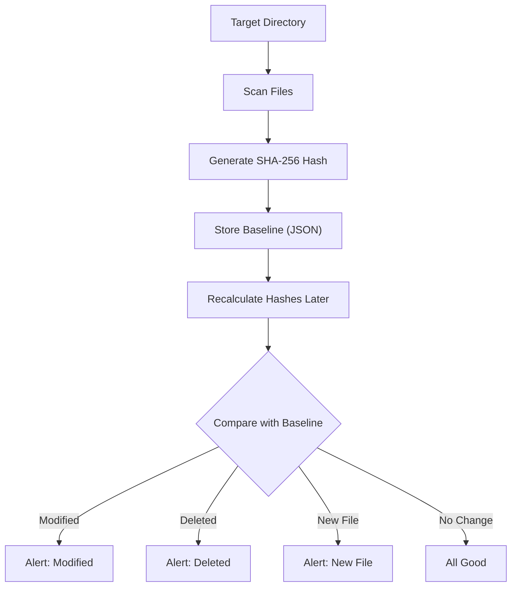

# Project 001: Simple File Integrity Monitor (FIM) with SHA-256

**Category:** Basic Cybersec Projects | **Difficulty:** Beginner | **Time:** 1-2 Weeks

---

### Problem Statement and Real World Impact

Imagine you are managing a critical server. If an attacker breaches the system and subtly modifies a configuration file, the changes might go unnoticed immediately, effectively leaving a backdoor open. Alternatively, ransomware might begin encrypting critical files silently in the background.

Relying solely on "last modified" timestamps is unreliable, as attackers can easily manipulate them. A File Integrity Monitor (FIM) addresses this issue by generating a cryptographic fingerprint (a hash) of the file's exact contents. If even a single character changes, the resulting hash completely changes, instantly flagging the modification.

This project implements a basic FIM in Python. While enterprise environments use commercial tools like Microsoft Defender, Tripwire, or CrowdStrike, building a custom FIM is an excellent way to understand how Security Operations Center (SOC) teams detect unauthorized file modifications.

---

### Key Learning Objectives:

- Understanding the core concepts of a File Integrity Monitor and its importance in defense.
- Implementing SHA-256 cryptographic hashing in a real-world scenario.
- Capturing a trusted baseline snapshot of critical directories.
- Automatically detecting files that are modified, added, or deleted.
- Writing defensive, resilient Python code for security tooling.

---

### Real-World Use Cases

File Integrity Monitoring is a standard security practice used to protect:
- Core Windows operating system files
- Linux configuration files (such as `/etc/passwd`)
- Private cryptographic keys and SSL certificates
- Critical database configuration files

SOC analysts rely on FIM alerts to spot unauthorized configuration changes before an attacker can establish persistence.

---

### Architecture

Here is how the monitoring system is structured:



---

### Technical Implementation Code

The process consists of two primary stages:

**Step 1: Establishing the Baseline**
The script recursively scans a designated target folder, reads the content of each file, and computes its SHA-256 hash. It then saves these filenames and their respective hashes into a JSON file, serving as a trusted snapshot.

```json
{
    "config.ini": "4d8b7d...",
    "notes.txt": "e6af3f..."
}
```

**Step 2: Detecting Modifications**
During subsequent runs, the script calculates the current hashes of all files in the folder and compares them against the stored JSON snapshot.
- A hash mismatch indicates file tampering.
- A new file present in the folder but missing from the baseline is flagged as unauthorized.
- A file present in the baseline but missing from the folder is flagged as deleted.

---

### The Code

Below is the Python script implementation. The comments explain the logic behind file processing, hashing, and comparison.

```python
import os
import hashlib
import json
import time

def calculate_sha256(filepath):
    sha256_hash = hashlib.sha256()
    try:
        # Read the file in chunks to prevent memory overload with large files
        with open(filepath, "rb") as f:
            for byte_block in iter(lambda: f.read(4096), b""):
                sha256_hash.update(byte_block)
        return sha256_hash.hexdigest()
    except Exception:
        # Skip files that cannot be accessed due to permission issues or locks
        return None

def create_baseline(directory, baseline_file="baseline.json"):
    baseline = {}

    # Recursively traverse the target directory
    for root, dirs, files in os.walk(directory):
        for file in files:
            full_path = os.path.join(root, file)
            file_hash = calculate_sha256(full_path)
            
            if file_hash:
                baseline[full_path] = file_hash

    # Save the trusted snapshot to a JSON file
    with open(baseline_file, "w") as f:
        json.dump(baseline, f, indent=4)

    print(f"[+] Snapshot saved. Tracking {len(baseline)} files.")

def monitor_integrity(directory, baseline_file="baseline.json"):
    if not os.path.exists(baseline_file):
        print("[-] Cannot find the baseline file. Please run the baseline creation step first.")
        return

    # Load the trusted baseline snapshot
    with open(baseline_file, "r") as f:
        baseline = json.load(f)

    current = {}

    # Rescan the directory to retrieve current file hashes
    for root, dirs, files in os.walk(directory):
        for file in files:
            full_path = os.path.join(root, file)
            file_hash = calculate_sha256(full_path)
            if file_hash:
                current[full_path] = file_hash

    # Identify deleted or modified files
    for path, old_hash in baseline.items():
        if path not in current:
            print(f"[!] Deleted: {path}")
        elif current[path] != old_hash:
            print(f"[!] Modified: {path}")

    # Identify new files not present in the baseline
    for path in current:
        if path not in baseline:
            print(f"[!] New File: {path}")

if __name__ == "__main__":
    
    # Define a test directory for execution
    target_folder = "./test_folder"
    os.makedirs(target_folder, exist_ok=True)

    print("Creating initial baseline...")
    create_baseline(target_folder)

    print("\nStarting integrity monitor...\n")
    monitor_integrity(target_folder)
```

---

### Expected Output Example

During the initial execution, the script generates the baseline:
```text
Creating initial baseline...
[+] Snapshot saved. Tracking 8 files.

Starting integrity monitor...
```

If a file named `config.ini` is subsequently modified:
```text
[!] Modified: ./test_folder/config.ini
```

If a new file is added to the directory:
```text
[!] New File: ./test_folder/password.txt
```

---

### Future Enhancements

To expand this basic script into a robust security tool, consider adding the following features:
- Implement an automated background watcher (using the Python `watchdog` library) to trigger real-time alerts.
- Integrate webhook notifications to send alerts to Discord, Slack, or via email when a modification occurs.
- Transition from a JSON file to a localized SQLite database for more efficient hash storage and querying.

---

> [!WARNING]
> Ensure you only deploy monitoring tools on systems or networks where you have explicit authorization. Unauthorized tracking of files on external systems is prohibited.