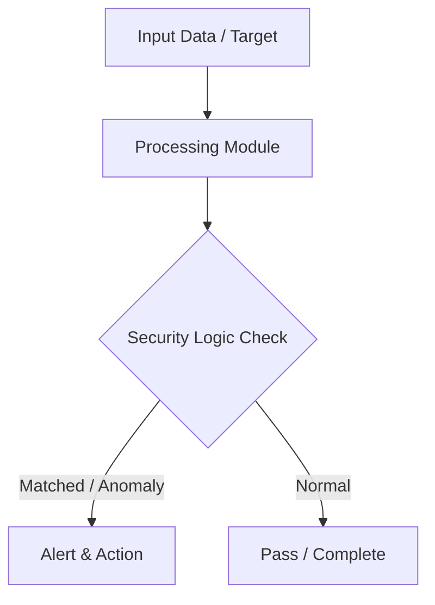

# 002 - Basic Network Port Scanner & Service Banner Grabbing Tool

> **Category**: Basic Cybersecurity Projects | **Difficulty**: ⭐ Basic | **Duration**: 1-2 weeks

---

## Problem Statement and Real World Impact

Real-world applications me yeh problem kafi common hai. Identifying open ports and unpatched network services running on local machines or lab servers.

Jab hum beginner-level cybersecurity practicals ki baat karte hain, toh foundational concepts ko code ke zariye samajhna sabse effective tareeka hota hai. Yeh project ek simple Python script ke zariye is real-world problem ko directly solve karta hai.

---

## Textbook & Paper References

- **Book Reference**: Computer Networking: A Top-Down Approach by Kurose & Ross (Chapter 3: Transport Layer & TCP Sockets)
- **Research Paper**: Efficient Port Scanning Techniques and Network Reconnaissance (ACM SIGCOMM, 2015)

---

## System Architecture

Link: [[Drawing 2026-07-30 22.31.19.excalidraw#Project Basic-002: 002 - Basic Network Port Scanner & Service Banner Grabbing Tool|Excalidraw Architecture Diagram]]



---

## Technical Implementation Code

Python socket-based multi-threaded port scanner that connects to TCP ports and grabs service banner strings.

```python
import socket
import sys
from concurrent.futures import ThreadPoolExecutor

def scan_port(ip, port):
    try:
        s = socket.socket(socket.AF_INET, socket.SOCK_STREAM)
        s.settimeout(1.5)
        result = s.connect_ex((ip, port))
        if result == 0:
            try:
                banner = s.recv(1024).decode().strip()
                print(f"[+] Port {port} OPEN | Banner: {banner}")
            except:
                print(f"[+] Port {port} OPEN | (No banner returned)")
        s.close()
    except Exception as e:
        pass

def start_scan(target_ip, start_port=1, end_port=1024):
    print(f"[*] Starting port scan on target: {target_ip}")
    with ThreadPoolExecutor(max_workers=50) as executor:
        for port in range(start_port, end_port + 1):
            executor.submit(scan_port, target_ip, port)

if __name__ == "__main__":
    target = "127.0.0.1"
    start_scan(target, 20, 100)

```

---

## Expected Results & Outcomes

1. Clear understanding of underlying networking, hashing, or system security mechanics.
2. Functional, lightweight Python script ready to execute in a local lab.
3. Verification of security controls against common real-world misconfigurations.

---

## Legal and Ethical Notice

> [!WARNING] Educational Use Only
> Always run these basic projects in your own local testing environment or authorized laboratory network.

---

## Related Index
- [[00 - Basic Cybersecurity Projects Index]]
