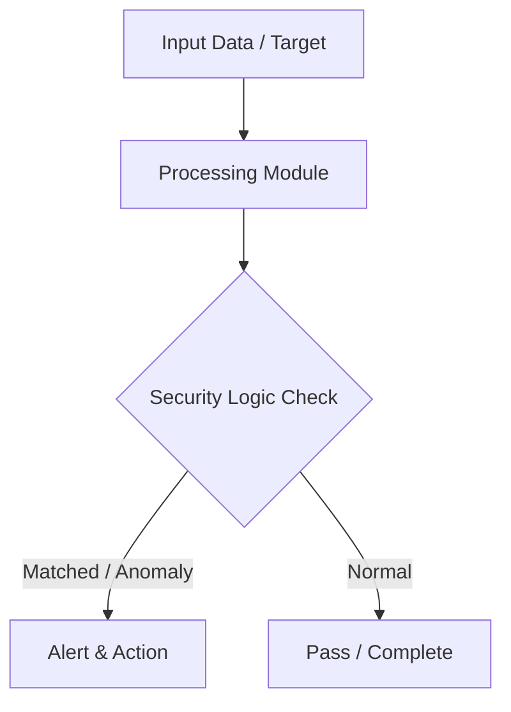

# 002 - Basic Network Port Scanner & Service Banner Grabbing Tool

> **Category**: Basic Cybersecurity Projects | **Difficulty**: ⭐ Basic | **Duration**: 1-2 weeks

---

## Problem Statement and Real World Impact

Identifying open ports and unpatched network services running on local machines or lab servers is a common challenge in network administration and security auditing. Left unchecked, these open ports can serve as entry points for attackers. 

When learning foundational cybersecurity concepts, building functional tools from scratch is highly effective. This project demonstrates how to solve this problem by using a simple Python script to scan target systems for active TCP ports and retrieve service banners. This helps security professionals quickly discover misconfigurations and vulnerable services running on a network.

---

## Textbook & Paper References

- **Book Reference**: Computer Networking: A Top-Down Approach by Kurose & Ross (Chapter 3: Transport Layer & TCP Sockets)
- **Research Paper**: Efficient Port Scanning Techniques and Network Reconnaissance (ACM SIGCOMM, 2015)

---

## System Architecture

Link: [[Drawing 2026-07-30 22.31.19.excalidraw#Project Basic-002: 002 - Basic Network Port Scanner & Service Banner Grabbing Tool|Excalidraw Architecture Diagram]]



---

## Technical Implementation Code

This Python script is a socket-based, multi-threaded port scanner that connects to TCP ports and grabs service banner strings.

```python
import socket
import sys
from concurrent.futures import ThreadPoolExecutor

def scan_port(ip, port):
    try:
        s = socket.socket(socket.AF_INET, socket.SOCK_STREAM)
        s.settimeout(1.5)
        result = s.connect_ex((ip, port))
        if result == 0:
            try:
                banner = s.recv(1024).decode().strip()
                print(f"[+] Port {port} OPEN | Banner: {banner}")
            except:
                print(f"[+] Port {port} OPEN | (No banner returned)")
        s.close()
    except Exception as e:
        pass

def start_scan(target_ip, start_port=1, end_port=1024):
    print(f"[*] Starting port scan on target: {target_ip}")
    with ThreadPoolExecutor(max_workers=50) as executor:
        for port in range(start_port, end_port + 1):
            executor.submit(scan_port, target_ip, port)

if __name__ == "__main__":
    target = "127.0.0.1"
    start_scan(target, 20, 100)

```

---

## Expected Results & Outcomes

1. A clear understanding of underlying networking principles, transport layer protocols, and TCP socket programming.
2. A functional, lightweight Python script ready to execute in a local lab for reconnaissance.
3. The ability to verify network security controls by identifying common real-world misconfigurations.

---

## Legal and Ethical Notice

> [!WARNING] Educational Use Only
> Always run these basic projects in your own local testing environment or authorized laboratory network.

---

## Related Index
- [[00 - Basic Cybersecurity Projects Index]]
