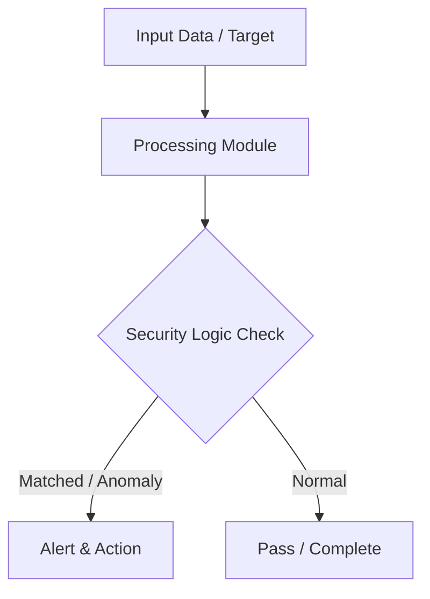

# 003 - Simple ARP Poisoning Detection Script

> **Category**: Basic Cybersecurity Projects | **Difficulty**: ⭐ Basic | **Duration**: 1-2 weeks

---

## Problem Statement and Real World Impact

Detecting Address Resolution Protocol (ARP) spoofing attacks on local Ethernet or Wi-Fi networks is crucial for preventing Man-in-the-Middle (MitM) eavesdropping. Attackers often exploit the lack of authentication in the ARP protocol to intercept, alter, or block network traffic. 

When studying network security, implementing a detection mechanism from scratch helps clarify how packet manipulation works. This project uses a simple Python script to monitor incoming network traffic and detect when a single IP address is mapped to multiple MAC addresses, effectively identifying potential ARP poisoning attempts in real time.

---

## Textbook & Paper References

- **Book Reference**: Computer Networks by Andrew S. Tanenbaum (Chapter 4: Data Link Layer & ARP Protocol)
- **Research Paper**: Detection and Mitigation of ARP Cache Poisoning Attacks (IEEE Communications Surveys, 2016)

---

## System Architecture

Link: [[Drawing 2026-07-30 22.31.19.excalidraw#Project Basic-003: 003 - Simple ARP Poisoning Detection Script|Excalidraw Architecture Diagram]]



---

## Technical Implementation Code

This Python script uses the Scapy library to monitor incoming ARP responses and triggers an alert if an IP address is mapped to conflicting MAC addresses.

```python
from scapy.all import sniff, ARP
import sys

ip_mac_table = {}

def process_packet(packet):
    if packet.haslayer(ARP) and packet[ARP].op == 2: # ARP Response
        sender_ip = packet[ARP].psrc
        sender_mac = packet[ARP].hwsrc
        
        if sender_ip in ip_mac_table:
            if ip_mac_table[sender_ip] != sender_mac:
                print(f"[!] WARNING: Possible ARP Spoofing Attack!")
                print(f"    IP: {sender_ip} changed MAC from {ip_mac_table[sender_ip]} to {sender_mac}")
        else:
            ip_mac_table[sender_ip] = sender_mac
            print(f"[+] Recorded: {sender_ip} -> {sender_mac}")

if __name__ == "__main__":
    print("[*] Monitoring network for ARP Spoofing anomalies...")
    sniff(store=False, prn=process_packet, filter="arp")

```

---

## Expected Results & Outcomes

1. A practical understanding of Data Link layer vulnerabilities and how ARP cache poisoning operates.
2. A functional, lightweight Python detection script ready to execute in a local lab.
3. Hands-on experience with network packet sniffing and anomaly detection logic.

---

## Legal and Ethical Notice

> [!WARNING] Educational Use Only
> Always run these basic projects in your own local testing environment or authorized laboratory network.

---

## Related Index
- [[00 - Basic Cybersecurity Projects Index]]
