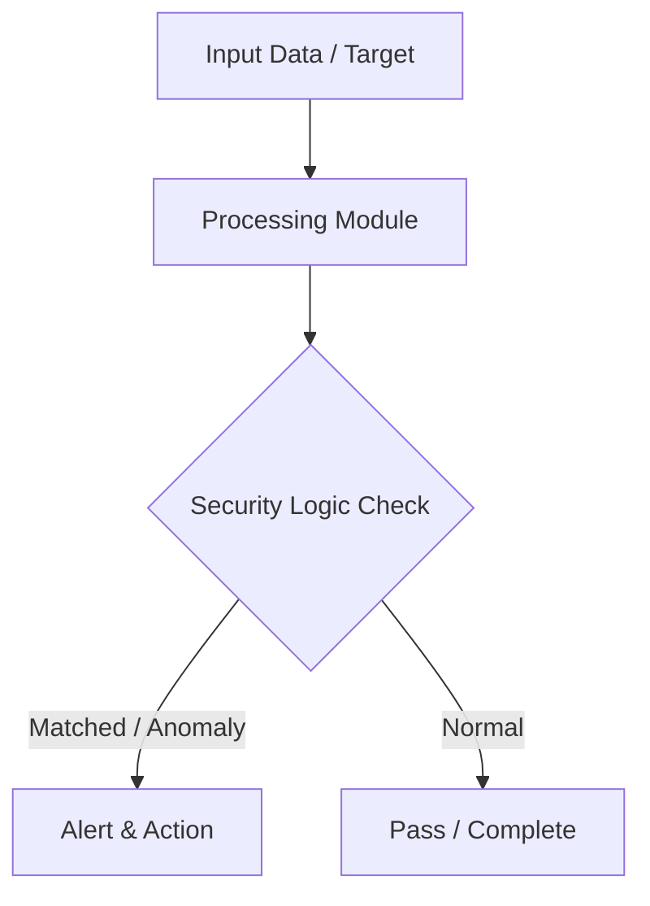

# 004 - Basic Password Strength Checker and Hash Cracker

> **Category**: Basic Cybersecurity Projects | **Difficulty**: ⭐ Basic | **Duration**: 1-2 weeks

---

## Problem Statement and Real World Impact

Preventing weak password choices is a fundamental aspect of system security. Many users still rely on easily guessable passwords, leaving critical systems vulnerable to unauthorized access via dictionary attacks and brute-force cracking.

To understand why complex passwords matter, it is highly effective to see the cracking process firsthand. This project addresses the issue by computing password entropy to assess the theoretical strength of a password, and then running a dictionary attack against hashed passwords to demonstrate how quickly simple passwords can be compromised.

---

## Textbook & Paper References

- **Book Reference**: NIST SP 800-63B: Digital Identity Guidelines (Authentication & Password Entropy Recommendations)
- **Research Paper**: Evaluating Password Strength and Entropy Estimation Algorithms (USENIX Security, 2017)

---

## System Architecture

Link: [[Drawing 2026-07-30 22.31.19.excalidraw#Project Basic-004: 004 - Basic Password Strength Checker and Hash Cracker|Excalidraw Architecture Diagram]]



---

## Technical Implementation Code

This Python utility computes a password entropy score and performs a simple dictionary attack against MD5/SHA-256 hashes.

```python
import hashlib
import math
import string

def check_entropy(password):
    charset = 0
    if any(c in string.ascii_lowercase for c in password): charset += 26
    if any(c in string.ascii_uppercase for c in password): charset += 26
    if any(c in string.digits for c in password): charset += 10
    if any(c in string.punctuation for c in password): charset += 32
    
    entropy = len(password) * math.log2(charset) if charset > 0 else 0
    return round(entropy, 2)

def dictionary_attack(target_hash, wordlist):
    print(f"[*] Attempting dictionary attack on target hash: {target_hash}")
    for word in wordlist:
        word = word.strip()
        hashed = hashlib.sha256(word.encode()).hexdigest()
        if hashed == target_hash:
            print(f"[+] SUCCESS! Password found: {word}")
            return word
    print("[-] Password not found in wordlist.")
    return None

if __name__ == "__main__":
    pwd = "Admin@123"
    print(f"Password: {pwd} | Entropy: {check_entropy(pwd)} bits")

```

---

## Expected Results & Outcomes

1. A clear understanding of hashing mechanisms, password entropy, and brute-force methodologies.
2. A functional Python script capable of auditing password strength and executing dictionary attacks.
3. Practical insight into why modern security standards enforce strict password complexity rules.

---

## Legal and Ethical Notice

> [!WARNING] Educational Use Only
> Always run these basic projects in your own local testing environment or authorized laboratory network. Do not attempt to crack credentials you do not own.

---

## Related Index
- [[00 - Basic Cybersecurity Projects Index]]
