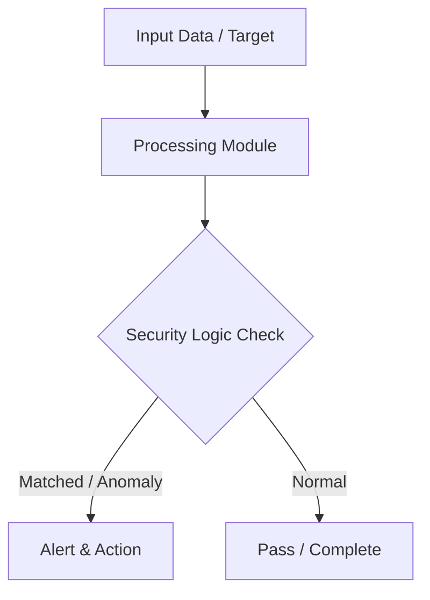

# 005 - Simple Web URL Phishing Detector using Domain Heuristics

> **Category**: Basic Cybersecurity Projects | **Difficulty**: ⭐ Basic | **Duration**: 1-2 weeks

---

## Problem Statement and Real World Impact

Real-world applications me yeh problem kafi common hai. Protecting non-technical users from clicking fraudulent typosquatting and fake phishing domain links.

Jab hum beginner-level cybersecurity practicals ki baat karte hain, toh foundational concepts ko code ke zariye samajhna sabse effective tareeka hota hai. Yeh project ek simple Python script ke zariye is real-world problem ko directly solve karta hai.

---

## Textbook & Paper References

- **Book Reference**: Web Application Security by Andrew Hoffman (Chapter on Phishing & Domain Fraud Vectors)
- **Research Paper**: Detecting Phishing Websites Using Lexical Features of URLs (IEEE Transactions on Knowledge & Data Engineering, 2011)

---

## System Architecture

Link: [[Drawing 2026-07-30 22.31.19.excalidraw#Project Basic-005: 005 - Simple Web URL Phishing Detector using Domain Heuristics|Excalidraw Architecture Diagram]]



---

## Technical Implementation Code

Python script evaluating URL length, IP address presence, hyphen counts, subdomains, and suspicious keywords.

```python
import re
from urllib.parse import urlparse

def analyze_url(url):
    risk_score = 0
    reasons = []
    
    # 1. IP address in domain
    if re.search(r'\b(?:[0-9]{1,3}\.){3}[0-9]{1,3}\b', url):
        risk_score += 35
        reasons.append("Raw IP address used instead of domain name")
        
    # 2. URL length
    if len(url) > 75:
        risk_score += 20
        reasons.append("Excessively long URL (>75 chars)")
        
    # 3. Excessive hyphens
    parsed = urlparse(url)
    domain = parsed.netloc
    if domain.count('-') > 2:
        risk_score += 25
        reasons.append("Multiple hyphens in domain name")
        
    # 4. Suspicious keywords
    keywords = ["login", "verify", "secure", "banking", "update", "account", "paypal", "free"]
    for kw in keywords:
        if kw in url.lower() and not domain.endswith("paypal.com"):
            risk_score += 15
            reasons.append(f"Suspicious keyword found: '{kw}'")
            
    print(f"URL: {url}")
    print(f"Risk Score: {risk_score}/100")
    print("Risk Factors:", reasons if reasons else "None (Appears Safe)")
    return risk_score

if __name__ == "__main__":
    analyze_url("http://192.168.1.1/secure-login-verify-account-update.html")

```

---

## Expected Results & Outcomes

1. Clear understanding of underlying networking, hashing, or system security mechanics.
2. Functional, lightweight Python script ready to execute in a local lab.
3. Verification of security controls against common real-world misconfigurations.

---

## Legal and Ethical Notice

> [!WARNING] Educational Use Only
> Always run these basic projects in your own local testing environment or authorized laboratory network.

---

## Related Index
- [[00 - Basic Cybersecurity Projects Index]]
