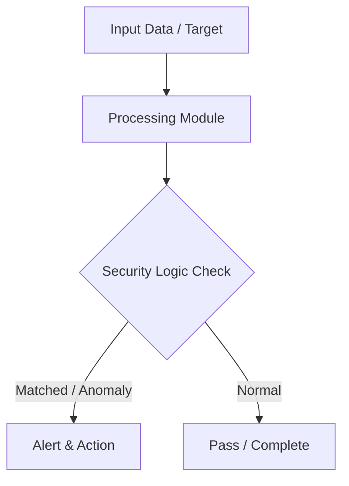

# 006 - Basic Packet Sniffer and HTTP Header Analyzer

> **Category**: Basic Cybersecurity Projects | **Difficulty**: ⭐ Basic | **Duration**: 1-2 weeks

---

## Problem Statement and Real World Impact

In many enterprise and public networks, legacy applications or misconfigured servers still transmit data over unencrypted HTTP. This exposes sensitive information, such as plain-text passwords, session cookies, and personal data, to anyone sharing the same network link. Attackers frequently leverage packet sniffing to passively capture this cleartext traffic and compromise user accounts.

To understand the mechanics of network eavesdropping and the critical need for encryption, this project builds a basic packet sniffer using Python. The script captures raw network packets and inspects them for HTTP GET and POST requests. By extracting and analyzing the headers, you will see firsthand how easily unencrypted data can be intercepted, reinforcing the importance of secure protocols like HTTPS.

---

## Textbook & Paper References

- **Book Reference**: Computer Networks by Andrew S. Tanenbaum (Chapter 6: Application Layer & HTTP Protocols)
- **Research Paper**: Analysis of Cleartext Credentials and Privacy Leakage in Public Wi-Fi Networks (ACM SIGCOMM, 2014)

---

## System Architecture

Link: [[Drawing 2026-07-30 22.31.19.excalidraw#Project Basic-006: 006 - Basic Packet Sniffer and HTTP Header Analyzer|Excalidraw Architecture Diagram]]



---

## Technical Implementation Code

Python packet sniffer reading raw network packets and extracting HTTP GET/POST headers for analysis.

```python
import socket
import re

def start_sniffer():
    # Raw socket for Windows/Linux
    try:
        sniffer = socket.socket(socket.AF_INET, socket.SOCK_RAW, socket.IPPROTO_IP)
        sniffer.bind(("0.0.0.0", 0))
        sniffer.setsockopt(socket.IPPROTO_IP, socket.IP_HDRINCL, 1)
        print("[*] Raw packet sniffer initialized. Listening for HTTP traffic...")
        
        while True:
            raw_data, addr = sniffer.recvfrom(65535)
            # Inspect string data for HTTP Method
            data_str = raw_data.decode(errors='ignore')
            if "GET " in data_str or "POST " in data_str:
                print(f"[+] HTTP Traffic Detected from {addr[0]}:")
                lines = data_str.splitlines()[:5]
                for line in lines:
                    print("    ", line)
    except Exception as e:
        print(f"[-] Socket creation failed: {e}")

if __name__ == "__main__":
    # Note: Requires Administrator / Root privilege
    start_sniffer()
```

---

## Expected Results & Outcomes

1. A clear understanding of network traffic inspection and the structure of HTTP headers.
2. A functional Python script that captures and analyzes raw network packets in a local lab.
3. Practical demonstration of the security risks associated with transmitting cleartext data.

---

## Legal and Ethical Notice

> [!WARNING] Educational Use Only
> Always run these basic projects in your own local testing environment or authorized laboratory network.

---

## Related Index
- [[00 - Basic Cybersecurity Projects Index]]
