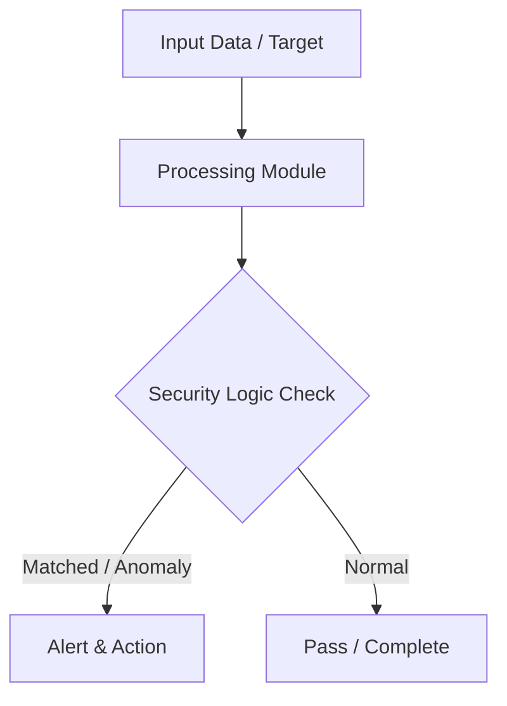

# 007 - Simple LSB Image Steganography Encoder & Decoder

> **Category**: Basic Cybersecurity Projects | **Difficulty**: ⭐ Basic | **Duration**: 1-2 weeks

---

## Problem Statement and Real World Impact

Secure communication often relies on cryptography to make messages unreadable, but sometimes the very presence of encrypted data can attract unwanted attention. Steganography solves this by hiding the secret data within plain sight—such as embedding text inside a standard image file—so that unauthorized observers do not even realize a secret conversation is taking place.

This project demonstrates this concept through Least Significant Bit (LSB) steganography. By using a Python script, you will learn how to slightly alter the least significant bits of an image's pixel color values to encode binary text data. The resulting image looks visually identical to the original, providing a stealthy channel for covert communication while teaching the fundamentals of digital media manipulation and data concealment.

---

## Textbook & Paper References

- **Book Reference**: Disappearing Cryptography: Information Hiding by Peter Wayner (Chapter on LSB Image Steganography)
- **Research Paper**: Steganography in Digital Media: Principles, Algorithms, and Applications (Cambridge University Press, 2010)

---

## System Architecture

Link: [[Drawing 2026-07-30 22.31.19.excalidraw#Project Basic-007: 007 - Simple LSB Image Steganography Encoder & Decoder|Excalidraw Architecture Diagram]]



---

## Technical Implementation Code

Python script using Pillow library to embed and extract secret text message bits into the Least Significant Bits of image pixels.

```python
from PIL import Image

def encode_message(image_path, secret_text, output_path):
    img = Image.open(image_path)
    encoded = img.copy()
    width, height = img.size
    
    binary_secret = ''.join(format(ord(c), '08b') for c in secret_text) + '1111111111111110'
    data_index = 0
    
    for y in range(height):
        for x in range(width):
            pixel = list(img.getpixel((x, y)))
            for n in range(3): # R, G, B
                if data_index < len(binary_secret):
                    pixel[n] = (pixel[n] & ~1) | int(binary_secret[data_index])
                    data_index += 1
            encoded.putpixel((x, y), tuple(pixel))
            if data_index >= len(binary_secret):
                break
        if data_index >= len(binary_secret):
            break
            
    encoded.save(output_path)
    print(f"[+] Message hidden successfully inside {output_path}")

def decode_message(image_path):
    img = Image.open(image_path)
    width, height = img.size
    binary_data = ""
    
    for y in range(height):
        for x in range(width):
            pixel = img.getpixel((x, y))
            for n in range(3):
                binary_data += str(pixel[n] & 1)
                
    all_bytes = [binary_data[i:i+8] for i in range(0, len(binary_data), 8)]
    decoded_text = ""
    for byte in all_bytes:
        if byte == '11111111': # Delimiter check
            break
        decoded_text += chr(int(byte, 2))
    return decoded_text

if __name__ == "__main__":
    print("[*] Simple LSB Steganography Tool Ready.")
```

---

## Expected Results & Outcomes

1. A clear understanding of bitwise operations and how data can be concealed within digital media formats.
2. A functional Python script capable of securely encoding and extracting text from standard PNG images.
3. Practical insight into covert communication channels and digital forensics.

---

## Legal and Ethical Notice

> [!WARNING] Educational Use Only
> Always run these basic projects in your own local testing environment or authorized laboratory network.

---

## Related Index
- [[00 - Basic Cybersecurity Projects Index]]
