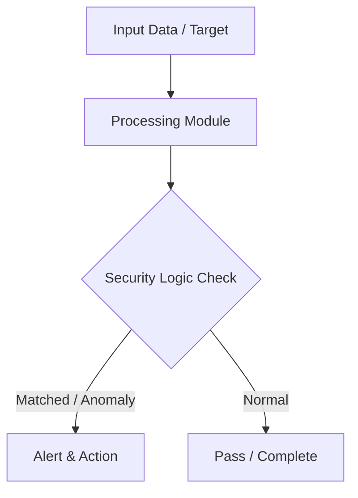

# 008 - Basic Directory Bruteforce Scanner for Web Servers

> **Category**: Basic Cybersecurity Projects | **Difficulty**: ⭐ Basic | **Duration**: 1-2 weeks

---

## Problem Statement and Real World Impact

Real-world applications me yeh problem kafi common hai. Discovering unlinked hidden web directories, backup archives, and administrative interfaces exposed on web servers.

Jab hum beginner-level cybersecurity practicals ki baat karte hain, toh foundational concepts ko code ke zariye samajhna sabse effective tareeka hota hai. Yeh project ek simple Python script ke zariye is real-world problem ko directly solve karta hai.

---

## Textbook & Paper References

- **Book Reference**: OWASP Web Security Testing Guide (WSTG v4.2: Information Gathering & Hidden File Enumeration)
- **Research Paper**: Automated Web Reconnaissance and Directory Enumeration Strategies (ACM Queue, 2018)

---

## System Architecture

Link: [[Drawing 2026-07-30 22.31.19.excalidraw#Project Basic-008: 008 - Basic Directory Bruteforce Scanner for Web Servers|Excalidraw Architecture Diagram]]



---

## Technical Implementation Code

Python HTTP client testing common path names (e.g. /admin, /backup.zip, /config.php) against a target web server.

```python
import requests

def scan_directories(target_url, wordlist):
    print(f"[*] Scanning web directories on target: {target_url}")
    headers = {"User-Agent": "Basic-Dir-Scanner/1.0"}
    
    for path in wordlist:
        url = f"{target_url.rstrip('/')}/{path.lstrip('/')}"
        try:
            res = requests.get(url, headers=headers, timeout=2.0)
            if res.status_code == 200:
                print(f"[+] Found (200 OK): {url}")
            elif res.status_code == 403:
                print(f"[!] Forbidden (403): {url}")
        except requests.RequestException:
            pass

if __name__ == "__main__":
    target = "http://127.0.0.1:8080"
    common_paths = ["admin", "login", "config.json", "backup.zip", "test", "api"]
    scan_directories(target, common_paths)

```

---

## Expected Results & Outcomes

1. Clear understanding of underlying networking, hashing, or system security mechanics.
2. Functional, lightweight Python script ready to execute in a local lab.
3. Verification of security controls against common real-world misconfigurations.

---

## Legal and Ethical Notice

> [!WARNING] Educational Use Only
> Always run these basic projects in your own local testing environment or authorized laboratory network.

---

## Related Index
- [[00 - Basic Cybersecurity Projects Index]]
